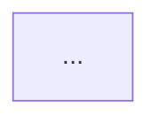

# Dependency Checker

Answers exactly one question: **what does this repo depend on, how much does it cost, and what
should someone fix first?**

This repo is **five standalone packages, not a monorepo** — `server`, `client`, `reviewer-core`,
`e2e`, `mcp`. Each has its own `package.json` and its own lockfile; there is no root `package.json`
and no `pnpm-workspace.yaml` tying them together (see [AGENTS.md](../../../AGENTS.md)). That single
fact drives most of what this skill looks for: nothing here is `workspace:*`-linked, so the same npm
package can silently resolve to different versions per package, and "internal" dependencies only
exist because `tsconfig.json` path aliases (or a stray relative import) reach across a package
boundary — never because of a package manager.

---

## 1. Scope

State up front, in a section literally titled **Scope**, which packages this run actually covers.
Default to all five: `server` (`@devdigest/api`), `client` (`@devdigest/web`), `reviewer-core`
(`@devdigest/reviewer-core`), `e2e` (`@devdigest/e2e`), `mcp` (`@devdigest/mcp`). If the user asked
about only some of them, say so explicitly and name what was excluded and why — never silently
narrow the scope.

## 2. Gather the data (skip fabricating anything you can't collect)

Do this yourself with Read/Glob/Grep/Bash — don't ask the user to paste it in, unless they already
have (some prompts hand you pre-collected data explicitly instead of tool output; in that case treat
it as ground truth and skip straight to §3).

1. **Declared dependencies.** For each in-scope package, read its `package.json` — split
   `dependencies` from `devDependencies`, keep the exact version range as declared.
2. **Installed size.** From a POSIX shell (the Bash tool, not PowerShell):
   ```bash
   du -sh <package>/node_modules/<dep-name> 2>/dev/null
   ```
   run once per top-level declared dependency, per package — not a full recursive walk of
   `node_modules` (that double-counts nested/transitive copies and buries the signal). If
   `node_modules` isn't installed for a package, say so in the report as an `Info`-tier note
   ("sizes unavailable — run the package's install first") instead of guessing a number.
3. **Cross-package imports.** Two different mechanisms, and the report must not conflate them:
   - **Path-alias imports** — grep each package's `tsconfig.json` for its `paths` entries (e.g.
     `@shared/*`, `@devdigest/reviewer-core`), then grep `src/` for actual usages of those aliases.
   - **Raw relative imports that cross a package boundary** — grep for relative paths that climb out
     of the current package (patterns like `from ['"]\.\./\.\./` or a literal `<other-pkg>/src/` in an
     import specifier). This is the pattern to watch for `§5`'s P0 case.
4. **Version drift.** Across every in-scope package.json, group declared dependency names and list
   any name whose resolved version string differs between packages.
5. **Unused-dependency candidates.** For each declared dependency, grep that package's `src/` (and
   its config files — `*.config.ts`, `drizzle.config.ts`, etc.) for the package name as an import or
   `require`. Zero hits is a *candidate*, not proof — a devDependency invoked only via a CLI in an
   npm script (`vitest`, `tsx`, `typescript`, `playwright`) is expected to have no source import, so
   check `package.json` `scripts` before flagging those.

## 3. Report structure

Produce the report as your reply (write it to a file only if the user asks to save/track it — e.g.
`docs/dependency-reports/NN-<slug>.md`, mirroring `docs/retros/`'s numbering convention). Use this
exact section order and these exact section names — every one of them is load-bearing for how the
report gets read, not decoration:

```markdown
# Dependency Report — <scope, e.g. "full repo" or "server + client">

## Scope
...

## Dependency Graph


## Size Breakdown
| Package | Dependency | Version | Installed size | Type |
|---|---|---|---|---|

## Internal vs External Dependencies
### Internal (cross-package)
### External (npm)

## Findings & Priorities
### P0
### P1
### P2
### Info

## Summary
1. ...
```

### Dependency Graph

A **Mermaid `flowchart`** whose nodes are the *packages themselves* (`server`, `client`,
`reviewer-core`, `e2e`, `mcp`), not individual npm libraries — this is the picture of how the
repo's own components relate, not a `node_modules` tree. Draw an edge for every internal dependency
found in §2.3, and label each edge with the mechanism (`alias` vs `relative import`). If a package
has no internal dependency on or from another (true today for `e2e`), it still appears as an
unconnected node — that absence is itself informative. Never draw an edge implying `workspace:*` or
pnpm-workspace linkage; if you're tempted to write that, you're describing a monorepo this repo isn't.

### Size Breakdown

One table (or one per package, whichever stays readable), sorted largest-first, with **numbers**, not
prose like "some large dependencies." Roll up a per-package total row.

### Internal vs External Dependencies

Keep these visibly separate — they answer different questions and must never be merged into one
undifferentiated dependency list:
- **Internal** — the alias and relative-import findings from §2.3, one row per edge: source file →
  target package → mechanism → whether it goes through the target's public entry point
  (`src/index.ts` or its declared alias) or reaches directly into the target's internal `src/`. The
  latter is the boundary violation this skill exists to catch (see §5).
- **External** — real npm packages, pointing back at the Size Breakdown table rather than repeating it.

### Findings & Priorities

Every finding is one line, tagged with a tier, and **names a specific package, dependency, or file
path** — never "consider optimizing dependencies" or other advice with nothing to click on. See §5
for what goes in which tier.

### Summary

3–5 bullets, **ordered by priority** (P0 first), each one concrete enough to act on without
re-reading the rest of the report. This is the section a developer reads if they read nothing else.

## 4. Internal vs. external — the distinction that must never blur

This repo shares code across packages two ways, and both are visible in `AGENTS.md`:
- a **TypeScript path alias** (`server/tsconfig.json` aliasing `@devdigest/reviewer-core` to
  `../reviewer-core/src`, or `@shared/*` to the vendored shared contracts) — the sanctioned mechanism;
- occasionally, **a raw relative import** that reaches straight into another package's `src/` without
  going through its alias or entry point — not sanctioned, and the report's job is to find these.

Never describe either mechanism as `workspace:*`, a pnpm workspace dependency, or anything implying
these packages are published/linked as packages to each other — they are not; there is no root
`package.json` and no workspace file. Getting this wrong misrepresents the architecture the rest of
`AGENTS.md` depends on.

## 5. Severity tiers

Use these four tiers, always spelled this way, and put every finding under one of them — an
unranked bullet list is not an acceptable substitute for this section.

| Tier | Means | Typical examples |
|---|---|---|
| **P0** | Breaks the package boundary or will break a build/refactor | A relative import that reaches past another package's public entry point into its internal `src/` (e.g. importing `reviewer-core/src/pipeline.js` directly by relative path instead of via the `@devdigest/reviewer-core` alias or `reviewer-core/src/index.ts`) |
| **P1** | Real cost or real risk, not urgent | Version drift on a dependency used across packages (same npm name, different resolved versions); an unusually large installed dependency relative to its actual usage |
| **P2** | Worth cleaning up, low risk either way | A small, clearly-unused dependency declared in `package.json`; a devDependency that duplicates something already available elsewhere |
| **Info** | Neutral, no action implied | Sizes that couldn't be collected because `node_modules` isn't installed; a package with no internal dependencies at all |

## 6. Hard rules

1. **Read-only.** This skill inspects and reports. It never edits a `package.json`, a lockfile, or
   any source file, and it never runs `pnpm remove` / `npm uninstall` or similar on the user's behalf.
2. **Recommend, don't act.** Every "drop this dependency" / "bump this version" / "fix this import"
   finding is phrased as something for the user to confirm and do themselves — never as something
   already done. If the user then asks you to actually make the change, that's a separate, explicit
   request outside this skill.
3. **No monorepo language.** Never write `workspace:*`, "workspace dependency", or "monorepo package"
   about these five packages — see §4.
4. **Every finding is specific.** Name the package, the dependency, and (for internal findings) the
   file. A finding that could apply to any repo is not a finding.
5. **Don't fabricate sizes or import evidence you didn't collect.** If §2's data collection failed or
   was skipped for part of the scope, say so — an `Info`-tier note beats a guessed number.

## 7. Not done by this skill

Choosing *which* framework/library to adopt, auditing dependencies for known CVEs, or deciding how a
route/module should be structured are out of scope — for security-relevant dependency questions defer
to the `security` skill, and for "where should this code live" questions defer to
`onion-architecture` / `frontend-ui-architecture`. This skill also never touches CI config, `.github/`
workflows, or `agent-runner/` — those aren't in scope for a dependency audit of the five packages above.
