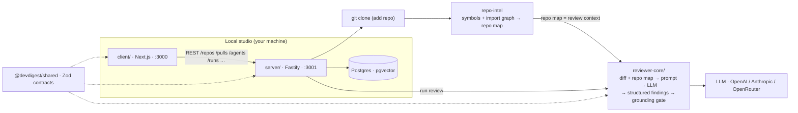

# DevDigest — system architecture
↑ [Docs index](./README.md) · [Root map](../CLAUDE.md)

The end-to-end review flow across the 4 packages. Per-module internals live in
each `<module>/README.md` (the source of truth for that module) and
`<module>/docs/`; this doc only covers how they connect.

## End-to-end review flow

## The flow in words
1. **Add a repo** → `server` clones it and `repo-intel`
   (`server/src/modules/repo-intel`) indexes symbols + import graph → the
   **Indexed** badge and the *repo map*.
2. **Import PRs** from GitHub → diff, commits, body, linked issue.
3. **Review** → `reviewer-core` assembles a prompt from the diff + repo map, calls
   the LLM, then the **grounding gate** drops any finding whose cited line isn't in
   the diff. The score is recomputed from surviving findings — the model's
   self-reported score is ignored.
4. Findings persist with severity + score.

All local; the only outbound calls are GitHub (PR data) and the LLM.

## Cross-cutting invariants
- **One contract, every package.** `@devdigest/shared` (Zod) is the single schema
  source; validation and serialization derive from it. See the vendoring note in
  the [root map](../CLAUDE.md).
- **Grounding is mandatory** and lives in `reviewer-core` — no caller can bypass it.
- **Prompt-injection defense** is one shared trusted rule (`INJECTION_GUARD`),
  not keyword scanning of untrusted text. Detail: [`server/README.md`](../server/README.md#review-context-non-obvious).

## Where to go deeper
| Concern | Source of truth |
|---------|-----------------|
| UI routes & data hooks | [`client/README.md`](../client/README.md) |
| API map, DI, request flow, review context | [`server/README.md`](../server/README.md) |
| Prompt → LLM → grounding pipeline | [`reviewer-core/README.md`](../reviewer-core/README.md) |
| Browser e2e flows | [`e2e/README.md`](../e2e/README.md) |
| Testing strategy | [`../TESTING.md`](../TESTING.md) |
