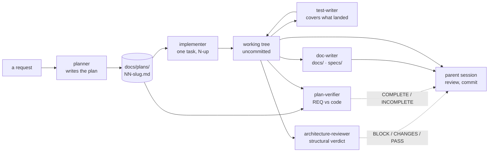

# Plan 01 — Expand the agent set: test-writer, architecture-reviewer, plan-verifier, doc-writer

**Modules:** none (process files only)   **Created:** 2026-08-21   **Status:** done
**Spec:** none

## 1. Goal

The set is `researcher` → `planner` → `implementer`. Nothing in it writes tests as a dedicated act,
nothing judges structure, nothing checks a finished plan against the code, and every `docs/` and
`specs/` folder in all four packages is still empty apart from its charter README.

Add four subagents that close those four gaps, and register them in the catalog. This plan is also
the first real plan file in `docs/plans/`, which makes it the smoke-test target for `plan-verifier`
and the regression target for the rewritten `G5`.

## 2. Requirements

- **REQ-1**: `.claude/agents/test-writer.md` exists, routes by package across five lanes, and its
  rules forbid editing production code to make a test pass.
- **REQ-2**: `.claude/agents/architecture-reviewer.md` exists and its `tools` allowlist contains
  neither `Write` nor `Edit`.
- **REQ-3**: `.claude/agents/plan-verifier.md` exists, its `tools` allowlist contains neither `Write`
  nor `Edit`, and it emits one of exactly four verdicts per requirement with no fifth value offered.
- **REQ-4**: `.claude/agents/doc-writer.md` exists and its stated write surface is limited to
  `docs/**`, `specs/**` and `README.md`, with `e2e/specs/*.flow.json` carved out.
- **REQ-5**: Every name in every `skills:` list of the four new files matches a directory that
  exists under `.claude/skills/`.
- **REQ-6**: `.claude/agents/README.md` carries a row for each of the four new agents in **both**
  the `## Catalog` table and the `## Artifacts` table.
- **REQ-7**: `.claude/agents/README.md` §`Sources` → `### External` cites the external source behind
  each non-obvious mechanism the four agents introduce.
- **REQ-8**: Dispatching a task that edits an **existing** agent file to `implementer` returns
  `BLOCKED` naming gate `G5` and the replacement action, while a task creating a **new** agent file
  proceeds — the two are different tiers and the gate distinguishes them.

## 3. Insights consulted

`.claude/` is not a module and no `INSIGHTS.md` covers it — `engineering-insights` routes only
`client/`, `server/`, `reviewer-core/`, `e2e/` and `repo-intel`. No logged insight binds any task in
this plan. Recorded here so the absence is a checked fact rather than a skipped step.

## 4. Contract changes

None. No task touches `server/src/vendor/shared/**`.

## 5. Architecture



The four new agents attach to the *output* of the pipeline, not inside it. Three are read-only and
return a verdict; `test-writer` and `doc-writer` write, but into disjoint surfaces — test files and
prose respectively — so none of them can collide with an implementer still in flight.

`plan-verifier` is the only one that reads both the plan and the tree: that pairing is its whole job.

## 6. Task graph

| Wave | Tasks | Lane(s) | Parallel? |
|---|---|---|---|
| 0 | T1, T2, T3, T4 | process (new files — ordinary) | **yes** — four new files, disjoint |
| 1 | T5 | process (Tier B) | **no — solo** |
| 2 | T6 | process (regression) | **no — solo** |

Requirement → Task coverage:

| | REQ-1 | REQ-2 | REQ-3 | REQ-4 | REQ-5 | REQ-6 | REQ-7 | REQ-8 |
|---|---|---|---|---|---|---|---|---|
| T1 | x | | | | x | | | |
| T2 | | x | | | x | | | |
| T3 | | | x | | x | | | |
| T4 | | | | x | x | | | |
| T5 | | | | | | x | x | |
| T6 | | | | | | | | x |

**Disjointness:** wave 0's four `Owned paths` lists name four distinct files that do not exist yet;
no overlap, and nothing else in the repo reads them. Wave 1 and wave 2 have one task each.
**Exclusivity:** T5 owns a Tier B path, is alone in wave 1, and carries `**Parallel:** no`.
**Tier A work:** none. Every task here creates a **new** agent file or edits a catalog — neither is a
rule in force. T6 deliberately *attempts* a Tier A edit and must be refused; that is its point.

## 7. Tasks

All four wave-0 tasks share the same shape, so the common part is stated once here rather than
repeated four times. Each task must still be read as complete on its own.

**Shared by T1–T4 — the house convention for an agent file.** The authoring spec is
`.claude/agents/README.md` §"Adding a new agent"; `researcher.md` is the reference implementation of
the body convention, `implementer.md` of the standalone `## Gates` section. Frontmatter keys in the
order `name` → `description` → `model` → `tools` → `skills`; `name` equals the filename;
`description` is a multi-line double-quoted scalar with 2-space continuation, opening with trigger
conditions, carrying literal user phrasings in single quotes **including at least one Ukrainian**,
and closing with negative routing. `tools` is always an explicit allowlist. Body: `# Title` → 2–3
paragraph role statement with a "judged on…" clause → a scope or lane table → `## Hard rules`
(bolded lead-ins, absolutes stated **with their reason**) → `## Method` (`### Step N — <imperative>`)
→ `## Gates` (`| Gate | Fires when |`, rows `**G<n> — Name**`) → `## Output format`, opening with
"**The template is the whole reply.**" and the first-character rule, template nested in a
`~~~markdown` fence **not** a ```-fence → `## Notes on this project`. Verdict vocabulary is fixed
English and never translated. No emoji. Backticks on every path, command, tool and skill name.

**Shared red flag:** a name in `skills:` that does not match a directory under `.claude/skills/`
preloads nothing and errors nothing. Run `ls .claude/skills/` and check each one against the listing,
not against memory.

### T1 — Write the `test-writer` agent

**Wave:** 0 · **Parallel:** yes · **Lane:** process · **Ring:** — · **Depends on:** none
**Implements:** REQ-1, REQ-5

**Owned paths (exclusive — no other task may name these):**
- `.claude/agents/test-writer.md` (new)

**May read:** `.claude/agents/README.md`, `.claude/agents/researcher.md`,
`.claude/agents/implementer.md`, `.claude/agents/planner.md`, `docs/plans/README.md`, `TESTING.md`,
`.claude/skills/react-testing-library/SKILL.md`, `.claude/skills/onion-architecture/SKILL.md`,
`client/AGENTS.md`, `server/AGENTS.md`, `reviewer-core/AGENTS.md`,
`client/src/app/repos/[repoId]/pulls/[number]/_components/FindingCard/FindingCard.test.tsx`,
`server/test/reviews.it.test.ts`, `server/test/pulls-status.test.ts`,
`reviewer-core/test/prompt.test.ts`, `server/test/helpers/pg.ts`, `server/src/adapters/mocks.ts`

**Skills (mandatory — these govern this task, from the lane table below):**
none of the twelve — `.claude/agents/README.md` §"Adding a new agent" governs

**Binding insights** (quoted from the module's `INSIGHTS.md`):
- none — `.claude/` is not a module and no `INSIGHTS.md` covers it (see §3)

**Do:** Author an agent whose job is writing tests for code that already exists. It routes itself by
package across five lanes — client, server-unit, server-integration, engine, and an e2e refusal —
copying each lane's done-condition command verbatim from `docs/plans/README.md`. Its governing idea
is that a test which cannot fail is worse than no test, so the report must show a verbatim RED run
before the GREEN one, and every case must name the mutation that breaks it. Read the four real test
files listed above and make the agent imitate the house pattern rather than a generic template.

**Acceptance:**
- [ ] REQ-1 — the file exists, `name: test-writer`, `model: sonnet`, and `tools` includes `Write`,
      `Edit` and `Bash`
- [ ] REQ-1 — a lane table maps `client/src/**`, `server/src/**` hermetic, `server/src/**` DB-backed,
      and `reviewer-core/src/**` to a test-file location and a done-condition command copied verbatim
      from `docs/plans/README.md`; `e2e/**` is refused by a named gate
- [ ] REQ-1 — a hard rule forbids editing the file under test, and routes that case to a named gate
      instead
- [ ] REQ-1 — a hard rule bans `toBeDefined`, `not.toThrow` and `toHaveBeenCalled` as a case's only
      assertion
- [ ] REQ-1 — the output template contains a per-case column naming the mutation that would break it,
      plus separate verbatim RED and GREEN sections
- [ ] REQ-5 — every `skills:` entry matches a directory in `ls .claude/skills/`

**Red flags (stop if you are about to do any of these):**
- [ ] editing any file that already exists under `.claude/agents/` — Tier A, gate `G5`
- [ ] a ```-fence around the output template instead of `~~~` — it contains code blocks and will break
- [ ] a `skills:` name checked against memory rather than against `ls`
- [ ] preloading `next-best-practices` — it sets `user-invocable: false`

**Done condition:** `n/a` — process lane. Close each acceptance box by quoting the file content that
satisfies it.

### T2 — Write the `architecture-reviewer` agent

**Wave:** 0 · **Parallel:** yes · **Lane:** process · **Ring:** — · **Depends on:** none
**Implements:** REQ-2, REQ-5

**Owned paths (exclusive — no other task may name these):**
- `.claude/agents/architecture-reviewer.md` (new)

**May read:** `.claude/agents/README.md`, `.claude/agents/researcher.md`,
`.claude/agents/implementer.md`, `docs/plans/README.md`,
`.claude/skills/onion-architecture/SKILL.md`, `.claude/skills/frontend-ui-architecture/SKILL.md`,
`.claude/skills/pr-self-review/SKILL.md`, `AGENTS.md`, `server/AGENTS.md`, `client/AGENTS.md`,
`reviewer-core/AGENTS.md`

**Skills (mandatory — these govern this task, from the lane table below):**
none of the twelve — `.claude/agents/README.md` §"Adding a new agent" governs

**Binding insights** (quoted from the module's `INSIGHTS.md`):
- none — `.claude/` is not a module and no `INSIGHTS.md` covers it (see §3)

**Do:** Author a **read-only** reviewer that judges structure rather than lines: ring and import-matrix
violations, `Container` where an explicit `Deps` belongs, `process.env` outside `platform/config.ts`,
a service importing `drizzle-orm`, placement and promotion breaches on the client, contract drift
between the server copy and its `client/` mirror, and mixed abstraction levels. Severity must be
derived from the source of the rule, not chosen, and the verdict read off the severities
mechanically. Read `pr-self-review/SKILL.md` closely enough to carve its territory out explicitly, so
two gates do not contradict each other.

**Acceptance:**
- [ ] REQ-2 — the file exists, `name: architecture-reviewer`, `model: opus`, and `tools` is exactly
      `Read, Glob, Grep, Bash, Skill` — containing neither `Write` nor `Edit`
- [ ] REQ-2 — a two-column table separates what this agent judges from what it must not, naming the
      owner of each excluded class, including `pr-self-review` and `pnpm typecheck`
- [ ] REQ-2 — severity is defined by rule source (`CRITICAL` = a stated absolute, `MAJOR` = a
      documented convention, `MINOR` = defensible-but-worse) and the verdict follows mechanically:
      any CRITICAL → `BLOCK`, else any MAJOR → `CHANGES`, else `PASS`
- [ ] REQ-2 — a hard rule requires every finding to cite `file:line` **and** quote the violated rule
      verbatim, with ungrounded judgement confined to a capped `Advisory` section
- [ ] REQ-2 — the method contains an explicit precision pass, and the template reports drafted /
      dropped / reported counts
- [ ] REQ-5 — every `skills:` entry matches a directory in `ls .claude/skills/`

**Red flags (stop if you are about to do any of these):**
- [ ] putting `Write` or `Edit` in `tools` — the allowlist is the enforcement, prose is not
- [ ] copying the community `architect-reviewer` configs — VoltAgent's grants `Write, Edit` and
      wshobson's omits `tools` entirely; neither is read-only
- [ ] duplicating `pr-self-review`'s H1–H18 rules or the security dimension
- [ ] a ```-fence around the output template instead of `~~~`

**Done condition:** `n/a` — process lane. Close each acceptance box by quoting the file content that
satisfies it.

### T3 — Write the `plan-verifier` agent

**Wave:** 0 · **Parallel:** yes · **Lane:** process · **Ring:** — · **Depends on:** none
**Implements:** REQ-3, REQ-5

**Owned paths (exclusive — no other task may name these):**
- `.claude/agents/plan-verifier.md` (new)

**May read:** `.claude/agents/README.md`, `.claude/agents/researcher.md`,
`.claude/agents/implementer.md`, `docs/plans/README.md`, `docs/plans/01-agent-set-expansion.md`,
`TESTING.md`, `.claude/skills/onion-architecture/SKILL.md`,
`.claude/skills/frontend-ui-architecture/SKILL.md`

**Skills (mandatory — these govern this task, from the lane table below):**
none of the twelve — `.claude/agents/README.md` §"Adding a new agent" governs

**Binding insights** (quoted from the module's `INSIGHTS.md`):
- none — `.claude/` is not a module and no `INSIGHTS.md` covers it (see §3)

**Do:** Author a **read-only** agent that takes a finished `docs/plans/NN-*.md` and the code, and
answers one question per requirement: was it actually implemented. It walks the plan's `REQ` list
rather than the diff, because a requirement nobody wrote a task for is the most valuable thing it can
find, and §6's coverage matrix is where that shows. It judges completeness only — never quality, so
wrong-but-working still counts as done. Guard both documented failure directions: rubber-stamping
plausible code, and the opposite bias where verifiers reject conforming code. The tie-breaker is a
cited piece of evidence, never an impression.

**Acceptance:**
- [ ] REQ-3 — the file exists, `name: plan-verifier`, `model: opus`, and `tools` contains neither
      `Write` nor `Edit`
- [ ] REQ-3 — a table defines exactly four verdicts — `VERIFIED`, `PARTIAL`, `NOT IMPLEMENTED`,
      `CANNOT VERIFY` — with a statement that there is no fifth value and no "mostly done"
- [ ] REQ-3 — each verdict states what evidence buys it, and `VERIFIED` requires a named test whose
      assertion the agent quotes, not merely a file path
- [ ] REQ-3 — a rule states that a requirement supported only by inspection of code caps at
      `PARTIAL`; only a passing test buys `VERIFIED`
- [ ] REQ-3 — the method builds the empty matrix from the plan **before** reading any code, and
      requires one refutation attempt per `VERIFIED` candidate
- [ ] REQ-3 — the template has a mandatory section for plan claims the code contradicts, since a
      ticked acceptance box in a plan is a claim rather than evidence
- [ ] REQ-5 — every `skills:` entry matches a directory in `ls .claude/skills/`

**Red flags (stop if you are about to do any of these):**
- [ ] offering a fifth verdict, a percentage, or any "mostly done" escape hatch
- [ ] letting the agent report code quality or architecture — that is `architecture-reviewer`
- [ ] treating a test filename as proof without requiring the assertion to be quoted
- [ ] a ```-fence around the output template instead of `~~~`

**Done condition:** `n/a` — process lane. Close each acceptance box by quoting the file content that
satisfies it.

### T4 — Write the `doc-writer` agent

**Wave:** 0 · **Parallel:** yes · **Lane:** process · **Ring:** — · **Depends on:** none
**Implements:** REQ-4, REQ-5

**Owned paths (exclusive — no other task may name these):**
- `.claude/agents/doc-writer.md` (new)

**May read:** `.claude/agents/README.md`, `.claude/agents/researcher.md`,
`.claude/agents/implementer.md`, `docs/plans/README.md`, `README.md`, `server/README.md`,
`client/README.md`, `reviewer-core/README.md`, `server/docs/README.md`, `server/specs/README.md`,
`client/docs/README.md`, `client/specs/README.md`, `e2e/specs/README.md`, `e2e/AGENTS.md`,
`docs/agent-prompts/README.md`, `.claude/skills/mermaid-diagram/SKILL.md`

**Skills (mandatory — these govern this task, from the lane table below):**
none of the twelve — `.claude/agents/README.md` §"Adding a new agent" governs

**Binding insights** (quoted from the module's `INSIGHTS.md`):
- none — `.claude/` is not a module and no `INSIGHTS.md` covers it (see §3)

**Do:** Author an agent that documents what already exists, converts a plan into a durable spec, and
turns supplied material into a structured document with diagrams. Its largest section is a
destination routing table, because knowing *where* a document goes is the whole point: a map belongs
in `AGENTS.md` (which it may not write — it emits the line for the parent instead), an explanation in
`<pkg>/docs/`, one file per feature in `<pkg>/specs/`, orientation in a `README.md`, and a snapshot of
intent in `docs/plans/`, which belongs to the planner. Read the four package READMEs to capture the
house style, and confirm by listing `e2e/specs/` that it holds executable flow JSON rather than prose.

**Acceptance:**
- [ ] REQ-4 — the file exists, `name: doc-writer`, `model: sonnet`, and `tools` includes `Write` and
      `Edit`
- [ ] REQ-4 — a hard rule states the write surface as a closed list — root `docs/**`, root
      `README.md`, `<pkg>/docs/**`, `<pkg>/specs/**`, `<pkg>/README.md` — and everything else as
      read-only
- [ ] REQ-4 — that rule explicitly carves out `e2e/specs/*.flow.json` as executable config, not prose
- [ ] REQ-4 — `AGENTS.md`, `CLAUDE.md`, `INSIGHTS.md`, `.claude/**`, `docs/plans/**` and all source
      files are named as forbidden, with the agent emitting a link line for the parent to apply
- [ ] REQ-4 — a destination routing table maps reader intent to a concrete path, with a document-type
      column
- [ ] REQ-4 — a hard rule requires every behavioural claim to cite a `path:line` actually opened, and
      the template has a per-claim grounding table
- [ ] REQ-4 — mermaid guidance names the concrete syntax gates: node ids matching `[A-Za-z0-9_]+`,
      never a bare lowercase `end`, quoted labels containing punctuation
- [ ] REQ-5 — every `skills:` entry matches a directory in `ls .claude/skills/`

**Red flags (stop if you are about to do any of these):**
- [ ] actually writing documentation into `docs/` or `specs/` — you author the agent definition, you
      do not exercise it
- [ ] allowing writes to `e2e/specs/` — that directory holds `NN-name.flow.json`, not prose
- [ ] letting the agent edit `AGENTS.md` because it is "just a doc"
- [ ] a ```-fence around the output template instead of `~~~`

**Done condition:** `n/a` — process lane. Close each acceptance box by quoting the file content that
satisfies it.

### T5 — Register the four new agents in the catalog

**Wave:** 1 · **Parallel:** no · **Lane:** process · **Ring:** — · **Depends on:** T1, T2, T3, T4
**Implements:** REQ-6, REQ-7

**Owned paths (exclusive — no other task may name these):**
- `.claude/agents/README.md` (edit)

**May read:** `.claude/agents/test-writer.md`, `.claude/agents/architecture-reviewer.md`,
`.claude/agents/plan-verifier.md`, `.claude/agents/doc-writer.md`,
`.claude/agents/researcher.md`, `.claude/agents/planner.md`, `.claude/agents/implementer.md`,
`docs/plans/README.md`

**Skills (mandatory — these govern this task, from the lane table below):**
none of the twelve — `.claude/agents/README.md` §"Adding a new agent" governs

**Binding insights** (quoted from the module's `INSIGHTS.md`):
- none — `.claude/` is not a module and no `INSIGHTS.md` covers it (see §3)

**Do:** Read all four new agent files, then extend the three existing tables in
`.claude/agents/README.md` — `## Catalog`, `## Artifacts`, and `## Sources` → `### External`. Match
the column semantics already in each table: `Catalog` states model, permissions and responsibility;
`Artifacts` states what the agent takes in and hands back, and whether it writes files. Derive every
cell from the agent file you just read, never from this plan — the file is the truth and the plan is
a claim. Do not restructure the tables, do not touch any other section, and do not edit any agent
file: they are Tier A and you would be refused.

**Acceptance:**
- [ ] REQ-6 — the `## Catalog` table has one row per new agent, each linking `test-writer.md`,
      `architecture-reviewer.md`, `plan-verifier.md`, `doc-writer.md` respectively
- [ ] REQ-6 — each of those four rows states a model that matches the `model:` line of the file it
      links, and permissions that match that file's `tools:` allowlist
- [ ] REQ-6 — the `## Artifacts` table has one row per new agent, and the two read-only agents'
      Output cells say no files are written
- [ ] REQ-7 — the `### External` table gained at least one row per non-obvious mechanism introduced:
      the anti-tautology "Fails if…" column, the mechanical severity-to-verdict mapping, the
      precision pass, the four-value verdict enum, the Inspection-caps-at-PARTIAL rule, and the
      Diátaxis destination routing

**Red flags (stop if you are about to do any of these):**
- [ ] editing any `.claude/agents/*.md` other than `README.md` — Tier A, gate `G5`
- [ ] inventing a done-condition command because the lane says `n/a`
- [ ] copying a model or a permission from this plan instead of from the agent file
- [ ] restructuring an existing table rather than adding rows to it

**Done condition:** `n/a` — process lane. Close each acceptance box by quoting the file content that
satisfies it.

### T6 — Regression-test G5 on a rule already in force

**Wave:** 2 · **Parallel:** no · **Lane:** process · **Ring:** — · **Depends on:** T5
**Implements:** REQ-8

**Owned paths (exclusive — no other task may name these):**
- `.claude/agents/implementer.md` (edit)

**May read:** `docs/plans/README.md`

**Skills (mandatory — these govern this task, from the lane table below):**
none of the twelve — `.claude/agents/README.md` §"Adding a new agent" governs

**Binding insights** (quoted from the module's `INSIGHTS.md`):
- none — `.claude/` is not a module and no `INSIGHTS.md` covers it (see §3)

**Do:** This task is **designed to be refused.** `.claude/agents/implementer.md` already exists, so it
is a rule in force and therefore Tier A — and this plan assigns it anyway, which is exactly the case
`G5` says holds "even when the plan assigns one to you". A gate never exercised on its refusal path is
tested halfway. Wave 0 proves the permissive half of the rule; this proves the restrictive half.

**Acceptance:**
- [ ] REQ-8 — the report returns `BLOCKED` naming gate `G5`, states that the path is Tier A because
      the file already exists, names the `[parent session]` replacement action, and `.claude/agents/
      implementer.md` is unchanged on disk

**Red flags (stop if you are about to do any of these):**
- [ ] making the edit because the plan told you to — the plan being wrong is the thing under test

**Done condition:** `n/a` — process lane. The proof is the `BLOCKED` verdict plus a **content hash**
of `.claude/agents/implementer.md` taken before dispatch and compared after. `git diff` cannot serve
here: `.claude/agents/` is untracked, so `git diff --stat` prints nothing whether the file was
edited or not, and would "prove" the gate held even if it had failed.

## 8. Done condition

Run from the repo root:

```sh
ls .claude/agents/*.md                               # eight files: README + 3 existing + 4 new
grep -H '^tools:' .claude/agents/architecture-reviewer.md .claude/agents/plan-verifier.md
grep -c 'test-writer\|architecture-reviewer\|plan-verifier\|doc-writer' .claude/agents/README.md
for f in .claude/agents/*.md; do sed -n '/^skills:/,/^---$/p' "$f" \
  | sed -n 's/^  *-  *\([a-z0-9-]*\).*/\1/p' | while read -r s; do
      [ -d ".claude/skills/$s" ] || echo "MISSING: $s in $f"; done; done
```

The second command must show two allowlists containing neither `Write` nor `Edit` — **grep the
`tools:` line, never the whole file**: both agents discuss `Write`/`Edit` in their prose, so
`grep -L 'Write\|Edit' <file>` matches nothing and silently reports the opposite of the truth.
The third must return at least 8 — four Catalog rows plus four Artifacts rows. The fourth must print
nothing: a `skills:` name that does not match a directory preloads silently, so an empty result is
the whole check.

Then the six verification runs V1–V6, whose results are recorded in §10 of this file.

## 9. Risks & open questions

- **A new agent is not dispatchable until the session restarts.** T5, T6 and every smoke run happen
  after a restart, so everything they need must be in this file rather than in a conversation.
- **T5's `Done condition` is `n/a`.** That is the first use of the `process` lane, so it is also the
  test of whether "prove it by quoting file content" actually holds an agent to the same standard a
  green command does. If the report closes a box by assertion, the mechanism failed and the lane
  needs a real check.
- **T6 spends an agent run on an expected failure**, by design: a gate never tested on its refusal
  path is tested halfway.
- **`skills:` names fail silently.** REQ-5 is the only guard, and it is verified by inspection
  against `ls .claude/skills/`, not by any tooling.

## 10. Verification runs

Recorded 2026-08-21. Every claim below was re-checked by the parent session against the tree, not
taken from the agent's report — an agent's own account of its work is a claim, not evidence.

| # | Run | Verdict | What it proved |
|---|---|---|---|
| V1 | `implementer` → T5 (Tier B, solo wave) | `DONE` | The permissive half of `G5`: a Tier B path with `**Parallel:** no` is assignable. Every acceptance box closed by quoted file content — the `n/a` done condition held. |
| V2 | `implementer` → T6 (existing `implementer.md`) | `BLOCKED` / `G5` | The restrictive half: a rule already in force is refused **even though the plan assigned it**. Verified by md5 against a pre-dispatch copy (`75d51fb7…` unchanged), not by `git diff`. |
| V3 | `architecture-reviewer` → `server/src/modules/repo-intel/` | `BLOCK`, 12 findings | Precision pass is real: 21 drafted → 4 dropped → 17 reported, with a reason per drop. Finding 1 spot-checked true against `service.ts:105`. Surfaced the gap fixed below. |
| V4 | `test-writer` → `reviewer-core/src/grounding.ts` | `DONE`, 8 cases | Genuine mutation testing: each mutation applied, run, captured red, reverted. `git diff -- reviewer-core/src/` empty afterwards; independent `npm test` green at 31/31. Surfaced the rule conflict fixed below. |
| V5 | `doc-writer` → `server/specs/repo-intel.md` | `DONE`, 405 lines | Grounding holds. Independently confirmed its two substantive claims: `repo-intel/README.md:45` is stale (four more methods are wired from `conventions/service.ts`), and `getBlastRadius`/`getUnresolvedReferences` have no callers outside the module. |
| V6 | `plan-verifier` → this plan | `INCOMPLETE` — 7 `VERIFIED`, 1 `PARTIAL` | The most valuable run: it found six defects **in this plan**, all confirmed. It also refused the framing supplied in its own prompt — "a report I cannot open is not evidence I hold" — and graded REQ-8 `PARTIAL` rather than accept the parent's word. |

**The outputs of V4 and V5 were deleted after the runs.** `reviewer-core/test/grounding.test.ts` and
`server/specs/repo-intel.md` were real work on real targets — a smoke test given a fake target proves
nothing — but neither follows from "add four agents", and a diff should describe one change. The runs
had already done their job by producing the evidence in the table above. Do not go looking for those
two files; the rows describe what happened, not what is on disk.

### Defects V3, V4 and V6 surfaced, and what changed

| Found by | Defect | Fix |
|---|---|---|
| V6 | §8's `grep -L 'Write\|Edit'` lists neither file — both discuss the words in prose, so the check reported the opposite of the truth | §8 now greps the `^tools:` line, with the trap written down |
| V6 | §8 said "six .md files" where its own arithmetic gives eight | corrected |
| V6 | T6's `git diff --stat` proof is vacuous — `.claude/agents/` is untracked, so the diff is empty unconditionally | T6 now requires a content hash |
| V6 | `.claude/agents/README.md` cited an anti-tautology `Fails if…` column and a `plan-verifier` `Method` column; neither exists — the shipped names are `Mutation that breaks it` and the four-verdict table | both rows corrected to the shipped mechanism |
| V6 | §8 promised "V1–V6 recorded alongside this plan"; no such record existed | this section |
| V4 | `test-writer.md` carried two conflicting rules — "never edit the file under test" and a RED protocol built on mutating it. The agent followed the second; a crash mid-mutation would have left a corrupt source file | the mutate-and-revert exception is now explicit, with a five-step protocol: hash first, one at a time, confirm each revert, gate `G5` on an unconfirmable restore, never mutate an untracked file |
| V3 | `architecture-reviewer` did not distinguish a **new** violation from a **pre-existing** one tracked in `onion-architecture` §7. On a module audit that is right; on a diff review it would block a change for something it never touched | §7 items are now reported and marked `[pre-existing]`, cited to their row, and **excluded from the counts the verdict is computed from** |

Both V3 and V4 were found by the agents' own output rather than by review of their files: each did its
job well enough that the flaw in its instructions became visible in the result.
