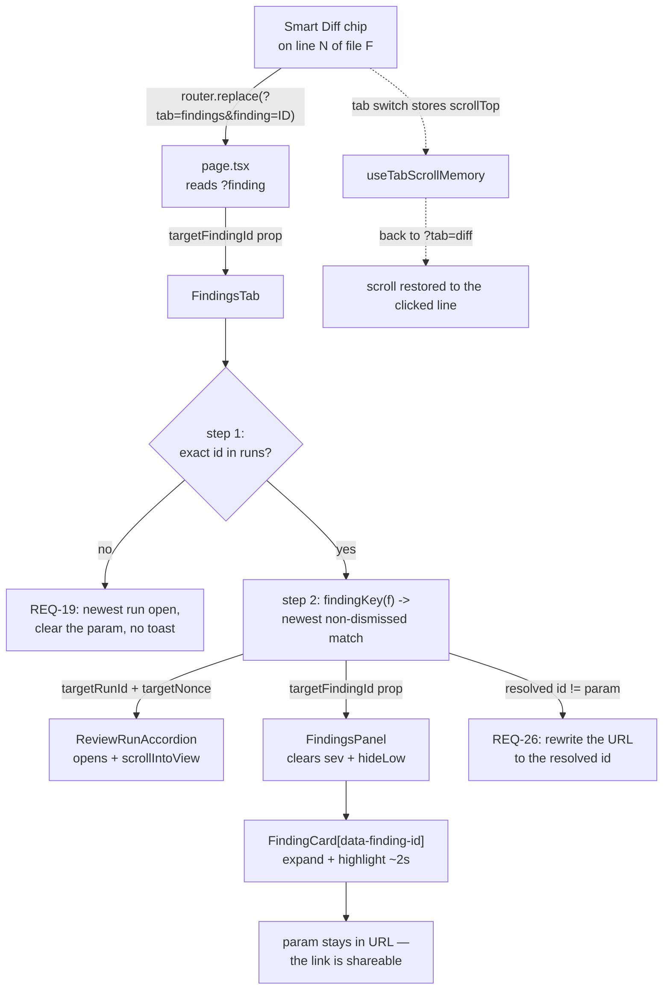

# Plan 04 — Smart Diff

**Modules:** server · client   **Created:** 2026-08-22   **Status:** draft
**Spec:** none (candidate for `server/specs/smart-diff.md` after the plan lands)

---

## 0. Start here — read this before dispatching anything

You are almost certainly a **fresh session with no memory of the conversation that produced this
plan.** That is the expected case. Everything you need is in this file. Read §0, §11 (Decisions
ledger) and §6 before dispatching a single task.

### 0.1 What state the repo is in

Verified on branch `hw3-subagents-workflow`, **2026-08-22**:

| Fact | How to confirm it yourself |
|---|---|
| **The `SmartDiff` Zod contract already exists and has NO implementation.** `SmartDiffRole` / `SmartDiffFile` / `SmartDiffGroup` / `ProposedSplit` / `SmartDiff` live in `server/src/vendor/shared/contracts/brief.ts` (lines ~80–113); `SmartDiffResponse = SmartDiff` is re-exported from `contracts/review-api.ts` (~line 64). **This plan extends that block in place** — see §4. | `grep -n "SmartDiff" server/src/vendor/shared/contracts/*.ts` |
| **No route, service, repository or handler implements it.** The only other hits are three forward-looking comments in `repo-intel` and one roadmap line in `modules/index.ts`. | `grep -rni "smart" server/src --include=*.ts` → contract + comments only |
| **The only consumer of the type is one re-export line.** `client/src/lib/types.ts:35` — `export type { PrBrief, SmartDiff } from "@devdigest/shared";`. Nothing reads the fields. | `grep -rn "SmartDiff" client/src server/src reviewer-core/src \| grep -v vendor/shared` |
| **`brief.ts` imports only `zod` today, and `findings.ts` imports only `zod`.** §4 adds one edge, `brief.ts → findings.ts`, for the `Severity` enum. There is no cycle: nothing in `findings.ts` imports `brief.ts`. | `head -5 server/src/vendor/shared/contracts/brief.ts` · `grep -n "^import" server/src/vendor/shared/contracts/findings.ts` |
| **`pulls/` has no service and no repository** — 2 files (`routes.ts`, `status.ts`) with ~18 inline `container.db` queries. `reviews/` has both, plus `repository/{pull,review,run}.repo.ts`. This drives §5's placement decision. | `find server/src/modules/pulls server/src/modules/reviews -type f` |
| **`GET /pulls/:id/intent` lives in `reviews/routes.ts`** even though it is `/pulls/`-prefixed, and modules register with **no** path prefix (`server/src/modules/index.ts` exports a bare `Record<string, FastifyPluginAsync>`). This is the sibling precedent. | `grep -n "'/pulls/:id/intent'" server/src/modules/reviews/routes.ts` |
| **`pnpm typecheck` is green on `main`** (`server/INSIGHTS.md`, 2026-08-16). Treat any error you see as yours. | `cd server && pnpm typecheck` |
| **The mockup is COMMITTED** (was untracked when this plan was written). `docs/mockups/smart-diff-mock.png`, 157 KB, landed in `6175a45` together with this plan, which is what makes §0.2's mandatory read followable off the owner's machine. §9 open question 6 is closed. **Read it; do not delete, move or rewrite it.** | `git ls-files docs/mockups/` |

### 0.2 Required reading — before any UI task

This is a precondition, not a suggestion, and it sits alongside §11 and §6:

> **Read `docs/mockups/smart-diff-mock.png` with the `Read` tool before touching T3, T7, T8 or T9.**
> The `Read` tool renders PNGs. The owner supplied this file as the visual reference for the whole
> feature, and every UI task names it as a required input.

If your tooling cannot render it, **§5.8 "The visual contract" carries its contents in text** — read
that instead and say in your report that you worked from the transcription rather than the image.
§5.8 also records the two places where the mockup is *not* the spec, so read it either way.

### 0.3 What to dispatch, in order

```
P1  [parent session]  Extend the Smart Diff block in contracts/brief.ts, additively (§4).
P2  [parent session]  ./scripts/sync-vendor.sh
──  dispatch          implementer: T2, T3, T4, T5 concurrently              (wave 1)
──  dispatch          implementer: T6, T7, T8 concurrently                  (wave 2)
──  dispatch          implementer: T9                                       (wave 3, alone)
──  parent session    pr-self-review over the whole diff, once
──  parent session    the demo walkthrough in §8.2
```

**Wave 0 has no implementer task.** The contract change is a single additive edit to an existing
Tier A file, so the parent session makes it before anything is dispatched. **There is no T1** — see
the tombstone in §6. The tree typechecks at every point in this sequence.

### 0.4 The six things a reader will otherwise get wrong

1. **Smart Diff never calls a model. Not once, not "just for the summary".** The zero-token
   guarantee is REQ-8 and it is proved by a test — a spy on `app.container.llm` plus a static import
   check on the classifier — not by intent. The mockup shows a per-file **"What this does:"** row and
   a `summary` pill; **neither is built in this iteration** (REQ-27, §11 **D7**). Looking at the
   picture and wiring an LLM call to fill that row is the single most likely way this feature's
   guarantee dies.
2. **The contract change is one additive edit to `brief.ts`, made by the parent session.** There is
   **no** `contracts/smart-diff.ts`, and `contracts/review-api.ts` is **not touched at all** — its
   `import { Intent, SmartDiff } from './brief.js'` and its `SmartDiffResponse = SmartDiff` alias
   both keep working unchanged. Nothing in this plan ever leaves the tree failing to typecheck.
3. **Groups do not collapse. Files do.** A group header is a heading, nothing more — all three
   sections always render expanded (REQ-28). What is collapsed by default is the **diff of every
   file** in Boilerplate, findings or no findings, plus any Core/Wiring file with no findings
   (REQ-3). The single source of truth is `SmartDiffFile.default_open` on the wire. §11 **D14**.
4. **A collapsed file must still advertise its findings** (REQ-29). Otherwise a CRITICAL finding
   inside a Boilerplate file — a hardcoded secret in a generated file is exactly this case — is
   reachable only by accident.
5. **Group membership never depends on findings.** Classification reads the file *path* and nothing
   else. A second agent run changes badges and within-group order; it can never move a file between
   Core / Wiring / Boilerplate (REQ-10, §11 **D8**).
6. **The server is correct by construction; every staleness bug in this feature is in the client
   cache.** The Smart Diff response is computed on read and persisted nowhere — there is no row, no
   cache key and no invalidation on the server side. So when someone reports "it opened the wrong
   card", the bug is in React Query invalidation (§5.7), never in the route. Read §5.7 before
   touching T4, T8 or T9.

---

## 1. Goal

The PR's changed files are sorted and grouped by **review risk**, so the reviewer reads business
logic first and lock files last — and, once a review has run, sees each finding **on the exact line
of the exact file it belongs to**, one click away from that finding's card in the agent-runs tab.

It is **purely deterministic**. It joins two things the app already has — the PR's changed files
(`GET /pulls/:id` → `pr_files.path/additions/deletions/patch`) and the findings of the persisted
reviews (`GET /pulls/:id/reviews`) — with a path-pattern classifier and a total sort. There is no
model call on this path, and there is a test whose only job is to prove that.

The surface: on `?tab=diff`, a `Smart order | Original order` segmented toggle sits top-right beside
the touched-file count. **Original order is the default.** In Smart order the files are partitioned
into three sections — **Core logic** ("The substance of the change — review closely"), **Wiring**
("Hooks the core into the app"), **Boilerplate** ("Generated / mechanical — skim"), each with a
count. **All three sections always render expanded**; a group header is a heading, not a control.
What opens or stays shut is each *file's diff*: in Core and Wiring a file carrying findings opens,
one without stays collapsed, and in Boilerplate **every** file stays collapsed regardless. A
collapsed file still shows that it has findings, so nothing hides. Files carrying findings sort
first inside their section, and a file over the large-file threshold is visually flagged.

On an offending line a coloured left bar and a right-aligned severity chip appear; clicking the chip
is a real in-app route transition to `?tab=findings&finding=<id>`, which opens the run holding that
finding, clears any filter that would hide it, scrolls to its card and highlights it.

Because finding ids are **run-scoped**, a re-run that reports the same issue mints a new id and the
deduped winner flips to it. Keeping the badge's id current is therefore a first-class requirement
(REQ-25), and the landing side resolves the param defensively (REQ-26) so a link cannot silently open
the wrong card.

One adjacent, pre-existing bug is fixed in the same PR because this feature makes it painful:
switching tabs away from Files changed and back **loses the scroll position** (REQ-24, T5).

**What already exists and is not re-created:** the `SmartDiff` contract block (extended, not
replaced), `parsePatch` with per-line `oldNo`/`newNo`, `DiffViewer`'s optional-feature-slot pattern
(`commenting?: DiffCommentApi`), `FindingCard`'s `data-finding-id`, `ReviewRunAccordion`'s
`targetRunId` + `targetNonce` open-and-scroll mechanism, `findingKey`'s dedup key on both sides,
`SectionLabel`, `SeverityBadge`, and `usePrActiveRuns`' server-sourced run tracking.

---

## 2. Requirements

| ID | Requirement |
|---|---|
| **REQ-1** | `GET /pulls/:id/smart-diff` returns the PR's changed files partitioned into exactly three groups — `core`, `wiring`, `boilerplate`, always all three, always in that order — and every changed file appears in **exactly one** of them. |
| **REQ-2** | Classification reads the file **path only**, with a documented precedence: a boilerplate pattern wins over a wiring pattern, a wiring pattern wins over core, and an unmatched path is `core`. The same path always yields the same role, independent of findings, patch availability, file size, or how many runs exist. |
| **REQ-3** | **File-level collapse is decided on the server and carried as `SmartDiffFile.default_open`.** It is `false` for **every** file whose role is `boilerplate`, findings or no findings; for `core` and `wiring` it is `true` **iff** that file has at least one finding. Every filename in `LOCK_FILES` classifies `boilerplate`, so a lock file always starts collapsed. The UI honours this flag and does not re-derive the rule. |
| **REQ-4** | Every numeric threshold and every path pattern used by Smart Diff lives in exactly one file, `server/src/modules/reviews/smart-diff/constants.ts`. No Smart Diff threshold or classification regex exists anywhere else in `server/` or in `client/`. |
| **REQ-5** | A file whose `additions + deletions` exceeds `LARGE_FILE_LINES` (**400**) is marked `large: true` on the wire, and the UI renders that file's header with a visible large-file flag. |
| **REQ-6** | `split_suggestion.too_big` is `true` **iff** `total_lines > SPLIT_SUGGESTION_LINES` (**1000**), where `total_lines` is the sum of `additions + deletions` over all changed files. |
| **REQ-7** | The findings attached to files are **all non-dismissed findings across all review runs of the PR**, deduplicated with the key `severity\|file\|start_line\|end_line\|title.trim().toLowerCase()`. On a collision the finding from the **newest** review survives and its `id` is the one the wire carries. |
| **REQ-8** | Serving `GET /pulls/:id/smart-diff` resolves **zero** LLM providers: a test spying on `app.container.llm` asserts it was never called during the request, and a second test asserts the classifier module's source imports nothing from `adapters/` or any provider SDK. |
| **REQ-9** | File order inside a group is a **total** order: `has findings desc → highest severity desc → finding count desc → changed lines desc → path asc`. `path` is unique within a PR, so no two files can tie and no row can change position between two identical requests. |
| **REQ-10** | Group membership is independent of findings: for a fixed file list, the `(role, path)` pairs are byte-identical before and after any number of review runs, deletions, or finding accept/dismiss actions. |
| **REQ-11** | A finding whose `file` is not among the PR's changed files is excluded from every group and counted in `unmatched_finding_count`. |
| **REQ-12** | With zero findings the response still returns all three groups with correct membership and ordering, every `findings` array empty, every `default_open` `false`, and `unmatched_finding_count: 0`. |
| **REQ-13** | On `?tab=diff`, an absent `order` param renders the original order; `?order=smart` renders Smart Diff. The segmented toggle writes and clears the param through the page's existing `setParam` helper, and the mode survives a reload. |
| **REQ-14** | In **original** order no line finding is rendered anywhere. In **smart** order a finding renders on the exact line of the exact file, matched by `finding.start_line === Line.newNo` from `parsePatch`. |
| **REQ-15** | ~~When several distinct findings land on the same rendered line, exactly one chip renders…~~ **SUPERSEDED 2026-08-22 — see the rewritten REQ-15 in §12.** Each finding on a line now renders its OWN chip linking to its own card; the single-representative rule survives only on the collapsed-file header (REQ-29). |
| **REQ-16** | A finding whose line is not present in the rendered patch — truncated context, outdated line, or `patch === null` — is **not dropped**: it renders in a per-file "not on a visible line" list under that file's header and stays clickable. |
| **REQ-17** | Clicking a finding chip performs an in-app route transition to `?tab=findings&finding=<id>` on the same page — never a link to github.com, never a popup, never a full page load. |
| **REQ-18** | `FindingsTab` reading `?finding=<id>` opens the `ReviewRunAccordion` of the run holding that finding, clears any `severity` or `hide-low-confidence` filter in `FindingsPanel` that would hide it, scrolls its `data-finding-id` card into view, expands it, and highlights it for ~2s. The param stays in the URL so the link is shareable. |
| **REQ-19** | A `?finding=<id>` that resolves by **neither** exact id **nor** the REQ-26 fallback degrades quietly: the findings tab renders with the newest run open, no crash, no error toast, no scroll hunt — and the `finding` param is cleared from the URL. |
| **REQ-20** | The changed-files header shows the number of touched files in **both** modes, and when `diff_source` is `cache` or `unavailable` Smart Diff renders the existing degradation notice instead of an empty "no changed files" state. |
| **REQ-21** | The `["smart-diff", prId]` query is invalidated by every mutation that can change the finding set: `useRunReview`, `useFindingAction`, `useDeleteRun`, `useDeleteReview`, and the page's `onRunDone`. |
| **REQ-22** | Smart Diff is **not** polled: `useSmartDiff` declares no `refetchInterval`. Freshness comes only from REQ-21's invalidations, and the tab stays fully usable while a run is in flight. |
| **REQ-23** | Two runs producing an identical finding collapse to exactly **one** chip, and that chip's navigation resolves to the **newer** run's card. |
| **REQ-24** | Switching `?tab=diff` → `?tab=findings` → `?tab=diff` restores the Files-changed scroll offset, including after a REQ-17 chip click, and `setParam`'s `router.replace` passes `{ scroll: false }`. |
| **REQ-25** | **No stale finding id ever survives in the rendered Smart Diff.** After a re-run that flips the deduped winner, the badge links to the **new** id and never the previous one. After `DELETE /reviews/:id`, every id from that run disappears from the payload together with its badge. After a dismiss, the dismissed finding's badge disappears. All three are verified against the **rendered** badge, not against the network response alone. |
| **REQ-26** | `?finding=<id>` resolution is two-step and defensive: exact id first, then — using the resolved finding's `findingKey` — re-resolve to the **newest non-dismissed** finding sharing that key, so a stale id lands on the *current* card rather than the superseded one. When the resolved id differs from the param, the URL is rewritten to the resolved id. |
| **REQ-27** | **`pseudocode_summary` is not built in this iteration.** The field stays declared on `SmartDiffFile` as `z.string().nullish()`, exactly as it is today; nothing on the server constructs it, and the UI renders **neither** the mockup's per-file **"What this does:"** row **nor** its `summary` pill. No model call is made to fill it. |
| **REQ-28** | **There is no group-level collapse state anywhere** — not on the wire, not in the UI. All three group sections always render expanded, each showing its coloured bullet, name, subtitle and file count. `SmartDiffGroup` carries no `default_open`, and no group header is a toggle. |
| **REQ-29** | **A collapsed file header still advertises its findings.** In every group, a file with at least one finding shows the coloured dot after its path plus a severity indicator (chip or count) on the header row, visible while the diff is collapsed. A `CRITICAL` finding inside a Boilerplate file must never be reachable only by accident. |

**The owner's nine acceptance criteria map as follows.** (1) mode toggle, findings hidden in normal
mode → REQ-13 + REQ-14. (2) touched-file header + zero tokens → REQ-20 + REQ-8. (3) large file
highlighted → REQ-5. (4) click jumps to the card in the agent-runs tab → REQ-17 + REQ-18. (5) three
groups, Boilerplate's file diffs always collapsed → REQ-1 + REQ-3 + REQ-28 (criterion 5 was
clarified by the owner on 2026-08-22 — §11 **D14**). (6) lock file always boilerplate + starts
collapsed → REQ-3. (7) badges clickable → REQ-17, with REQ-29 making them reachable on a collapsed
file. (8) no new model call in the logs → REQ-8 + REQ-27. (9) thresholds and patterns in a dedicated
constants file → REQ-4.

**The coordinator's re-run questions map as follows.** (1) cache invalidation → REQ-21 + REQ-22.
(2) a second run adds, never replaces → REQ-7 + REQ-23. (3) several findings on one line → REQ-15.
(4) ordering shifts, membership does not → REQ-9 + REQ-10. (5) stale deep links → REQ-19 + REQ-26.
(6) no polling mid-run → REQ-22. (7) **ids must be refreshed after a re-run** → REQ-25, with REQ-26
as the belt-and-braces landing-side guard.

---

## 3. Insights consulted

Read in full on 2026-08-22: `server/INSIGHTS.md` (172 lines, 25 entries), `client/INSIGHTS.md`
(140 lines, 20 entries), `reviewer-core/INSIGHTS.md` (15 lines, 1 entry). Nothing was appended after
this plan's `Created` date at time of writing. **`reviewer-core/` is not touched by one line of this
plan** — it is read only to confirm the engine has no part in a deterministic path.

### server — the entries that bind this change

- `2026-08-21` — **`.it` tests are not hermetic by default; only `overrides.secrets` closes both
  channels.** `LocalSecretsProvider` reads `~/.devdigest/secrets.json` *and* falls back to
  `process.env` (which `dotenv/config` fills from `server/.env`). A `.it` test reaching
  `container.llm(...)` without `hermeticOverrides()` from `server/test/helpers/overrides.ts` makes
  **real billed calls** that `catch` blocks swallow. → binds **T6**: the zero-token test is worthless
  if the harness can make a live call.
- `2026-08-17` — **`created_at` cannot break a sort tie; a non-total sort makes rows jump.**
  `ORDER BY confidence DESC, created_at ASC` was not total; Postgres returned tied rows in heap order
  and the card the user just clicked moved on the next refetch. *Any user-visible list needs a unique
  immutable last key.* → binds **T2**: REQ-9's tie-break is `path`, which is unique per PR, and
  nothing else will do.
- `2026-08-17` — **CORRECTS the `{}`-parses entry: `.default()` breaks the REAL call.** Calls go out
  with `strict: true`, where a provider rejects any field that is optional without also being
  nullable — and `.default()` is exactly that. Fields stay REQUIRED; **`.nullish()` is fine, because
  it is nullable AND optional**. → binds **P1**: `pseudocode_summary` stays `z.string().nullish()`
  and must not be "tidied" into `.default(null)`.
- `2026-08-17` — **GitHub's PR sub-resources fail independently of `pulls.get`.** "PR exists, diff is
  empty" is a real upstream state; `PrDetail.diff_source` (`github | cache | unavailable`) carries
  the verdict to the UI *so the fallback stops rendering as "No changed files."* → binds **T6/T7**:
  REQ-20 exists because of this entry.
- `2026-08-17` — **a delete-then-guarded-insert cache swap loses data on an upstream `200 []`.**
  `pr_files` is a cache that can legitimately be empty or stale. → binds **T6**: Smart Diff reads
  the persisted `pr_files`, never re-fetches from GitHub, and never treats empty as authoritative.
- `2026-08-17` — **`.` does not match `\r`, so `split('\n')` silently breaks every CRLF file.** On a
  CRLF checkout every line keeps a trailing `\r`, which is a JS regex line terminator, so the match
  fails for *all* lines and the parser returns `[]` with no error. → binds **T2 and T3**: any patch
  or path parsing splits on `/\r?\n/`.
- `2026-08-16` — **Widening a contract enum takes 3 edits, not 1 — but never a migration.** A value
  added to a Zod enum in `vendor/shared/contracts/` also has to be added to the matching Drizzle
  `text(col, { enum: [...] })`, and the third edit is `./scripts/sync-vendor.sh`. → binds **P1**:
  this change widens **no** enum (it reuses `Severity` verbatim), so it is one edit plus the sync,
  and **zero** migrations.
- `2026-08-16` — **`pnpm typecheck` is green on `main`; treat any error as yours.**
- `2026-08-10` — **`reviews.run_id` is a `uuid`.** To model "findings across N runs" in a `.it` test,
  insert **N separate `reviews` rows** (`runId` is nullable — omit it), never distinct run-id
  strings like `'run-1'`. → binds **T6**: this is exactly how REQ-7/REQ-23/REQ-25's fixture is built.
- `2026-08-09` — **`completeAgentRun` has a THIRD, hidden param-type copy**: `reviews/repository.ts`
  is a class façade that *re-declares* the inline parameter types of the free functions in
  `repository/*.repo.ts`; miss the façade and you get a `TS2353` pointing at the wrong file. → binds
  **T6**: adding `filesForPull` means editing both `repository/pull.repo.ts` and `repository.ts`.
- `2026-08-09` (seed) — **migrations are not applied on boot**, and **DB-backed tests need the
  `*.it.test.ts` suffix** or they run in the Docker-less lane. This plan adds **no** migration.

### client — the entries that bind this change

- `2026-08-18` — **a hidden Browser pane freezes every React Query query.** All skeletons + zero
  network requests is that, not a data bug. *Verify UI through the RTL lane instead.* → binds **T3,
  T5, T7, T8**: every UI acceptance box is closed by an RTL run, never by a browser screenshot.
- `2026-08-18` — **never run `pnpm build` in `client/` while `pnpm dev` is running.** → binds every
  client task's done condition: `pnpm typecheck && pnpm test`, never `pnpm build`.
- `2026-08-17` — **fixed-order category sections silently outrank the sort you asked for.** A
  30%-confidence rule rendered above a 90% one because sections came first. → binds **T2/T7**: Smart
  Diff is the *deliberate inverse* of that lesson — the sections **are** the ranking (risk order),
  and the score-like ordering is what happens **inside** a section. Say so in the code comment, or a
  future reader will "fix" it into one flat list.
- `2026-08-10` — **`findingKey` must stay identical to the server's key** in
  `server/src/modules/pulls/routes.ts`; the list counts are deduped server-side and the popup
  re-dedups client-side with the same key so the two agree. → binds **T2** (the server side of
  REQ-7) and **T8** (REQ-26's fallback re-resolution). A *third* variant of this key is a bug the
  moment it exists — T8 imports `findingKey`, it does not re-implement it.
- `2026-08-10` — **`borderColor` is a shorthand and conflicts with `borderLeftColor`**, triggering
  React's "Updating a style property during rerender…" warning on re-render. Use the three non-left
  longhands (`borderTopColor`/`borderRightColor`/`borderBottomColor`) when a distinct
  `borderLeftColor` accent is present. → binds **T3**: the coloured left bar on an offending line is
  exactly this pattern, and **T8**: so is the ~2s highlight.
- `2026-08-16` — **a clickable card must not be a `<button>` if it contains one.** Nested
  interactive elements are invalid HTML; the parser breaks them apart and the inner control leaves
  the tab order. → binds **T3**: the severity chip is a `<button>` inside a code line — the line row
  stays a plain container; and the file header holds both a chevron and a REQ-29 indicator.
- `2026-08-16` — **`vendor/ui` interactive primitives have no accessible name by default**; they take
  an optional `ariaLabel` — pass it. → binds **T3/T7**: the chip is icon/short-text sized and must
  carry a full accessible name.
- `2026-08-16` — **row order that outlives a checkbox must be client-held, not re-derived.** →
  binds **T8**: the deep-link resolution is held per `(param, nonce)`, not recomputed on every
  render, or it fights the user's own filter clicks.
- `2026-08-09` (seed) — **never `fetch` in a component; add a hook under `lib/hooks/`. Pages are
  thin. Tests mock the hook boundary, not global `fetch`.** → binds **T4** and every client test.

---

## 4. Contract changes — wave 0

**Yes, the wire shape changes.** It is **one purely additive edit to the existing Smart Diff block in
`server/src/vendor/shared/contracts/brief.ts`**, plus the vendor sync. Nothing is removed or
retyped; `contracts/review-api.ts` is **not touched**; `contracts/smart-diff.ts` is **not created**;
nothing changes in the barrel; the tree typechecks before, during and after.

`brief.ts` is a Tier A path — an existing file under `contracts/**` — so by this plan's own rule the
edit belongs to the **parent session**, not to an implementer. Wave 0 therefore contains two parent
steps and no dispatchable task.

### 4.1 What changes in `brief.ts`

One new import at the top of the file:

```ts
import { Severity } from './findings.js';
```

**No cycle is created, and this is verified rather than assumed.** `findings.ts` imports only `zod`
— it has no import of `brief.ts`, direct or transitive — so the new edge `brief.ts → findings.ts`
runs strictly one way. (`review-api.ts` already imports from both files, which is downstream of both
and unaffected.) Confirm with `grep -n "^import" server/src/vendor/shared/contracts/findings.ts`.

Then the `// ---- Smart Diff ----` block, extended. Additions are marked; **everything unmarked is
already there and stays byte-identical**:

```ts
export const SmartDiffRole = z.enum(['core', 'wiring', 'boilerplate']);
export type SmartDiffRole = z.infer<typeof SmartDiffRole>;

/** NEW. One finding placed on one line of one file. `line` is a NEW-file line number. */
export const SmartDiffFileFinding = z.object({
  id: z.string(),          // FindingRecord.id — the deep-link target. RUN-SCOPED: a re-run
                           // that reports the same issue mints a NEW id (see §5.7 / REQ-25).
  line: z.number().int(),  // finding.start_line; 0 means "no usable line"
  severity: Severity,      // reuses CRITICAL | WARNING | SUGGESTION — no new enum
});
export type SmartDiffFileFinding = z.infer<typeof SmartDiffFileFinding>;

export const SmartDiffFile = z.object({
  path: z.string(),
  pseudocode_summary: z.string().nullish(), // UNCHANGED — placeholder for future work.
                                            // Nothing writes it, nothing renders it (REQ-27).
                                            // Leave it `.nullish()`; NEVER `.default(null)`.
  additions: z.number().int(),
  deletions: z.number().int(),
  changed_lines: z.number().int(),          // NEW — additions + deletions, precomputed
  large: z.boolean(),                       // NEW — changed_lines > LARGE_FILE_LINES (REQ-5)
  has_patch: z.boolean(),                   // NEW — false when GitHub omitted the patch
  default_open: z.boolean(),                // NEW — the ONLY collapse flag in the contract.
                                            // false for every boilerplate file; for core/wiring
                                            // true iff findings.length > 0 (REQ-3).
  findings: z.array(SmartDiffFileFinding),  // NEW — D2
  finding_lines: z.array(z.number().int()), // KEPT — derived: sorted unique findings[].line
});

export const SmartDiffGroup = z.object({
  role: SmartDiffRole,
  file_count: z.number().int(), // NEW — files.length, so the header needs no client arithmetic
  files: z.array(SmartDiffFile),
  // NO `default_open` HERE. Groups never collapse (REQ-28, §11 D14).
});

export const ProposedSplit = z.object({ name: z.string(), files: z.array(z.string()) });

export const SmartDiff = z.object({
  groups: z.array(SmartDiffGroup),          // always length 3, ordered core, wiring, boilerplate
  total_files: z.number().int(),            // NEW
  total_lines: z.number().int(),            // NEW — hoisted out of split_suggestion for the header
  unmatched_finding_count: z.number().int(),// NEW — REQ-11
  split_suggestion: z.object({
    too_big: z.boolean(),
    total_lines: z.number().int(),
    proposed_splits: z.array(ProposedSplit),// always [] — §11 D12, §10
  }),
});
```

**Nothing is deleted.** `pseudocode_summary` stays exactly as it is (§11 **D7**, revised): it is a
declared placeholder for future work, nothing constructs it, nothing renders it. `.nullish()` is
already nullable-and-optional, so an absent value parses — which is what will happen, because the
server never sets the field. Do **not** change it to `.default(null)`: the 2026-08-17 server insight
bans `.default()` in these schemas outright.

**`default_open` lives on the file, not the group.** An earlier draft put it on `SmartDiffGroup`;
the owner corrected that on 2026-08-22 (§11 **D14**) — groups are headings, not controls, so a
group-level flag would encode a state that does not exist.

**Kept: `finding_lines`.** Per **D2** it stays as a derived field. It is `[...new Set(findings.map(f
=> f.line))].sort((a, b) => a - b)` and nothing more.

**No `generated_at`, no ETag, no version field.** The response is computed on read and persisted
nowhere (§5.7) — a freshness stamp on the wire would suggest a server-side cache that does not exist
and cannot be the cause of a staleness bug.

**No enum is widened**, so per the 2026-08-16 server insight this is one contract edit plus the sync
and **zero** Drizzle or migration work.

### 4.2 P1 — `[parent session]`, wave 0, first

**Do:** make the edit in §4.1. Add the `Severity` import, add `SmartDiffFileFinding`, add the six new
fields (`changed_lines`, `large`, `has_patch`, `default_open` on the file; `file_count` on the group;
`total_files`, `total_lines`, `unmatched_finding_count` on the root). Touch nothing else in
`brief.ts` — `Intent`, `BlastRadius`, `Risks`, `PrHistory` and `PrBrief` are unrelated and stay as
they are, and `pseudocode_summary` is left exactly as written. In the block's doc comment, record the
five things a future reader will otherwise get wrong: (a) `line` is a **new-file** line number and
`0` means "no usable line"; (b) `finding_lines` is *derived* from `findings` and exists only for
backwards compatibility; (c) `pseudocode_summary` is an unbuilt placeholder — nothing writes it and
filling it would require a model call, which REQ-8 forbids; (d) **`id` is run-scoped** — a re-run
reporting the same issue mints a new id, which is why there is no freshness stamp on this response
and why the client must invalidate rather than trust it (§5.7); (e) `default_open` is a **file**
flag and there is deliberately no group-level equivalent.

**Acceptance** (these are the retired T1's criteria, folded in — nothing was dropped):

- [ ] REQ-1 — `SmartDiff.groups` is `z.array(SmartDiffGroup)` and the doc comment records the
      invariant "always length 3, ordered core, wiring, boilerplate"
- [ ] REQ-3 — `SmartDiffFile.default_open: z.boolean()` exists and the doc comment states the rule
      (`false` for all boilerplate; `true` iff findings for core/wiring)
- [ ] REQ-28 — `SmartDiffGroup` has **no** `default_open` field, and the comment says why
- [ ] REQ-5 — `SmartDiffFile` carries `changed_lines: z.number().int()` and `large: z.boolean()`
- [ ] REQ-6 — `split_suggestion` keeps `too_big`, `total_lines` and `proposed_splits`, and
      `SmartDiff` additionally hoists `total_lines` to the top level for the header
- [ ] REQ-11 — `SmartDiff.unmatched_finding_count: z.number().int()` exists
- [ ] REQ-15 — `SmartDiffFileFinding` carries `id`, `line` and `severity`, and `severity` is the
      `Severity` imported from `./findings.js`, not a new enum
- [ ] REQ-27 — `pseudocode_summary: z.string().nullish()` is **unchanged** — `git diff` shows no
      edit to that line beyond the added comment, and it is not `.default(null)`
- [ ] the doc comment carries the run-scoped-`id` warning from §5.7, in prose, next to the `id` field
- [ ] **`contracts/review-api.ts` is untouched** — `git diff --stat` does not list it — and its
      `SmartDiffResponse = SmartDiff` alias still resolves
- [ ] `contracts/smart-diff.ts` does **not** exist, and `server/src/vendor/shared/index.ts` is
      unchanged (the barrel already re-exports `brief.js`)
- [ ] `client/src/lib/types.ts:35`'s `export type { PrBrief, SmartDiff }` still resolves, unedited
- [ ] no `.default()` was added anywhere, and no Zod enum was widened

**Must not:**

- create `contracts/smart-diff.ts`, or any new file under `contracts/**`
- edit `contracts/review-api.ts`, `contracts/findings.ts`, or `server/src/vendor/shared/index.ts`
- hand-edit `client/src/vendor/shared/**` — the mirror has exactly one writer, P2's script
- re-declare `z.enum(['CRITICAL','WARNING','SUGGESTION'])` instead of importing `Severity`
- delete `pseudocode_summary`, or change it to `.default(null)` / `.optional()` / required
- put `default_open` on `SmartDiffGroup`
- add `generated_at`, an ETag or a version field "so the client can tell if it is stale"
- run `pnpm db:generate` — this change widens no enum and adds no column

**Done condition:** `./scripts/sync-vendor.sh && ./scripts/sync-vendor.sh --check && cd server && pnpm typecheck && pnpm exec vitest run --exclude '**/*.it.test.ts' && cd ../client && pnpm typecheck`

> **CORRECTED 2026-08-22, after this step shipped.** The original done condition stopped at the two
> typechecks and could **not** have caught what this edit broke. Adding required fields to a Zod
> object silently invalidates every fixture that `.parse()`s it — and `tsc` never sees it, for two
> independent reasons: `server/tsconfig.json` ends `"include": ["src/**/*.ts"]`, so `server/test/**`
> is not compiled at all, and `SmartDiff.parse()` takes `unknown`, so even compiling it would raise
> nothing. `server/test/contracts.test.ts`'s SmartDiff fixture failed at RUNTIME and was only found
> by T2's own test run one wave later; the parent session repaired it. That file is in no task's
> `Owned paths`, so no implementer could have fixed it either. **Any contract edit must run the
> hermetic test suite, not just a typecheck.**

### 4.3 P2 — `[parent session]`, wave 0, after P1

`./scripts/sync-vendor.sh`. P1's own done-condition command already runs
`sync-vendor.sh && sync-vendor.sh --check`, so this is a belt-and-braces re-run; it is idempotent.
`client/src/vendor/shared/**` is Tier A and is **never** hand-edited — the script is the only writer.

---

## 5. Architecture

### 5.1 Where the server code goes, and why

**Decision: the route, the service method, the `pr_files` read and the pure classifier all live in
the `reviews` module.** `pulls` is not touched.

The reasoning, from `onion-architecture`:

- The endpoint needs two aggregates: `pr_files` (PR-scoped) and findings across reviews
  (reviews-scoped). Putting the route in `pulls` would mean `pulls` importing `reviews`' service or
  repository — **"No module imports another module"** (§2, cross-cutting rule 2). Forbidden outright.
- Putting it in `reviews` needs no cross-module import at all: `reviews/repository/pull.repo.ts`
  already owns PR-scoped queries (`getPull`, `upsertIntent`, `getIntent`), so a `filesForPull`
  `SELECT` over four columns joins the family it already belongs to. Two modules reading the same
  table is not a module dependency.
- `pulls` has **no service and no repository** — violation **V2** in the onion skill, "Forbidden".
  Adding cross-aggregate logic to its 381-line `routes.ts` deepens a known violation; the plan
  declines to.
- **Sibling precedent, already in the tree:** `GET /pulls/:id/intent` and `POST /pulls/:id/intent`
  are registered in `reviews/routes.ts`. Modules register with no prefix, so a `/pulls/`-prefixed
  path inside `reviews` is the established shape, not a novelty.

Ring placement:

| File | Ring | Note |
|---|---|---|
| `modules/reviews/smart-diff/constants.ts` | R2 | patterns + thresholds; imports nothing |
| `modules/reviews/smart-diff/classify.ts` | R2 | pure; imports R0 contracts + its own constants |
| `modules/reviews/repository/pull.repo.ts` | R3 | the only place `drizzle-orm` appears |
| `modules/reviews/repository.ts` | R3 | façade — derive the param type, do not re-declare it |
| `modules/reviews/service.ts` | R2 | orchestrates; takes `Deps`, never `Container` |
| `modules/reviews/routes.ts` | R5 | read input → resolve tenancy → one service call → status |

### 5.2 The classifier — total by construction

```
role(path):
  1. BOILERPLATE_PATTERNS.some(re => re.test(path))  -> 'boilerplate'
  2. WIRING_PATTERNS.some(re => re.test(path))       -> 'wiring'
  3. otherwise                                       -> 'core'
```

Precedence is **boilerplate > wiring > core**, and the default is **core**. Both are deliberate:

- Boilerplate wins because a generated file that also looks like config (`dist/next.config.js`)
  should be skimmed, not reviewed. Under the opposite order the vendor directory leaks into Wiring.
- Unmatched defaults to **core** because the two errors are not symmetric: a file wrongly promoted to
  Core costs the reviewer a few seconds of attention, a file wrongly demoted to Boilerplate has its
  diff collapsed by default and may never be read at all. When in doubt, show it.

`git diff.orderFile` is the deterministic prior art this shape follows: an ordered pattern list,
first match wins, everything unmatched sorted last (here: everything unmatched treated as most
important, which is the same mechanism pointed the other way).

**Wiring is defined, not hand-waved.** It is the set of files that *connect* code without containing
the change's substance: build and tool config (`*.config.ts`, `tsconfig*.json`, `drizzle.config.*`,
`next.config.*`, `vitest.config.*`, `postcss.config.*`, `docker-compose*`, `Dockerfile*`),
environment files (`.env*`), CI definitions (`.github/**`, `.gitlab-ci.yml`), barrels and
entrypoints (`index.ts|tsx|js|jsx`, `main.*`, `app.ts`, `server.ts`), route registration
(`routes.ts`, `route.ts`, `router.tsx`), framework file conventions (`layout.tsx`, `middleware.ts`,
`proxy.ts`), and dependency manifests (`package.json` — a dependency add *is* wiring, not
boilerplate; only the **lock** file is boilerplate).

**Classification is path-only, on purpose.** Linguist's `generated.rb` also detects generated
content — average line length > 110 chars, Go's `// Code generated … DO NOT EDIT`, protobuf's
banner. Every one of those requires reading the patch, and `patch` is `null` for large and binary
files and can be a stale cache (`server/INSIGHTS.md`, 2026-08-17 ×2). A content rule would therefore
make group membership depend on whether GitHub felt like sending a patch, which breaks REQ-10.
**Rejected, deliberately** — see §11 **D8**.

### 5.3 The two orderings, and the one collapse rule

**Between groups:** fixed — `core`, `wiring`, `boilerplate`. This is the ranking, and all three
always render (REQ-28).

**Inside a group:** total, in this exact key order —

| # | Key | Direction | Why |
|---|---|---|---|
| 1 | has findings | desc | the mockup: files with findings first |
| 2 | highest severity present (`CRITICAL > WARNING > SUGGESTION`) | desc | a blocker outranks a suggestion |
| 3 | finding count | desc | more problems, more attention |
| 4 | `changed_lines` | desc | bigger change, more risk |
| 5 | `path` | asc | **unique per PR — makes the order total** |

Key 5 is the one that is not optional. `server/INSIGHTS.md` 2026-08-17: a sort whose last key is not
unique and immutable returns rows in heap order, and the card the user just clicked jumps position on
the next refetch. Keys 1–3 all change when a run lands — that is expected and is exactly why key 5
must exist.

**The collapse rule (REQ-3), computed once, on the server:**

```
default_open(role, findings):
  role === 'boilerplate'  ->  false        // always, findings or not
  otherwise               ->  findings.length > 0
```

Two levels that are often conflated, kept apart deliberately:

| Level | State | Where it lives |
|---|---|---|
| **Group** | none — always expanded | nowhere. REQ-28 removes the concept |
| **File** | `default_open` | `SmartDiffFile`, computed by the classifier |

And the consequence the rule creates, which REQ-29 answers: a finding inside a Boilerplate file is
invisible until the user expands that file by hand. A hardcoded secret in a generated file is exactly
the kind of thing that lands there, so the **collapsed** header must carry the coloured dot and a
severity indicator. Collapsing a file may cost a scroll; it must never cost a blocker.

### 5.4 The click — Smart Diff to the finding card



`ReviewRunAccordion` already implements the open-and-scroll half via `targetRunId` + `targetNonce`
(the nonce is in the effect's dep array purely to re-fire the scroll on a repeat click). **D4 reuses
that mechanism rather than inventing a second one.** What is new is the *finding*-level leg:
`FindingsPanel` must clear filters that would hide the target, and `FindingCard` must expand and
highlight.

### 5.5 The client placement

| Piece | Path | Rule |
|---|---|---|
| `SmartDiffViewer` | `app/repos/[repoId]/pulls/[number]/_components/SmartDiffViewer/` | **colocated** — one consumer today (`DiffTab`). `frontend-ui-architecture` §3: promotion happens on the *second* consumer, never speculatively. |
| annotations slot | `components/diff-viewer/annotations.ts` + threaded through the existing tree | the primitive is already shared by two call sites; the slot follows the `commenting?: DiffCommentApi` precedent exactly |
| `useSmartDiff` | `lib/hooks/reviews.ts` | client insight 2026-08-09: never `fetch` in a component |
| tab scroll memory | `app/repos/[repoId]/pulls/[number]/_lib/use-tab-scroll-memory.ts` | `_lib/` is the route-private logic folder |

**Extend the shared primitives; do not fork the viewer.** `DiffViewer → FileCard → CodeLine` already
carries one optional feature slot (`commenting`) as a plain pass-through at every hop. A second
optional slot is the pattern the file already teaches. A separate viewer would duplicate
`parsePatch`, the hunk rendering, the collapse behaviour and the styles — and would guarantee the two
drift. `SmartDiffViewer` is therefore a *composition*: group sections + headers + counts + the
annotation adapter, rendering the shared `FileCard`s underneath.

### 5.6 The tab-scroll fix (REQ-24)

**Cause, confirmed:** `page.tsx` renders each tab as `{tab === "diff" && <DiffTab …/>}`, so switching
away unmounts the tab body outright and coming back is a fresh mount with `scrollTop` 0.

**Secondary, unverified:** `setParam` calls `router.replace(...)` with no `{ scroll: false }`, and
the App Router defaults to `scroll: true`. The real scroll container is the `<main style={{ flex:1,
minHeight:0, overflow:"auto" }}>` inside `client/src/vendor/ui/shell/AppFrame.tsx`, so the window
probably never scrolls and Next's scroll-to-top is probably a no-op. `grep -rn "scroll: false"
client/src` returns **0** hits repo-wide. Pass it anyway — it is one argument and cannot hurt.

**Chosen: (a) per-tab scroll memory.** A route-private hook stores `scrollTop` keyed by tab on the
way out and restores it in a `useLayoutEffect` on the way in. It finds its container by walking up
from a sentinel node to the nearest scrollable ancestor, so it needs **no** change to `AppFrame`.

Rejected, and why:

- **(b) keep both tabs mounted, hide the inactive one with CSS.** Does not solve the problem on its
  own — `<main>`'s `scrollTop` is a single shared value and the content height changes with the tab,
  so per-tab offsets are still needed. It also doubles the mounted DOM and keeps both tabs' query
  observers live.
- **(c) thread a scroll-container ref out of `AppFrame`.** `AppFrame` is a design-system primitive
  rendered by every page in the app. `scripts/sync-vendor.sh` covers only `vendor/shared`, so
  `vendor/ui` is hand-maintained and edits there are silent, un-checked, and blast-radius-wide for a
  single page's bug. Not worth it.

**Expansion state is deliberately NOT preserved across a tab switch.** Scroll position is a
navigation affordance the user never chose to lose; file expansion in Smart Diff is *derived from the
server's `default_open`* (§5.3), so a remount reproduces exactly what the user was looking at. The
one thing lost is a hand-toggle the user performed — a known, documented limitation, logged in §9,
not a REQ. This also means a restored `scrollTop` lands on the same content it left, because the
content height is reproduced identically.

### 5.7 Staleness — the failure mode, and where it lives

**The invariant, stated plainly: the Smart Diff response is computed on read and persisted nowhere.**
There is no `smart_diff` table, no cache key, no `generated_at`, no server-side invalidation. Every
request recomputes the whole payload from `pr_files`, `reviews` and `findings` as they are at that
instant. **The server is therefore correct by construction, and every staleness bug in this feature
lives in the client's React Query cache.** Anyone debugging "the wrong card opened" should read
`client/src/lib/hooks/reviews.ts`'s invalidation lists first and the route last.

**The failure mode this creates, in full, because it is not the obvious one.** Finding ids are
**run-scoped**: a re-run that reports the same issue writes a *new* `findings` row with a *new* id,
and under D1's newest-wins dedup the surviving winner flips to that new id. If the client serves a
cached `["smart-diff", prId]` payload after the re-run, the badge still carries the **previous** id
— and because the old run usually still exists, `?tab=findings&finding=<old-id>` **resolves
successfully and navigates to the wrong card**: the superseded run's finding instead of the current
one.

That is strictly worse than a dead link. A dead link is visible; this one silently shows a stale
rationale from an older run and nothing anywhere surfaces an error. **An implementer who "handles the
stale deep link" by only covering the not-found case has not fixed this bug.** Hence two separate
requirements, one on each side:

| Path | What goes stale | Fixed by |
|---|---|---|
| **Re-run flips the deduped winner** | the badge's `id` points at the superseded finding | **REQ-25** — `useRunReview` + `onRunDone` invalidate `["smart-diff", prId]`, so the badge re-renders with the new id |
| **`DELETE /reviews/:id` / `DELETE /runs/:id`** | ids from the deleted run linger in the payload | **REQ-25** — `useDeleteReview` and `useDeleteRun` invalidate `["smart-diff", prId]` |
| **Finding dismissed or accepted** | a dismissed finding's badge should vanish (D1 filters dismissed) | **REQ-25** — `useFindingAction` invalidates `["smart-diff", prId]` alongside `["reviews", prId]` |

**REQ-26 is the belt and braces on the landing side**, and it exists because invalidation is a
liveness property while the deep link is a durability one: a URL can be pasted a week later, into a
cold cache, on another machine. Resolution is therefore two steps:

1. **Exact id** — find the finding with that `id` among the current `runs`.
2. **Key upgrade** — take that finding's `findingKey(f)` (imported from
   `client/src/components/findings-indicator/index.ts`, never re-implemented) and re-resolve to the
   **newest non-dismissed** finding sharing the key. That is the same winner the server picked for
   the badge, so the diff tab and the findings tab agree by construction.
3. If step 1 finds nothing, the key is unrecoverable from the URL alone → **REQ-19** degradation.

**The URL is rewritten** (via `setParam`, a `replace`) to the resolved id whenever it differs from
the param, so the link the user copies afterwards is the current one and a second paste needs no
upgrade.

**Known limitation, stated so nobody thinks it is an oversight:** a link shared *before* a re-run
whose original run is *later deleted* cannot be upgraded — step 1 fails and the key is not in the
URL. Making that survivable means putting the dedup key in the URL, which is ugly and is not
proposed here. §9 open question 4.

### 5.8 The visual contract

Transcribed from `docs/mockups/smart-diff-mock.png` on 2026-08-22, so that a session whose tooling
cannot render the PNG still has the facts. **Read the image if you can (§0.2); this section is the
fallback and the reconciliation, not a replacement.**

**What the mockup shows:**

| Element | Detail |
|---|---|
| Section label | `REVIEWER-ORDERED DIFF` with the `Code` icon — the existing `SectionLabel` primitive, not a new component |
| Header row | `9 files · +247 −38` on the left; the `Smart order \| Original order` segmented toggle right-aligned on the **same** row. `Smart order` is the selected segment in the mock |
| Group headers | a small coloured square bullet · the name · a muted subtitle · a right-aligned file count. **Blue = Core logic** "The substance of the change — review closely" · **amber = Wiring** "Hooks the core into the app" · **grey = Boilerplate** "Generated / mechanical — skim". Counts read `2 files` / `3 files` / `4 files` |
| File card header | chevron · file icon · mono path · **a small coloured dot immediately after the path on files that carry findings** · right side: a `summary` pill and the `+84 −0` stat |
| Findings on lines | a coloured left bar on the offending line plus a right-aligned chip. Three chip styles — `suggestion` (blue), `warning` (amber), `blocker` (red). The mockup shows one chip because its example line carries one finding — it does NOT evidence one-chip-per-LINE. D6 was reversed on 2026-08-22: every finding on a line gets its own chip (§12) |
| Line gutter | real new-file line numbers with hunk jumps (…28, 29, 30, then 52, 53…) — exactly what `parsePatch` already produces |

**Where the mockup is the spec.** Everything in the table above, plus the file-level expansion
pattern: Core's two files both carry findings and are both expanded; in Wiring, `index.ts` and
`server.ts` are collapsed while `config.ts` is expanded because it carries a blocker. That is REQ-3
exactly. The coloured dot on the collapsed `src/api/users.ts` header is REQ-29 exactly.

**Where the mockup is NOT the spec — two pieces of artistic licence, named so nobody implements them:**

1. **The "What this does:" row and the `summary` pill.** Under each expanded file's header the mock
   shows a row reading *"What this does: New token-bucket limiter: read bucketKey → Redis INCR → if
   over limit return 429, else next()."*, with a matching `summary` pill in the header. **That row is
   `pseudocode_summary` — a model-written per-file explanation, and it is not built in this
   iteration.** The field ships as an unwritten placeholder (REQ-27, §11 **D7**), so **neither the
   row nor the pill renders**. Do not fake the text, and above all do not wire a model call to
   generate it — that is how REQ-8 dies.
2. **`src/api/users.ts` sits under Boilerplate, with its diff expanded.** A path-only classifier
   (§5.2) calls that path `core`, and REQ-3 collapses every Boilerplate file regardless of findings.
   The mock is illustrating the collapsed-header-with-dot affordance, not asserting a classification.
   **The classifier is the spec here, not the picture.**

**What the mockup does not contradict:** it shows all three groups rendered with their headers and
counts, which is REQ-28. There is no group chevron and no collapsed group in the image.

---

## 6. Task graph

### Waves

| Wave | Tasks | Lane(s) | Parallel? |
|---|---|---|---|
| 0 | `[parent]` **P1** → `[parent]` **P2** | contract | **n/a** — no implementer task; two serialized parent steps |
| 1 | **T2, T3, T4, T5** | backend, frontend ×3 | **yes** |
| 2 | **T6, T7, T8** | backend, frontend ×2 | **yes** |
| 3 | **T9** | frontend | **no** — alone in the wave |

> **T1 is retired.** An earlier draft created `contracts/smart-diff.ts` as an implementer task; the
> owner reversed that on 2026-08-22 (§11 **D2**), and the contract work is now parent step **P1**.
> T1's acceptance criteria and done-condition command were folded into §4.2 verbatim — nothing was
> dropped. **Task numbering is left unchanged** so that every cross-reference in this document stays
> valid: there is no T1, and tasks run T2 … T9.

### Requirement → Task coverage

`P1` ‡ is a `[parent session]` step, not a dispatchable task — see §4.2. It appears in the matrix
because it is where six requirements are satisfied, and a requirement with no owner is a hole
whether or not its owner is dispatchable.

| | 1 | 2 | 3 | 4 | 5 | 6 | 7 | 8 | 9 | 10 |
|---|---|---|---|---|---|---|---|---|---|---|
| **P1** ‡ | x | | x | | x | x | | | | |
| **T2** | x | x | x | x | x | x | x | x | x | x |
| **T3** | | | | | | | | | | |
| **T4** | | | | | | | | | | |
| **T5** | | | | | | | | | | |
| **T6** | x | | | | | | x | x | | |
| **T7** | | | x | | x | | | | | |
| **T8** | | | | | | | | | | |
| **T9** | | | | | | | | | | |

| | 11 | 12 | 13 | 14 | 15 | 16 | 17 | 18 | 19 | 20 |
|---|---|---|---|---|---|---|---|---|---|---|
| **P1** ‡ | x | | | | x | | | | | |
| **T2** | x | x | | | | | | | | |
| **T3** | | | | x | x | x | | | | |
| **T4** | | | | | | | | | | |
| **T5** | | | | | | | | | | |
| **T6** | x | x | | | | | | | | x |
| **T7** | | | x | x | x | x | x | | | x |
| **T8** | | | | | | | | x | x | |
| **T9** | | | x | | | | x | x | x | |

| | 21 | 22 | 23 | 24 | 25 | 26 | 27 | 28 | 29 |
|---|---|---|---|---|---|---|---|---|---|
| **P1** ‡ | | | | | | | x | x | |
| **T2** | | | x | | | | | x | |
| **T3** | | | | | | | | | x |
| **T4** | x | x | | | x | | | | |
| **T5** | | | | x | | | | | |
| **T6** | | | x | | x | | | | |
| **T7** | | | | | x | | x | x | x |
| **T8** | | | | | x | x | | | |
| **T9** | x | | | x | x | x | | | |

Every REQ is hit by at least one owner; every task implements at least one REQ.

**REQ-30 … REQ-34 are NOT in the tables above** — they were added by the post-verification remediation
in §12, after this matrix was written. Their owners live on each §12 task's `Implements:` line and are
reproduced here so no requirement is orphaned:

| | REQ-30 | REQ-31 | REQ-32 | REQ-33 | REQ-34 |
|---|---|---|---|---|---|
| **T10** | x | | | | |
| **T11** | | x | | | |
| **T12** | | | | | |
| **T13** | | | x | | |
| **T14** | | | | x | |
| **T15** | | | | | x |

T12 owns the **rewritten** REQ-15 (§12), which supersedes the REQ-15 row in the first table.

### Disjointness — checked per wave

- **Wave 0** — no implementer task. P1 and P2 are parent steps, run one after the other, with nothing
  to collide with. ✔
- **Wave 1** —
  T2 `{server/src/modules/reviews/smart-diff/constants.ts, .../classify.ts, server/test/smart-diff-classify.test.ts}` ·
  T3 `{client/src/components/diff-viewer/annotations.ts, .../DiffViewer/DiffViewer.tsx, .../FileCard/FileCard.tsx, .../CodeLine/CodeLine.tsx, .../styles.ts, .../index.ts, .../DiffViewer/DiffViewer.test.tsx}` ·
  T4 `{client/src/lib/hooks/reviews.ts, client/src/lib/hooks/reviews.test.tsx, client/messages/en/prReview.json}` ·
  T5 `{client/src/app/repos/[repoId]/pulls/[number]/_lib/use-tab-scroll-memory.ts, .../_lib/use-tab-scroll-memory.test.tsx, client/src/app/repos/[repoId]/pulls/[number]/page.tsx}`.
  One server task and three client tasks across four disjoint directories. No path appears twice. ✔
- **Wave 2** —
  T6 `{server/src/modules/reviews/repository/pull.repo.ts, .../repository.ts, .../service.ts, .../routes.ts, server/test/smart-diff-api.it.test.ts}` ·
  T7 `{client/.../_components/SmartDiffViewer/** (5 files), client/.../_components/DiffTab/DiffTab.tsx, .../DiffTab/DiffTab.test.tsx}` ·
  T8 `{client/.../_components/FindingsTab/FindingsTab.tsx, .../FindingsTab/FindingsTab.test.tsx, .../FindingsPanel/FindingsPanel.tsx, .../FindingsPanel/FindingsPanel.test.tsx, .../FindingCard/FindingCard.tsx, .../FindingCard/FindingCard.test.tsx}`.
  T7 and T8 are both in `_components/` but own **different component folders**. No path appears
  twice. ✔
- **Wave 3** — T9 owns `client/src/app/repos/[repoId]/pulls/[number]/page.tsx`. Alone. ✔

**Cross-wave re-ownership, stated so nobody reads it as a collision:** `page.tsx` is owned by **T5 in
wave 1** and again by **T9 in wave 3**. The invariant is *within* a wave, and these are two waves
apart. T9 carries an explicit red flag against undoing T5's edits.

**`docs/mockups/smart-diff-mock.png` is read by four tasks and owned by none.** It is a read-only
input; no task may modify, move or delete it.

### Exclusivity — Tier B

**None.** No task owns `.claude/agents/README.md` or `.claude/skills/README.md`. T9 is marked
`Parallel: no` because it is alone in its wave, not because of Tier B.

### Tier A work — the `[parent session]` steps, in order

**P1 — wave 0, first.** The additive `brief.ts` edit, in full in §4.2 (do / acceptance / must-not /
done condition). Verify afterwards with `grep -n "SmartDiffFileFinding"
server/src/vendor/shared/contracts/brief.ts` → a hit, and `git diff --stat` → `brief.ts` and the
`client/` mirror only.

**P2 — wave 0, after P1.** `./scripts/sync-vendor.sh`. Idempotent; P1's done condition already ran
it. `client/src/vendor/shared/**` is Tier A and has no other writer.

**There is no migration step in this plan.** Smart Diff adds no column and no table — it reads
`pr_files`, `reviews` and `findings` as they already are, and widens no enum. Do **not** run
`pnpm db:generate`.

**INSIGHTS.md** — Tier A for every task. Insight candidates go in each implementer's report under
`### Insight candidates`; the parent session appends at session end.

---

## 7. Tasks

### T2 — The pure classifier and the one constants file
**Wave:** 1 · **Parallel:** yes · **Lane:** backend · **Ring:** R2 · **Depends on:** `[parent]` P1, P2
**Implements:** REQ-1, REQ-2, REQ-3, REQ-4, REQ-5, REQ-6, REQ-7, REQ-8, REQ-9, REQ-10, REQ-11, REQ-12, REQ-23, REQ-28

**Owned paths (exclusive — no other task may name these):**
- `server/src/modules/reviews/smart-diff/constants.ts` (new)
- `server/src/modules/reviews/smart-diff/classify.ts` (new)
- `server/test/smart-diff-classify.test.ts` (new)

**May read:** `server/src/vendor/shared/contracts/brief.ts` (P1's output — the Smart Diff block),
`server/src/vendor/shared/contracts/findings.ts`,
`server/src/modules/pulls/routes.ts` (the dedup block, ~lines 179–192),
`client/src/components/findings-indicator/index.ts` (`findingKey`),
`server/src/modules/reviews/helpers.ts`, `docs/plans/04-smart-diff.md` §5.2 and §5.3

**Skills (mandatory — these govern this task, from the lane table):**
`onion-architecture`, `fastify-best-practices`, `zod`, `typescript-expert`

**Binding insights:**
- `server` `2026-08-17` — **a non-total sort makes rows jump.** `ORDER BY confidence DESC,
  created_at ASC` was not total; Postgres returned tied rows in heap order and the card the user
  just clicked moved on the next refetch. *Any user-visible list needs a unique immutable last key.*
- `server` `2026-08-17` — `.` does not match `\r`; split subprocess/file text on `/\r?\n/` or every
  line fails to match on a CRLF checkout, silently, with no error
- `client` `2026-08-10` — `findingKey` = `severity|file|start_line|end_line|title.trim().toLowerCase()`
  and **must stay identical** to the server's key in `modules/pulls/routes.ts`. A third variant is a
  bug the moment it exists
- `client` `2026-08-17` — fixed-order category sections silently outrank the sort you asked for.
  Smart Diff is the deliberate inverse: the sections **are** the ranking. Say so in a comment or
  someone will "fix" it into one flat list
- `server` `2026-08-16` — `pnpm typecheck` is green on `main`; treat any error as yours

**Do:** Write two pure modules and their hermetic test. `constants.ts` holds **every** threshold and
**every** pattern — `LARGE_FILE_LINES = 400`, `SPLIT_SUGGESTION_LINES = 1000`, `LOCK_FILES`,
`BOILERPLATE_PATTERNS`, `WIRING_PATTERNS`, `ROLE_ORDER`, and `ALWAYS_COLLAPSED_ROLES` (which is
`['boilerplate']`) — each with a source comment naming where the number came from (§9's citation
table). `classify.ts` exports `classifyPath(path): SmartDiffRole` implementing §5.2's three-step
precedence, and `buildSmartDiff(files, findings): SmartDiff` implementing §5.3's total order, its
`default_open` rule, REQ-7's dedup, REQ-11's unmatched count, REQ-5's `large` flag and REQ-6's
`too_big`. Define the two input types locally in `classify.ts` — the caller supplies
`{ path, additions, deletions, patch: string | null }` and
`{ id, file, start_line, end_line, severity, title, review_created_at }`. **Sort the findings inside
the function** (`review_created_at` desc, then `id` desc) before deduping, so the function is correct
regardless of the order the caller happens to pass; do not rely on `reviewsForPull`'s newest-first
ordering. `split_suggestion.proposed_splits` is always `[]` (§11 **D12**). **Do not construct
`pseudocode_summary` at all** — it is `.nullish()` and out of scope this iteration (REQ-27, §11
**D7**). Neither file imports anything but the R0 contracts and each other.

**Acceptance:**
- [ ] REQ-1/REQ-12 — `buildSmartDiff([], [])` returns exactly three groups in the order
      `core, wiring, boilerplate`, all empty, `unmatched_finding_count: 0`; and a file list with no
      findings still groups and orders correctly with every `findings` array empty and every
      `default_open` `false`
- [ ] REQ-2 — a table-driven test asserts `classifyPath` over ≥25 paths covering every pattern
      family, including the precedence cases `dist/next.config.js` → `boilerplate` (not `wiring`)
      and `src/lib/thing.ts` → `core` (unmatched default)
- [ ] **REQ-3 — the collapse rule, four cases in one test:** a boilerplate file **with** findings →
      `default_open: false`; a boilerplate file without → `false`; a core file with findings →
      `true`; a core file without → `false`. The same four for `wiring`. The mutation that would
      break it: applying `findings.length > 0` uniformly across all three roles
- [ ] REQ-3 — every entry of `LOCK_FILES` classifies `boilerplate` at both repo root and nested
      (`a/b/pnpm-lock.yaml`), and therefore emits `default_open: false`
- [ ] REQ-28 — no group object in the output carries a `default_open` key:
      `expect(Object.keys(group)).toEqual(['role','file_count','files'])` on all three
- [ ] REQ-4 — `grep -rn "400\|1000" server/src/modules/reviews/smart-diff/classify.ts` finds no
      threshold literal; both numbers exist only in `constants.ts`
- [ ] REQ-5 — a file with `additions + deletions === 400` is **not** `large`; `401` is
- [ ] REQ-6 — `total_lines === 1000` → `too_big: false`; `1001` → `true`; and
      `proposed_splits` is `[]` in every case
- [ ] REQ-7/REQ-23 — two findings differing only by `id` and `review_created_at`, identical on
      `severity|file|start_line|end_line|title` (including a case and whitespace difference in
      `title`), collapse to **one**, and the surviving `id` is the newer review's
- [ ] REQ-9 — a fixture of ≥6 files in one group asserts the exact emitted order, and a second
      assertion shuffles the input array and asserts the output is byte-identical
- [ ] REQ-10 — the same file list built once with `[]` findings and once with a full finding set
      produces identical `(role, path)` membership sets for all three groups
- [ ] REQ-11 — a finding whose `file` matches no changed file appears in no group and increments
      `unmatched_finding_count`; a finding with `start_line: 0` stays attached to its file with
      `line: 0`
- [ ] REQ-8 (static half) — a test reads `classify.ts` and `constants.ts` as text and asserts no
      `import` line matches `/adapters\/|openai|anthropic|openrouter|llm/i`

**Red flags (stop if you are about to do any of these):**
- [ ] importing `drizzle-orm`, `db/schema*`, `platform/container` or `fastify` into either file —
      these are R2 and pure
- [ ] reading `patch` content to decide a role — classification is path-only (§5.2); a content rule
      makes membership depend on whether GitHub sent a patch and breaks REQ-10
- [ ] opening a Boilerplate file because it has findings — REQ-3 is `false` for that role
      unconditionally; REQ-29 is what makes those findings visible instead
- [ ] emitting a `default_open` on the **group** — groups never collapse (REQ-28)
- [ ] ending the within-group sort on `changed_lines` or severity and omitting `path` — that is the
      exact non-total sort the 2026-08-17 insight is about
- [ ] writing a fourth copy of the dedup key instead of the character-identical
      `severity|file|start_line|end_line|title.trim().toLowerCase()`
- [ ] putting a threshold, a regex or a lock-file name anywhere but `constants.ts`
- [ ] splitting patch or path text on `'\n'` instead of `/\r?\n/`
- [ ] making `buildSmartDiff` depend on the caller's array order for correctness
- [ ] keeping the OLDER finding on a dedup collision — newest wins, and its id is what the UI links to
- [ ] setting `pseudocode_summary` to anything — including `null`. Nothing constructs it (REQ-27)
- [ ] implementing a real `proposed_splits` — it ships as `[]` by owner decision (§11 **D12**)
- [ ] editing `server/src/vendor/shared/**` — Tier A; P1 already made the contract change

**Done condition:** `cd server && pnpm typecheck && pnpm exec vitest run --exclude '**/*.it.test.ts'`

---

### T3 — The `annotations` slot in the shared diff-viewer primitives
**Wave:** 1 · **Parallel:** yes · **Lane:** frontend · **Depends on:** none
**Implements:** REQ-14, REQ-15, REQ-16, REQ-29

**Owned paths (exclusive — no other task may name these):**
- `client/src/components/diff-viewer/annotations.ts` (new)
- `client/src/components/diff-viewer/DiffViewer/DiffViewer.tsx` (edit)
- `client/src/components/diff-viewer/FileCard/FileCard.tsx` (edit)
- `client/src/components/diff-viewer/CodeLine/CodeLine.tsx` (edit)
- `client/src/components/diff-viewer/styles.ts` (edit)
- `client/src/components/diff-viewer/index.ts` (edit — export the new types)
- `client/src/components/diff-viewer/DiffViewer/DiffViewer.test.tsx` (new)

**Required inputs — read these before writing code:**
- **`docs/mockups/smart-diff-mock.png`** (§0.2 — mandatory; the `Read` tool renders it). The
  file-card header, the coloured dot after the path, the left bar and the three chip styles all come
  from this image. §5.8 is the text fallback if your tooling cannot render it.
- `client/src/components/diff-viewer/comments.ts` (the `DiffCommentApi` precedent),
  `client/src/components/diff-viewer/helpers.ts` (`parsePatch`, the `Line` interface),
  `client/src/components/diff-viewer/constants.ts` (`AUTO_EXPAND_MAX_LINES = 200`),
  `client/src/vendor/ui/primitives/Badge.tsx` (`SeverityBadge`),
  `client/src/test/smoke.test.tsx`, `docs/plans/04-smart-diff.md` §5.5 and §5.8

**Skills (mandatory — these govern this task, from the lane table):**
`frontend-ui-architecture`, `next-best-practices`, `react-best-practices`, `typescript-expert`,
`react-testing-library`

**Binding insights** (from `client/INSIGHTS.md`):
- `2026-08-10` — **`borderColor` is a shorthand and conflicts with `borderLeftColor`**, triggering
  React's "Updating a style property during rerender…" warning on re-render. Use the three non-left
  longhands (`borderTopColor`/`borderRightColor`/`borderBottomColor`) when a distinct
  `borderLeftColor` accent is present. Dropping the `border` shorthand alone is not enough. **The
  coloured left bar on an offending line is exactly this pattern**
- `2026-08-16` — a clickable card must not be a `<button>` if it contains one; nested interactive
  elements are invalid HTML, the parser breaks them apart and the inner control leaves the tab order.
  **The file header now holds a chevron AND a REQ-29 indicator** — shape it accordingly
- `2026-08-16` — `vendor/ui` interactive primitives have **no accessible name by default**; a
  wrapping `<label>` does not name a `<button role=…>`. Pass an explicit `ariaLabel`
- `2026-08-18` — a hidden Browser pane freezes every React Query query; **verify UI through the RTL
  lane**, never the Browser pane
- `2026-08-18` — never run `pnpm build` in `client/` while `pnpm dev` is running

**Do:** Add a second optional feature slot alongside `commenting`, threaded as a plain pass-through
`DiffViewer → FileCard → CodeLine` exactly the way `commenting` already is. `annotations.ts` declares
`DiffLineAnnotation` (`key`, `severity`, `label`, `count`, `title`, `onClick`) and
`DiffAnnotationApi` with three members:

- `forLine(path, newNo): DiffLineAnnotation | null` — the on-line chip (REQ-14, REQ-15);
- `orphansFor(path): DiffLineAnnotation[]` — findings with no renderable line (REQ-16);
- `headerFor(path): DiffLineAnnotation | null` — **the collapsed-state indicator (REQ-29)**, rendered
  in the file header *whether the card is open or closed*.

**The label and title are caller-supplied strings** — the shared primitive must not import `prReview`
message keys, because it is shared and the caller owns the wording. `CodeLine` renders the coloured
left bar plus a right-aligned chip `<button>` when `forLine` returns non-null; the chip carries
`aria-label={title}`. `FileCard` renders `headerFor`'s dot + severity indicator on its header row and
`orphansFor` as a compact list under the header, and gains a `defaultOpen?: boolean` prop that
**overrides** the `AUTO_EXPAND_MAX_LINES` seed when provided. With `annotations` undefined, every
rendered byte must be identical to today (REQ-14's "normal mode shows nothing").

**Acceptance:**
- [ ] REQ-14 — a test renders `<DiffViewer files={…} />` with **no** `annotations` and asserts zero
      chips, zero left-bar accents, no header dot and no orphan list; the existing `smoke.test.tsx`
      still passes
- [ ] REQ-14 — with `annotations` supplied, a chip renders on the line whose `newNo` matches and on
      **no other line**, asserted via `within(row)` over the specific line row
- [ ] REQ-15 — `forLine` returning `{ count: 2 }` renders exactly one chip showing `×2`, not two chips
- [ ] REQ-16 — `orphansFor` returning two annotations renders two clickable entries under the file
      header, and clicking one fires its `onClick`
- [ ] **REQ-29 — the collapsed-header test.** With `defaultOpen={false}` and `headerFor` returning a
      `CRITICAL` annotation, the header shows the dot and a severity indicator, and
      `getByRole('button', { name: … })` finds it **without expanding the card**. The mutation that
      would break it: rendering `headerFor` inside the open-state branch
- [ ] `defaultOpen={false}` collapses a 3-line file (which `AUTO_EXPAND_MAX_LINES` would open), and
      `defaultOpen={true}` opens a 5000-line file (which it would close)
- [ ] the chip is reachable by keyboard and `getByRole('button', { name: … })` finds it by the
      supplied `title`
- [ ] `commenting` still threads and behaves exactly as before — the existing `DiffTab` call site
      compiles unchanged

**Red flags (stop if you are about to do any of these):**
- [ ] **shipping UI that was never compared against `docs/mockups/smart-diff-mock.png`** — read it
      (§0.2) or work from §5.8 and say so in your report
- [ ] rendering `headerFor` only when the card is open — that defeats REQ-29 entirely
- [ ] setting `borderColor` on a row that also sets `borderLeftColor` — use the three non-left
      longhands (client insight 2026-08-10)
- [ ] making the code-line row or the file header itself a `<button>` while it contains one
- [ ] rendering a chip with no accessible name, or naming it only "blocker" with no file/line context
- [ ] importing `useTranslations` or any `prReview` message key into `components/diff-viewer/**` —
      the caller supplies the strings
- [ ] rendering a "What this does" row or a `summary` pill — REQ-27; the mockup shows both and
      neither is built
- [ ] forking a second viewer, or copying `parsePatch` / the hunk rendering into a new file
- [ ] changing `AUTO_EXPAND_MAX_LINES` or its existing behaviour when `defaultOpen` is absent
- [ ] importing anything from `app/repos/**` — a shared component never imports from a route
- [ ] caching an annotation by id inside the primitive — the caller rebuilds the adapter from fresh
      data on every render, and a memo keyed on a finding id would re-introduce §5.7's stale-id bug
- [ ] verifying any of this in the Browser pane instead of the RTL lane

**Done condition:** `cd client && pnpm typecheck && pnpm test`

---

### T4 — `useSmartDiff`, the invalidation set that keeps ids fresh, and the message keys
**Wave:** 1 · **Parallel:** yes · **Lane:** frontend · **Depends on:** `[parent]` P1, P2
**Implements:** REQ-21, REQ-22, REQ-25

> **Read §5.7 before starting.** This task is the primary defence against the silent
> wrong-card bug. Every one of the four invalidations below exists because a finding id is
> run-scoped and a cached payload will otherwise carry a superseded one.

**Owned paths (exclusive — no other task may name these):**
- `client/src/lib/hooks/reviews.ts` (edit)
- `client/src/lib/hooks/reviews.test.tsx` (new)
- `client/messages/en/prReview.json` (edit)

**May read:** `client/src/lib/api.ts`, `client/src/lib/hooks/core.ts` (`usePullDetail`,
`usePulls`), `client/src/app/repos/[repoId]/pulls/[number]/page.tsx`,
`client/src/vendor/shared/contracts/brief.ts` (the synced mirror of P1's output),
`client/src/i18n/request.ts`, `docs/plans/04-smart-diff.md` §5.7, §5.8 and §7 T7/T8 (the string list
those tasks will consume)

**Skills (mandatory — these govern this task, from the lane table):**
`frontend-ui-architecture`, `next-best-practices`, `react-best-practices`, `typescript-expert`,
`react-testing-library`, `zod`

**Binding insights** (from `client/INSIGHTS.md`):
- `2026-08-09` (seed) — **all server data flows through `lib/hooks/*` → `lib/api.ts`.** A `fetch`
  inside a component is the thing this rule exists to stop. **Tests never hit the network** — mock
  the hook boundary, not global `fetch`
- `2026-08-18` — verify through the RTL lane, not the Browser pane
- `2026-08-18` — never run `pnpm build` while `pnpm dev` is running

**Do:** Add `useSmartDiff(prId)` — query key `["smart-diff", prId]`, `queryFn: () =>
api.get<SmartDiffResponse>(\`/pulls/${prId}/smart-diff\`)` (`SmartDiffResponse` still comes from
`@devdigest/shared` via `review-api.ts`, which P1 left untouched), `enabled: !!prId`, and **no
`refetchInterval`** (REQ-22; the justification, worth a comment: `usePrActiveRuns` already tracks
runs server-side and `onRunDone` fires on settle, so a poll would spend DB round-trips to learn
nothing). Then audit every mutation in the file and add `["smart-diff", prId]` to the invalidation
list of the four that can change the finding set — `useDeleteRun`, `useDeleteReview`, `useRunReview`,
`useFindingAction`. Put a short comment above each one naming *which* staleness path it closes (§5.7's
table), so a future reader does not delete one as redundant. Leave `useCancelRun` alone: it
invalidates nothing today, and changing that is a different decision (§9). Finally, add every Smart
Diff string this feature needs to `client/messages/en/prReview.json` under a `smartDiff` namespace —
**this task is the single owner of that file**, so add T7's and T8's strings too, up front, matching
§5.8's wording exactly: the section label `REVIEWER-ORDERED DIFF`, the two mode labels
(`Smart order`, `Original order`), the three group titles and their subtitles (*"The substance of the
change — review closely"*, *"Hooks the core into the app"*, *"Generated / mechanical — skim"*), the
`{count} files` count template, the large-file label, the three severity display labels
(`CRITICAL → "blocker"`, `WARNING → "warning"`, `SUGGESTION → "suggestion"` — the mockup's wording,
which is *not* the enum's), the chip accessible-name template, and the "not on a visible line" label.

**Acceptance:**
- [ ] REQ-22 — `useSmartDiff` declares no `refetchInterval` and no `refetchOnWindowFocus: true`;
      `grep -n "refetchInterval" client/src/lib/hooks/reviews.ts` shows only `usePrActiveRuns`'
      and `usePrRuns`' TWO pre-existing hits (corrected 2026-08-22 — the box said one)
- [ ] REQ-21 — an RTL test with a **real** `QueryClient` and a mocked `api` module mounts a harness,
      fires each of the four mutations, and asserts the `["smart-diff", prId]` query refetches. The
      mutation that would break it: deleting `["smart-diff", prId]` from any one `onSuccess` makes
      that mutation's assertion fail while the other three still pass
- [ ] REQ-25 path 1 — after `useRunReview` settles, the harness's `useSmartDiff` data is the **second**
      `api.get` response, not the first; assert on a changed finding `id`, not on a refetch count
- [ ] REQ-25 path 2 — `useDeleteRun` and `useDeleteReview` each trigger the refetch, so ids belonging
      to a deleted run cannot survive in the cache
- [ ] REQ-25 path 3 — `useFindingAction`'s **dismiss** path is covered explicitly, because D1 filters
      dismissed findings out: dismissing must be able to make a badge disappear. The **accept** path
      is covered too — it shares the mutation
- [ ] `prReview.json` gains a `smartDiff` object containing every key T7 and T8 will call, with the
      group titles and subtitles matching §5.8 word for word, and the three severity display labels
      reading `blocker` / `warning` / `suggestion`
- [ ] there is **no** key for a "What this does" row or a `summary` pill — REQ-27
- [ ] the file stays valid JSON and every other namespace in it is unchanged (`git diff` shows added
      lines only)

**Red flags (stop if you are about to do any of these):**
- [ ] adding a `refetchInterval` to `useSmartDiff` "so it stays fresh during a run" — REQ-22
- [ ] setting a `staleTime` on `useSmartDiff` — `usePrIntent` has `staleTime: Infinity` and is the
      *opposite* case (an intent is computed once per PR lifetime); copying it here is exactly the
      §5.7 bug
- [ ] using `qc.setQueryData` to patch the smart-diff payload after a mutation instead of
      invalidating — hand-patched ids are how a stale id survives
- [ ] omitting any one of the four invalidations because "the run one already covers it"
- [ ] mocking global `fetch` instead of the `api` module / hook boundary
- [ ] editing `client/src/vendor/shared/**` — Tier A, mirrored by the script only
- [ ] touching `page.tsx` — `onRunDone`'s invalidation is **T9's**, not yours
- [ ] hardcoding `"blocker"` in a component later instead of reading the key you add here
- [ ] rewriting `prReview.json` wholesale rather than adding to it

**Done condition:** `cd client && pnpm typecheck && pnpm test`

---

### T5 — Restore the Files-changed scroll position across a tab switch
**Wave:** 1 · **Parallel:** yes · **Lane:** frontend · **Depends on:** none
**Implements:** REQ-24

> **T5 is an independent bug fix that ships in this PR** (§11 **D13**). It depends on nothing in this
> plan and nothing in this plan depends on it — that independence is why REQ-24 is its own
> requirement and its own task, keeping the scroll fix reviewable on its own terms inside the larger
> diff. It is **not** a reason to split it into a separate change, and §8.2 step 12 is a required
> part of the one demo walkthrough.

**Owned paths (exclusive — no other task may name these):**
- `client/src/app/repos/[repoId]/pulls/[number]/_lib/use-tab-scroll-memory.ts` (new)
- `client/src/app/repos/[repoId]/pulls/[number]/_lib/use-tab-scroll-memory.test.tsx` (new)
- `client/src/app/repos/[repoId]/pulls/[number]/page.tsx` (edit)

**May read:** `client/src/vendor/ui/shell/AppFrame.tsx` (**read only — do not edit**),
`client/src/components/app-shell/**`,
`client/src/app/repos/[repoId]/pulls/[number]/_components/DiffTab/DiffTab.tsx`,
`docs/plans/04-smart-diff.md` §5.6

**Skills (mandatory — these govern this task, from the lane table):**
`frontend-ui-architecture`, `next-best-practices`, `react-best-practices`, `typescript-expert`,
`react-testing-library`

**Binding insights** (from `client/INSIGHTS.md`):
- `2026-08-17` — **`AppFrame`'s `<main>` has no padding and every page supplies its own container.**
  The same entry is the record that `<main style={{ flex:1, minHeight:0, overflow:"auto" }}>` in
  `vendor/ui/shell/AppFrame` is the real scroll box — that is the element this hook must find
- `2026-08-18` — a hidden Browser pane freezes every React Query query; **verify through the RTL
  lane**, not the Browser pane. This bug is *only* provable in RTL
- `2026-08-18` — never run `pnpm build` while `pnpm dev` is running
- `2026-08-16` — row order that outlives a state change must be *held*, not re-derived. Same shape
  of problem, different axis: a value the user produced by interacting cannot be recomputed

**Do:** Write `useTabScrollMemory(activeTab: string)`, returning a ref to attach to a sentinel node.
It resolves the scroll container by walking `parentElement` from the sentinel to the nearest ancestor
whose computed `overflowY` is `auto` or `scroll` (falling back to `document.scrollingElement`), reads
`scrollTop` into a `Map<string, number>` on every scroll (throttled with `requestAnimationFrame`) and
on tab change, and restores the remembered offset for the new tab in a `useLayoutEffect` — before
paint, so there is no visible jump. Then wire it in `page.tsx`: call the hook with `tab`, attach the
sentinel to the existing tab-body `<div>`, and add `{ scroll: false }` to `setParam`'s
`router.replace`. Do **not** edit `AppFrame` (§5.6 rejects option (c) — it is a design-system
primitive rendered by every page, and `vendor/ui` is hand-maintained rather than script-synced). Do
**not** change the `{tab === "…" && <Tab/>}` conditional-render structure; the whole point is that
the fix works despite the unmount.

**Acceptance:**
- [ ] REQ-24 — an RTL test renders a harness with a scrollable container, sets the container's
      `scrollTop` to 640, switches the tab prop away and back, and asserts `scrollTop === 640`.
      jsdom does not implement layout, so the test must install a writable `scrollTop` on
      `HTMLElement.prototype` with a backing store in `beforeEach` and restore it in `afterEach` —
      **assert the restored number, never "the component rendered"**
- [ ] the mutation that would break it is named in a test comment: removing the `useLayoutEffect`
      restore (or keying the map on something other than the tab) makes the assertion read `0`
- [ ] a second assertion covers two tabs independently: diff→640, findings→120, back to diff→640
- [ ] REQ-24 — `page.tsx`'s `setParam` passes `{ scroll: false }` to `router.replace`, and every
      existing param it manages (`tab`, `trace`) still round-trips
- [ ] `client/src/vendor/ui/shell/AppFrame.tsx` is **unchanged** — `git diff --stat` does not list it
- [ ] the hook cleans up its scroll listener on unmount (no listener leak across tab switches)

**Red flags (stop if you are about to do any of these):**
- [ ] editing `client/src/vendor/ui/**` to expose a ref — rejected in §5.6, blast radius is every page
- [ ] restoring in `useEffect` instead of `useLayoutEffect` — the user sees the jump
- [ ] "fixing" it by keeping both tabs mounted — §5.6 option (b), which does not actually fix it
- [ ] widening the fix to `agents/[id]`, `skills/[id]` or the pulls-list `FilterBar` — §9 records the
      repo-wide gap deliberately; this task is the PR detail page only
- [ ] asserting "the diff tab rendered" and calling REQ-24 covered
- [ ] using `window.scrollTo` / `window.scrollY` — the window is not the scroll container here
- [ ] adding `smartDiff` props to `DiffTab` or `FindingsTab` — that is T9's job, not yours

**Done condition:** `cd client && pnpm typecheck && pnpm test`

---

### T6 — The endpoint: repository read, service method, route, and the zero-token proof
**Wave:** 2 · **Parallel:** yes · **Lane:** backend · **Ring:** R3+R2+R5 · **Depends on:** `[parent]` P1, P2, and T2
**Implements:** REQ-1, REQ-7, REQ-8, REQ-11, REQ-12, REQ-20, REQ-23, REQ-25

**Owned paths (exclusive — no other task may name these):**
- `server/src/modules/reviews/repository/pull.repo.ts` (edit — add `filesForPull`)
- `server/src/modules/reviews/repository.ts` (edit — façade delegate)
- `server/src/modules/reviews/service.ts` (edit — add `smartDiffForPull`)
- `server/src/modules/reviews/routes.ts` (edit — add `GET /pulls/:id/smart-diff`)
- `server/test/smart-diff-api.it.test.ts` (new — **the `.it.test.ts` suffix is mandatory**)

**May read:** `server/src/modules/reviews/smart-diff/{classify,constants}.ts` (T2's output),
`server/src/modules/reviews/repository/review.repo.ts` (`reviewsForPull`),
`server/src/modules/reviews/helpers.ts` (`ReviewDto`, `ReviewDtoFinding`),
`server/src/modules/pulls/routes.ts` (the `pr_files` read at ~line 251 and `diff_source` at ~283),
`server/src/db/schema/**`, `server/test/helpers/overrides.ts`, `server/test/helpers/pg.ts`,
`server/test/intent-api.it.test.ts` (the `.it` bootstrap pattern),
`server/src/vendor/shared/contracts/brief.ts` and `.../review-api.ts` (`SmartDiffResponse`),
`docs/plans/04-smart-diff.md` §5.7

**Skills (mandatory — these govern this task, from the lane table):**
`onion-architecture`, `fastify-best-practices`, `zod`, `typescript-expert`,
`drizzle-orm-patterns`, `postgresql-table-design`

**Binding insights** (from `server/INSIGHTS.md`):
- `2026-08-21` — **`.it` tests are not hermetic by default.** `LocalSecretsProvider` reads
  `~/.devdigest/secrets.json` **and** falls back to `process.env` (filled from `server/.env` by
  `dotenv/config`); `config.secretsPath` has no env override, so **only `overrides.secrets` closes
  both channels**. Use `hermeticOverrides()` from `server/test/helpers/overrides.ts` or the test can
  make real billed calls that `catch` blocks swallow
- `2026-08-10` — **`reviews.run_id` is a `uuid`.** Model "findings across N runs" as **N separate
  `reviews` rows** with `runId` omitted (it is nullable) — seeding `runId: 'run-1'` fails with
  `invalid input syntax for type uuid`
- `2026-08-09` — **`completeAgentRun` has a THIRD, hidden param-type copy**: `reviews/repository.ts`
  is a class façade that re-declares the inline object types of the free functions in
  `repository/*.repo.ts`. Miss the façade and you get a `TS2353` pointing at the wrong file. Derive
  the type (`Parameters<typeof pullRepo.filesForPull>`) rather than re-typing it
- `2026-08-17` — **GitHub's PR sub-resources fail independently**; `diff_source`
  (`github | cache | unavailable`) exists so the fallback stops rendering as "No changed files"
- `2026-08-17` — **a delete-then-guarded-insert cache swap loses data on an upstream `200 []`**;
  `pr_files` is a cache that can legitimately be empty. Never treat empty as authoritative
- `2026-08-09` (seed) — DB-backed tests need the `*.it.test.ts` suffix, and migrations are not
  applied on boot

**Do:** Add `filesForPull(db, prId)` to `repository/pull.repo.ts` — a `SELECT` of
`path, additions, deletions, patch` from `t.prFiles` filtered by `prId`, returning row types, never a
query builder. Delegate it from the `repository.ts` façade, **deriving** the parameter type rather
than re-declaring it. Add `smartDiffForPull(workspaceId, prId)` to `ReviewService`: resolve the pull
(404 via `NotFoundError` when missing), read `filesForPull` and the existing `reviewsForPull`, flatten
findings, drop any with `dismissed_at != null`, map each to T2's input shape carrying its review's
`created_at`, and hand both arrays to `buildSmartDiff`. The service does the I/O and the mapping; it
contains **no** classification logic — that all lives in T2's pure module. Register
`GET /pulls/:id/smart-diff` in `reviews/routes.ts` next to the `/pulls/:id/intent` pair, following
that route's exact shape: `schema: { params: IdParams, response: { 200: SmartDiffResponse } }`,
handler = resolve tenancy with `getContext`, one service call, return. **Compute on read and persist
nothing** — no table, no cache, no memoization keyed on `prId` (§5.7: the server's correctness is
exactly this property). This route also **never** calls GitHub — it reads the persisted `pr_files`
cache, exactly as `servePersisted` does, so an unavailable upstream degrades to whatever is cached and
the client renders the existing notice.

**Acceptance:**
- [ ] REQ-1 — a `.it` test seeds a PR with ≥5 files spanning all three roles and asserts the response
      has exactly three groups in the order `core, wiring, boilerplate` with every file in one group
- [ ] REQ-12 — the same PR with **zero** reviews returns 200 with correct grouping, every
      `findings` array empty and every `default_open` `false`
- [ ] REQ-7/REQ-23 — **two separate `reviews` rows** (per the 2026-08-10 insight — `runId` omitted,
      distinct `created_at`) each carrying a finding identical on
      `severity|file|start_line|end_line|title` produce exactly **one** entry, whose `id` is the
      newer review's finding
- [ ] REQ-25 (server half) — the same request issued **again after** inserting the newer review
      returns the **new** id with no restart, no cache bust and no invalidation step. This is the
      assertion that documents "the server is correct by construction" (§5.7); if it ever fails,
      somebody added a cache
- [ ] REQ-25 — deleting the newer review and re-requesting returns the older id again, and deleting
      both makes the finding disappear from the payload entirely
- [ ] REQ-7 — a finding with `dismissed_at` set is absent from the response
- [ ] REQ-11 — a finding on a path absent from `pr_files` appears in no group and increments
      `unmatched_finding_count`
- [ ] **REQ-8 — the zero-token proof.** The test builds the app with `hermeticOverrides()`, spies on
      `app.container.llm`, issues the request, and asserts the spy **was never called**. It also
      asserts the response is 200, so the assertion cannot pass by the route erroring out early
- [ ] REQ-20 — a PR whose `pr_files` rows exist but whose upstream is unavailable still returns its
      cached files; the endpoint makes no GitHub call (assert via the `MockGitHubClient` recording
      nothing, or that no `container.github()` resolution occurs)
- [ ] a 404 is returned for an unknown `prId`, and the route declares `schema.response[200]` so a row
      type cannot reach the wire
- [ ] the test file name ends `.it.test.ts` and it self-skips when Docker is unavailable, matching
      `server/test/intent-api.it.test.ts`'s `dockerAvailable()` gate

**Red flags (stop if you are about to do any of these):**
- [ ] importing `drizzle-orm` or `db/schema*` into `service.ts` — SQL lives only in `repository/**`
- [ ] passing `app.container` into the service instead of the existing `Deps`/constructor shape
- [ ] re-declaring `filesForPull`'s parameter object type in the façade instead of deriving it —
      that is the exact `TS2353`-at-the-wrong-file trap from 2026-08-09
- [ ] putting classification, ordering, dedup or `default_open` logic in `service.ts` — all of it
      belongs to T2's pure module
- [ ] setting `pseudocode_summary` — nothing constructs it this iteration (REQ-27)
- [ ] **caching or persisting the result** — a table, a memo, an in-process `Map` keyed on `prId`, or
      a `Cache-Control` header. §5.7's whole guarantee is that the server has no cache to go stale
- [ ] editing `server/src/modules/pulls/**` or importing anything from it — no module imports another
- [ ] editing `server/src/vendor/shared/**` — Tier A; P1 already made the contract change
- [ ] calling `container.github()` or refetching the diff from GitHub on this path
- [ ] running the `.it` test without `hermeticOverrides()` — it can make real billed calls that a
      `catch` swallows (2026-08-21)
- [ ] naming the test file `smart-diff-api.test.ts` — it needs the `.it` infix or it runs in the
      Docker-less lane and fails
- [ ] omitting `schema.response` on the new route
- [ ] adding a Drizzle row type to anything under `vendor/shared`
- [ ] generating a migration — this feature adds no column and no table

**Done condition:** `cd server && pnpm typecheck && pnpm exec vitest run .it.test`

---

### T7 — `SmartDiffViewer` and the mode toggle in `DiffTab`
**Wave:** 2 · **Parallel:** yes · **Lane:** frontend · **Depends on:** `[parent]` P1, P2, and T3, T4
**Implements:** REQ-3, REQ-5, REQ-13, REQ-14, REQ-15, REQ-16, REQ-17, REQ-20, REQ-25, REQ-27, REQ-28, REQ-29

**Owned paths (exclusive — no other task may name these):**
- `client/src/app/repos/[repoId]/pulls/[number]/_components/SmartDiffViewer/SmartDiffViewer.tsx` (new)
- `client/src/app/repos/[repoId]/pulls/[number]/_components/SmartDiffViewer/index.ts` (new)
- `client/src/app/repos/[repoId]/pulls/[number]/_components/SmartDiffViewer/helpers.ts` (new)
- `client/src/app/repos/[repoId]/pulls/[number]/_components/SmartDiffViewer/styles.ts` (new)
- `client/src/app/repos/[repoId]/pulls/[number]/_components/SmartDiffViewer/SmartDiffViewer.test.tsx` (new)
- `client/src/app/repos/[repoId]/pulls/[number]/_components/DiffTab/DiffTab.tsx` (edit)
- `client/src/app/repos/[repoId]/pulls/[number]/_components/DiffTab/DiffTab.test.tsx` (edit)

**Required inputs — read these before writing code:**
- **`docs/mockups/smart-diff-mock.png`** (§0.2 — mandatory). This task builds the screen the mockup
  shows, so it is the primary consumer of it. **Read §5.8 as well, not instead** — §5.8 names the two
  places where the mockup is deliberately *not* the spec, and both of them live in this task.
- `client/src/components/diff-viewer/**` (T3's output, especially `annotations.ts`, `helpers.ts`'s
  `parsePatch`/`Line`, `FileCard`), `client/src/lib/hooks/reviews.ts` (T4's `useSmartDiff`),
  `client/messages/en/prReview.json` (T4's keys — **read, never edit**),
  `client/src/vendor/shared/contracts/brief.ts` (the synced Smart Diff types),
  `client/src/vendor/ui/**` (`SectionLabel`, `SeverityBadge`),
  `client/src/app/skills/_components/SkillCard/**` (the container-div + inner-control shape),
  `docs/plans/04-smart-diff.md` §5.3, §5.5, §5.7 and §5.8

**Skills (mandatory — these govern this task, from the lane table):**
`frontend-ui-architecture`, `next-best-practices`, `react-best-practices`, `typescript-expert`,
`react-testing-library`

**Binding insights** (from `client/INSIGHTS.md`):
- `2026-08-17` — **fixed-order category sections silently outrank the sort you asked for.** A
  30%-confidence rule rendered above a 90% one. Smart Diff is the **deliberate inverse**: the
  sections *are* the risk ranking and the within-group order carries the rest. Write that in a
  comment, or the next reader flattens it
- `2026-08-16` — **a clickable card must not be a `<button>` if it contains one.** Shape a clickable
  file card as a container `<div>` with the control as a sibling
- `2026-08-16` — `vendor/ui` interactive primitives have no accessible name by default; pass
  `ariaLabel`
- `2026-08-10` — `borderColor` conflicts with `borderLeftColor` on re-render
- `2026-08-18` — verify through the RTL lane, not the Browser pane
- `2026-08-09` (seed) — pages are thin, the real logic lives in colocated `_components/<Name>/`;
  tests mock the hook boundary, never global `fetch`

**Do:** Build `SmartDiffViewer` as a *composition* over the shared primitives, not a second viewer.
It takes the `SmartDiffResponse`, the PR's `PrFile[]` (for the patches), `diffSource`/`diffReason`,
and an `onOpenFinding(id: string) => void` callback. It renders the `SectionLabel`
(`REVIEWER-ORDERED DIFF`, `Code` icon) and, for each of the three groups in wire order, a **static**
section header — coloured bullet, localized title, muted subtitle, right-aligned `file_count` — with
**no chevron and no open/closed state** (REQ-28). Under each header, that group's files render as
shared `FileCard`s with `defaultOpen={file.default_open}` **read straight from the wire** (REQ-3 —
the rule is the server's, and this component must not re-derive it), and with an `annotations`
adapter built in `helpers.ts`. The adapter implements all three members of `DiffAnnotationApi`:
`forLine` joins `SmartDiffFileFinding.line` to `parsePatch`'s `newNo` and collapses several findings
on one line into a single annotation per REQ-15; `orphansFor` takes everything unplaceable
(`line === 0`, line absent from the parsed patch, `has_patch === false`); `headerFor` returns the
collapsed-state indicator — the highest severity present and the count — so a collapsed Boilerplate
file still shows its findings (REQ-29). Labels and titles come from T4's keys. `onClick` calls
`onOpenFinding(id)` — **read straight from the current payload prop; never memoize the id-to-callback
map on anything but the payload itself** (§5.7: a stale closure over an old id reproduces the
wrong-card bug on the client side even when the cache is fresh).

**The mockup shows two things this task must NOT build** (§5.8, REQ-27): the per-file
**"What this does:"** row and the `summary` pill in the file header. `pseudocode_summary` is unbuilt
this iteration — nothing on the server writes it — so neither renders. Do not fake the prose, and do
not reach for a model call.

In `DiffTab`, add the segmented `Smart order | Original order` control right-aligned on the same row
as the existing `N files · +A −D` header, and two **optional** props — `order?: "smart" | null` and
`onOrderChange?: (o: "smart" | null) => void` — so this task typechecks before T9 wires them.
`order === "smart"` renders `SmartDiffViewer` (fed by `useSmartDiff`), anything else renders today's
`DiffViewer` **with no `annotations` prop at all**.

**Acceptance:**
- [ ] REQ-13 — `order={null}` renders the original `DiffViewer`; `order="smart"` renders the three
      group sections; clicking the toggle calls `onOrderChange` with `"smart"` and then `null`
- [ ] REQ-14 — in `order={null}` the rendered output contains **zero** severity chips, asserted with
      `queryByRole('button', { name: /blocker|warning|suggestion/i })` → `null`
- [ ] REQ-14 — in `order="smart"` a chip renders inside the row for the exact `newNo` line of the
      exact file, asserted with `within(fileCard)` scoping
- [ ] REQ-15 — a fixture with two distinct findings on one line renders exactly one chip showing the
      **higher** severity and `×2`, and clicking it calls `onOpenFinding` with the higher-severity
      finding's id
- [ ] REQ-16 — a finding with `line: 0`, and one whose line is absent from the patch, both appear in
      the file's "not on a visible line" list and are clickable
- [ ] **REQ-28 — all three sections render expanded**, each with its bullet, title, subtitle and
      `file_count`, and **no group header is clickable**: `queryByRole('button', { name: /core
      logic|wiring|boilerplate/i })` → `null`
- [ ] **REQ-3 — `defaultOpen` comes from the wire, not from a local rule.** A fixture with a
      Boilerplate file carrying a `CRITICAL` finding and `default_open: false` renders that file
      collapsed. The mutation that would break it: computing `open = findings.length > 0` in the
      component
- [ ] **REQ-29 — that same collapsed Boilerplate file shows the coloured dot and a `blocker`
      indicator on its header**, found without expanding anything
- [ ] REQ-25 (render half) — a test **rerenders** `SmartDiffViewer` with a second payload in which the
      same line's finding carries a **new id**, then clicks the chip and asserts `onOpenFinding` was
      called with the **new** id. The mutation that would break it: memoizing the annotation adapter
      on anything other than the payload
- [ ] REQ-25 — rerendering with a payload where that finding is gone removes the chip
- [ ] REQ-5 — a file with `large: true` renders a visible large-file flag in its header
- [ ] REQ-17 — the chip is a `<button>` that calls `onOpenFinding`; the rendered output contains **no**
      `href` to `github.com` and no dialog/portal for this interaction
- [ ] **REQ-27 — nothing renders for `pseudocode_summary`:** `queryByText(/what this does/i)` →
      `null`, and no `summary` pill appears in any file header, for a payload where the field is
      absent **and** for one where a value is present (defensive — nothing produces one today)
- [ ] REQ-20 — the touched-file count renders in **both** modes, and with
      `diffSource="unavailable"` the existing degradation notice renders instead of an empty state
- [ ] every user-facing string comes from `useTranslations("prReview")`; no literal `"blocker"`,
      `"Core logic"`, `"Wiring"` or `"Boilerplate"` appears in the components

**Red flags (stop if you are about to do any of these):**
- [ ] **shipping UI that was never compared against `docs/mockups/smart-diff-mock.png`** — read it
      (§0.2) or work from §5.8 and say so in your report
- [ ] **rendering the "What this does" row**, an empty version of it, or the `summary` pill —
      REQ-27. The mockup shows both and neither is built this iteration
- [ ] **calling a model to fill the per-file summary.** There is no path from this component to an
      LLM, and adding one kills REQ-8 silently
- [ ] making a group header collapsible, adding a chevron to it, or storing group open state —
      REQ-28
- [ ] computing a file's open state in the component instead of reading `file.default_open` — REQ-3
- [ ] copying the mockup's placement of `src/api/users.ts` under Boilerplate into a client-side
      override — §5.8 names that as artistic licence; the classifier is the spec
- [ ] forking `DiffViewer` / re-implementing `parsePatch` or the hunk rendering instead of composing
      the shared primitives (§5.5)
- [ ] promoting `SmartDiffViewer` to `client/src/components/` — it has exactly one consumer;
      promotion happens on the **second**
- [ ] holding the smart-diff payload in `useState` and syncing it with `useEffect` — derive it from
      the hook on every render, or a re-run's new ids never reach the chip (§5.7 + the
      derive-don't-store rule)
- [ ] `useMemo`ing the annotation adapter on `[prId]` or `[files]` instead of on the payload
- [ ] rendering annotations in original order — REQ-14 is half of the owner's criterion 1
- [ ] rendering anything for `split_suggestion.proposed_splits` — it is always `[]` (§11 **D12**)
- [ ] editing `client/messages/en/prReview.json` — T4 owns it; if a key is missing, report and stop
- [ ] editing anything under `client/src/components/diff-viewer/**` — T3 owns it
- [ ] editing `page.tsx`, `FindingsTab`, `FindingsPanel` or `FindingCard` — T8 and T9 own those
- [ ] a chip with no accessible name, or a file card that is itself a `<button>` containing the chip
- [ ] `borderColor` alongside `borderLeftColor` on the offending-line accent
- [ ] flattening the three sections into one sorted list "because sections hide the ranking" — read
      the 2026-08-17 client insight above; here the inversion is deliberate
- [ ] `window.open`, a modal, or a github.com link as the click target
- [ ] verifying in the Browser pane instead of the RTL lane

**Done condition:** `cd client && pnpm typecheck && pnpm test`

---

### T8 — The landing half of the jump: resolving `?finding=<id>` defensively
**Wave:** 2 · **Parallel:** yes · **Lane:** frontend · **Depends on:** T4
**Implements:** REQ-18, REQ-19, REQ-25, REQ-26

> **Read §5.7 before starting.** The naive implementation — "find the finding by id, scroll to it" —
> passes every obvious test and still opens the **wrong card** after a re-run, because the stale id
> resolves successfully to a superseded finding. REQ-26's second step is not optional polish.

**Owned paths (exclusive — no other task may name these):**
- `client/src/app/repos/[repoId]/pulls/[number]/_components/FindingsTab/FindingsTab.tsx` (edit)
- `client/src/app/repos/[repoId]/pulls/[number]/_components/FindingsTab/FindingsTab.test.tsx` (new)
- `client/src/app/repos/[repoId]/pulls/[number]/_components/FindingsPanel/FindingsPanel.tsx` (edit)
- `client/src/app/repos/[repoId]/pulls/[number]/_components/FindingsPanel/FindingsPanel.test.tsx` (edit)
- `client/src/app/repos/[repoId]/pulls/[number]/_components/FindingCard/FindingCard.tsx` (edit)
- `client/src/app/repos/[repoId]/pulls/[number]/_components/FindingCard/FindingCard.test.tsx` (edit)

**Required inputs — read these before writing code:**
- **`docs/mockups/smart-diff-mock.png`** (§0.2 — mandatory). This task owns the *landing* end of the
  jump the mockup's chips start; the severity vocabulary (`blocker` / `warning` / `suggestion`) and
  the accent styling come from it. §5.8 is the text fallback.
- `client/src/app/repos/[repoId]/pulls/[number]/_components/ReviewRunAccordion/ReviewRunAccordion.tsx`
  (**read only — the `targetRunId` + `targetNonce` mechanism this task reuses**),
  `client/src/components/findings-indicator/index.ts` (**`findingKey` — import it, never
  re-implement it**), `client/src/app/repos/[repoId]/pulls/[number]/page.tsx`,
  `client/messages/en/prReview.json` (T4's keys — **read, never edit**),
  `client/src/lib/hooks/reviews.ts`, `docs/plans/04-smart-diff.md` §5.4, §5.7 and §5.8

**Skills (mandatory — these govern this task, from the lane table):**
`frontend-ui-architecture`, `next-best-practices`, `react-best-practices`, `typescript-expert`,
`react-testing-library`

**Binding insights** (from `client/INSIGHTS.md`):
- `2026-08-10` — **`findingKey` must stay identical to the server's key.** The PR-list counts are
  deduped server-side and the popup re-dedups client-side with the same key so the two agree. REQ-26
  is a third consumer of that same key — **import it**; a re-implementation that drifts by one
  character makes the upgrade step silently no-op
- `2026-08-16` — **row order that outlives a state change must be client-held, not re-derived.**
  Resolve the deep link once per `(param, nonce)` and hold the resolution; recomputing it on every
  render fights the user's own filter clicks
- `2026-08-16` — `vendor/ui` interactive primitives have no accessible name by default
- `2026-08-10` — `borderColor` conflicts with `borderLeftColor` — the ~2s highlight is a border
  accent, so this applies directly
- `2026-08-17` — `FormField required` folds the `*` into the label's accessible name; match a prefix
  in tests rather than an exact label
- `2026-08-18` — verify through the RTL lane, not the Browser pane

**Do:** Add optional `targetFindingId?: string | null` and `onTargetResolved?: (resolvedId: string |
null) => void` props to `FindingsTab` (optional so this task typechecks before T9 wires them). When
`targetFindingId` changes, run §5.7's **two-step resolution**:

1. find the finding with that exact `id` among the current `runs`;
2. if found, compute `findingKey(f)` — imported from `client/src/components/findings-indicator` —
   and re-resolve to the **newest non-dismissed** finding sharing that key, using the owning review's
   `created_at` for "newest" so the answer matches the server's winner;
3. if step 1 finds nothing, report `null` (REQ-19).

On success, drive the existing `target = { runId, n }` state — the same one `handleGoToReview` already
increments — so `ReviewRunAccordion` opens and scrolls with **no new mechanism**; pass the resolved
finding id down to `FindingsPanel`, which clears `sev` and `hideLow` if either would hide it, and to
`FindingCard`, which expands and applies a highlight that clears after ~2s. Then call
`onTargetResolved(resolvedId)` — T9 decides what to do with the URL. On failure, open the newest run,
call `onTargetResolved(null)`, and render nothing else: no toast, no error state, no scroll.

**Acceptance:**
- [ ] REQ-18 — a test renders `FindingsTab` with two runs and `targetFindingId` naming a finding in
      the **older** run, and asserts that run's accordion is open while it would otherwise be closed
- [ ] REQ-18 — with `FindingsPanel` pre-filtered to a severity that excludes the target, supplying
      `targetFindingId` makes the target's card visible; the filter is cleared, not merely bypassed
- [ ] REQ-18 — `hideLow` is likewise cleared when the target is a low-confidence finding
- [ ] REQ-18 — the target `FindingCard` renders expanded and carries a highlight that is gone after
      advancing fake timers past ~2s, asserted via a class/style or a `data-` attribute — and the
      card is still present afterwards (the highlight clears, the card does not disappear)
- [ ] **REQ-26 / REQ-25 — the wrong-card test.** Two runs whose findings share a `findingKey`;
      `targetFindingId` names the **older** run's id (the stale one). Assert the **newer** run's
      accordion opens, the **newer** card is the highlighted one, and `onTargetResolved` is called
      with the **newer** id. The mutation that would break it: deleting step 2 — the test then opens
      the older card and still passes every REQ-18 assertion, which is exactly why this box exists
- [ ] REQ-26 — when the id already **is** the newest match, `onTargetResolved` is called with the
      same id (so T9 performs no pointless URL rewrite)
- [ ] REQ-26 — `findingKey` is **imported**, not re-implemented:
      `grep -n "start_line}|" client/src/app/repos/**/FindingsTab/*.tsx` finds nothing
- [ ] REQ-19 — `targetFindingId="does-not-exist"` renders the tab with the newest run open, throws
      nothing, shows no `role="alert"`, and calls `onTargetResolved(null)`
- [ ] REQ-19 — the same holds when `runs` is empty
- [ ] REQ-25 — a finding whose only match is `dismissed_at != null` is treated as unresolvable
      (`onTargetResolved(null)`), matching D1's server-side filter
- [ ] `ReviewRunAccordion` is **unchanged** — `git diff --stat` does not list it; this task drives its
      existing `targetRunId`/`targetNonce` props
- [ ] the j/k focus cursor in `FindingsPanel` still works and its existing tests still pass

**Red flags (stop if you are about to do any of these):**
- [ ] **implementing only step 1** and treating REQ-19's not-found case as the whole of "stale link
      handling" — §5.7 says in full why that leaves the worse bug in place
- [ ] **shipping UI that was never compared against `docs/mockups/smart-diff-mock.png`** (§0.2/§5.8)
- [ ] re-implementing the dedup key inline instead of importing `findingKey`
- [ ] using the *finding's own* `created_at` for "newest" if one exists — the server orders by the
      owning **review**'s `created_at`; using a different clock makes the two sides disagree
- [ ] editing `ReviewRunAccordion.tsx` or inventing a second open-and-scroll mechanism — §5.4 reuses
      the one that already ships
- [ ] rendering an error toast, `role="alert"` or an empty state for an unresolvable id
- [ ] clearing or rewriting the `finding` param from inside these components — they report via
      `onTargetResolved`; **T9 owns the URL**
- [ ] leaving the filter in place and merely scrolling to a card the filter has hidden
- [ ] a `setTimeout` highlight with no cleanup on unmount
- [ ] `borderColor` alongside `borderLeftColor` on the highlight
- [ ] editing `DiffTab`, `SmartDiffViewer`, `page.tsx` or `prReview.json` — T7, T4 and T9 own those
- [ ] verifying in the Browser pane instead of the RTL lane

**Done condition:** `cd client && pnpm typecheck && pnpm test`

---

### T9 — Page integration: the `order` and `finding` params, the URL rewrite, and the last invalidation
**Wave:** 3 · **Parallel:** no · **Lane:** frontend · **Depends on:** T4, T5, T7, T8
**Implements:** REQ-13, REQ-17, REQ-18, REQ-19, REQ-21, REQ-24, REQ-25, REQ-26

**Owned paths (exclusive — no other task may name these):**
- `client/src/app/repos/[repoId]/pulls/[number]/page.tsx` (edit)

**Required inputs — read these before writing code:**
- **`docs/mockups/smart-diff-mock.png`** (§0.2 — mandatory). This task is the last one that can
  notice the wired-up screen does not match the reference; read it and say in your report that the
  integrated result was compared against it. §5.8 is the text fallback.
- everything T4, T5, T7 and T8 produced — especially the prop signatures of `DiffTab`
  (`order`, `onOrderChange`) and `FindingsTab` (`targetFindingId`, `onTargetResolved`),
  `client/src/lib/hooks/reviews.ts`, `docs/plans/04-smart-diff.md` §5.4, §5.6, §5.7 and §5.8

**Skills (mandatory — these govern this task, from the lane table):**
`frontend-ui-architecture`, `next-best-practices`, `react-best-practices`, `typescript-expert`

**Binding insights** (from `client/INSIGHTS.md`):
- `2026-08-09` (seed) — **pages are thin.** This task reads params, passes props and invalidates a
  query. Any branching beyond that belongs in a `_components/` or `_lib/` file
- `2026-08-18` — verify through the RTL lane, not the Browser pane
- `2026-08-18` — never run `pnpm build` while `pnpm dev` is running

**Do:** Read `order` and `finding` from `useSearchParams` alongside the existing `tab` and `trace`.
Pass `order={order === "smart" ? "smart" : null}` and `onOrderChange={(o) => setParam("order", o)}`
to `DiffTab`. Pass `targetFindingId={finding}` to `FindingsTab`, and handle its `onTargetResolved`
three ways (REQ-19 + REQ-26): `null` → `setParam("finding", null)`; a **different** id → rewrite the
param to the resolved id; the **same** id → do nothing (writing the same value would loop). Add
`invalidateSmartDiff()` (`qc.invalidateQueries({ queryKey: ["smart-diff", prId] })`) alongside the
existing `invalidateActiveRuns` / `invalidateRunHistory`, and call it from `onRunDone` — this is
REQ-25's run-settled path and the reason badges appear after Run Review without a reload. The chip's
navigation target from T7 sets `tab=findings` and `finding=<id>` in **one** `router.replace`, not two,
or the second call reads a stale `search` and drops the first. **T5 has already edited this file**:
preserve its `useTabScrollMemory(tab)` call, its sentinel ref and the `{ scroll: false }` argument
exactly as they are.

**Acceptance:**
- [ ] REQ-13 — `?tab=diff` with no `order` renders the original order; `?tab=diff&order=smart`
      renders Smart Diff; toggling writes and clears the param and the mode survives a remount with
      the same URL
- [ ] REQ-17 — a chip click results in a single `router.replace` whose URL carries **both**
      `tab=findings` and `finding=<id>`, and the page renders the findings tab afterwards
- [ ] REQ-18 — the `finding` param reaches `FindingsTab` as `targetFindingId` and **stays in the
      URL** after a successful same-id resolution (the link is shareable)
- [ ] REQ-26 — `onTargetResolved("newer-id")` when the param says `"older-id"` rewrites the param to
      `newer-id`; `onTargetResolved("same-id")` performs **no** navigation (assert `router.replace`
      was not called again — this is the loop guard)
- [ ] REQ-19 — `onTargetResolved(null)` clears only the `finding` param; `tab`, `trace` and `order`
      are untouched
- [ ] REQ-21/REQ-25 — `onRunDone` invalidates `["smart-diff", prId]` in addition to
      `["pr-active-runs"]`, `["pr-runs"]` and the `refetchReviews()` it already does
- [ ] REQ-24 — T5's `useTabScrollMemory` call, sentinel and `{ scroll: false }` are all still
      present; `git diff` for this task shows no removal of those lines
- [ ] the file stays thin — no classification, no filtering, no key computation in `page.tsx`
- [ ] the integrated screen was compared against `docs/mockups/smart-diff-mock.png` and the report
      says so, naming any divergence beyond the two §5.8 records as artistic licence

**Red flags (stop if you are about to do any of these):**
- [ ] removing or "simplifying away" T5's `{ scroll: false }`, the `useTabScrollMemory` call or the
      sentinel ref
- [ ] rewriting the `finding` param unconditionally on every `onTargetResolved` — writing the same
      value re-renders, re-resolves and writes again: an infinite loop
- [ ] two `setParam` calls for one navigation — the second reads a stale `search` and drops the first
- [ ] clearing the `finding` param after a **successful** resolution — REQ-18 requires it to persist
- [ ] omitting `invalidateSmartDiff()` from `onRunDone` because "`useRunReview` already invalidates"
      — the mutation fires when the run **starts**, `onRunDone` when it **settles**; only the second
      one has findings to show (§5.7)
- [ ] **shipping the integrated screen without ever comparing it to the mockup** (§0.2)
- [ ] adding business logic, filtering, `findingKey` computation or annotation building to `page.tsx`
- [ ] editing `DiffTab`, `FindingsTab`, `SmartDiffViewer`, `reviews.ts` or `prReview.json` — every
      one of those belongs to a wave-1 or wave-2 task; if a prop is missing, **report and stop**
- [ ] adding a `refetchInterval` anywhere
- [ ] verifying in the Browser pane instead of the RTL lane

**Done condition:** `cd client && pnpm typecheck && pnpm test`

---

## 8. Done condition

### 8.1 The command set

```sh
# contract (P1's own done condition; re-runnable any time)
./scripts/sync-vendor.sh && ./scripts/sync-vendor.sh --check

# server — hermetic lane (T2)
cd server && pnpm typecheck && pnpm exec vitest run --exclude '**/*.it.test.ts'

# server — DB-backed lane (T6); needs Docker
cd server && pnpm exec vitest run .it.test

# client (T3, T4, T5, T7, T8, T9)
cd client && pnpm typecheck && pnpm test
```

`reviewer-core/` is untouched, so its lane needs no run beyond whatever CI does on its own.

### 8.2 The demo walkthrough — what a human clicks, in order

The owner needs a recording. This is the literal script, and **every step is required** — including
step 12, which is REQ-24's proof and ships in this same PR (§11 **D13**).

1. Open a PR with a lock file, a config file and real source changes. Go to **Files changed**.
   → the header shows the touched-file count. *(REQ-20)*
2. The toggle reads **Original order** by default; the file list is GitHub's order and **no severity
   chips are visible anywhere**. *(REQ-13, REQ-14)*
3. Click **Smart order**. Three sections appear — Core logic, Wiring, Boilerplate — each with its
   bullet, subtitle and file count, **all three expanded**, and none of the headers is clickable.
   *(REQ-1, REQ-28)*
4. Inside **Boilerplate**, every file's diff is collapsed — including the lock file, and including
   any file that carries findings. Inside **Core** and **Wiring**, files with findings are open and
   files without are shut. *(REQ-3)*
5. A file over 400 changed lines carries the large-file flag. *(REQ-5)*
6. Reload the page — the URL still says `?tab=diff&order=smart` and Smart order is still active.
   *(REQ-13)*
7. Press **Run Review**. While it runs, Smart Diff stays usable — sections, ordering and counts all
   work with zero findings. *(REQ-22)*
8. When the run settles, **badges appear without a reload**, and files with findings move to the top
   of their section. *(REQ-21, REQ-25, REQ-9)*
9. Check the server log for the window covering step 8's Smart Diff render: **no new model call**.
   Confirm too that no file shows a "What this does" row or a `summary` pill. *(REQ-8, REQ-27)*
10. **The buried-blocker check.** Find a Boilerplate file that carries a finding. Without expanding
    it, its header shows the coloured dot and the severity indicator. Click that indicator.
    *(REQ-29)*
11. Click a severity chip on an offending line. The app navigates in-place to the **Agent runs** tab,
    the owning run's accordion is open, the finding's card is expanded and highlighted, and the URL
    reads `?tab=findings&finding=<id>`. No popup, no github.com. *(REQ-17, REQ-18)*
12. **Required.** Click back to **Files changed**: the list is where you left it, not scrolled to the
    top. *(REQ-24)*
13. Copy the step-11 URL, open it in a new tab: it lands on the same card. *(REQ-18)*
14. Run a **second** agent that reports the same issue: the badge count does not double, the badge's
    id has been refreshed, and clicking it lands on the **newer** run's card. *(REQ-7, REQ-23,
    REQ-25)*
15. **The stale-link check.** Paste the URL you copied in step 13 — the one carrying the *old* id.
    It must still land on the **newer** card, and the URL in the address bar must have been rewritten
    to the new id. *(REQ-26)*
16. Dismiss that finding: its badge disappears from Smart Diff without a reload. *(REQ-21, REQ-25)*
17. Delete the run holding a finding, then paste its deep link: the findings tab opens with the
    newest run, no error, and the `finding` param is gone from the URL. *(REQ-19)*

---

## 9. Risks & open questions

**Where the numbers come from.** They are chosen from published limits, not invented, and the owner
should feel free to argue with them — they live in one file (REQ-4) and cost one line each to change.

| Constant | Value | Source |
|---|---|---|
| `LARGE_FILE_LINES` | **400** | GitHub auto-loads only the first **400 lines / 20 KB** of a file's diff (docs.github.com, repository limits); Cisco/SmartBear's inspection study puts an effective review session at **≤ 200–400 LOC**. The two agree, which is why 400 rather than a compromise number. |
| `SPLIT_SUGGESTION_LINES` | **1000** | Google `eng-practices`: *"100 lines is usually a reasonable size for a CL, and 1000 lines is usually too large."* |
| classification patterns | — | GitHub **Linguist** — `vendor.yml` (`node_modules/`, `dist/`, `vendor/`, `bower_components/`, `Carthage/`, `gradle/wrapper/`, `.mvn/wrapper/`, NuGet `packages/x.y/`, `(\.\|-)min\.(js\|css)$`), `generated.rb` (every lock file, `gradlew`, `mvnw`, `.designer.cs`, `Pods/`), `documentation.yml` (`^[Dd]ocs?/`, `[Dd]ocumentation/`, `^[Ee]xamples/`, `README`, `LICEN[CS]E`) — plus this repo's own shapes: `__snapshots__/`, `*.snap`, `*.generated.*`, `client/src/vendor/**`, `server/src/vendor/shared/**`, `test-results/`, `clones/`. `linguist-generated` is the one attribute GitHub documents as *"hidden by default in diffs"*, which is exactly the Boilerplate contract. |
| ordering shape | — | `git diff.orderFile` — an ordered glob list, first match wins, unmatched last: the closest deterministic precedent, and the shape `constants.ts` copies. |

**Risks**

1. **The silent wrong-card bug is the highest-risk item in this plan** (§5.7). It passes every naive
   test, produces no error, and the symptom — "the rationale doesn't match the line" — reads as an
   LLM quality problem rather than a cache problem. Three defences are stacked: REQ-25's four
   invalidations (T4), REQ-25's `onRunDone` path (T9), and REQ-26's key upgrade (T8). If any of the
   three is dropped in review, say so explicitly rather than quietly.
2. **The mockup is an invitation to break REQ-8.** It shows a per-file "What this does:" row that can
   only be produced by a model. `pseudocode_summary` stays declared in the contract as a placeholder
   (§11 **D7**), so nothing structurally prevents someone adding a one-line LLM call to fill it — the
   guard is REQ-27's *render nothing* acceptance in T7, T7's explicit red flag, and REQ-8's
   `container.llm` spy in T6, which would fail the moment such a call is added on this path. Anyone
   reviewing a future "just a small summary" change should be sent to this risk entry.
3. **A finding inside a collapsed Boilerplate file is invisible without REQ-29.** That is the price
   of D14's rule, and a hardcoded secret in a generated file is exactly the case where it bites.
   REQ-29 is what makes the price acceptable; if it is dropped, D14 must be revisited too.
4. **`pr_files` is a cache and can be empty or stale.** Two 2026-08-17 server insights document
   exactly this. Smart Diff reads the cache and never re-fetches, so a degraded PR shows fewer files
   than `files_count` claims. Mitigation: REQ-20 renders the existing `diff_source` notice. It is a
   degradation, not a bug, and the plan makes it visible rather than silent.
5. **Two modules now read `pr_files`.** `pulls/routes.ts` reads it inline; `reviews`' repository will
   too. That is duplication, not a module dependency, and it is bounded to a four-column `SELECT`.
   The real fix is onion violation **V2** — extract `pulls/repository.ts` + `service.ts` — which is
   out of scope here and should be its own plan.
6. **`brief.ts` is Tier A and P1 is the only step that may touch it.** Every task carries a red flag
   against editing `server/src/vendor/shared/**`. If an implementer finds the Smart Diff block
   missing `SmartDiffFileFinding`, **P1 has not run** — the correct response is to report and stop,
   not to make the edit.
7. **`page.tsx` is edited twice, two waves apart** (T5 then T9). T9 carries an explicit red flag
   against undoing T5, and §6 records the re-ownership so it is not read as a collision.
8. **jsdom implements no layout**, so T5's test must install a writable `scrollTop`. If that proves
   unworkable, the fallback is to inject the container resolver into the hook and pass a fake — but
   the assertion must stay "the restored number", never "the component rendered".
9. **REQ-26's URL rewrite can loop** if T9 writes the param unconditionally. The guard is in T9's
   acceptance and red flags: rewrite only when the resolved id **differs**.

**Open questions** — none of these blocked planning; each changes the work if answered differently.

1. **`{ scroll: false }` is missing repo-wide, not just here.** `agents/[id]/page.tsx:30`,
   `repos/[repoId]/pulls/page.tsx:47,56` and `app/page.tsx:17` all call `router.replace` the same
   way, and `grep -rn "scroll: false" client/src` returns **0** hits. T5 fixes the PR detail page
   only, deliberately. Sweeping the other three is a separate, trivial change — say the word.
2. **Hand-toggled file expansion is lost on a tab switch** (§5.6). The server's `default_open` is
   reproduced exactly on remount, so this only bites a user who manually opened a Boilerplate file
   and came back. Preserving it means lifting per-file open state into `_lib/` — real work, no REQ
   today.
3. **`useCancelRun` invalidates nothing.** A cancelled run can leave partial findings behind, so
   arguably it should invalidate `["reviews"]` and `["smart-diff"]`. It does not today; T4 leaves it
   as-is rather than changing pre-existing behaviour inside a Smart Diff task.
4. **One deep-link case remains unrecoverable** (§5.7, "known limitation"): a link shared *before* a
   re-run whose original run is *later deleted*. Step 1 finds nothing, so there is no key to upgrade
   from, and REQ-19's quiet degradation is what happens. Making it survivable means putting the
   dedup key in the URL — long, ugly, and leaking a title into a query string. Not proposed; say the
   word if it matters.
5. **Severity display wording diverges from the enum.** The mockup says `blocker`, the contract says
   `CRITICAL`. T4 maps them in `prReview.json`. If the owner wants the enum widened instead, that is
   a contract change and a different wave 0.
6. **CLOSED 2026-08-22 — the mockup is committed.** It was untracked when this plan was written,
   which made §0.2's mandatory read unfollowable off the owner's machine. `docs/mockups/smart-diff-mock.png`
   landed in `6175a45` alongside this plan; `git ls-files docs/mockups/` now lists it. §0.1's row was
   corrected to match.

---

## 10. What is explicitly NOT built

- **Any LLM call, anywhere on this path.** No per-file summaries, no "AI-suggested review order",
  no natural-language group descriptions. The group subtitles are static localized strings.
- **`pseudocode_summary` — deferred, not deleted.** The field stays declared on `SmartDiffFile` as a
  placeholder for future work. Nothing writes it, nothing reads it, nothing renders it — so the
  mockup's "What this does:" row and `summary` pill do not appear (REQ-27, §11 **D7**). Building it
  means deciding how to generate a per-file explanation without breaking REQ-8, and that is its own
  plan.
- **Any server-side cache or persistence of the Smart Diff response.** Computed on read, every time.
  §5.7 explains why that is a feature, not a missing optimisation.
- **Group-level collapse.** No chevron, no open/closed state, no `SmartDiffGroup.default_open`
  (REQ-28, §11 **D14**).
- **`proposed_splits`.** The field stays in the contract and always ships as `[]`; `too_big` and
  `total_lines` are real and computed. Owner-confirmed — §11 **D12**.
- **Content-based generated-file detection** (minified-line-length heuristic, `// Code generated`
  banners, protobuf headers). Rejected in §5.2 because it makes group membership depend on patch
  availability and breaks REQ-10.
- **A stable, run-independent finding identity.** Findings stay run-scoped; REQ-25 and REQ-26 work
  *around* that rather than changing it. A durable finding id is a schema change and its own plan.
- **The dedup key in the URL.** §9 open question 4.
- **A new contract file.** `contracts/smart-diff.ts` was in an earlier draft and is not created;
  `contracts/review-api.ts` is not touched. §4, §11 **D2**.
- **Any change to `reviewer-core/`.** The engine is not on this path.
- **Promoting `SmartDiffViewer` to `client/src/components/`.** One consumer; promotion happens on the
  second.
- **Editing `client/src/vendor/ui/shell/AppFrame.tsx`.** Rejected in §5.6.
- **The repo-wide `{ scroll: false }` sweep.** §9 open question 1.
- **Smart Diff on the PR *list* page.** This is the PR detail page only.

---

## 11. Decisions ledger — closed by the owner

D1 and D3–D6 and D8–D11 were closed before planning. **D2 and D7 were revised, and D12–D14 added, by
the owner on 2026-08-22 after reviewing the first draft of this plan.** These are all fixed. Do not
re-open them; if one turns out to be wrong, report it under `Notes for the integrator` rather than
deviating.

| # | Decision |
|---|---|
| **D1** | **Finding source: ALL review runs**, not just the newest. Every non-dismissed finding across every run, deduped with the existing key `severity\|file\|start_line\|end_line\|title.trim().toLowerCase()`. That key already exists on both sides — `client/src/components/findings-indicator/index.ts` `findingKey` and the dedup block in `server/src/modules/pulls/routes.ts` — and must stay character-identical. On a collision the **newest** finding wins and its `id` is what the UI links to. |
| **D2** | *(revised by the owner, 2026-08-22)* **The contract change is a single additive edit to the existing `// ---- Smart Diff ----` block in `server/src/vendor/shared/contracts/brief.ts`.** `SmartDiffFile` gains `findings: [{ id, line, severity }]` with `severity` reusing the existing `Severity` enum, plus `changed_lines`, `large`, `has_patch` and `default_open`; `SmartDiffGroup` gains `file_count`; `SmartDiff` gains `total_files`, `total_lines` and `unmatched_finding_count`; `finding_lines: number[]` is **kept** as a derived field. `brief.ts` gains one import, `Severity` from `./findings.js`, which creates **no cycle** — `findings.ts` imports only `zod`. **No new contract file is created, and `contracts/review-api.ts` is not touched at all**: its `import { Intent, SmartDiff } from './brief.js'` and its `SmartDiffResponse = SmartDiff` alias keep working unchanged. `brief.ts` is Tier A, so the edit is parent step **P1**, followed by `./scripts/sync-vendor.sh` as **P2**. The tree typechecks at every point. |
| **D3** | **Mode state lives in the URL:** `?tab=diff&order=smart`. **Original order is the default** — an absent param means original. Written through the page's existing `setParam` helper. |
| **D4** | **The click is a `router` navigation** to `?tab=findings&finding=<id>` on the same page. `FindingsTab` reads the param, finds the run holding the finding, opens that `ReviewRunAccordion`, clears any `severity`/`hide-low-confidence` filter that would hide it, scrolls to the card, expands and highlights it for ~2s. The param stays in the URL so the link is shareable. |
| **D5** | **Ordering inside a group is total**, ending on `path` (unique per PR). Files with findings first. Group **membership** never changes on a re-run. |
| **D6** | ~~Several findings on one line render as one chip…~~ **REVERSED by the owner, 2026-08-22.** Show them all: one chip per finding, each linking to its own card. The aggregated `×N` chip and its tie-break are gone — and with them the briefly-agreed plan to add `review_created_at` to the contract, which existed only to pick a winner. `pickFeatured` survives for REQ-29's collapsed-file header alone. See the rewritten REQ-15 in §12. |
| **D7** | *(revised by the owner, 2026-08-22)* **`pseudocode_summary` is out of scope for this iteration.** The field stays in the contract as a placeholder for future work — declared `z.string().nullish()`, unchanged, never `.default(null)`. **Nothing writes it, nothing reads it, nothing renders it.** The mockup's per-file "What this does:" row and its `summary` pill are therefore not built (REQ-27). This reverses an earlier draft that deleted the field; the earlier justification — that an unfilled model-only field invites a future REQ-8 violation — is now carried by REQ-27's render-nothing acceptance, T7's red flags, and REQ-8's `container.llm` spy (§9 risk 2). |
| **D8** | **Classification is path-only.** Content heuristics are rejected because `patch` is `null` for large and binary files and can be a stale cache, which would make group membership depend on GitHub's mood. |
| **D9** | **Smart Diff is not polled.** Freshness comes from invalidation on `onRunDone`, run deletion, review deletion, run start and finding accept/dismiss. |
| **D10** | **The tab-scroll fix uses per-tab scroll memory**, not a keep-mounted rewrite and not an `AppFrame` ref. |
| **D11** | **Finding ids are run-scoped, and staleness is a client-cache problem only.** The Smart Diff response is computed on read and persisted nowhere, so the server is correct by construction. A re-run mints a new id and flips the deduped winner, so a cached payload can carry an id that still resolves — to the **wrong** card. Defence is two-sided: invalidate on all four finding-changing mutations plus `onRunDone` (**REQ-25**), and resolve the deep link in two steps, exact id then `findingKey` upgrade to the newest non-dismissed match, rewriting the URL to the resolved id (**REQ-26**). |
| **D12** | *(owner, 2026-08-22)* **`split_suggestion.proposed_splits` ships as `[]`, always.** The field stays in the contract; `too_big` and `total_lines` are genuinely computed. No split proposal is built, and no UI renders the array. This closes the question rather than leaving it open. |
| **D13** | *(owner, 2026-08-22)* **T5, the tab-scroll fix, ships in the same PR as Smart Diff.** It keeps its own requirement (REQ-24) and its own task, because it depends on nothing here and nothing here depends on it — that isolation makes it reviewable on its own terms inside the larger diff. It is **not** split into a separate change, and §8.2 step 12 is a required part of the single demo walkthrough. |
| **D14** | *(owner, 2026-08-22 — this is criterion 5's real meaning and it overrides every earlier reading)* **Groups are never collapsible. Files are.** A group header is a heading announcing "the files of this group follow"; there is no group-level open/closed state on the wire or in the UI, and `SmartDiffGroup` carries no `default_open` (**REQ-28**). What is collapsed by default is the **diff of every file in the Boilerplate group, regardless of whether it carries findings**; in Core and Wiring a file with findings opens and one without stays shut. The rule is computed once, on the server, and carried as `SmartDiffFile.default_open` so the UI cannot re-derive it differently (**REQ-3**). Because a Boilerplate file's findings are then invisible until it is opened by hand, the collapsed header must advertise them with the coloured dot plus a severity indicator (**REQ-29**) — a `CRITICAL` finding in a generated file must never be reachable only by accident. |

---

## 12. Remediation — wave 4 (added 2026-08-22, after verification)

Three reviews ran once waves 0–3 were green: `plan-verifier` (26 VERIFIED · 3 PARTIAL),
`architecture-reviewer` (CHANGES — 1 gating MAJOR in new code) and the owner's own inspection of
the running feature. This wave closes what they found. Two new requirements:

| ID | Requirement |
|---|---|
| **REQ-30** | **The canonical contracts directory classifies `core`, not `boilerplate`.** `server/src/vendor/shared/**` is the hand-written source of truth for every API/UI type in the repo — a change there is the most review-worthy change this codebase has, not a generated artifact to skim. Only its *generated mirror*, `client/src/vendor/shared/**`, is `boilerplate`. `client/src/vendor/ui/**` is hand-maintained design-system code and is **not** boilerplate either — `./scripts/sync-vendor.sh` writes `vendor/shared` only. |
| **REQ-31** | **`TargetFindingSignal` / `TargetFindingContext` live in their own module** at `_components/target-finding-context.ts`, imported by both `FindingsPanel` and `FindingsTab`. Neither reaches into the other's implementation file to get them. |

### T10 — Un-bury the canonical contracts from Boilerplate
**Wave:** 4 · **Parallel:** yes · **Lane:** backend · **Ring:** R2 · **Depends on:** nothing
**Implements:** REQ-30 (and repairs REQ-2's pattern set)

**Owned paths (exclusive):**
- `server/src/modules/reviews/smart-diff/constants.ts` (edit)
- `server/test/smart-diff-classify.test.ts` (edit)

**Skills:** `onion-architecture`, `typescript-expert`
**Binding insights:** `server/INSIGHTS.md` 2026-08-16 — typecheck is green on `main`, any error is yours.

**Do:** in `BOILERPLATE_PATTERNS`, under "This repo's own generated/vendored shapes":
1. **Delete** `/^server\/src\/vendor\/shared\//`. The canonical contracts are `core`. This pattern is
   why a change to `contracts/skills-api.ts` — or to `brief.ts`, the contract this very feature
   extends — was sorted into Boilerplate and collapsed by default.
2. **Narrow** `/^client\/src\/vendor\//` to `/^client\/src\/vendor\/shared\//`. Only the synced
   mirror is generated; `client/src/vendor/ui/**` is the hand-maintained design system, and
   `./scripts/sync-vendor.sh` never writes it.
3. Correct the block's doc comment, which currently claims both trees are vendored.

**Acceptance:**
- [ ] REQ-30 — `classifyPath('server/src/vendor/shared/contracts/skills-api.ts')` is `'core'`
- [ ] REQ-30 — `classifyPath('client/src/vendor/shared/contracts/brief.ts')` is `'boilerplate'`
- [ ] REQ-30 — `classifyPath('client/src/vendor/ui/shell/AppFrame.tsx')` is `'core'`
- [ ] all three added to the existing `it.each` table in `smart-diff-classify.test.ts`, not a new block
- [ ] REQ-4 holds — no threshold or pattern moved out of `constants.ts`

**Must not:** widen the fix to other patterns; touch `classify.ts`; edit `vendor/shared/**` itself.
**Red flags:** deleting `/^client\/src\/vendor\//` outright (the mirror IS boilerplate); adding a
content-based check (D8 — classification is path-only).
**Done condition:** `cd server && pnpm typecheck && pnpm exec vitest run --exclude '**/*.it.test.ts'`

### T11 — Promote the target-finding context to its own module
**Wave:** 4 · **Parallel:** yes · **Lane:** frontend · **Depends on:** nothing
**Implements:** REQ-31

**Owned paths (exclusive):**
- `client/src/app/repos/[repoId]/pulls/[number]/_components/target-finding-context.ts` (new)
- `client/src/app/repos/[repoId]/pulls/[number]/_components/FindingsPanel/FindingsPanel.tsx` (edit)
- `client/src/app/repos/[repoId]/pulls/[number]/_components/FindingsPanel/index.ts` (edit)
- `client/src/app/repos/[repoId]/pulls/[number]/_components/FindingsTab/FindingsTab.tsx` (edit)

**Skills:** `frontend-ui-architecture`, `react-best-practices`, `typescript-expert`
**Binding insights:** `client/INSIGHTS.md` 2026-08-18 — verify through the RTL lane, never the Browser pane.

**Do:** `architecture-reviewer` returned CHANGES on this. `TargetFindingSignal` and
`TargetFindingContext` are new in this change and have two consumer modules, but live inside
`FindingsPanel.tsx` — so `FindingsTab` imports `../FindingsPanel/FindingsPanel` directly, bypassing
`FindingsPanel/index.ts`, whose declared surface is narrower. `frontend-ui-architecture` §3: two
consumers → promote to the nearest common ancestor, which is `_components/`.

Move both to `_components/target-finding-context.ts` and import from there in both consumers. This is
a **pure move** — no behaviour changes, no test rewrites beyond an import path.

**Acceptance:**
- [ ] REQ-31 — the context and its type live in `_components/target-finding-context.ts`
- [ ] REQ-31 — `grep -rn "FindingsPanel/FindingsPanel" client/src` returns nothing
- [ ] every REQ-18 / REQ-26 test that passed before still passes, unmodified in substance
- [ ] `FindingsPanel/index.ts`'s exported surface is unchanged or narrowed, never widened

**Must not:** change the resolution logic, the filter-clearing, or the highlight; touch
`FindingCard`, `ReviewRunAccordion`, `page.tsx` or `SmartDiffViewer`.
**Red flags:** re-exporting the context from `FindingsPanel` "for compatibility" (that keeps the
violation); turning the move into a refactor of the resolver.
**Done condition:** `cd client && pnpm typecheck && pnpm test`

### REQ-15 — REWRITTEN by the owner, 2026-08-22

**Supersedes the original REQ-15 and §11 D6.** The original collapsed every finding on a rendered
line into ONE chip carrying the highest severity plus a `×N` count, and needed a tie-break to decide
which finding the click opened. The owner has ruled the opposite way: **show them all.**

> **REQ-15 (rewritten)** — When several distinct findings land on the same rendered line, **each
> renders its own chip**, ordered by severity descending then `id` ascending, and each chip links to
> its **own** finding. There is no aggregated `×N` chip on a line. The single-representative rule
> survives **only** on the collapsed-file header indicator (REQ-29), where one chip must stand for
> the whole file: there it keeps the highest severity plus a count, and its click targets the
> highest-severity finding.

**This closes the REQ-15 defect `plan-verifier` reported** (`INCOMPLETE`, REQ-15 `PARTIAL`): the
unimplementable *"ties broken by newest review"* clause is gone, because with every finding shown
there is no winner to pick. **`SmartDiffFileFinding` therefore does NOT gain `review_created_at`** —
an earlier owner decision to add it was made under the one-chip model and is withdrawn with it. The
contract is unchanged by this wave, so there is no wave-0 step and no `sync-vendor.sh` run.

### T12 — One chip per finding on a line, not one chip per line
**Wave:** 4 · **Parallel:** yes · **Lane:** frontend · **Depends on:** nothing
**Implements:** REQ-15 (rewritten)

**Owned paths (exclusive):**
- `client/src/components/diff-viewer/annotations.ts` (edit)
- `client/src/components/diff-viewer/CodeLine/CodeLine.tsx` (edit)
- `client/src/components/diff-viewer/DiffViewer/DiffViewer.test.tsx` (edit)
- `client/src/app/repos/[repoId]/pulls/[number]/_components/SmartDiffViewer/helpers.ts` (edit)
- `client/src/app/repos/[repoId]/pulls/[number]/_components/SmartDiffViewer/SmartDiffViewer.test.tsx` (edit)

**Skills:** `frontend-ui-architecture`, `react-best-practices`, `react-testing-library`, `typescript-expert`
**Binding insights:** `client/INSIGHTS.md` 2026-08-16 — `vendor/ui` interactive primitives have no
accessible name by default; every chip keeps its `aria-label`/`title`. 2026-08-18 — verify through
the RTL lane, never the Browser pane.

**Do:** `DiffAnnotationApi.forLine` currently returns at most ONE chip descriptor for a line, built
by `pickFeatured` over that line's findings. Change it to return **all** of them (an array), and have
`CodeLine` render one chip per entry in a row. `pickFeatured` stays — `headerFor` still needs it for
REQ-29's single collapsed-header indicator — but `forLine` stops calling it.

Order the chips by severity descending, then `id` ascending, so the row is stable between two
identical renders (the same total-order discipline as REQ-9; a non-total order makes chips swap
places on refetch).

**Acceptance:**
- [ ] REQ-15 — two findings of DIFFERENT severity on one line render **two** chips, each clickable,
      each calling `onOpenFinding` with its **own** id
- [ ] REQ-15 — two findings of the SAME severity on one line render two chips, both clickable
- [ ] REQ-15 — no `×N` text appears on any on-line chip; `grep` for the count marker in the on-line
      path returns nothing
- [ ] REQ-15 — chip order is stable: the same payload passed twice yields the same left-to-right order
- [ ] REQ-29 — the collapsed-file header still renders exactly ONE chip with the highest severity and
      a count, and its click still targets the highest-severity finding — this must not regress
- [ ] REQ-14 — a chip still renders only on the line whose `newNo` matches, proven with `within(row)`
- [ ] REQ-16 — the orphan list is unchanged; an orphan is still never also an on-line chip

**Must not:** change `headerFor` or `orphansFor`; delete `pickFeatured`; add `review_created_at` to
the contract or to any wire type; touch `page.tsx`, `DiffTab`, `FindingsTab`, `FindingsPanel` or
`FindingCard`; introduce a cap or "+N more" truncation on the number of chips without saying so.
**Red flags:** keeping the aggregated chip and merely adding a tooltip listing the rest; rendering
the chips as nested buttons inside one wrapper button; dropping the `aria-label` when there are
several chips (each needs its own accessible name, or a screen reader hears N identical buttons).
**Done condition:** `cd client && pnpm typecheck && pnpm test`

### T13 — `package.json` moves to Boilerplate
**Wave:** 4 · **Parallel:** yes · **Lane:** backend · **Ring:** R2 · **Depends on:** T10 (same files)
**Implements:** REQ-32

> **REQ-32** — `package.json` classifies `boilerplate`, at any depth, alongside its lock file.

**Owner decision, 2026-08-22.** T10's block forbade widening its pattern edits, so this was
deliberately NOT folded into it — T10 correctly refused an out-of-band instruction that contradicted
its own task block, and asked for it to arrive as a plan edit instead. This is that plan edit.

The rationale being overturned is written into the file today: the manifest was called `wiring` on
the grounds that adding a dependency is a decision worth reading while the lock file is its
mechanical consequence. The owner has ruled for the mockup instead —
`docs/mockups/smart-diff-mock.png` shows `package.json` in the Boilerplate group directly above
`package-lock.json` — so the manifest is skimmed with its lock file.

**Owned paths (exclusive):**
- `server/src/modules/reviews/smart-diff/constants.ts` (edit)
- `server/test/smart-diff-classify.test.ts` (edit)

**Skills:** `onion-architecture`, `typescript-expert`
**Binding insights:** `server/INSIGHTS.md` — and T10's finding, not yet logged there:
`BOILERPLATE_PATTERNS` is **first-match-wins**, with no "most specific wins" semantics. Check that no
earlier, broader entry already shadows what you add.

**Do:**
1. Remove the `package.json` entry from `WIRING_PATTERNS` (currently `constants.ts:155`), together
   with its trailing comment "the manifest is wiring, only its LOCK file is boilerplate" — now false.
2. Add it to `BOILERPLATE_PATTERNS`, with a comment recording that this is an owner decision matching
   the mockup, not a Linguist rule (Linguist does NOT treat `package.json` as generated).
3. Update the `LOCK_FILES` doc comment if it implies the manifest is handled elsewhere.

**Acceptance:**
- [ ] REQ-32 — `classifyPath('package.json')` is `'boilerplate'`
- [ ] REQ-32 — `classifyPath('client/package.json')` is `'boilerplate'`
- [ ] both added to the existing `it.each` table; any row asserting `package.json` as `'wiring'` is
      updated, never left to contradict
- [ ] REQ-30 still holds — T10's three vendor-tree cases stay green
- [ ] REQ-4 holds — nothing moved out of `constants.ts`

**Must not:** touch any other manifest (`Cargo.toml`, `pyproject.toml`, `go.mod`, `composer.json`,
`Gemfile`) — the owner ruled on `package.json` only and there is no mockup evidence for the rest;
touch `classify.ts`; re-open T10's vendor lookahead.
**Red flags:** adding the pattern where an earlier entry already shadows it (first match wins);
sweeping in every manifest "for consistency".
**Done condition:** `cd server && pnpm typecheck && pnpm exec vitest run --exclude '**/*.it.test.ts'`

### T14 — The deep-link target owns the keyboard cursor and is the only card open
**Wave:** 5 · **Parallel:** no · **Lane:** frontend · **Depends on:** T11 (context module), T12
**Implements:** REQ-33

> **REQ-33** — When `?finding=<id>` resolves, the target card is the **only** card the panel presents
> as selected: it carries the highlight, it carries the `focused` ring, it is the card the `j`/`k`
> cursor and the `a`/`d` shortcuts act on, and no other card is expanded by the "first card opens by
> default" rule. Landing on a deep link never leaves two cards looking selected.

**Owner-reported, 2026-08-22, from the running app.** Clicking a `warning` chip on
`server/package.json` appeared to open a `CRITICAL` finding in a different file
(`server/src/modules/skills/helpers.ts`). Verified against the database: the URL carried the CORRECT
id (`a23d6cf1-…` = WARNING, `server/package.json:3`, "Version bump understates the change severity"),
so neither the chip (T7/T12) nor the resolver (T8) is at fault. `FindingsPanel.tsx:125-128` is:

```tsx
focused={i === focusIdx}                          // focusIdx stays 0 — never moves to the target
defaultExpanded={i === 0 || f.id === target?.id}  // card 0 opens even when a target exists
highlighted={f.id === target?.id}
```

so card 0 gets the focus ring AND opens, while the real target is highlighted somewhere below. Two
cards read as "this one", and the eye takes the top.

**This is not cosmetic.** The panel's `a`/`d` shortcuts fire on `shown[focusIdx]`
(`FindingsPanel.tsx:89-90`), so after following a deep link, pressing `a` (accept) or `d` (dismiss)
acts on **card 0**, not on the highlighted finding the user is looking at. That is a destructive
action on the wrong record.

**Owned paths (exclusive):**
- `client/src/app/repos/[repoId]/pulls/[number]/_components/FindingsPanel/FindingsPanel.tsx` (edit)
- `client/src/app/repos/[repoId]/pulls/[number]/_components/FindingsPanel/FindingsPanel.test.tsx` (edit)

**Skills:** `react-best-practices`, `react-testing-library`, `frontend-ui-architecture`, `typescript-expert`
**Binding insights:** `client/INSIGHTS.md` 2026-08-16 — state that outlives a re-render must be
*held*, not re-derived; the existing `target.n` nonce is how a repeat click re-fires. 2026-08-18 —
verify through the RTL lane, never the Browser pane.

**Do:**
1. When a target resolves, move `focusIdx` to that finding's index **in `shown`** — the filtered,
   rendered list, not `findings` — so the ring, the highlight and the keyboard cursor are one card.
   Do it in the same effect that already clears the filters, and only after the clearing has taken
   effect, or the index will be computed against the pre-clear list.
2. Change `defaultExpanded` so the "first card opens" rule yields to a target:
   `target ? f.id === target.id : i === 0`. With a deep link there is exactly one open card.
3. Re-fire on `target.n` like the existing effect, so clicking the same chip twice re-selects.

**Acceptance:**
- [ ] REQ-33 — with a target that is NOT first in the list, `focused` lands on the target and not on
      card 0; assert on the rendered attribute, not on internal state
- [ ] REQ-33 — with a target, card 0 is NOT expanded unless it *is* the target
- [ ] REQ-33 — the `a`/`d` shortcut, fired after a deep link resolves, calls the action mutation with
      the **target's** id. This is the case that makes the bug destructive — it must be covered.
- [ ] REQ-33 — with NO target, behaviour is unchanged: card 0 focused and expanded
- [ ] REQ-18 — filter-clearing still works, and the focus index is correct *after* a filter was
      cleared (target hidden by a severity chip, then revealed)
- [ ] every existing `FindingsPanel` test still passes, j/k navigation included

**Must not:** touch `FindingCard`, `FindingsTab`, `target-finding-context.ts`, `SmartDiffViewer` or
`page.tsx`; change the resolver; remove the j/k cursor.
**Red flags:** computing the index against `findings` instead of `shown` (they differ whenever a
filter is active — the exact case step 1 has to survive); setting `focusIdx` in render instead of an
effect; leaving card 0 expanded "because it looks empty otherwise".
**Done condition:** `cd client && pnpm typecheck && pnpm test`

### T15 — One scroll, and it happens after the layout settles
**Wave:** 6 · **Parallel:** no · **Lane:** frontend · **Depends on:** T14
**Implements:** REQ-34

> **REQ-34** — Landing on `?finding=<id>` performs **exactly one** scroll, issued only after the
> target card has expanded and any filter-clearing has re-rendered the list, so the card the user
> lands on is the card that is highlighted.

**Owner-reported, 2026-08-22, second round.** After T14 the *correct* card is highlighted — but the
viewport lands somewhere else, showing a different finding. Two independent causes, both confirmed by
reading the code; fix both:

**Cause 1 — two competing smooth scrolls, and the WRONG one lands last.**
`ReviewRunAccordion.tsx:47-53` calls `scrollIntoView({ behavior: "smooth", block: "start" })` on the
RUN header whenever `targetRunId` matches — and it fires **even when the accordion is already open**,
because `setOpen(true)` being a no-op does not stop the scroll on the next line. `FindingCard.tsx:64-74`
calls `scrollIntoView({ behavior: "smooth", block: "center" })` on the card.

React runs effects **child-first**, so the order is: card scrolls to itself, then the accordion
scrolls to the run header — **the accordion wins because it lands last.** The viewport parks at the
top of the run and shows that run's FIRST finding.

This is why the owner reported that other deep links "work fine" and only this one does not: when the
target happens to be near the top of its run, both scrolls agree and the bug is invisible. Verified
against the database for the reported case — the target is the **5th of 6** findings in its run
(four `CRITICAL`s sort above the `WARNING` on `server/package.json:3`), and the card the owner saw
was that run's first `CRITICAL`. The accordion is the PR's newest run, already open by default, so
opening was never the issue.

**Cause 2 — the scroll is computed before the card grows.** `FindingCard`'s effect calls
`setExpanded(true)` and `scrollIntoView` in the same body, so the position is measured against the
COLLAPSED card; the expansion renders a frame later and pushes everything down. T14's filter-clearing
compounds it by changing the number of cards *above* the target in the same cascade.

**Owned paths (exclusive):**
- `client/src/app/repos/[repoId]/pulls/[number]/_components/FindingCard/FindingCard.tsx` (edit)
- `client/src/app/repos/[repoId]/pulls/[number]/_components/FindingCard/FindingCard.test.tsx` (edit)
- `client/src/app/repos/[repoId]/pulls/[number]/_components/ReviewRunAccordion/ReviewRunAccordion.tsx` (edit)
- `client/src/app/repos/[repoId]/pulls/[number]/_components/FindingsTab/FindingsTab.tsx` (edit)
- `client/src/app/repos/[repoId]/pulls/[number]/_components/FindingsTab/FindingsTab.test.tsx` (edit)

**Skills:** `react-best-practices`, `react-testing-library`, `typescript-expert`
**Binding insights:** `client/INSIGHTS.md` 2026-08-22 — an rAF guard keyed on the
`requestAnimationFrame` RETURN VALUE deadlocks under a synchronous test double; if you defer with
rAF, key any guard on an independent boolean. 2026-08-18 — verify through the RTL lane.

**Do:**
1. Give `ReviewRunAccordion` an opt-out — e.g. `scrollOnTarget?: boolean` defaulting to `true`, so
   the Timeline jump keeps working exactly as it does today. `FindingsTab` passes `false` when the
   accordion is being opened by a **finding** deep link rather than a Timeline click, so the card
   owns the scroll and the accordion only opens.
2. In `FindingCard`, split the effect: expand and highlight first, then issue the scroll only once
   the expanded content has rendered — a follow-up effect keyed on `expanded`, or one deferred frame.
   Whichever you choose, the scroll must be issued **once** per target, not on every render while
   `expanded` stays true.

**Acceptance:**
- [ ] REQ-34 — a finding deep link calls `scrollIntoView` exactly ONCE across the whole tree: the
      card's, never the accordion's. Assert the accordion's element is not scrolled.
- [ ] REQ-34 — the card's `scrollIntoView` is called only after `expanded` is true; a test that
      would pass with the old same-effect ordering must fail
- [ ] REQ-34 — repeat clicks on the same chip (`highlightNonce` bumps) still re-scroll, exactly once each
- [ ] the Timeline "go to review" jump still scrolls the accordion — `scrollOnTarget` defaults to
      `true` and `RunHistory`'s path is unchanged. This is the regression this task most risks.
- [ ] REQ-18's existing scroll tests still pass; the "does not scroll a normally-rendered card" case
      still holds
- [ ] no scroll is issued when there is no target at all

**Must not:** touch `FindingsPanel`, `SmartDiffViewer`, `page.tsx` or `target-finding-context.ts`;
change the resolver or the highlight duration; remove the Timeline scroll.
**Red flags:** dropping the accordion's scroll entirely (breaks the Timeline jump — it is a different
feature that shares the channel); scrolling on every render while `expanded` is true; an rAF guard
keyed on the rAF id (see the binding insight); using `scrollIntoView` without the optional-call `?.`
that keeps jsdom from crashing.
**Done condition:** `cd client && pnpm typecheck && pnpm test`
