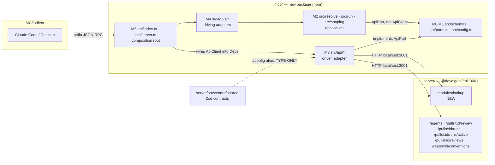
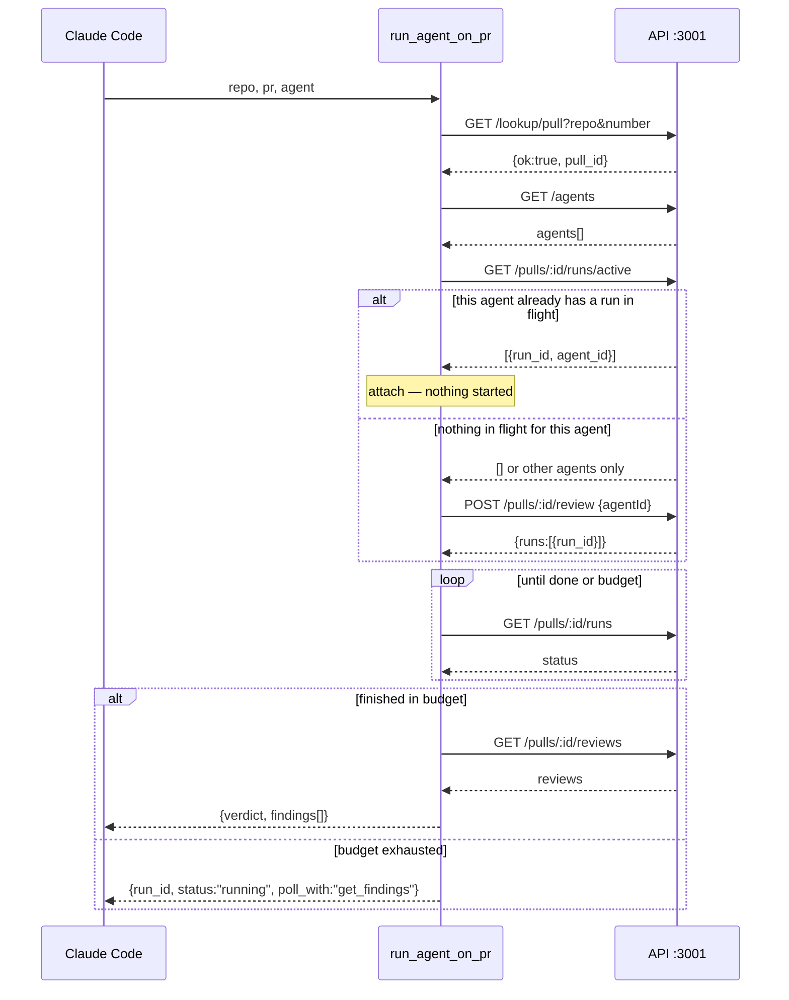

# Plan 05 — Local stdio MCP server (`mcp/`)

**Modules:** mcp (new) · server · client (vendor mirror only)   **Created:** 2026-08-23   **Status:** implemented 2026-08-23 — all tasks landed; see §7 for the three amendments made during T11
**Spec:** `mcp/specs/mcp-server.md` — written by T13 as part of this plan (does not exist yet)

---

## 0. Start here — read this before dispatching anything

You are almost certainly a **fresh session with no memory of the conversation that produced this
plan.** That is the expected case. Everything you need is in this file. Read §0, §5.12 (the ring
model for `mcp/`), §5.13 (the six frozen strings) and §6 before dispatching a single task.

### 0.1 What is already decided and must NOT be re-litigated

These came from the repo owner. They are inputs, not options:

| # | Decision |
|---|---|
| **D-A** | The MCP server is a **new fifth standalone package `mcp/`** at the repo root, beside `server/`, `client/`, `reviewer-core/`, `e2e/`. Own `package.json`, own lockfile, **no root `package.json`**. |
| **D-B** | It reaches DevDigest data **over HTTP to `http://localhost:3001`**. It does **not** import server services and does **not** touch Postgres. The owner has accepted the cost: the API must be running. |
| **D-C** | `run_agent_on_pr` is **hybrid** — start the run, wait up to a configurable budget (default ~90 s, env-overridable), return findings if it lands in time, otherwise `{run_id, status:"running", poll_with:"get_findings"}` plus an actionable next step. Never block indefinitely. |
| **D-D** | Exactly **five tools**: `list_agents`, `run_agent_on_pr`, `get_findings`, `get_conventions`, `get_blast_radius`. |
| **D-E** | `get_blast_radius` **ships as a stub** and must still appear in the tool list — it is deliberately left as the course homework. |
| **D-F** | **`onion-architecture` governs this plan.** For `server/` tasks it applies in full, unmodified. For `mcp/` it is *carried over deliberately* — §5.12 states the package's own ring model, its import matrix, and the rules that do **not** transfer and why. |
| **D-G** | §5.13's six model-facing strings are **normative and final**. T8–T11 copy them character for character; they are not a draft to improve on. |
| **D-H** | **Idempotency is in-flight only.** The key is `(pull_id, agent_id)` and it matches only a run that is **still running**, checked through the existing `GET /pulls/:id/runs/active`. There is **no** `agent_runs.head_sha` column, **no** migration, and **no** schema change anywhere in this plan. The owner has accepted the cost: calling `run_agent_on_pr` again on an unchanged commit spends a fresh review. §5.5 states what that trade buys and what it gives up. |

And the four design principles, treated here as requirements rather than advice:

1. **Result, not operation** — one call performs the whole arc (REQ-12).
2. **Flat arguments** — separate primitive values, no nested objects (REQ-9).
3. **Terse structured response** — `{verdict, findings[]}` with only the needed fields (REQ-10, REQ-17, REQ-18).
4. **Errors lead somewhere** — never a bare 404; every failure names the next step (REQ-22).

### 0.2 What state the repo is in

Verified on branch `main`, **2026-08-23**. Confirm any of it yourself with the command in column 2.

| Fact | How to confirm it |
|---|---|
| **There is no `mcp/` directory anywhere in the tree.** This is greenfield; P0 creates it. | `ls` at the repo root |
| **There is no `.mcp.json` anywhere in the tree.** Registration is P2. | `find . -maxdepth 2 -name '.mcp.json' -not -path './node_modules/*'` |
| **`GET /repos/:id/pulls` calls GitHub before it answers.** It runs `gh.listPullRequests(...)` and upserts every PR. It is therefore the *wrong* tool for resolving a PR number to an id — see §5.2. | `sed -n '1,90p' server/src/modules/pulls/routes.ts` |
| **There is no "get pull by number" route.** Every route is keyed by an internal uuid, validated by `IdParams = z.object({ id: z.string().uuid() })`. | `cat server/src/modules/_shared/schemas.ts` |
| **`POST /pulls/:id/review` is fire-and-forget.** `ReviewService.runReview` creates the `agent_run` rows, returns `{runs, reviews: []}` immediately, and executes in the background. The findings are never on that response. | `sed -n '/async runReview/,/^  }/p' server/src/modules/reviews/service.ts` |
| **`GET /pulls/:id/runs/active` already answers the idempotency question.** `activeRunsForPull` filters on `status = 'running'` and returns `{run_id, agent_id, agent_name, ran_at}` per run. That is exactly `(pull_id, agent_id) → is one in flight?`, which is why D-H needs no new route and no new column. | `sed -n '/activeRunsForPull/,/^}/p' server/src/modules/reviews/repository/run.repo.ts` |
| **`agent_runs` has no head-sha column, and neither does `reviews`** — nothing records which commit a finished run reviewed. That is *why* D-H settles for in-flight-only idempotency rather than a preference. | `cat server/src/db/schema/runs.ts` |
| **`RunBus` is a process-lifetime in-memory singleton** with a 5-minute replay TTL. `completed` survives eviction, so a *late* SSE subscriber ends cleanly — but an **API restart** between `POST …/review` and the subscribe leaves `completed` empty and the stream hangs. This is why §5.4 polls instead of streaming. | `cat server/src/platform/sse.ts` |
| **Run statuses are `running` \| `done` \| `failed` \| `cancelled`**, stored on `agent_runs.status` and returned by `GET /pulls/:id/runs`. | `grep -rno "status: '[a-z]*'" server/src/modules/reviews/repository/run.repo.ts` |
| **`reviewer-core/tsconfig.json` already aliases `@devdigest/shared` → `../server/src/vendor/shared/index.ts`** and pins `zod` to its own `node_modules`. This is the precedent §5.3 copies. | `cat reviewer-core/tsconfig.json` |
| **`.github/workflows/reviewer-core.yml` already path-filters on `server/src/vendor/shared/**`** for exactly that aliasing reason. T14 copies the pattern. | `sed -n '1,25p' .github/workflows/reviewer-core.yml` |
| **The API needs no auth header.** `getContext` resolves the default workspace and system user through `LocalNoAuthProvider`. | `cat server/src/modules/_shared/context.ts` |
| **`node_modules/` and `dist/` are already git-ignored globally**, so `mcp/` needs no `.gitignore` change. | `cat .gitignore` |
| **`pnpm typecheck` is green on `main`** (`server/INSIGHTS.md`, 2026-08-16). Treat any error you see as yours. | `cd server && pnpm typecheck` |

### 0.3 What to dispatch, in order

```
P0  [parent session]  Bootstrap mcp/ skeleton + npm install                 (§7.P0)
──  dispatch          implementer: T1                              (wave 0, alone)
──  dispatch          implementer: T3, T5 concurrently                      (wave 1)
──  dispatch          implementer: T6, T7, T8 concurrently                  (wave 2)
──  dispatch          implementer: T9, T10 concurrently                     (wave 3)
──  dispatch          implementer: T11, T14 concurrently                    (wave 4)
──  dispatch          implementer: T12, T13 concurrently                    (wave 5)
P2  [parent session]  .mcp.json · root AGENTS.md 5th row · mcp/AGENTS.md +
                      mcp/CLAUDE.md · mcp/INSIGHTS.md · docs/plans/README.md rows (§7.P2)
──  parent session    pr-self-review over the whole diff, once
```

**There is no P1 and there are no T2 or T4.** They were the `agent_runs.head_sha` column, its
migration, and the code that wrote it; D-H removed all three. Tombstones are in §7 so a reader who
finds a stale reference elsewhere knows it is stale rather than missing.

### 0.4 The eight things a reader will otherwise get wrong

1. **`mcp/package.json`, `mcp/package-lock.json`, `mcp/tsconfig.json` and `mcp/vitest.config.ts`
   already exist and are NOT implementer-owned.** `package.json` and `vitest.config.ts` are Tier A
   by name, and a lockfile is regenerated only by the package manager. P0 creates them; §7.P0
   records exactly what was installed. An implementer that wants to change one reports BLOCKED.
2. **`server/src/vendor/shared/index.ts` is NOT Tier A.** Tier A covers *existing files under
   `server/src/vendor/shared/contracts/**`*. The barrel sits one level up and must be edited, or a
   new contract file is unreachable through `@devdigest/shared`. T1 owns both.
3. **`mcp/AGENTS.md`, `mcp/CLAUDE.md` and `mcp/INSIGHTS.md` are parent-session work (P2), even
   though they are new files.** A module `AGENTS.md` auto-loads for every agent that touches that
   module — an implementer writing it would be writing rules its own siblings run under. Same for
   `INSIGHTS.md`, whose writer the `engineering-insights` protocol names as the parent session at
   session end. **Do not add them to any `Owned paths` list.** T13 writes the spec only.
4. **`mcp/` has a ring model and it is enforced from wave 1.** §5.12 is not commentary — its import
   matrix is pinned by a grep test that T5 writes and every later task inherits. `fetch` in a tool
   handler, the SDK in `shaping/`, or `process.env` outside `config.ts` will fail `npm test`.
5. **The six model-facing strings in §5.13 are frozen (D-G).** They are approved copy, measured
   against REQ-7's 2048-byte budget. Copy them; do not improve them.
6. **Nothing in `mcp/src/**` may write to stdout.** stdio *is* the transport; one stray
   `console.log` corrupts the JSON-RPC frame stream and the server dies with an unhelpful parse
   error on the client side. Every diagnostic goes to `process.stderr` (REQ-4).
7. **The wait is a poll of `GET /pulls/:id/runs`, not a read of `GET /runs/:id/events`.** The SSE
   route is fine for a browser and wrong for this client; §5.4 has the table. Do not "improve" it
   into SSE.
8. **`get_blast_radius` makes no HTTP call and never will in this plan.** It returns a
   self-describing not-implemented result. Wiring it to `repo-intel` is the homework, and doing it
   here removes the exercise.

---

## 1. Goal

An MCP client — Claude Code first, Claude Desktop second — can review a pull request through
DevDigest without leaving the conversation: *"review PR 42 on maxfurmanov/devdigest with the
security agent"* becomes one tool call that returns a verdict and a short list of findings, and
*"what are this repo's conventions"* becomes another.

The surface is five tools over **local stdio**, exposed from a **new fifth package `mcp/`** that
talks HTTP to the existing API. The tools speak human coordinates — `owner/name` and a PR number —
which the API does not; closing that gap with one cheap, GitHub-free lookup route is the **only**
server-side change in this plan. There is no schema change and no migration (D-H).

The whole design is bent toward one number: **what this server costs an MCP client that has not
called it yet.** With Claude Code's tool search on by default, that is the tool *names* plus the
server `instructions` field and nothing else — so `instructions` is written like a skill
description, the schemas stay deferred, and the number is measured, published in `mcp/README.md`,
and pinned by a test so it cannot drift.

The package is also the first chance this repo has had to start a module with its architecture
already decided rather than acquired. `server/` carries nine logged onion violations because its
rings were written down after the code; `mcp/` gets its ring model in §5.12 before the first real
file exists, and a grep test enforces it from wave 1.

**What already exists and is not re-created:** the whole REST surface (`/agents`,
`/pulls/:id/review`, `/pulls/:id/runs`, `/pulls/:id/runs/active`, `/pulls/:id/reviews`,
`/repos/:id/conventions`), the `RunBus` and its SSE route, `getBlastRadius` inside `repo-intel`, the
Zod contracts in `server/src/vendor/shared`, and the `reviewer-core` pattern for consuming those
contracts from a sibling package.

---

## 2. Requirements

**30 live requirements, numbered REQ-1..REQ-32 with two tombstoned gaps.** REQ-24 and REQ-25 were
deleted by D-H; the ids are retired rather than reused so that any stale reference elsewhere reads
as stale instead of silently pointing at a different requirement.

### Package and placement

| ID | Requirement |
|---|---|
| **REQ-1** | `mcp/` is a standalone package: `mcp/package.json` declares `@devdigest/mcp`, `"type": "module"`, and its own `package-lock.json`; no root `package.json` is created, and no workspace file lists it. `cd mcp && npm run typecheck && npm test` exits 0. |
| **REQ-2** | No file under `mcp/src/**` imports `drizzle-orm`, `postgres`, `fastify`, or any path under `server/src/` other than the `@devdigest/shared` alias. A test greps the source tree and fails on a hit. |
| **REQ-3** | `mcp/tsconfig.json` aliases `@devdigest/shared` → `../server/src/vendor/shared/index.ts` and pins `zod` to `./node_modules/zod`; **every** `@devdigest/shared` import under `mcp/src/**` is `import type`. A test asserts there is no value import. |
| **REQ-4** | The server runs over stdio only. No `console.log`, `console.info`, `console.debug` or `process.stdout.write` appears under `mcp/src/**`; every diagnostic goes to stderr. A test greps for it. |

### Architecture — the `mcp/` ring model (§5.12)

| ID | Requirement |
|---|---|
| **REQ-31** | `mcp/src/**` obeys the import matrix in §5.12, enforced by a grep test rather than by review: `tools/**` contains no `fetch` and no URL literal; `resolve/**`, `run/**` and `shaping/**` import neither `@modelcontextprotocol/sdk` nor `fetch`; `api/**` imports nothing from `tools/**`; `schemas/**` and `ports.ts` import only `zod` and each other; and `process.env` is read **only** in `src/config.ts`. |
| **REQ-32** | Every unit in the application ring (`resolve/**`, `run/**`, `shaping/**`) takes an explicit `Deps` interface naming exactly what it uses. No unit receives the whole `McpServer`, the whole config object, or a module-level singleton client, and the concrete `ApiClient` is constructed **only** in `src/server.ts`. |

### Protocol surface

| ID | Requirement |
|---|---|
| **REQ-5** | Exactly five tools are registered — `list_agents`, `run_agent_on_pr`, `get_findings`, `get_conventions`, `get_blast_radius` — and no others. Each name is 1–64 chars and matches `^[A-Za-z0-9_.\-/]+$` (SEP-986). |
| **REQ-6** | Every tool is registered through `McpServer.registerTool(name, {title, description, inputSchema, outputSchema, annotations}, handler)` with all five config keys present. `annotations.readOnlyHint` is `true` for four tools and `false` for `run_agent_on_pr`, which also sets `destructiveHint: false` and `idempotentHint: true`. |
| **REQ-7** | The server sets a non-empty `instructions` string. `instructions` and every tool `description` are **≤ 2048 bytes** measured as UTF-8, and each opens with its decisive sentence. A test asserts the byte length of all six strings. |
| **REQ-8** | Neither `alwaysLoad` nor `"anthropic/alwaysLoad"` appears anywhere in `mcp/**` or in `.mcp.json`. Everything stays deferred. A test greps for both strings. |
| **REQ-9** | Every tool `inputSchema` is a flat object of primitives — no property whose JSON Schema `type` is `object` or `array`. A test walks the registered input schemas and fails on any nested property. |
| **REQ-10** | Every tool result carries `structuredContent` that validates against that tool's `outputSchema`, and no result ever embeds a raw `ReviewRecord`, `PrDetail`, `RunTrace` or `ConventionListResult`. |

### Tool behaviour

| ID | Requirement |
|---|---|
| **REQ-11** | `list_agents()` returns `{agents: [{id, name, model, enabled}]}` and nothing else — no `system_prompt`, no `output_schema`, no `description` longer than one line. |
| **REQ-12** | One call to `run_agent_on_pr(repo, pr, agent)` performs the whole arc — resolve coordinates, check for an in-flight run, start or attach, wait, collect findings. In the success case the client makes no second call. |
| **REQ-13** | The wait budget is `DEVDIGEST_MCP_RUN_BUDGET_MS`, default `90000`. If the run completes within it the tool returns `{verdict, findings[]}`; if it does not, the tool returns `{run_id, status: "running", poll_with: "get_findings"}` plus a next-step message. The call never returns later than budget + one poll interval, proven by a fake-timer test. |
| **REQ-14** | Waiting is done by polling `GET /pulls/:id/runs`. `GET /runs/:id/events` is not consumed by `mcp/` at all. The poll cadence keeps one `run_agent_on_pr` call under the API's global 120 req/min rate limit. |
| **REQ-15** | Idempotency is **in-flight only** (D-H). Before starting, the tool reads `GET /pulls/:id/runs/active`; if a run for the same `(pull_id, agent_id)` is already `running` it **attaches** to that run and starts nothing. In every other case — no active run at all, or only `done`/`failed`/`cancelled` history — it starts a new run. A completed run is never reused. |
| **REQ-16** | `get_findings(repo, pr, ...)` returns the terse verdict for already-persisted reviews and **starts no run** — a test asserts no `POST` is issued. |
| **REQ-17** | `response_format` is a flat string argument, `concise` \| `detailed`, defaulting to `concise`. `concise` omits `id`, `rationale`, `suggestion`, `confidence` and `end_line`; `detailed` adds them. |
| **REQ-18** | Findings are capped at 20 per response and ordered by a **total** order: `CRITICAL → WARNING → SUGGESTION`, then `file` asc, then `start_line` asc, then `title` asc. When the cap truncates, the response carries a `note` naming `severity` and `file` as the arguments that narrow it. |
| **REQ-19** | No tool emits a `nextCursor` or any opaque pagination token. |
| **REQ-20** | `get_conventions(repo)` ships as a **Tool** in this iteration, and `mcp/specs/mcp-server.md` records the Tool-vs-Resource evaluation, the recommendation, and the single condition that would flip it. |
| **REQ-21** | `get_blast_radius(repo, pr)` is registered and returns `isError: true` with `structuredContent` `{implemented: false, retry: false, reason, use_instead}`, and issues **no** HTTP request. |
| **REQ-22** | Every failure path returns `isError: true` and a first sentence that names the next action — a tool to call or a command to run. A test enumerates the error catalogue and asserts each message contains one of the five tool names or a backticked shell command. |

### Server side and resolution

| ID | Requirement |
|---|---|
| **REQ-23** | `GET /lookup/pull?repo=<owner/name>&number=<n>` answers **200** with the discriminated union `{ok: true, pull: {...}}` \| `{ok: false, reason, message, candidates[]}`. It performs one DB read, makes no GitHub call, and writes nothing. |
| ~~REQ-24~~ | **Retired by D-H.** Was: `agent_runs.head_sha` exists and `createAgentRun` writes it. There is no schema change in this plan. |
| ~~REQ-25~~ | **Retired by D-H.** Was: `GET /lookup/run?pull_id=&agent_id=&head_sha=`. `GET /pulls/:id/runs/active` already answers the only question that remained, so the route is not built. |
| **REQ-26** | The `mcp/` resolver caches `owner/name → repo_id` in-process with a TTL and **never** caches a negative result, and never caches a PR-level lookup. |

### Ops, docs, CI

| ID | Requirement |
|---|---|
| **REQ-27** | `mcp/` carries a reproducible startup-token measurement. `mcp/README.md` publishes the number, the date it was taken and the exact command; a test pins the number under a committed ceiling so it cannot silently drift. |
| **REQ-28** | `.github/workflows/mcp.yml` runs `npm ci && npm run typecheck && npm test` in `mcp/`, path-filtered on `mcp/**`, `server/src/vendor/shared/**` and the workflow file itself; `TESTING.md`'s suite map carries the new row. |
| **REQ-29** | `mcp/specs/mcp-server.md` documents the five tools, the ring model, the resolution layer, the hybrid budget, the in-flight-only idempotency and its accepted cost, the error catalogue and the stub decision. |
| **REQ-30** | `mcp/README.md` documents registration (both `.mcp.json` and `claude mcp add`) and an end-to-end verification walkthrough that starts from `pnpm db:migrate`. |

---

## 3. Insights consulted

Read in full before decomposing: `server/INSIGHTS.md` (189 lines), `client/INSIGHTS.md`,
`reviewer-core/INSIGHTS.md`, `e2e/INSIGHTS.md`. `mcp/INSIGHTS.md` does not exist yet — P2 creates it.

The entries that bear on this change, with their dates. Each is pushed down into the
`Binding insights` field of the task it constrains:

| Date | Entry | Who it binds |
|---|---|---|
| `2026-08-22` | **A Zod contract edit that passes both typechecks can still break every fixture.** `server/tsconfig.json` includes only `src/**/*.ts`, so `server/test/**` is never compiled, and `.parse()` takes `unknown`. A contract edit's done condition must run `pnpm exec vitest run --exclude '**/*.it.test.ts'`, never just `pnpm typecheck`. | **T1** — its done condition appends the vitest run to the contract-lane command for exactly this reason. |
| `2026-08-15` | **`Container` structurally satisfies a per-service `Deps` interface** — replacing `constructor(private container: Container)` with an explicit interface needs no call-site or container change. Verified end-to-end on `modules/repos/service.ts`. | **T3** (the new `LookupService`), and it is the law §5.12 carries over to `mcp/`'s application ring wholesale — **T5**, **T6**, **T7**, **T10**, **T11**. |
| `2026-08-17` | **`.` does not match `\r`, so `split('\n')` silently breaks every CRLF file.** Anywhere you parse subprocess or line-delimited output on Windows, split on `/\r?\n/`. | **T5**, **T11** — MCP stdio framing is line-delimited JSON, and this is a Windows repo. |
| `2026-08-17` | **`created_at` cannot break a sort tie between rows written by the same transaction**; any user-visible list needs a unique immutable last key. | **T7** — REQ-18's finding order is total precisely because of this. |
| `2026-08-17` | **A silent fail-open hides a feature that never ran.** `modules/` has no logger on any `Deps`, so an unobservable pass is worse than an off-convention log. | **T6**, **T9**, **T10** — a resolution or wait failure must surface as `isError: true`, never as an empty findings list. |
| `2026-08-17` | **`.default()` breaks the REAL call** under `strict: true` structured output — fields stay required, `.nullish()` is fine. | **T1**, **T7** — a `.default()` on a *request* schema also silently masks a missing field. `response_format`'s default (REQ-17) is applied in the handler, not by the wire schema. |
| `2026-08-21` | **Secrets have TWO sources** — `~/.devdigest/secrets.json` **and** `process.env` via `dotenv` — so a test reaching a real provider makes billed calls that `catch` blocks swallow. | **T3**, **T10**, **T14** — the `mcp/` test lane must never reach a live API or a live model; §5.12's `Deps` seam is what makes that easy rather than aspirational. |
| `2026-08-16` | **`pnpm typecheck` is GREEN on `main`.** Treat any error as yours, not pre-existing. | **T1**, **T3**. |
| `2026-08-16` | **Widening a contract enum takes 3 edits but never a migration**, and the third edit is `./scripts/sync-vendor.sh`. | **T1** — a *new* contract file needs the barrel line and the sync, and nothing else. |
| `2026-08-09` (seed) | **Migrations don't run on boot** (`pnpm db:migrate`), and **DB-backed tests need the `*.it.test.ts` suffix** or they run in the Docker-less lane. | **T3** (its test is `.it`), **T12**'s walkthrough. This plan adds no migration of its own (D-H), but the DB still has to be migrated before anything runs. |

Two entries that bound the **deleted** tasks are recorded here as no longer binding, so a reader who
remembers them does not go looking for the task: `2026-08-17` on `drizzle-kit generate`'s rename
prompt (bound the migration step) and `2026-08-09` on `completeAgentRun`'s third hidden param-type
copy (bound the head-sha write). D-H removed both tasks; both entries stay true and stay relevant to
any *future* change that touches `agent_runs`.

`client/INSIGHTS.md`, `reviewer-core/INSIGHTS.md` and `e2e/INSIGHTS.md` were read and produced
nothing binding: this plan touches `client/` only through `sync-vendor.sh` (T1's done condition),
and touches neither `reviewer-core/` nor `e2e/` at all.

---

## 4. Contract changes

**Wave 0, one new file — never an edit to an existing `contracts/*.ts`.**

`server/src/vendor/shared/contracts/lookup-api.ts` (new) exports:

- `PullLookup` — `{repo_id, pull_id, number, full_name, head_sha, title, status}`. `status` reuses
  `PrStatus` from `./platform.js` (importing a sibling contract file is the established pattern —
  `review-api.ts` imports from `findings.ts` and `brief.ts`).
- `PullLookupResult` — the discriminated union `z.discriminatedUnion('ok', [...])`:
  `{ok: true, pull: PullLookup}` | `{ok: false, reason: 'repo_not_found'|'pull_not_found', message: string, candidates: string[]}`.

That is the whole contract change. `ExistingRun` / `ExistingRunResult` were part of the retired
`GET /lookup/run` route and are **not** added (D-H).

`head_sha` stays on `PullLookup` even though D-H's idempotency does not use it: it is a true,
free fact about the pull request the caller just resolved, and a client that wants to say *which
commit* it reviewed needs it. It is data, not a mechanism.

`server/src/vendor/shared/index.ts` (edit) gains one line:
`export * from './contracts/lookup-api.js';`

That barrel is **not** Tier A — the Tier A row covers *existing files under
`server/src/vendor/shared/contracts/**`*, and `index.ts` is one level above it. Adding the export
line is the whole point of adding a contract file.

`client/src/vendor/shared/**` is a byte-identical mirror and is never hand-edited; T1's
done-condition command runs `./scripts/sync-vendor.sh` followed by `--check`, which is the repo's
convention for a contract task.

**Why a 200 with a discriminated union instead of a 404** (decision **D3**, §5.2): the whole job of
this route is to turn "not found" into something the MCP layer can say out loud (principle 4). A 200
makes the not-found payload part of the route's `schema.response` and therefore typed on both sides;
`ApiErrorBody`'s `details` field is `unknown` and would be re-parsed by hand at the boundary. It is
also the one route in `server/` that will declare a full `schema.response` from day one, which the
`onion-architecture` skill names as the largest gap in R5.

**No other contract changes, and no schema changes at all.** `contracts/trace.ts`,
`db/schema/runs.ts` and `db/migrations/**` are untouched by this plan.

---

## 5. Architecture

### 5.1 The package



Everything in `mcp/src/**` reaches DevDigest through the `M3` adapter and nothing else. The dotted
edge is the only coupling to `server/`, and it disappears at runtime. The ring labels are §5.12.

### 5.2 The resolution layer — and whether to add a server route

The tools speak `repo = "owner/name"` and `pr = 42`. Every API route is keyed by an internal uuid.
There is no "get pull by number" route. Three ways to close that, and the owner asked for the
trade-off in writing rather than a silent pick:

| Option | What it costs | Verdict |
|---|---|---|
| **A — resolve entirely inside `mcp/`**: `GET /repos` → match `full_name` → `GET /repos/:id/pulls` → match `number` | `GET /repos/:id/pulls` **syncs from GitHub before it answers** — `gh.listPullRequests(...)` plus one upsert per PR (`pulls/routes.ts`). Every `run_agent_on_pr` would trigger a full GitHub PR-list sync: slow, GitHub-rate-limited, degraded offline, and a *write* on what the caller thinks is a read. Two round trips minimum, and the matching rules get duplicated in a second language. | **Rejected** |
| **B — new `GET /lookup/pull` in `server/`** | One DB read joining `repos ⋈ pull_requests`, no GitHub call, no write. The "not found, here are the candidates" payload is built where the data already is, which is principle 4 for free rather than three extra requests. Reusable later by the web client for `/repos/:owner/:name/pulls/:n` deep links. Costs: one new contract file, one new module, one wave-0 serialization. | **Chosen** |
| **C — add the route to the existing `pulls/` module** | Same benefit as B, but `pulls/routes.ts` is 381 lines with ~18 inline `container.db` queries and neither a service nor a repository (onion violation **V2**, "SQL in a route handler" — the skill's own worked anti-pattern). The task would either repeat the violation or drag a full module extraction into this plan. It also puts a static `/pulls/lookup` segment in front of `/pulls/:id`, a router-precedence subtlety nobody needs. | **Rejected** |

**Chosen: B, as a new `modules/lookup/` module** — `routes.ts` (R5) → `service.ts` (R2) →
`repository.ts` (R3), registered in `modules/index.ts` (R6). It is genuinely cross-aggregate (it
joins `repos` and `pull_requests`), so it belongs to neither existing module, and it starts
onion-clean instead of inheriting V2. `LookupService` takes an explicit
`interface LookupServiceDeps { db: Db }` and is constructed with `app.container`, which structurally
satisfies it (`server/INSIGHTS.md`, 2026-08-15). It does **not** join `workspace/` and `polling/` on
the "pass-through module, no service" exception — that list is shrink-only, and this route branches
on domain state and reads two tables, which is exactly the threshold the skill names for extracting
a service.

**The module ships exactly one route.** An earlier draft paired it with `GET /lookup/run`; D-H
retired that, because `GET /pulls/:id/runs/active` already returns `{run_id, agent_id, status:
running}` per run and therefore already answers the only question the MCP layer asks. A second
public endpoint with zero callers is not a smaller cost than a missing one.

**Caching (REQ-26).** `mcp/src/resolve/cache.ts` memoizes `owner/name → repo_id` for the process
lifetime with a TTL (default 5 min) — repos are added rarely and their ids never change.
**PR-level lookups are never cached.** A PR's title, status and head all move underneath you, the
lookup is one cheap DB read, and a stale `pull_id` would silently address the wrong review.
**Negative results are never cached**: "you have not imported that repo yet" must become true the
moment the user imports it, or the tool teaches the model a lie.

**The actionable error (principle 4).** `{ok: false}` carries `candidates` — the imported repos'
`full_name`s for `repo_not_found`, the known PR numbers for `pull_not_found` — so the tool can say
*"`maxfurmanov/devdigest` is not imported. Imported repos: `a/b`, `c/d`. Import one in the web UI at
http://localhost:3000."* without a second request.

### 5.3 How `mcp/` gets its types

| Option | Verdict |
|---|---|
| **tsconfig path alias to `../server/src/vendor/shared`, type-only imports** | **Chosen.** It is byte-for-byte the `reviewer-core/tsconfig.json` pattern, already proven in this repo, and CI already path-filters on `server/src/vendor/shared/**` for exactly that reason. Type-only means the runtime zod in `mcp/` is independent of the server's — which matters here: the SDK requires `zod@^3.25` while `server/` is on `^3.24.1` (§7.P0, §9 R1). |
| **A third vendored copy synced by `sync-vendor.sh`** | Rejected. `sync-vendor.sh` exists because Next's webpack cannot resolve the server tree's `./contracts/*.js` re-exports (the script says so in its own header). `mcp/` is plain Node with `moduleResolution: "Bundler"` and has no such problem. A third mirror triples the drift surface and adds a second blocking CI check for nothing. |
| **`mcp/` declares its own schemas only, no alias** | Rejected *as the only mechanism* — it loses compile-time coupling, so a contract change breaks the MCP server at runtime instead of at `npm run typecheck`. But it is half right, and that half is adopted below. |

**The adopted rule, in two sentences.** Domain contracts arrive as **types**
(`import type { Agent, FindingRecord, PullLookupResult } from '@devdigest/shared'`). Every **value**
schema in `mcp/` — every `inputSchema`, every `outputSchema`, every response parser — is a **narrow
projection** written under `mcp/src/schemas/**` against `mcp/`'s own zod.

Two independent reasons, and both matter:

1. **`outputSchema` is what the model reads.** `ReviewRecord` carries `run_id`, `agent_id`,
   `grounding`, `created_at`, `accepted_at`, `dismissed_at` — six fields no model needs and every one
   of them a token. A domain contract as an MCP output schema is principle 3 thrown away.
2. **Version decoupling, now demonstrated rather than predicted.** The two packages are on different
   zod minors and both typecheck, because nothing crosses the boundary at runtime.

**This is a named divergence from `onion-architecture`** — see §5.12.4.

### 5.4 The hybrid run — and why it polls

`POST /pulls/:id/review` returns immediately with run ids and `reviews: []`. Something has to wait.

| | SSE — `GET /runs/:id/events` | Polling — `GET /pulls/:id/runs` |
|---|---|---|
| Latency to "done" | immediate | ≤ one poll interval |
| Robustness | `RunBus` is an in-memory, process-lifetime singleton. Restart the API between the `POST` and the subscribe and `completed` is empty, so `onDone` never fires and the stream hangs until the client's own timeout | `agent_runs.status` lives in Postgres and survives a restart |
| Cost in `mcp/` | an SSE frame parser, plus `\r` handling on a CRLF checkout (`server/INSIGHTS.md`, 2026-08-17) | `fetch` + `JSON.parse` |
| Verdict | **rejected as the wait mechanism** | **chosen (REQ-14)** |



**Cadence.** First poll at 1.5 s, then every 3 s. Over a 90 s budget that is ≤ 31 requests, well
inside the global 120 req/min limit, and `POST /pulls/:id/review`'s own 10/min limit is untouched
because the tool issues at most one. **Deadline discipline:** each poll carries
`AbortSignal.timeout`, and the waiter returns at the budget even mid-poll — REQ-13's
"never blocks indefinitely" is proven by a fake-timer test, not by inspection. The `sleep` and the
clock arrive through the waiter's `Deps` (REQ-32), which is what makes that test possible without a
real timer.

**Why hybrid at all, restated so nobody "simplifies" it back:** Claude Code's auto-backgrounding of a
>2 min MCP call does **not** apply to subagent calls, IDE servers or non-interactive mode, and
`MCP_TOOL_TIMEOUT` / `CLAUDE_CODE_MCP_TOOL_IDLE_TIMEOUT` still cap it. Claude Code does **not**
implement the MCP tasks extension (SEP-1686/2663) — do not design on it. And
`notifications/progress` has an open display regression, so no required UX may depend on it.
A bounded wait with a documented fallback is the only shape that behaves the same in all four
execution modes.

### 5.5 Idempotency — in-flight only (D-H)

Key: **`(pull_id, agent_id)`**, and it matches only a run that is **still running**.

1. `GET /lookup/pull` yields `pull_id`; `GET /agents` yields `agent_id`.
2. `GET /pulls/:id/runs/active` — whose route comment already calls it "the server source of truth"
   — returns every run on that PR with `status = 'running'`, each carrying `run_id` and `agent_id`.
3. **Match → attach.** Wait on that run, start nothing.
   **No match → start.** `POST /pulls/:id/review {agentId}`.

There is no third branch. A `done`, `failed` or `cancelled` run is never reused, whatever commit it
ran against.

**What the owner traded away, stated plainly.** Calling `run_agent_on_pr` twice on an unchanged
commit runs the review twice and pays for it twice. That is not a corner case — a coding agent that
returns to the same PR in a later turn hits it every time. The alternative was an additive
`agent_runs.head_sha` column plus a migration, which would have let a completed run of the same
commit return its findings for free; the owner chose to keep this plan free of schema changes
instead, and this section is the record of that choice rather than an oversight to be fixed by the
next implementer.

Two things keep the cost bounded, and both are already in the plan:

- **The failure that actually compounds is still prevented.** Two calls racing inside one
  conversation — the model retrying because it read `status:"running"` as an error — can never start
  two runs of the same agent on the same PR. That is what the attach branch is for, and it is why
  §5.13.3's *"That is a normal result, not a failure"* sentence is load-bearing rather than polite.
- **`get_findings` is the free path and the tools say so.** It returns the last review's verdict for
  a PR at zero model cost, `run_agent_on_pr`'s own description points at it by name, and
  `get_findings`' description opens by promising it starts no run. A model that has read the
  descriptions has a cheap way to re-read a result without re-running one.

**If this is ever revisited**, the change is bounded and known: add `agent_runs.head_sha` (one
additive nullable column — `server/INSIGHTS.md`, 2026-08-17, confirms an add-only migration
generates non-interactively on Windows in one shot), write it in `createAgentRun` (both copies —
`run.repo.ts` and the façade in `repository.ts`, per the 2026-08-09 entry), and add the `done`
branch here. Nothing in this plan's structure blocks it.

### 5.6 Response shaping

`concise` (default) `get_findings` / `run_agent_on_pr` output:

```
{ verdict, score, counts: {critical, warning, suggestion},
  findings: [{severity, file, line, title}],
  shown, total, note? }
```

`detailed` adds `id`, `end_line`, `rationale`, `suggestion`, `confidence` per finding.

- **Cap 20** (`MAX_FINDINGS`), one constant, one file: `mcp/src/shaping/constants.ts`.
- **Total order** — `CRITICAL → WARNING → SUGGESTION`, then `file` asc, `start_line` asc, `title`
  asc. Not decorative: `server/INSIGHTS.md` (2026-08-17) records a real bug where a non-total order
  made a list reshuffle between two identical reads.
- **Truncation teaches (principles 3 + 4).** `note` reads *"Showing 20 of 57 findings, CRITICAL
  first. Narrow with severity='CRITICAL' or file='src/x.ts'."* — it names the flat arguments that
  exist, so the next call is cheaper instead of being a blind repeat.
- **No cursor (REQ-19, decision D6).** A `nextCursor` invites the model to page through 57 findings,
  which is precisely the token burn this whole plan is avoiding. A hard cap plus a narrowing hint is
  cheaper and produces better behaviour. Anthropic's `response_format` pattern
  (`concise` | `detailed`, default concise) measured ~⅓ the token cost on a comparable payload; it is
  adopted for `get_findings` and `run_agent_on_pr` (REQ-17).
- **A security property falls out of this.** Finding `rationale` and `suggestion` are free text
  written by one LLM and about to be read by another — the prompt-injection surface of this whole
  server. `concise` omits both by default, so the untrusted free text only reaches the model when the
  caller explicitly asks for `detailed`.

### 5.7 The error catalogue (principle 4)

Every entry returns `isError: true`, and the **first sentence** names the next action.

| Condition | Message shape |
|---|---|
| API unreachable | "DevDigest API is not answering at `http://localhost:3001`. Start it with `cd server && pnpm dev`, then retry." |
| repo not imported | "Repo `owner/name` is not imported into DevDigest. Imported repos: `a/b`, `c/d`. Import one at http://localhost:3000." |
| PR number unknown | "Repo `owner/name` has no PR #123 in DevDigest. Known PRs: #45, #46, #48." |
| agent not found | "Agent `x` not found — call `list_agents` for valid ids." *(the owner's own example)* |
| agent disabled | "Agent `x` is disabled. Call `list_agents` and pick an enabled one, or enable it at http://localhost:3000/agents." |
| budget exhausted | *not an error* — `isError: false`, `{run_id, status:"running", poll_with:"get_findings"}`, message: "Still running after 90s. Call `get_findings` with the same repo and pr in a minute." |
| run failed | "The run failed: `<error>`. Call `list_agents` to check the agent's model, or retry." |
| malformed `repo` | "`repo` must be `owner/name`, e.g. `maxfurmanov/devdigest`. Got `x`." |
| blast radius | see §5.8 |

The catalogue lives in **one file** (`src/resolve/messages.ts`, ring M2) as data, not scattered
across five handlers. That placement is the onion rule "a literal used twice in the module belongs in
one file" applied at package scale, and it is what makes REQ-22 testable over the whole catalogue
rather than by example.

### 5.8 The stub (`get_blast_radius`)

**There is no protocol-level convention for a not-implemented tool** — this was checked against the
spec and the SDK and came back NOT FOUND. What follows is therefore an **engineering choice made in
this plan**, not a standard, and it must be recorded as such in `mcp/specs/mcp-server.md`.

Returns `isError: true` with:

```
{ implemented: false, retry: false,
  reason: "Blast radius is not wired up yet.",
  use_instead: "get_findings" }
```

and a `content[0].text` whose first sentence says the same thing in words.

**Why `isError: true` and not a successful "empty" result** (decision **D8**): a successful result
invites the model to quote an empty impact map as fact — *"the blast radius is empty"* — which is a
worse failure than a visible one. `retry: false` in the structured content, and the phrase "not
implemented" in the first sentence of the text, are what stop a retry loop; the error flag is what
stops a fabrication.

The tool makes **no HTTP call** (REQ-21). `getBlastRadius` exists at
`server/src/modules/repo-intel/service.ts` with no callers outside that module and no HTTP route,
and exposing it is the course homework — the stub is the exercise, not an oversight.

### 5.9 `get_conventions` — Tool or Resource?

The owner has not decided this one. **Recommendation: ship it as a Tool now (REQ-20).** Three
reasons, in order of weight:

1. **Conventions are per-repo, so a Resource must be a *template*** — `devdigest://repo/{owner}/{name}/conventions`.
   Claude Code surfaces resources through `ListMcpResourcesTool`, which enumerates `resources/list`;
   templates are served by `resources/templates/list`. Whether Claude Code enumerates templates there
   is **unverified**. Building the primary path on unverified client behaviour is exactly the mistake
   the `notifications/progress` regression warns against.
2. **The zero-startup-cost argument is weaker than it looks under tool search.** A deferred tool's
   schema also costs nothing until it is searched; what is always loaded is the tool *name*, and
   `get_conventions` is 15 characters.
3. **A Resource cannot take arguments.** No `response_format`, no filter — it must return everything,
   which is principle 3 inverted.

**The condition that would flip it,** recorded in the spec: a spike confirming Claude Code enumerates
MCP resource templates. If it does, register one **concrete** resource per imported repo at startup
*in addition to* the tool, and measure whether the model reaches for it. That is a follow-up, not
part of this plan.

### 5.10 Measuring the startup token cost (REQ-27)

**What Claude Code actually loads at session start with tool search on** is the server name, each
tool's **name**, and the server `instructions` field. Tool schemas and descriptions are deferred.
(`defer_loading` in `.claude.json` is a **no-op** — issue #26844, closed not-planned. The
server-author lever is the opposite, `alwaysLoad`, and REQ-8 forbids it.)

`mcp/scripts/measure-startup-tokens.ts`:

1. imports the same `buildServer(deps)` that `src/index.ts` uses — **no transport, no network, no
   API**. This is only possible because M5 is split from the transport (§5.12);
2. reads `instructions` and the registered tool names from the in-process registry;
3. counts tokens with `js-tiktoken` (`cl100k_base`), already a proven dependency in this repo;
4. prints three numbers — `deferred_startup_tokens` (names + instructions), `full_schema_tokens`
   (what would load if someone set `alwaysLoad`), and each tool's `description` byte count against
   the 2 KB budget;
5. is invoked by `npm run measure` (the script is declared in `mcp/package.json` by P0 — §7.P0).

`mcp/README.md` publishes `deferred_startup_tokens`, the date, and the command (REQ-30/REQ-27), and
`mcp/test/startup-cost.test.ts` asserts it stays under a committed ceiling so an over-long
`instructions` rewrite fails CI instead of quietly costing every session.

**Stated honestly in the README:** `cl100k_base` is an OpenAI tokenizer, not Claude's. The number is
an exact, reproducible proxy for tracking drift — not an exact Anthropic token count.

### 5.11 Security posture

- **stdio, local-only.** The confused-deputy and token-passthrough guidance in the MCP security docs
  is scoped to OAuth-proxy *remote* servers and does not apply here. **Choosing stdio is itself the
  official mitigation** — say so in the spec so nobody "hardens" it into something else.
- **No secret ever becomes a tool parameter.** The API needs none today (`LocalNoAuthProvider`
  resolves the default workspace with no header). If that changes, the credential comes from
  `~/.devdigest/secrets.json` with `process.env` as fallback — the repo rule — never from an argument
  the model can see or invent.
- **Untrusted input at the tool boundary.** `repo`, `agent` and `file` are model-authored strings
  that end up in a URL query string. `repo` must match `^[A-Za-z0-9._-]+/[A-Za-z0-9._-]+$` before it
  is sent; every interpolated value is `encodeURIComponent`'d and length-capped. The ring model puts
  every URL construction in **one ring** (M3), which is what makes "did we escape everything?" a
  one-file question. This is OWASP-level reasoning applied to a Fastify/Zod/Drizzle stack, not the
  Express/Mongo snippets in the `security` skill.
- **The base URL is loopback by default and refuses a non-loopback host** unless
  `DEVDIGEST_MCP_ALLOW_REMOTE=1` is set explicitly. A mis-set env var must not silently point a local
  agent at someone else's server.
- **Injection surface, handled by shaping, not by scanning.** See §5.6's last bullet: `concise`
  omits the LLM-authored free-text fields by default.

### 5.12 The ring model for `mcp/` — `onion-architecture`, carried over on purpose

The `onion-architecture` skill says of itself: **"Scope is `server/` only."** `mcp/` is a new
standalone package, so the existing ring names (`modules/`, `adapters/`, `platform/`, `db/`) do not
describe a single file in it, and pretending otherwise would produce a matrix nobody could check.

What transfers is the *method*, not the folder names: **a ring is a set of paths, and the only rule
is which paths may appear in which file's import list.** That is checkable by eye, by grep, and — as
of T5 — by a test. Below is `mcp/`'s own model, written before the first real file exists.

#### 5.12.1 The rings

Paths are relative to `mcp/src/`. Higher number = further out. **Outer may import inner directly;
inner may never import outer.**

```
  M5  composition root      │ server.ts (buildServer) · index.ts (stdio, process)
  M4  driving adapters      │ tools/*.ts · tools/_register.ts
  M3  driven adapter        │ api/client.ts · api/routes.ts · api/errors.ts
  M2  application           │ resolve/** · run/** · shaping/**
  M1  kernel                │ config.ts
  M0  contracts + ports     │ schemas/** · ports.ts        ← imports `zod` and itself
       ↑ everything points inward. @devdigest/shared sits alongside M0 as a TYPE-ONLY
         source of domain types the package depends on and never the reverse.
```

Three of the six rings map one-to-one onto the server's, and saying which is the fastest way to read
the table: **M0 is R0** (contracts + ports, `zod` only), **M2 is R2** (application, `Deps`, no I/O),
**M5 is R6** (the composition root, the only place allowed to name everything). M3 is R4 with exactly
one adapter in it. M4 is R5 — `tools/` is to this package what `routes.ts` is to a server module: the
transport edge, and nothing more.

#### 5.12.2 The import matrix (REQ-31)

| Ring | Path | MAY import | MUST NOT import |
|---|---|---|---|
| **M0** contracts + ports | `schemas/**`, `ports.ts` | `zod`, itself, `import type` from `@devdigest/shared` | everything else — the SDK, `fetch`, node builtins, any other ring |
| **M1** kernel | `config.ts` | `zod`, M0 | the SDK, `fetch`, M2–M5. **The only file in the package that may read `process.env`** |
| **M2** application | `resolve/**`, `run/**`, `shaping/**` | M0, `import type` from `@devdigest/shared` | `@modelcontextprotocol/sdk`, `fetch`, `M3` (it depends on the **`ApiPort`**, never on `ApiClient`), `process.env`, M4, M5 |
| **M3** driven adapter | `api/**` | M0, M1's *types*, `import type` from `@devdigest/shared` | `@modelcontextprotocol/sdk`, **`tools/**`**, M2, M5. The **only** ring where `fetch` and a URL literal may appear |
| **M4** driving adapters | `tools/**` | M0, M2, `@modelcontextprotocol/sdk` | **`fetch`**, any URL literal, `api/client.ts` (it receives an `ApiPort` through `Deps`), `process.env` |
| **M5** composition root | `server.ts`, `index.ts` | **everything** | nothing — this is what a composition root is for. `index.ts` is additionally the only file that may touch the transport or the process |

Three cross-cutting rules, each a direct lift:

1. **`process.env` is read in `config.ts` and nowhere else.** The server's version of this rule names
   `platform/config.ts` and `adapters/secrets/local.ts`; `mcp/` has no secrets provider, so the list
   is one file long.
2. **No ring reaches sideways.** `resolve/` does not import `run/`; `shaping/` imports neither. When
   two of them need the same thing it moves down into M0, exactly as the server's answer to
   "two modules need the same thing" is a port.
3. **No cycles.**

#### 5.12.3 Dependency injection — `Deps`, not a container, not a singleton (REQ-32)

`server/INSIGHTS.md` (2026-08-15) is the load-bearing entry: *"`Container` structurally satisfies a
per-service `Deps` interface"* — an explicit interface costs nothing and buys the mock seam. `mcp/`
starts there instead of arriving there after nine violations.

```ts
// src/ports.ts  (M0)
export interface ApiPort {
  lookupPull(repo: string, number: number): Promise<PullLookupResult>;
  listAgents(): Promise<AgentSummary[]>;
  listActiveRuns(pullId: string): Promise<ActiveRun[]>;   // GET /pulls/:id/runs/active
  startReview(pullId: string, agentId: string): Promise<{ runId: string }>;
  listRuns(pullId: string): Promise<RunStatus[]>;
  listReviews(pullId: string): Promise<ReviewProjection[]>;
  listConventions(repoId: string): Promise<ConventionProjection[]>;
}

// src/run/waiter.ts  (M2)
export interface RunWaiterDeps {
  api: ApiPort;
  budgetMs: number;
  sleep: (ms: number) => Promise<void>;
  now: () => number;
}
```

- **A tool handler never receives the `McpServer`,** and no unit receives the whole config object —
  it takes the two or three values it uses. This is the direct analogue of "a service never takes the
  `Container`": dependencies invisible at the signature are dependencies nobody can test around.
- **The concrete `ApiClient` is constructed exactly once, in `server.ts` (M5).** No module-level
  singleton, no `new ApiClient()` inside a tool. A singleton is a container with worse ergonomics.
- **`Deps` is the mock seam.** A hermetic test passes an object literal implementing `ApiPort` — not
  a global `fetch` stub, and never a cast. The server's `test/repo-intel-*.test.ts` files build a
  fake container with `as never` and then write a private field; that is the service-locator pattern
  billing you, and it is the concrete thing this section is buying its way out of.
- **The clock and `sleep` are injected**, which is what makes REQ-13's fake-timer proof a two-line
  test rather than a flaky one.

#### 5.12.4 What does NOT transfer, and why

A rule that cannot bind is named as inapplicable here, not silently dropped:

| Rule from the skill | Status in `mcp/` | Why |
|---|---|---|
| **The whole R3 persistence ring, `drizzle-orm`, `db/schema`, `db/rows.ts`, transactions, the unit-of-work rule** | **Inapplicable** | D-B forbids DB access outright. There is no persistence ring, no repository, and no file in `mcp/` may import `drizzle-orm` or `postgres` — REQ-2 turns the absence into a test rather than a convention. `drizzle-orm-patterns` and `postgresql-table-design` are therefore **not** assigned to any `mcp/` task. |
| **The `.it.test.ts` suffix and the unit/integration lane split** | **Inapplicable** | The suffix rule is *"iff the subject imports `drizzle-orm`, `postgres`, `db/client` or a `repository.ts`"*. Nothing in `mcp/` can, so **`mcp/` has exactly one test lane** — `npm test`, hermetic, no Docker. That is the ring→lane derivation producing a one-row answer, not an exemption from it. |
| **Fastify rules — plugin encapsulation, `app.decorate`, hook ordering, `schema.response`** | **Inapplicable** | `mcp/` runs no HTTP server. `fastify-best-practices` is **not** assigned to any `mcp/` task. The nearest analogue is `tools/_register.ts` (T8), which is where "schema-first at the boundary" lives instead: it makes `inputSchema`/`outputSchema` structurally mandatory the way a route schema is. |
| **`modules/<m>/` vertical slices, `_shared/`, `platform/infra/`, the DI container** | **Not adopted** | `mcp/` is ~15 source files. The skill's own escape hatch applies — *"Small modules skip the service… ceremony you add 'for later' is a cost you pay every change."* The onion applies to the **package**, not to a slice inside it. Revisit only if a second transport or a second backend appears. |
| **The V1–V9 violation ledger** | **Binds `server/` tasks only** | It is a list of specific files in `server/src`. `mcp/` is greenfield and starts at zero; T3 in particular exists partly *because* V2 ("SQL in a route handler", `pulls/routes.ts`) made option C in §5.2 the wrong home. |
| **"Contracts are domain types — do not build a parallel model"** | **Adopted, then deliberately narrowed** | Inside `server/`, the wire contract *is* the domain type and there is no second model. In `mcp/` the wire contract is not what the model sees: `outputSchema` is a **narrow projection** (§5.3). This is the one place `mcp/` diverges rather than extends, and the reason is principle 3 — a domain contract handed to an LLM is tokens spent on `accepted_at`. The rule survives in the form that matters: **there is still exactly one source of truth**, `@devdigest/shared`, and `mcp/` re-derives nothing from it. |
| **`onion-architecture` as an assigned skill on `mcp/` tasks** | **Adopted with the scope stated** | The skill's own header scopes it to `server/`. This plan extends it to `mcp/` on the owner's instruction (D-F) with §5.12 as the local matrix. Where the skill's text and §5.12 disagree about `mcp/`, §5.12 wins — and for the two `server/` tasks (T1 and T3) the skill wins, unmodified. |

#### 5.12.5 The test lane each ring implies

| Ring | Lane |
|---|---|
| M0 / M1 / M2 | hermetic unit test, `Deps` supplied as an object literal, no `fetch` stub needed |
| M3 (`api/**`) | the **one** place a `fetch` stub is the right tool — it is the adapter under test |
| M4 / M5 | registration and protocol tests over `buildServer(deps)` with a fake `ApiPort`, no transport, no socket |

All of it runs in one command — `cd mcp && npm test`. There is no second lane because there is no
database; see §5.12.4.

### 5.13 The six model-facing strings — copy verbatim

**Normative (D-G).** These are final, approved by the repo owner on 2026-08-23. T8–T11 copy them
character for character. They are **not** a draft to improve on: every clause below is load-bearing
against a numbered requirement or one of the four design principles, and rewriting one silently
drops the property it carries. If a string genuinely must change, change it here first and say why.

Byte counts measured with `Buffer.byteLength(s, 'utf8')` against REQ-7's 2048-byte budget:

| String | Bytes | % of budget | Written in |
|---|---|---|---|
| `instructions` | 557 | 27% | T11 |
| `list_agents` | 298 | 15% | T9 |
| `run_agent_on_pr` | 780 | 38% | T10 |
| `get_findings` | 440 | 21% | T10 |
| `get_conventions` | 352 | 17% | T9 |
| `get_blast_radius` | 285 | 14% | T8 |

The byte count is part of the acceptance, not trivia: REQ-7 makes an over-budget string throw at
registration, so a "small clarification" that pushes one past 2048 fails the build rather than
being silently truncated.

`run_agent_on_pr` was re-measured on 2026-08-23 after D-H: it was 784 bytes while it claimed to
reuse a review of the same commit, and is **780** now that it claims to attach to one already in
flight. The number in this table is the one T11's byte-length test asserts against.

#### 5.13.1 Server `instructions`

```
DevDigest runs AI code review on GitHub pull requests locally. Search this server when the user asks to review a pull request, wants the findings of a review that already ran, asks which reviewer agents are configured, or asks about a repository's coding conventions.

Typical arc: `list_agents` for a valid agent id, then `run_agent_on_pr` to review, then `get_findings` to re-read the result later.

Every tool takes `repo` as "owner/name" and `pr` as the pull request number. Requires the DevDigest API at http://localhost:3001 (`cd server && pnpm dev`).
```

This string is the one thing besides the five tool *names* that Claude Code loads at session start,
and with tool search on it is what decides whether Claude searches this server at all. It is written
like a skill description — category of task, when to search, key capabilities — not like a README.

"the findings of a review that already ran" survives D-H untouched, and is worth not misreading: it
describes `get_findings` reading a **persisted** review out of `GET /pulls/:id/reviews`, which is
unaffected by the idempotency change. It is not a claim that a finished run is ever reused to skip a
new one.

#### 5.13.2 `list_agents`

```
List the reviewer agents configured in DevDigest, each with its id, name, model and enabled flag. Call this first to obtain a valid `agent` value for `run_agent_on_pr` — agent ids are uuids and cannot be guessed. Returns one short line per agent; never the agent's system prompt or output schema.
```

#### 5.13.3 `run_agent_on_pr`

```
Review one GitHub pull request with one DevDigest agent and return the findings. Performs the whole arc in a single call: resolves the pull request, attaches to a matching review already in flight or else starts a new run, waits for it, and returns {verdict, score, counts, findings[]}.

`repo` is "owner/name", `pr` is the pull request number, `agent` is an id from `list_agents`.

If the review is still running when the wait budget expires (default 90s), returns {run_id, status:"running", poll_with:"get_findings"} instead. That is a normal result, not a failure — call `get_findings` with the same `repo` and `pr` a minute later.

Findings are capped at 20, most severe first. Pass `response_format:"detailed"` only when you need each finding's rationale and suggested fix.
```

The longest of the six, deliberately. It is the only tool with a non-obvious contract, and the
sentence **"That is a normal result, not a failure"** is the one that stops a model from reading
`status:"running"` as an error and restarting a review that is already in flight — the exact
double-spend REQ-15 exists to prevent, and under D-H that in-flight case is now the *whole* of
REQ-15, which makes the sentence carry more weight than it did, not less.

The second clause is the one D-H changed. It reads **"attaches to a matching review already in
flight or else starts a new run"** — matching on `(pull_id, agent_id)` and only ever on a run that is
still `running`. It must not be reworded back into a claim about commits or about reusing a finished
review: the tool does neither (§5.5), and a description that promises free reuse would make the
model's cost model wrong in the expensive direction.

#### 5.13.4 `get_findings`

```
Return the findings of a review that already ran on a pull request, without starting a new one. Use it to re-read a result, or to poll after `run_agent_on_pr` returned status "running".

`repo` is "owner/name", `pr` is the pull request number. Narrow the result with `severity` and `file`.

Returns {verdict, score, counts, findings[]}, capped at 20 and most severe first. This tool never starts a review — use `run_agent_on_pr` for that.
```

Unchanged by D-H, and load-bearing because of it: with completed runs never reused automatically,
this is the *only* zero-cost way to re-read a verdict, and its first sentence is what tells the model
so.

#### 5.13.5 `get_conventions`

```
Return the coding conventions DevDigest extracted from a repository — the house rules its code actually follows. `repo` is "owner/name". Read them before writing or reviewing code in that repository, so the change matches existing style instead of guessing at it. Returns one line per convention with its status; it reviews nothing and starts no run.
```

#### 5.13.6 `get_blast_radius`

```
Not implemented — this tool returns an explanation, never data. It is a registered placeholder for a future pull request impact map. Do not call it expecting a blast radius and do not retry it: use `run_agent_on_pr` for review findings, or `get_conventions` for a repository's rules.
```

"Not implemented" are the first two words, per T8. A model that has read this description has no
route to calling it in the expectation of data — which is the whole reason D-E's stub is safe to
register at all.

#### 5.13.7 What each clause is carrying

Read this before editing any string above; it names the property that disappears if you cut a clause.

| Rule | Where it lives in the strings |
|---|---|
| **Principle 1 — result, not operation** | `run_agent_on_pr` opens "Review … and return the findings", then "Performs the whole arc in a single call" and names the steps. |
| **Principle 2 — flat arguments** | Every argument is named individually in backticks — `repo`, `pr`, `agent`, `severity`, `file`, `response_format`. No string hints at a nested object. |
| **Principle 3 — terse structured response** | The result shape `{verdict, score, counts, findings[]}` and the cap of 20 are stated in the description, so the model knows the cost before it calls. |
| **Principle 4 — errors lead somewhere** | Descriptions route as well as errors do: "Call this first…", "use `run_agent_on_pr` for that", "do not retry it: use…". |
| **REQ-7 — decisive first sentence** | Every string opens with a verb and its object. Not cosmetic: with tool search this is the retrieval key. |
| **REQ-11 — `list_agents` is the id source** | "Call this first to obtain a valid `agent` value for `run_agent_on_pr` — agent ids are uuids and cannot be guessed." |
| **REQ-15 — in-flight attach, and nothing more** | "attaches to a matching review already in flight or else starts a new run" — the promise is exactly what §5.5 implements. No clause anywhere claims a finished review is reused. |
| **REQ-16 — `get_findings` starts nothing** | "without starting a new one" opens it, and "This tool never starts a review" closes it. Under D-H this is the free re-read path, so it is stated twice on purpose. |
| **REQ-17 — `response_format`** | Named in `run_agent_on_pr` with the condition for choosing `detailed`, so `concise` stays the default in practice and not just in the schema. |
| **REQ-18 — cap and order** | "capped at 20, most severe first" appears in both tools that return findings. |
| **REQ-21 — the stub declares itself** | "Not implemented" leads, `retry` is addressed in prose, and two alternatives are named. |
| **Unambiguous parameter names** (Anthropic) | `pr` is spelled out as "the pull request number" everywhere, because `pr` alone reads as an object or an id. |
| **Relationships between resources** (Anthropic) | Three descriptions cross-reference each other, so the `list_agents` → `run_agent_on_pr` → `get_findings` arc is legible without external docs. |
| **SEP-986** | All five names are 1–64 chars and match the required charset. |

#### 5.13.8 Two deliberate choices, so nobody "fixes" them

1. **`repo` as "owner/name" is stated four times** — once in `instructions` and again in three
   descriptions. That is ~90 redundant bytes and it is intentional: `instructions` is loaded by
   Claude Code at session start, but a description is what the model re-reads at call time, and not
   every MCP client surfaces `instructions` to the model at all. Do not deduplicate it.
2. **No `devdigest_` prefix** — the names are bare per D-D, which takes the owner's slide as the
   contract. The collision risk with another server exposing `get_findings` in the same session is
   known and accepted. If it is ever revisited, it is one edit to REQ-5 plus these six strings, and
   it must happen before T8 ships.

---

## 6. Task graph

### 6.1 Waves

**12 tasks across 6 waves.** T2 and T4 were deleted by D-H and their ids are retired, not reused.

| Wave | Tasks | Lane(s) | Parallel? |
|---|---|---|---|
| — | **P0** `[parent session]` — bootstrap `mcp/` skeleton + `npm install` | n/a | serialized |
| 0 | T1 | contract | **no** — alone in its wave |
| 1 | T3, T5 | backend, mcp | yes |
| 2 | T6, T7, T8 | mcp | yes |
| 3 | T9, T10 | mcp | yes |
| 4 | T11, T14 | mcp, docs/CI | yes |
| 5 | T12, T13 | mcp, docs | yes |
| — | **P2** `[parent session]` — `.mcp.json`, root `AGENTS.md`, `mcp/AGENTS.md` + `CLAUDE.md` + `INSIGHTS.md`, `docs/plans/README.md` rows | n/a | serialized |

Wave 0 is now a single task because T2 was its only sibling. `**Parallel:** no` on T1 is
informational — T1 owns no Tier B path, so nothing is gated on it — but it must match this table.

### 6.2 Requirement → Task coverage

30 live requirements. REQ-24 and REQ-25 are retired (D-H) and carry no column.

| | 1 | 2 | 3 | 4 | 5 | 6 | 7 | 8 | 9 | 10 | 11 | 12 | 13 | 14 | 15 | 16 |
|---|---|---|---|---|---|---|---|---|---|---|---|---|---|---|---|---|
| **T1** | | | | | | | | | | | | | | | | |
| **T3** | | | | | | | | | | | | | | | | |
| **T5** | x | x | x | x | | | | | | | | | | | | |
| **T6** | | | | | | | | | | | | | | | | |
| **T7** | | | | | | | | | | x | | | | | | |
| **T8** | | | | | | x | x | | x | | | | | | | |
| **T9** | | | | | | | | | | | x | | | | | |
| **T10** | | | | | | | | | | | | x | x | x | x | x |
| **T11** | | | | x | x | | x | x | x | | | | | | | |
| **T12** | | | | | | | | | | | | | | | | |
| **T13** | | | | | | | | | | | | | | | | |
| **T14** | | | | | | | | | | | | | | | | |

| | 17 | 18 | 19 | 20 | 21 | 22 | 23 | 26 | 27 | 28 | 29 | 30 | 31 | 32 |
|---|---|---|---|---|---|---|---|---|---|---|---|---|---|---|
| **T1** | | | | | | | x | | | | | | | |
| **T3** | | | | | | | x | | | | | | | |
| **T5** | | | | | | | | | | | | | x | |
| **T6** | | | | | | x | | x | | | | | | x |
| **T7** | x | x | x | | | | | | | | | | | x |
| **T8** | | | | | x | | | | | | | | | |
| **T9** | | | | x | | | | | | | | | | |
| **T10** | | | | | | | | | | | | | | x |
| **T11** | | | | | | x | | | | | | | x | x |
| **T12** | | | | | | | | | x | | | x | | |
| **T13** | | | | x | | | | | | | x | | | |
| **T14** | | | | | | | | | | x | | | | |

**Coverage check: PASS.** All 30 live requirements are claimed by at least one task; every task
implements at least one requirement. The two retired ids are claimed by nobody, which is the
intended state and is visible here rather than inferred.

### 6.3 Disjointness

Verified wave by wave. The union of `Owned paths` within each wave has **no repeats**:

- **Wave 0** — T1 alone: `{contracts/lookup-api.ts, vendor/shared/index.ts}`. Trivially disjoint.
- **Wave 1** — T3 `{modules/lookup/**, modules/index.ts, test/lookup.it.test.ts}` ∩
  T5 `{mcp/src/config.ts, mcp/src/ports.ts, mcp/src/api/**, mcp/test/api-client.test.ts, mcp/test/rings.test.ts}` = ∅
  *(one is entirely under `server/`, the other entirely under `mcp/` — the strongest form of disjoint)*
- **Wave 2** — T6 `{mcp/src/resolve/**, mcp/test/resolver.test.ts}` ∩ T7 `{mcp/src/shaping/**, mcp/src/schemas/findings.ts, mcp/test/shaping.test.ts}` ∩ T8 `{mcp/src/tools/_register.ts, mcp/src/tools/get-blast-radius.ts, mcp/src/schemas/blast.ts, mcp/test/tools-blast.test.ts}` = ∅
- **Wave 3** — T9 `{mcp/src/tools/list-agents.ts, mcp/src/tools/get-conventions.ts, mcp/src/schemas/agents.ts, mcp/src/schemas/conventions.ts, mcp/test/tools-read.test.ts}` ∩ T10 `{mcp/src/tools/run-agent-on-pr.ts, mcp/src/tools/get-findings.ts, mcp/src/run/**, mcp/test/run-agent-on-pr.test.ts, mcp/test/get-findings.test.ts}` = ∅
- **Wave 4** — T11 `{mcp/src/index.ts, mcp/src/server.ts, mcp/src/instructions.ts, mcp/test/protocol.test.ts}` ∩ T14 `{.github/workflows/mcp.yml, TESTING.md}` = ∅
- **Wave 5** — T12 `{mcp/scripts/measure-startup-tokens.ts, mcp/README.md, mcp/test/startup-cost.test.ts}` ∩ T13 `{mcp/specs/mcp-server.md}` = ∅

**Disjointness check: PASS.**

### 6.4 Exclusivity

**No task owns a Tier B path.** `.claude/agents/README.md` and `.claude/skills/README.md` are not
touched by this plan, so the solo-wave condition does not apply anywhere. T1 is alone in wave 0 for
graph reasons, not tier reasons.

**Exclusivity check: PASS (vacuously).**

### 6.5 The `mcp` lane — defined here, because it does not exist yet

`docs/plans/README.md` is **Tier A**, so this plan cannot add the row. It defines the lane for its
own tasks and P2 hands the row to the parent session.

| Lane | Trigger path | Governing skills | Done-condition command |
|---|---|---|---|
| **mcp** | `mcp/**` | `onion-architecture` — **as scoped by §5.12**, which is the package's own ring model and import matrix; `typescript-expert`; `zod`; **+** `security` on the tool boundary and any interpolated URL; **+** `context7-mcp` for the MCP TypeScript SDK's current API. **Never** `fastify-best-practices`, `drizzle-orm-patterns`, `postgresql-table-design` (§5.12.4 says why each is inapplicable), nor any of the four UI skills. | `cd mcp && npm run typecheck && npm test` |

Two notes an implementer needs before it opens the skill:

- **`onion-architecture`'s own header scopes it to `server/`.** It is assigned here on the owner's
  instruction (D-F). Read it for the *method* — rings as path sets, the import matrix, `Deps` over a
  container, the ring→test-lane derivation — and read **§5.12 for the paths**. Where the two disagree
  about a file in `mcp/`, §5.12 wins; where a rule has no `mcp/` analogue, §5.12.4 names it
  inapplicable rather than leaving you to guess.
- **`context7-mcp` is outside the twelve preloaded skills.** Load it with the `Skill` tool. A plan
  naming a skill outside the twelve is the one direction in which the plan outranks the preload list,
  and the SDK's `registerTool` surface is young enough that working from memory is a real risk —
  A registry check already caught one version constraint that way (§9 R1).

The lane's *shape* is modelled on `engine` (`reviewer-core/src/**`): a standalone TypeScript package,
consumed as source, no DB and no HTTP server of its own.

---

## 7. Tasks

### P0 `[parent session]` — bootstrap the `mcp/` package skeleton

**Not an implementer task.** `package.json` and `vitest.config.ts` are Tier A by name, and
`package-lock.json` is regenerated only by the package manager. Run this before wave 0.

Create `mcp/package.json`. **The two version pins below are not the obvious ones** — see the note
after the block:

```json
{
  "name": "@devdigest/mcp",
  "version": "0.0.0",
  "private": true,
  "type": "module",
  "description": "Local stdio MCP server exposing DevDigest to MCP clients (Claude Code, Claude Desktop). Talks HTTP to @devdigest/api; no DB access.",
  "scripts": {
    "start": "tsx src/index.ts",
    "typecheck": "tsc --noEmit -p tsconfig.json",
    "test": "vitest run",
    "measure": "tsx scripts/measure-startup-tokens.ts"
  },
  "dependencies": {
    "@modelcontextprotocol/sdk": "^1.30.0",
    "zod": "^3.25.0"
  },
  "devDependencies": {
    "@types/node": "^22.10.0",
    "js-tiktoken": "^1.0.21",
    "tsx": "^4.19.2",
    "typescript": "^5.7.2",
    "vitest": "^2.1.8"
  }
}
```

**Why `zod` is `^3.25.0` and not the repo's `^3.24.1`.** Verified against the npm registry on
2026-08-23 (`npm view @modelcontextprotocol/sdk version dependencies peerDependencies`):
`@modelcontextprotocol/sdk@1.30.0` declares `zod: ^3.25 || ^4.0` as **both** a dependency and a peer
dependency. A `^3.24.1` range would *resolve* to a working version today, but the range itself
permits 3.24.1, which the SDK does not accept — so the range, not just the resolution, has to move.
`server/` and `reviewer-core/` stay on `^3.24.1` and are not touched: the `zod` path pin in the
tsconfig below is what keeps the two independent, and this is the first concrete payoff of §5.3's
type-only alias. **The zod v3 line works — do not migrate anything to zod v4.** See §9 R1.

**Why the SDK is `^1.30.0` and not `^1.0.0`.** Pin what was actually checked. `1.30.0` is the
version whose zod range is quoted above; a wider range makes that guarantee meaningless.

Create `mcp/tsconfig.json` — the `reviewer-core/tsconfig.json` shape, with the `zod` pin:

```json
{
  "compilerOptions": {
    "target": "ES2022", "module": "ESNext", "moduleResolution": "Bundler",
    "moduleDetection": "force", "strict": true, "noUncheckedIndexedAccess": true,
    "esModuleInterop": true, "resolveJsonModule": true, "isolatedModules": true,
    "skipLibCheck": true, "forceConsistentCasingInFileNames": true,
    "verbatimModuleSyntax": false, "declaration": false, "sourceMap": true,
    "composite": false, "noEmit": true, "types": ["node"], "lib": ["ES2022"],
    "paths": {
      "@devdigest/shared": ["../server/src/vendor/shared/index.ts"],
      "@devdigest/shared/*": ["../server/src/vendor/shared/*"],
      "zod": ["./node_modules/zod"],
      "zod/*": ["./node_modules/zod/*"]
    }
  },
  "include": ["src/**/*.ts", "test/**/*.ts", "scripts/**/*.ts"]
}
```

Create `mcp/vitest.config.ts` (node environment, `include: ['test/**/*.test.ts']`, and the
`@devdigest/shared` resolve alias copied from `reviewer-core/vitest.config.ts`).

Create a **placeholder `mcp/src/index.ts`** containing `export {}` and a comment saying what it is.
It is needed: `tsc` errors `TS18003` on an include glob that matches no input file, so "typecheck
against an empty `src/`" is not a thing. **T11 owns `src/index.ts` and replaces it wholesale** — the
placeholder carries no design and nothing in it should be preserved.

Then: `cd mcp && npm install`.

**Expect a warning that is not a problem.** npm 11 gates install scripts, so `npm install` will
report that esbuild's postinstall did not run. That is fine — esbuild ships its platform binary as an
optional dependency. Confirm rather than assume, with `npx vitest run --passWithNoTests` and
`npx tsx -e "console.log('ok')"`; only reach for `npm approve-scripts` if one of those fails.

**Also expect `npm audit` to report a critical.** It is `vitest <3.2.6` (Vitest UI server), reachable
through the `vitest ^2.1.8` pin that `server/`, `client/` and `reviewer-core/` all already carry.
`mcp/` matching the repo-wide pin is deliberate; do not unilaterally bump it here, and do not treat
the audit output as something this package introduced.

**Verify before dispatching wave 0:** `cd mcp && npm run typecheck` exits 0, and the installed
`@modelcontextprotocol/sdk` accepts the pinned zod. If a later SDK has moved to requiring zod v4
only, stop and read §9 R1 — the type-only alias makes that survivable, but the version must be
pinned deliberately, not discovered in wave 3.
---

### T1 — Add the lookup contract
**Wave:** 0 · **Parallel:** no · **Lane:** contract · **Ring:** R0 · **Depends on:** none
**Implements:** REQ-23

> **`onion-architecture` applies to this task in full, unmodified** — this is ordinary
> `server/src/` work. §5.12 is about `mcp/` and does not touch it.

**Owned paths (exclusive — no other task may name these):**
- `server/src/vendor/shared/contracts/lookup-api.ts` (new)
- `server/src/vendor/shared/index.ts` (edit — one export line)

**May read:** `server/src/vendor/shared/contracts/platform.ts` (for `PrStatus`),
`server/src/vendor/shared/contracts/review-api.ts` (the sibling-import precedent),
`docs/plans/05-mcp-server.md` §4

**Skills (mandatory — these govern this task):** `zod`, `onion-architecture` (its **R0** rule —
contracts import `zod` and their sibling contract files, and nothing else, ever)

**Binding insights** (from `server/INSIGHTS.md`):
- `2026-08-22` — a Zod contract edit that passes both typechecks can still break every fixture at
  runtime: `server/tsconfig.json` includes only `src/**/*.ts`, so `server/test/**` is never compiled.
  The done condition below runs vitest for this reason.
- `2026-08-17` — `.default()` on a request schema silently masks a missing field. Fields stay
  required; `.nullish()` is fine.
- `2026-08-16` — a new contract needs the barrel line plus `./scripts/sync-vendor.sh`, and never a
  migration.

**Do:** Add the two exports described in §4 — `PullLookup` and `PullLookupResult` (a
`z.discriminatedUnion('ok', …)`) — in one new file, each with its inferred type exported alongside
it, and a header comment explaining that this is the human-coordinates→internal-id boundary and that
`{ok:false}` carries `candidates` so the caller can render a next step without a second request.
Then add the single `export * from './contracts/lookup-api.js';` line to the barrel. Do not edit any
other contract file. **Do not add `ExistingRun` / `ExistingRunResult`** — an earlier draft of this
plan had them for a `GET /lookup/run` route that D-H retired; if you find a reference to them
elsewhere, it is stale.

**Acceptance:**
- [ ] REQ-23 — `PullLookupResult` is a discriminated union on `ok`; the `false` branch carries
      `reason`, `message` and `candidates: string[]`.
- [ ] `PullLookup` carries `{repo_id, pull_id, number, full_name, head_sha, title, status}` with
      `status` imported from `./platform.js`.
- [ ] `lookup-api.ts` imports `zod` and `./platform.js` and nothing else (the R0 rule).
- [ ] `server/src/vendor/shared/index.ts` re-exports the new file.
- [ ] `./scripts/sync-vendor.sh --check` passes after the sync.

**Red flags (stop if you are about to do any of these):**
- [ ] editing any **existing** file under `server/src/vendor/shared/contracts/**` — Tier A, refuse
- [ ] hand-editing `client/src/vendor/shared/**` instead of running `./scripts/sync-vendor.sh`
- [ ] importing anything from `src/**`, `fastify`, `drizzle-orm` or a node builtin into a contract —
      that is the R0 rule, and it has no exceptions
- [ ] putting a `Date`, a class, or a Drizzle row type on the wire shape
- [ ] adding `.default()` to any field
- [ ] adding an `ExistingRun` type or anything else for a `/lookup/run` route — it does not exist

**Done condition:** `./scripts/sync-vendor.sh && ./scripts/sync-vendor.sh --check && cd server && pnpm typecheck && pnpm exec vitest run --exclude '**/*.it.test.ts' && cd ../client && pnpm typecheck`
*(the contract-lane row from `docs/plans/README.md`, with the vitest run appended per the 2026-08-22 insight)*

---

### ~~T2 — Add `agent_runs.head_sha`~~ — DELETED (D-H)

**Tombstone.** This task added a nullable `head_sha` column to `agent_runs` so a completed run could
be matched to the commit it reviewed. D-H chose in-flight-only idempotency instead, so there is no
column, no `drizzle-kit generate`, and no `pnpm db:migrate` step in this plan. **T2 is not
dispatchable and its id is retired.** §5.5's last paragraph records what to do if the decision is
ever revisited.

---

### ~~P1 `[parent session]` — generate and apply the migration~~ — DELETED (D-H)

**Tombstone.** Existed only to generate and apply T2's migration. There is no schema change in this
plan, so nothing sits between wave 0 and wave 1. `pnpm db:migrate` still appears in §8 and in T12's
walkthrough, because the database has to be migrated for the app to serve at all — that is a
precondition of running DevDigest, not a step this plan introduces.

---

### T3 — The `lookup` module: resolve human coordinates
**Wave:** 1 · **Parallel:** yes · **Lane:** backend · **Ring:** R5+R2+R3 (+R6 registration) · **Depends on:** T1
**Implements:** REQ-23

> **`onion-architecture` applies to this task in full, unmodified.** It is the task most directly
> shaped by it: the module exists as a new R5/R2/R3 triple rather than as a sixth inline query in
> `pulls/routes.ts` precisely because of violation **V2** (§5.2, option C).

**Owned paths (exclusive):**
- `server/src/modules/lookup/routes.ts` (new)
- `server/src/modules/lookup/service.ts` (new)
- `server/src/modules/lookup/repository.ts` (new)
- `server/src/modules/index.ts` (edit — one import, one registry entry)
- `server/test/lookup.it.test.ts` (new)

**May read:** `server/src/modules/repos/routes.ts` (the canonical thin-route shape),
`server/src/modules/conventions/routes.ts` (a route that declares `schema.response`),
`server/src/modules/_shared/context.ts`, `server/src/db/schema/{repos,pulls}.ts`,
`server/src/vendor/shared/contracts/lookup-api.ts`, `server/test/helpers/`,
`docs/plans/05-mcp-server.md` §5.2

**Skills (mandatory):** `onion-architecture`, `fastify-best-practices`, `zod`, `typescript-expert`,
`drizzle-orm-patterns`, `postgresql-table-design`, `security`

**Binding insights** (from `server/INSIGHTS.md`):
- `2026-08-15` — `Container` structurally satisfies a per-service `Deps` interface with no call-site
  or container change: write `interface LookupServiceDeps { db: Db }` and construct with
  `app.container`.
- `2026-08-09` (seed) — a DB-backed test **must** end `.it.test.ts` or it runs in the Docker-less
  lane and silently proves nothing.
- `2026-08-17` — `freshRepo()` per test does not isolate an `.it` test: `LocalNoAuthProvider`
  resolves the same default workspace for every request, so workspace-scoped state written by one
  test is visible to the next in the same file. Clean up what you write.
- `2026-08-21` — an `.it` test reaching `container.llm(...)` or `container.github()` without
  `hermeticOverrides()` from `server/test/helpers/overrides.ts` makes **real billed calls** that
  `catch` blocks swallow.

**Do:** Create a new module that answers **one** read-only question.
`GET /lookup/pull?repo=<owner/name>&number=<n>` resolves the pair to `PullLookupResult` in **one**
DB read joining `repos` and `pull_requests`, workspace-scoped through `getContext`, with **no**
GitHub call and no write — that last point is the entire reason this module exists rather than
reusing `GET /repos/:id/pulls` (§5.2). On a miss it returns `{ok: false}` with `candidates`: the
workspace's repo `full_name`s for `repo_not_found`, that repo's known PR numbers for
`pull_not_found`. Declare `schema.querystring` **and** `schema.response` — the outward DTO gate the
skill names as R5's largest gap, and this plan is explicit that the new module starts with it.
Register the module in `modules/index.ts` with one import and one registry entry, following the
comment already in that file. Cover it with an `.it` test: hit, both miss cases with their candidate
lists, and an assertion that a lookup issues no GitHub call.

**There is exactly one route.** An earlier draft paired this with `GET /lookup/run`; D-H retired it
because `GET /pulls/:id/runs/active` already returns `{run_id, agent_id}` for every `running` run and
therefore already answers the only question the MCP layer asks. **Do not build it**, and do not add
an `agent_runs` query to this module.

**Acceptance:**
- [ ] REQ-23 — `GET /lookup/pull?repo=owner/name&number=n` returns 200 `{ok:true, pull:{…}}` for a
      known PR and 200 `{ok:false, reason, message, candidates[]}` for both miss cases.
- [ ] REQ-23 — the request path performs no GitHub call and no write; the `.it` test asserts it
      (e.g. by a `container.github` spy and a row-count assertion before/after).
- [ ] The route declares `schema.response` and is workspace-scoped through `getContext`.
- [ ] `LookupService` takes an explicit `LookupServiceDeps`, never `Container`; `drizzle-orm`
      appears only in `repository.ts`.
- [ ] The module contains no `/lookup/run` route and no `agent_runs` query.

**Red flags:**
- [ ] building `GET /lookup/run` — retired by D-H, and the existing `runs/active` route covers it
- [ ] importing `drizzle-orm` or `db/schema*` into `service.ts` — SQL lives in `repository.ts` only
- [ ] `constructor(private container: Container)` instead of an explicit `Deps` interface
- [ ] `routes.ts` calling `repository.ts` directly — R5 may not reach its own module's R3; the
      pass-through exception is `workspace/` and `polling/` only, and it is shrink-only
- [ ] calling `container.github()` anywhere in this module — the whole point is a GitHub-free read
- [ ] importing another module (`repos/`, `pulls/`, `reviews/`) — cross-module imports are forbidden;
      this module reads the tables directly through its own repository
- [ ] hand-rolling `.parse()` in the handler instead of a route schema
- [ ] naming the test `lookup.test.ts` — it needs Postgres, so it must be `lookup.it.test.ts`
- [ ] interpolating the `repo` query value into SQL by hand instead of a parameterised Drizzle `eq`

**Done condition:** `cd server && pnpm typecheck && pnpm exec vitest run .it.test`
*(needs Docker; the test file must end `.it.test.ts`)*

---

### ~~T4 — Record the head sha on every run~~ — DELETED (D-H)

**Tombstone.** This task threaded the PR's head sha into `createAgentRun` (both the repository
function and the façade copy in `reviews/repository.ts`). It existed only to feed T2's column. With
no column there is nothing to write, and **`server/src/modules/reviews/**` is untouched by this
plan.** The `2026-08-09` insight about `completeAgentRun`'s third hidden param-type copy remains true
and will bind whoever next adds a field to a run — it just has no task here.

---

### T5 — `mcp/` foundation: ports, config, the HTTP adapter, and the ring guard
**Wave:** 1 · **Parallel:** yes · **Lane:** mcp (§6.5) · **Ring:** M0 + M1 + M3 · **Depends on:** T1
**Implements:** REQ-1, REQ-2, REQ-3, REQ-4, REQ-31

> **`onion-architecture` applies as scoped by §5.12.** This task builds the innermost and the
> outermost-but-one rings *and* the grep test that enforces the whole matrix for every later task.
> Read §5.12 including §5.12.4's inapplicable list — half the skill does not bind here.

**Owned paths (exclusive):**
- `mcp/src/ports.ts` (new — M0, the `ApiPort` interface)
- `mcp/src/config.ts` (new — M1, the only `process.env` reader)
- `mcp/src/api/client.ts` (new — M3, implements `ApiPort`)
- `mcp/src/api/routes.ts` (new — M3, every URL builder)
- `mcp/src/api/errors.ts` (new — M3, HTTP failure → typed `ApiError`)
- `mcp/test/api-client.test.ts` (new)
- `mcp/test/rings.test.ts` (new — the import-matrix guard)

**May read:** `mcp/package.json`, `mcp/tsconfig.json` (both created by P0 — read, never edit),
`reviewer-core/tsconfig.json`, `server/src/vendor/shared/contracts/lookup-api.ts`,
`server/src/vendor/shared/adapters.ts` (the "ports defined innermost" precedent),
`server/src/modules/reviews/routes.ts` and `repository/run.repo.ts` (for the exact shapes of
`/pulls/:id/runs` and `/pulls/:id/runs/active`), `server/src/platform/errors.ts` (`ApiErrorBody`),
`docs/plans/05-mcp-server.md` §5.1, §5.3, §5.7, §5.11, **§5.12 in full**

**Skills (mandatory):** `onion-architecture` (per §5.12), `typescript-expert`, `zod`, `security`,
`context7-mcp`

**Binding insights** (from `server/INSIGHTS.md`; `mcp/INSIGHTS.md` does not exist yet — P2 creates it):
- `2026-08-15` — an explicit `Deps`/port interface is structurally satisfied by the concrete thing
  with no call-site change. `ApiPort` is written for the consumers' convenience, not the client's.
- `2026-08-17` — `.` does not match `\r`, so `split('\n')` silently breaks on a CRLF checkout. This
  is a Windows repo and MCP stdio framing is line-delimited; split on `/\r?\n/` anywhere you parse
  line-oriented output.
- `2026-08-17` — a silent fail-open hides a feature that never ran. A failed HTTP call must surface,
  never degrade into an empty success.
- `2026-08-21` — secrets come from `~/.devdigest/secrets.json` with `process.env` as fallback, never
  from a parameter.

**Do:** Lay the two rings everything else sits on, then pin the matrix. `ports.ts` (M0) declares
`ApiPort` exactly as §5.12.3 shows it — including `listActiveRuns(pullId)` for
`GET /pulls/:id/runs/active`, which is what D-H's idempotency check reads — and imports `zod` and
`@devdigest/shared` types only; this is the ports-defined-innermost inversion, the same shape
`vendor/shared/adapters.ts` uses on the server. `config.ts` (M1) is the **only** file in the package
that reads `process.env`: it parses `DEVDIGEST_API_URL` (default `http://localhost:3001`),
`DEVDIGEST_MCP_RUN_BUDGET_MS` (default `90000`) and `DEVDIGEST_MCP_ALLOW_REMOTE` with a zod schema,
and **refuses a non-loopback host** unless the opt-out is set (§5.11). `api/` (M3) is the one driven
adapter: `client.ts` implements `ApiPort` over `fetch` with per-request `AbortSignal.timeout`;
`routes.ts` holds every URL builder, each `encodeURIComponent`-ing its interpolated values, so "did
we escape everything?" is a one-file question; `errors.ts` translates every failure — connection
refused, non-2xx, malformed body — into a typed `ApiError` carrying the *next-step message* rather
than a status code (§5.7). SDK error types and raw `Response` objects never escape `api/`. Finally,
`rings.test.ts` is the guard that makes §5.12 real from wave 1 onward: it greps the source tree and
fails on any matrix violation, so every later task inherits the discipline instead of being asked to
remember it.

**Acceptance:**
- [ ] REQ-1 — `cd mcp && npm run typecheck && npm test` exits 0.
- [ ] REQ-2 — `rings.test.ts` fails if any file under `mcp/src/**` imports `drizzle-orm`,
      `postgres`, `fastify`, or a path containing `server/src/`.
- [ ] REQ-3 — `rings.test.ts` fails on any non-`import type` import of `@devdigest/shared`
      under `mcp/src/**`.
- [ ] REQ-4 — `rings.test.ts` fails on `console.log`/`console.info`/`console.debug`/
      `process.stdout.write` under `mcp/src/**`.
- [ ] REQ-31 — `rings.test.ts` encodes §5.12.2 as data and fails on each of: `fetch` or a URL literal
      outside `api/**`; `@modelcontextprotocol/sdk` imported by `resolve/**`, `run/**`, `shaping/**`
      or `api/**`; `api/**` importing `tools/**`; `schemas/**` or `ports.ts` importing anything but
      `zod`, each other and `@devdigest/shared` types; `process.env` outside `config.ts`. The test
      passes today because those directories are empty — that is intended; it is a trap set for
      waves 2–4.
- [ ] `ApiPort` declares `listActiveRuns`, and `api/routes.ts` builds `/pulls/:id/runs/active`.
- [ ] A connection-refused error produces a message whose first sentence names `cd server && pnpm dev`.
- [ ] `config.ts` rejects a non-loopback `DEVDIGEST_API_URL` unless `DEVDIGEST_MCP_ALLOW_REMOTE=1`.
- [ ] `ApiClient` is exported but **not** instantiated at module scope anywhere.

**Red flags:**
- [ ] a **value** import from `@devdigest/shared` — type-only, always (§5.3)
- [ ] adding a `lookupRun` method to `ApiPort` — that route was retired by D-H; the in-flight check
      goes through `listActiveRuns`
- [ ] reading `process.env` in `api/`, `ports.ts` or anywhere but `config.ts` — M1 rule
- [ ] a module-level `export const api = new ApiClient(...)` — the composition root constructs it
      once, in `server.ts` (REQ-32); a singleton is a container with worse ergonomics
- [ ] `ports.ts` importing `fetch`, the SDK, or anything from `api/` — M0 points inward only
- [ ] letting a raw `Response` or a `fetch` `TypeError` escape `api/` — errors are part of the port
- [ ] `console.log` anywhere under `mcp/src/**` — stdio is the transport; use `console.error`
- [ ] editing `mcp/package.json`, `mcp/package-lock.json`, `mcp/tsconfig.json` or
      `mcp/vitest.config.ts` — Tier A, created by P0, refuse
- [ ] touching `mcp/src/index.ts` — it is P0's placeholder and T11 owns it
- [ ] a test that starts the API, opens a socket, or calls the network — stub `fetch`, and note that
      `api/**` is the **only** ring where a `fetch` stub is the right tool (§5.12.5)
- [ ] interpolating a caller-supplied string into a URL without `encodeURIComponent` and a length cap
- [ ] a `catch` that returns an empty success instead of an `ApiError`

**Done condition:** `cd mcp && npm run typecheck && npm test`

---

### T6 — The resolution layer
**Wave:** 2 · **Parallel:** yes · **Lane:** mcp (§6.5) · **Ring:** M2 · **Depends on:** T5
**Implements:** REQ-22, REQ-26, REQ-32

> **`onion-architecture` applies as scoped by §5.12.** M2 is the direct analogue of the server's R2:
> pure application logic, an explicit `Deps`, no I/O of its own, no SDK, no `process.env`.

**Owned paths (exclusive):**
- `mcp/src/resolve/resolver.ts` (new)
- `mcp/src/resolve/cache.ts` (new)
- `mcp/src/resolve/messages.ts` (new — the error catalogue from §5.7)
- `mcp/test/resolver.test.ts` (new)

**May read:** `mcp/src/ports.ts`, `mcp/src/config.ts`, `mcp/src/api/**` (read for its shape; do not
import it), `server/src/vendor/shared/contracts/lookup-api.ts`,
`docs/plans/05-mcp-server.md` §5.2, §5.7, §5.12

**Skills (mandatory):** `onion-architecture` (per §5.12), `typescript-expert`, `zod`, `security`

**Binding insights** (from `server/INSIGHTS.md`):
- `2026-08-15` — the explicit `Deps` interface is the mock seam: a hermetic test passes an object
  literal, never a cast and never a global stub.
- `2026-08-17` — a silent fail-open hides a feature that never ran. An unresolved repo must produce
  a visible, actionable error, never an empty findings list.
- `2026-08-21` — no credential ever comes from a tool argument.

**Do:** Turn `(repo, pr)` into `{repo_id, pull_id}` through one `ApiPort.lookupPull` call, and
`agent` into an agent id through `ApiPort.listAgents` (exact id match first, then case-insensitive
name match). Everything arrives through
`interface ResolverDeps { api: ApiPort; cache: RepoCache; now: () => number }` — the resolver never
constructs a client and never reads config or `process.env`. Validate `repo` against
`^[A-Za-z0-9._-]+/[A-Za-z0-9._-]+$` **before** it reaches the port, and cap its length.
`cache.ts` memoizes only `owner/name → repo_id`, with a TTL taken from `Deps`; it caches **no**
PR-level lookup and **no** negative result — §5.2 says why each would be a bug. `messages.ts` owns
the whole error catalogue from §5.7 as data in one file, so the wording is testable in bulk rather
than scattered across five handlers.

**Acceptance:**
- [ ] REQ-32 — `resolver.ts` and `cache.ts` each declare an explicit `Deps` interface; every test
      supplies it as a plain object literal, with **no** `fetch` stub and no cast.
- [ ] REQ-26 — a second resolution of the same `owner/name` inside the TTL issues no second
      `lookupPull` for the repo id; a miss is re-requested every time.
- [ ] REQ-26 — a PR-level lookup is never served from cache.
- [ ] REQ-22 — every catalogue entry's first sentence contains a tool name from the five, or a
      backticked shell command; the test asserts this over the whole catalogue rather than by
      example.
- [ ] `repo` failing the pattern is rejected before any port call is made.
- [ ] An unknown agent name produces "…call `list_agents`…", per the owner's example.
- [ ] `rings.test.ts` still passes — no `fetch`, no SDK import, no `process.env` in this ring.

**Red flags:**
- [ ] importing `api/client.ts` instead of depending on `ApiPort` — M2 depends on the port, and the
      concrete client is wired in M5
- [ ] reading `process.env` or importing `config.ts`'s parsed values at module scope
- [ ] importing `@modelcontextprotocol/sdk` — the SDK lives in M4 and M5 only
- [ ] caching a negative result, or caching a PR-level lookup
- [ ] building a URL here — URL construction is M3's, and only M3's
- [ ] re-implementing repo/PR matching against `GET /repos` + `GET /repos/:id/pulls` — that path
      calls GitHub and was rejected in §5.2
- [ ] returning `{findings: []}` when resolution failed

**Done condition:** `cd mcp && npm run typecheck && npm test`

---

### T7 — Response shaping and the narrow findings schema
**Wave:** 2 · **Parallel:** yes · **Lane:** mcp (§6.5) · **Ring:** M2 + M0 · **Depends on:** T5
**Implements:** REQ-10, REQ-17, REQ-18, REQ-19, REQ-32

> **`onion-architecture` applies as scoped by §5.12** — including §5.12.4's one named **divergence**:
> the MCP `outputSchema` is a *narrow projection*, not the domain contract. Read that row before you
> reach for `ReviewRecord`.

**Owned paths (exclusive):**
- `mcp/src/shaping/project.ts` (new — M2)
- `mcp/src/shaping/order.ts` (new — M2)
- `mcp/src/shaping/constants.ts` (new — M2)
- `mcp/src/schemas/findings.ts` (new — M0)
- `mcp/test/shaping.test.ts` (new)

**May read:** `server/src/vendor/shared/contracts/findings.ts`,
`server/src/vendor/shared/contracts/review-api.ts`, `mcp/src/ports.ts`,
`docs/plans/05-mcp-server.md` §5.6, §5.12

**Skills (mandatory):** `onion-architecture` (per §5.12), `typescript-expert`, `zod`, `security`

**Binding insights** (from `server/INSIGHTS.md`):
- `2026-08-17` — `created_at` cannot break a sort tie between rows written by the same transaction;
  any user-visible list needs a unique immutable last key, or rows reshuffle between two identical
  reads. REQ-18's order is total for exactly this reason.
- `2026-08-17` — `.default()` on a request schema silently masks a missing field: `response_format`'s
  default is applied in the handler, not by the wire schema.

**Do:** Own the projection from DevDigest's persisted reviews to what a model sees — pure functions,
no I/O, no port, no SDK. `project.ts` maps `ReviewRecord[]` (type-only) to the `concise`/`detailed`
shapes in §5.6, dropping dismissed findings and deduplicating across runs. `order.ts` implements
REQ-18's **total** order and the 20-item cap, and produces the truncation `note` naming `severity`
and `file`. Every threshold lives in `constants.ts` and nowhere else. `schemas/findings.ts` (M0)
declares the narrow `outputSchema` — this is the file that decides what the model is allowed to see,
so keep it minimal and comment every field with why it earns its tokens. No cursor, no page token,
no `nextCursor`.

**Acceptance:**
- [ ] REQ-17 — `concise` output contains no `id`, `rationale`, `suggestion`, `confidence` or
      `end_line`; `detailed` contains all five.
- [ ] REQ-18 — the order is total: a property test over a shuffled fixture yields byte-identical
      output on every run.
- [ ] REQ-18 — with 57 findings and a cap of 20, `shown` is 20, `total` is 57, and `note` contains
      both `severity` and `file`.
- [ ] REQ-19 — no key named `nextCursor`, `cursor`, `page` or `offset` appears in any output schema.
- [ ] REQ-10 — every projection result validates against the declared `outputSchema`.
- [ ] REQ-32 — `project.ts` and `order.ts` are pure functions over their arguments; no test needs a
      stub of any kind.
- [ ] Every numeric threshold used by shaping lives in `constants.ts`.

**Red flags:**
- [ ] re-exporting `ReviewRecord`, `FindingRecord` or `Finding` as an MCP `outputSchema` — the
      projection is the point (§5.3, §5.12.4)
- [ ] `schemas/findings.ts` importing anything but `zod` and `@devdigest/shared` types — M0 rule
- [ ] any I/O, port call or SDK import in `shaping/**`
- [ ] adding a cursor or an offset "for completeness"
- [ ] a non-total sort — ties must be broken by `title` asc
- [ ] putting `rationale`/`suggestion` in the `concise` shape — that is the injection surface (§5.6)
- [ ] a `.default()` on an input field instead of defaulting in the handler
- [ ] a second copy of a threshold outside `constants.ts`

**Done condition:** `cd mcp && npm run typecheck && npm test`

---

### T8 — The registration convention, demonstrated on the stub
**Wave:** 2 · **Parallel:** yes · **Lane:** mcp (§6.5) · **Ring:** M4 + M0 · **Depends on:** T5
**Implements:** REQ-6, REQ-7, REQ-9, REQ-21

> **`onion-architecture` applies as scoped by §5.12.** `tools/**` is M4 — the transport edge, this
> package's `routes.ts`. A handler does four things and no more: read validated input, resolve,
> call **one** application function, map the result. `_register.ts` is where "schema-first at the
> boundary" lives, since §5.12.4 rules `fastify-best-practices` inapplicable here.

**Owned paths (exclusive):**
- `mcp/src/tools/_register.ts` (new — M4)
- `mcp/src/tools/get-blast-radius.ts` (new — M4)
- `mcp/src/schemas/blast.ts` (new — M0)
- `mcp/test/tools-blast.test.ts` (new)

**May read:** `mcp/src/ports.ts`, `mcp/src/schemas/**`,
`server/src/modules/repo-intel/service.ts` (to describe accurately what is *not* wired up),
`server/src/modules/repos/routes.ts` (the four-things-and-no-more handler shape),
`docs/plans/05-mcp-server.md` §5.8, **§5.13.6 (the frozen description)**, §5.12

**Skills (mandatory):** `onion-architecture` (per §5.12), `typescript-expert`, `zod`, `context7-mcp`

**Binding insights:** none — this task is entirely new code in a new package, and no dated entry in
any module's `INSIGHTS.md` bears on it.

**Do:** Write the one helper every tool registers through, then prove it on the simplest tool.
`_register.ts` wraps `McpServer.registerTool(name, {title, description, inputSchema, outputSchema,
annotations}, handler)` so that all five config keys are structurally required, the SEP-986 name
charset is validated at registration, the ≤2048-byte budget on `description` is **enforced at
registration time** (throw, do not truncate — a silently truncated description is worse than a
failing build), and `annotations.readOnlyHint` must be stated explicitly rather than defaulted. It
also fixes the handler signature so a handler receives its `Deps` and returns a structured result —
that shape is what stops later tools from constructing clients inline. Then implement
`get_blast_radius(repo, pr)` per §5.8, with **§5.13.6's description copied verbatim**: it makes
**no HTTP call**, returns `isError: true` with `{implemented: false, retry: false, reason,
use_instead}`, and its `content[0].text` opens with "Not implemented". Consult the SDK's current
`registerTool` signature with `context7-mcp` rather than from memory — a registry check already found one version
constraint that memory would have got wrong (§7.P0).

**Acceptance:**
- [ ] REQ-6 — `_register.ts` makes `title`, `description`, `inputSchema`, `outputSchema` and
      `annotations` structurally required; omitting one is a type error.
- [ ] REQ-7 — registering a tool whose `description` exceeds 2048 UTF-8 bytes throws at
      registration; a test proves it.
- [ ] REQ-9 — `_register.ts` rejects an input schema with any object- or array-typed property.
- [ ] REQ-21 — `get_blast_radius` returns `isError: true`, `structuredContent.implemented === false`,
      `structuredContent.retry === false`, and issues no `fetch` (asserted by the fact that it holds
      no port at all, plus a spy).
- [ ] The description is §5.13.6 byte for byte — 285 bytes, first two words "Not implemented".
- [ ] `rings.test.ts` still passes — `tools/**` contains no `fetch` and no URL literal.

**Red flags:**
- [ ] wiring `get_blast_radius` to `repo-intel` or adding a server route for it — that is the
      course homework and this plan deliberately leaves it undone (D-E)
- [ ] rewriting §5.13.6's description — it is frozen (D-G)
- [ ] `fetch`, a URL literal, or `new ApiClient(...)` inside `tools/**` — M4 receives a port, it
      does not create one
- [ ] business logic in a handler — it reads input, resolves, calls one application function, maps
      the result; anything else belongs in M2
- [ ] truncating an over-long description instead of throwing
- [ ] defaulting `readOnlyHint` instead of requiring it
- [ ] returning `isError: false` for the stub — see D8 in §5.8; a "successful" empty result invites
      the model to state the blast radius is empty
- [ ] a nested object or array argument on any tool

**Done condition:** `cd mcp && npm run typecheck && npm test`

---

### T9 — `list_agents` and `get_conventions`
**Wave:** 3 · **Parallel:** yes · **Lane:** mcp (§6.5) · **Ring:** M4 + M0 · **Depends on:** T6, T7, T8
**Implements:** REQ-11, REQ-20

> **`onion-architecture` applies as scoped by §5.12.** Both handlers are M4 and stay thin.

**Owned paths (exclusive):**
- `mcp/src/tools/list-agents.ts` (new — M4)
- `mcp/src/tools/get-conventions.ts` (new — M4)
- `mcp/src/schemas/agents.ts` (new — M0)
- `mcp/src/schemas/conventions.ts` (new — M0)
- `mcp/test/tools-read.test.ts` (new)

**May read:** `mcp/src/{ports.ts,resolve/**,shaping/**,schemas/**,tools/_register.ts}`,
`server/src/vendor/shared/contracts/knowledge.ts` (the `Agent` and `ConventionCandidate` shapes),
`server/src/vendor/shared/contracts/conventions-api.ts`,
`server/src/modules/conventions/routes.ts`,
`docs/plans/05-mcp-server.md` §5.6, §5.9, **§5.13.2 and §5.13.5 (the frozen descriptions)**, §5.12

**Skills (mandatory):** `onion-architecture` (per §5.12), `typescript-expert`, `zod`, `security`,
`context7-mcp`

**Binding insights** (from `server/INSIGHTS.md`):
- `2026-08-17` — a silent fail-open hides a feature that never ran: an unreachable API must be an
  `isError` result, not an empty agent list.
- `2026-08-15` — the `Deps` interface is the mock seam; these tests pass a fake `ApiPort` object
  literal, not a `fetch` stub.

**Do:** The two pure reads, with **§5.13.2 and §5.13.5 copied verbatim** as their descriptions.
`list_agents()` takes no arguments and projects `ApiPort.listAgents()` down to
`{id, name, model, enabled}` — this is the tool that makes a valid `agent` value discoverable, which
is what makes the "agent not found, call `list_agents`" error actionable, and the frozen description
already says so. `get_conventions(repo)` resolves the repo through T6's resolver, calls
`ApiPort.listConventions`, and returns only accepted/shipped rules with the fields a model needs —
never `ConventionListResult` verbatim, and never the scan-stats block. Both register through
`_register.ts` with `readOnlyHint: true`, and both receive their port through `Deps`.

**Acceptance:**
- [ ] REQ-11 — `list_agents` output contains exactly `{agents:[{id,name,model,enabled}]}`; a test
      asserts no `system_prompt` or `output_schema` key appears anywhere in the result.
- [ ] REQ-11 — the description is §5.13.2 byte for byte (298 bytes).
- [ ] REQ-20 — `get_conventions(repo)` is registered as a **Tool**, takes `repo` as a flat string,
      its output is a projection rather than `ConventionListResult`, and its description is §5.13.5
      byte for byte (352 bytes).
- [ ] An unresolvable `repo` produces the catalogue message from T6, not an empty list.
- [ ] Both tools set `readOnlyHint: true` and receive an `ApiPort` through `Deps` — the tests supply
      an object literal.
- [ ] `rings.test.ts` still passes.

**Red flags:**
- [ ] rewriting either frozen description (D-G)
- [ ] returning `Agent` or `ConventionListResult` verbatim — the projection is the point
- [ ] `fetch`, a URL literal, or a client constructed inside a handler
- [ ] passing `system_prompt` to the model (it is long, and it is the reviewer's prompt, not data)
- [ ] filtering or re-ordering logic inside the handler instead of in M2 — a tool handler is thin
- [ ] adding a `Resource` for conventions in this task — §5.9 defers that behind a named condition
- [ ] a nested object argument
- [ ] a value import from `@devdigest/shared`

**Done condition:** `cd mcp && npm run typecheck && npm test`

---

### T10 — `run_agent_on_pr` (hybrid) and `get_findings`
**Wave:** 3 · **Parallel:** yes · **Lane:** mcp (§6.5) · **Ring:** M4 + M2 · **Depends on:** T3, T6, T7, T8
**Implements:** REQ-12, REQ-13, REQ-14, REQ-15, REQ-16, REQ-32

> **`onion-architecture` applies as scoped by §5.12.** The split is load-bearing: the wait loop and
> the in-flight decision are **M2** (`run/**`, pure, `Deps`-injected, testable with fake timers);
> the two handlers are **M4** and stay thin. Putting the poll loop inside the handler is this task's
> version of "SQL in a route handler".

**Owned paths (exclusive):**
- `mcp/src/tools/run-agent-on-pr.ts` (new — M4)
- `mcp/src/tools/get-findings.ts` (new — M4)
- `mcp/src/run/waiter.ts` (new — M2)
- `mcp/src/run/idempotency.ts` (new — M2)
- `mcp/test/run-agent-on-pr.test.ts` (new)
- `mcp/test/get-findings.test.ts` (new)

**May read:** `mcp/src/{ports.ts,config.ts,api/**,resolve/**,shaping/**,schemas/**,tools/_register.ts}`,
`server/src/modules/reviews/routes.ts`, `server/src/modules/reviews/service.ts`,
`server/src/modules/reviews/repository/run.repo.ts` (`activeRunsForPull`'s exact shape),
`server/src/platform/sse.ts` (to understand why SSE was rejected),
`server/src/vendor/shared/contracts/{review-api,lookup-api}.ts`,
`docs/plans/05-mcp-server.md` §5.4, §5.5, §5.7, **§5.13.3 and §5.13.4 (the frozen descriptions)**, §5.12

**Skills (mandatory):** `onion-architecture` (per §5.12), `typescript-expert`, `zod`, `security`,
`context7-mcp`

**Binding insights** (from `server/INSIGHTS.md`):
- `2026-08-15` — the explicit `Deps` interface is the mock seam. `RunWaiterDeps` names `api`,
  `budgetMs`, `sleep` and `now`, which is what makes the fake-timer proof below a two-line test
  instead of a flaky one.
- `2026-08-21` — secrets have two sources and a `catch` will swallow a real billed call. **No test in
  this task may reach a live API or a live model**; pass a fake `ApiPort` and a fake clock.
- `2026-08-17` — a silent fail-open hides a feature that never ran: a failed or cancelled run must
  surface as an error with a next step, never as `{findings: []}`.

**Do:** The one write tool, and its read-only twin, with **§5.13.3 and §5.13.4 copied verbatim** as
their descriptions. `waiter.ts` (M2) owns the poll loop from §5.4 — first poll at 1.5 s then every
3 s, each with `AbortSignal.timeout`, returning at the budget even mid-poll — with `sleep`, `now`,
`budgetMs` and the `ApiPort` all arriving through `RunWaiterDeps`. `idempotency.ts` (M2) owns D-H's
**two-branch** decision and is a pure function
`(activeRuns: ActiveRun[], agentId: string) => 'attach' | 'start'`: attach when a run for this agent
is already `running`, start otherwise. There is no `reuse` branch — a completed run is never reused
(§5.5), and adding one would need a schema change this plan does not make. The handlers (M4) then
read thin: `run_agent_on_pr(repo, pr, agent)` resolves → reads `ApiPort.listActiveRuns` → attaches or
calls `ApiPort.startReview` → waits → projects through T7. `get_findings(repo, pr, response_format?,
severity?, file?)` reads the persisted reviews and **starts nothing** — under D-H that is the only
free way to re-read a verdict, so it matters more than it looks. Both tools take only flat
primitives; the budget is env-configured through `config.ts` and wired in M5, **not** an argument
(fewer arguments, fewer model mistakes — principle 2).

**Acceptance:**
- [ ] REQ-12 — a happy-path `run_agent_on_pr` issues exactly one `startReview` and returns
      `{verdict, findings[]}` with no second client call required.
- [ ] REQ-13 — with the run still `running` at the budget, the result is
      `{run_id, status:"running", poll_with:"get_findings"}` with `isError: false` and a message
      naming `get_findings`.
- [ ] REQ-13 — a fake-timer test (injected `sleep`/`now`, **no real timer**) proves the call returns
      no later than budget + one poll interval, even when a poll never resolves.
- [ ] REQ-14 — no test or source file references `/runs/` + `/events`; the wait polls
      `ApiPort.listRuns`. A ≤31-request bound over a 90 s budget is asserted.
- [ ] REQ-15 — `idempotency.ts` is a pure function with a table test: an active run for **this**
      agent → `attach` and **no** `startReview`; an active run for a **different** agent → `start`;
      an empty active list → `start`. There is no third return value.
- [ ] REQ-15 — a PR whose only history is a `done` run **starts a new run**; a test asserts
      `startReview` was called, because "never reuses a finished run" is the accepted cost of D-H
      and must not silently regress into a cache.
- [ ] REQ-16 — `get_findings` never calls `ApiPort.startReview` (asserted on a fake port that throws
      if it is).
- [ ] REQ-32 — `waiter.ts` and `idempotency.ts` declare explicit `Deps`; both test files supply
      object literals, with no `fetch` stub and no cast.
- [ ] The two descriptions are §5.13.3 (780 bytes) and §5.13.4 (440 bytes) byte for byte.
- [ ] `run_agent_on_pr` sets `readOnlyHint: false`, `destructiveHint: false`, `idempotentHint: true`.
- [ ] `rings.test.ts` still passes.

**Red flags:**
- [ ] adding a `reuse` branch, a completed-run cache, or any head-sha comparison — D-H removed the
      column that would make it correct, so it could only ever guess
- [ ] rewriting either frozen description (D-G) — in particular, restoring "reuses an existing
      review of the same commit", which is the clause D-H made false
- [ ] the poll loop living inside the tool handler — that is M4 doing M2's job, and it makes the
      fake-timer test impossible
- [ ] `fetch`, a URL literal, `new ApiClient(...)`, or `process.env` anywhere in this task
- [ ] consuming `GET /runs/:id/events` — §5.4 rejected SSE; the `RunBus` is in-memory and an API
      restart makes the stream hang
- [ ] a real `setTimeout` in a test, or a wait whose exit depends on the server ever answering
- [ ] starting a second run when one is already `running` for the same `(pull_id, agent_id)`
- [ ] treating a `failed` run as a result and returning its empty findings
- [ ] a test that hits a real API or a real model
- [ ] adding a `wait_seconds` argument — the budget is env-configured (principle 2)
- [ ] returning `{findings: []}` on any error path

**Done condition:** `cd mcp && npm run typecheck && npm test`

---

### T11 — Composition root, `instructions`, and the protocol tests
**Wave:** 4 · **Parallel:** yes · **Lane:** mcp (§6.5) · **Ring:** M5 · **Depends on:** T8, T9, T10
**Implements:** REQ-4, REQ-5, REQ-7, REQ-8, REQ-9, REQ-22, REQ-31, REQ-32

> **`onion-architecture` applies as scoped by §5.12.** M5 is R6: the one place allowed to name
> everything, and the **only** place the concrete `ApiClient` is constructed. `index.ts` is
> additionally the only file that may touch the transport or the process.

**Owned paths (exclusive):**
- `mcp/src/server.ts` (new — M5, `buildServer(deps)`, transport-free)
- `mcp/src/index.ts` (**replaces P0's placeholder** — M5, stdio wiring and process only)
- `mcp/src/instructions.ts` (new)
- `mcp/test/protocol.test.ts` (new)

**`mcp/src/index.ts` will exist as a P0 placeholder** — `export {}` plus a comment, written only so
`tsc` has an input file (§7.P0). Replace it wholesale. There is no design in it and
nothing to preserve.

**May read:** every file under `mcp/src/**`, `server/src/platform/container.ts` (the composition-root
precedent), `docs/plans/05-mcp-server.md` §5.10, §5.12, **§5.13 in full**, §0.1

**Skills (mandatory):** `onion-architecture` (per §5.12), `typescript-expert`, `zod`, `security`,
`context7-mcp`

**Binding insights** (from `server/INSIGHTS.md`):
- `2026-08-15` — the composition root is the one place that names everything; `Deps` interfaces make
  its wiring the only construction site in the package.
- `2026-08-17` — `.` does not match `\r`; on a CRLF checkout, line-oriented parsing must split on
  `/\r?\n/`. MCP stdio framing is line-delimited JSON.

**Do:** Assemble the server and place the string that actually costs tokens. Split
`buildServer(deps: ServerDeps): McpServer` — it constructs the concrete `ApiClient` from `config`,
builds each ring's `Deps`, registers all five tools, sets `instructions`, and touches **no**
transport — from `index.ts`, which creates the stdio transport, connects, and owns the process. The
split is what makes T12's measurement possible without a socket, and it is the same reason the
server keeps `app.ts` separate from `server.ts`. `instructions.ts` holds **§5.13.1 copied verbatim**
— it is frozen (D-G), it is the only prose Claude sees at session start, and §5.13's commentary
explains why each clause is there. `protocol.test.ts` pins the whole surface over `buildServer()`
with a fake `ApiPort`: five tools and no more, names against SEP-986, the six byte counts from
§5.13's table, flat inputs, no `alwaysLoad`, no stdout writes, and every catalogue message ending
somewhere.

**Acceptance:**
- [ ] REQ-5 — exactly five tools are registered, with exactly the five names from D-D; each matches
      `^[A-Za-z0-9_.\-/]{1,64}$`.
- [ ] REQ-7 — `instructions` is §5.13.1 byte for byte and measures **557**; the five descriptions
      measure **298 / 780 / 440 / 352 / 285**, matching §5.13's table. The test reports each byte
      count so budget headroom is visible, and fails on any mismatch — not merely on >2048.
- [ ] REQ-8 — a grep over `mcp/**` finds neither `alwaysLoad` nor `anthropic/alwaysLoad`.
- [ ] REQ-9 — walking the five registered input schemas finds no object- or array-typed property.
- [ ] REQ-4 / REQ-32 — `buildServer(deps)` runs in a test with a fake `ApiPort`, no transport, no
      socket and no network; `protocol.test.ts` supplies `deps` as an object literal.
- [ ] REQ-32 — `new ApiClient(...)` appears exactly once in the package, in `server.ts`; a grep in
      `rings.test.ts` or `protocol.test.ts` asserts the count.
- [ ] REQ-31 — `rings.test.ts` passes with every ring now populated; report its output verbatim.
- [ ] REQ-22 — every error catalogue entry's first sentence names a tool or a backticked command.
- [ ] P0's placeholder `index.ts` is gone, replaced by real transport wiring.

**Red flags:**
- [ ] rewriting §5.13.1 (D-G) — it is approved copy, measured, and asserted by this task's own test
- [ ] putting the transport inside `buildServer()` — T12 needs to call it without one
- [ ] constructing `ApiClient` anywhere but `server.ts`, or reading `process.env` anywhere but
      `config.ts`
- [ ] `index.ts` containing any logic beyond transport wiring and process handling
- [ ] keeping any part of P0's placeholder `index.ts`
- [ ] `console.log` anywhere; diagnostics go to `console.error`
- [ ] setting `alwaysLoad` or `"anthropic/alwaysLoad"` in `_meta` "so the tools are always visible" —
      that is the exact cost this plan is minimising (REQ-8)
- [ ] registering a sixth tool, or renaming one of the five
- [ ] depending on `notifications/progress` for any required behaviour — it has an open display
      regression in Claude Code

**Done condition:** `cd mcp && npm run typecheck && npm test`

---

### T14 — CI lane for the new package
**Wave:** 4 · **Parallel:** yes · **Lane:** docs/CI · **Ring:** n/a · **Depends on:** T5
**Implements:** REQ-28

**Owned paths (exclusive):**
- `.github/workflows/mcp.yml` (new)
- `TESTING.md` (edit — one row in the suite map, one bullet in "Running locally")

**May read:** `.github/workflows/reviewer-core.yml` (the closest analogue — npm, no Docker, aliased
contracts), `.github/workflows/server-unit.yml`, `mcp/package.json`,
`docs/plans/05-mcp-server.md` §6.5, §5.12.5

**Skills (mandatory):** none of the twelve — this is CI configuration and repo documentation. In
particular `onion-architecture` is **not** assigned: nothing here is a source file whose ring or
import list is in question.

**Binding insights** (from `server/INSIGHTS.md`):
- `2026-08-21` — a lane that reaches a real provider makes billed calls that `catch` blocks swallow,
  and stays green. The `mcp` lane must be hermetic: no Docker, no API, no keys.

**Do:** Give the fifth package a suite. Copy `.github/workflows/reviewer-core.yml`'s shape — npm,
`npm ci`, no Docker, `concurrency` group, `permissions: contents: read` — and path-filter on
`mcp/**`, `server/src/vendor/shared/**` (because `mcp/tsconfig.json` aliases it, exactly the reason
already written in the reviewer-core workflow's header) and the workflow file itself. Then add the
`mcp` row to `TESTING.md`'s suite map and a line to "Running locally". State in the header that this
package has **one** lane and no `.it` split, because it has no database — §5.12.5's derivation, in
the voice the other four workflows use.

**Acceptance:**
- [ ] REQ-28 — `.github/workflows/mcp.yml` runs `npm ci && npm run typecheck && npm test` with
      working-directory `mcp`, and no Docker service.
- [ ] REQ-28 — the `paths:` filter lists `mcp/**`, `server/src/vendor/shared/**` and
      `.github/workflows/mcp.yml`, on both `push` and `pull_request`.
- [ ] REQ-28 — `TESTING.md`'s suite map has an `mcp` row (`mcp/` · unit · vitest · `mcp.yml` · no
      Docker) and "Running locally" shows `cd mcp && npm test`.
- [ ] The workflow header states the suite is hermetic — no API, no Docker, no keys — and that there
      is one lane because there is no DB ring.

**Red flags:**
- [ ] adding a Postgres service or a testcontainers step to this lane
- [ ] inventing an `mcp` `.it.test.ts` split — §5.12.4 rules it inapplicable
- [ ] putting a provider key or any secret in the workflow
- [ ] editing another package's workflow, or `docs/plans/README.md` (Tier A — P2 owns it)
- [ ] `npm install` instead of `npm ci` in CI

**Done condition:** `cd mcp && npm run typecheck && npm test`
*(the command the workflow runs — proving it is real is the point; the YAML itself has no test lane)*

---

### T12 — Measure and publish the startup token cost; write the README
**Wave:** 5 · **Parallel:** yes · **Lane:** mcp (§6.5) · **Ring:** outside the rings (a tool, like `db/seed.ts`) · **Depends on:** T11
**Implements:** REQ-27, REQ-30

> **`onion-architecture` applies as scoped by §5.12,** with one carry-over worth naming:
> `scripts/measure-startup-tokens.ts` is a **tool outside the rings**, the exact analogue of
> `server/src/db/seed.ts`. Nothing under `mcp/src/**` may import it.

**Owned paths (exclusive):**
- `mcp/scripts/measure-startup-tokens.ts` (new)
- `mcp/test/startup-cost.test.ts` (new)
- `mcp/README.md` (new)

**May read:** every file under `mcp/src/**`, `reviewer-core/README.md` and `e2e/README.md` (for
house voice), `docs/plans/05-mcp-server.md` §5.10, §5.12, §7.P0, §0.3

**Skills (mandatory):** `onion-architecture` (per §5.12), `typescript-expert`, `context7-mcp`

**Binding insights** (from `server/INSIGHTS.md`):
- `2026-08-09` (seed) — **migrations are not applied on boot**; a fresh clone that "won't serve"
  usually just needs `pnpm db:migrate`. The verification walkthrough must start there.
- `2026-08-21` — the measurement must not reach a live model or a live API; it runs `buildServer()`
  with a fake port, in-process.

**Do:** Produce the number and the page. The script imports `buildServer(deps)` with a fake
`ApiPort` (no transport, no network), reads `instructions` and the registered tool names, and counts
tokens with `js-tiktoken` `cl100k_base`, printing `deferred_startup_tokens`, `full_schema_tokens`
and each description's byte count against the 2 KB budget. `startup-cost.test.ts` pins
`deferred_startup_tokens` under a committed ceiling so an `instructions` rewrite fails CI rather
than quietly taxing every session. `README.md` then does four jobs: what the server is and the one
prerequisite (the API must be running — D-B); the five tools in a table, **including that
`get_blast_radius` is a registered stub and that a repeated `run_agent_on_pr` on an unchanged commit
runs a fresh review (D-H)** — a README that overpromises idempotency costs its reader money;
**registration**, both `.mcp.json` (content in §7.P2) and `claude mcp add`; and a **verification
walkthrough** that starts `pnpm db:migrate`, starts the API, registers the server, and confirms the
handshake and one real `list_agents` call. Publish the measured number with its date and the exact
command, and state plainly that `cl100k_base` is an OpenAI tokenizer — the number is a reproducible
drift proxy, not an Anthropic token count.

**Acceptance:**
- [ ] REQ-27 — `cd mcp && npm run measure` prints all three numbers and makes no network call.
- [ ] REQ-27 — `mcp/README.md` publishes `deferred_startup_tokens`, the date, and the command.
- [ ] REQ-27 — `startup-cost.test.ts` fails if the number exceeds the committed ceiling.
- [ ] REQ-27 — the README states the tokenizer caveat.
- [ ] REQ-30 — the README documents both registration paths and a walkthrough beginning with
      `pnpm db:migrate`.
- [ ] REQ-30 — the walkthrough records **which launch command actually worked** (see §9 R2) rather
      than repeating this plan's untested first choice.
- [ ] The tool table says `get_blast_radius` is a stub and that re-running a review on an unchanged
      commit is not free.
- [ ] Nothing under `mcp/src/**` imports the script.

**Red flags:**
- [ ] measuring by starting the transport or connecting a client — `buildServer()` is transport-free
      for this reason
- [ ] importing `scripts/**` from `src/**` — it is a tool outside the rings
- [ ] reporting the full-schema number as "the startup cost" — with tool search on, schemas are
      deferred and that number is the counterfactual
- [ ] publishing a number without the date and the command that reproduces it
- [ ] describing `run_agent_on_pr` as idempotent across commits — it is not (D-H, §5.5)
- [ ] editing `mcp/package.json` to add the `measure` script — **P0 already declared it**; if it is
      missing, report BLOCKED rather than editing a Tier A file
- [ ] writing `mcp/AGENTS.md` or `mcp/INSIGHTS.md` — those are P2

**Done condition:** `cd mcp && npm run typecheck && npm test && npm run measure`

---

### T13 — The spec
**Wave:** 5 · **Parallel:** yes · **Lane:** docs · **Ring:** n/a · **Depends on:** T9, T10, T11
**Implements:** REQ-20, REQ-29

**Owned paths (exclusive):**
- `mcp/specs/mcp-server.md` (new)

**May read:** every file under `mcp/src/**`, `server/specs/README.md` and `server/specs/smart-diff.md`
(house format), `docs/plans/05-mcp-server.md` §5 in full

**Skills (mandatory):** `mermaid-diagram`. `onion-architecture` is **not** assigned — this task
describes the ring model rather than placing code under it; §5.12 is the source to transcribe from.

**Binding insights:** none — this is a new document describing code that has just landed.

**Do:** Write the durable description of the feature, the thing that stays in sync with the code
after this plan goes stale. Cover: the five tools with their arguments and output shapes; **the ring
model and its import matrix** (§5.12.1–5.12.3), because a structure law that lives only in a stale
plan file is a structure law nobody will follow in six months — and include §5.12.4's inapplicable
list, since "there is no DB ring here and here is why" is the part a newcomer most needs; the
resolution layer and **why** `GET /lookup/pull` exists rather than client-side resolution (§5.2's
table); the hybrid budget and **why polling beat SSE** (§5.4's table); **the in-flight-only
idempotency and its accepted cost** (§5.5) — state that a repeat review of an unchanged commit runs
again and costs again, and what it would take to change that, because this is the single fact most
likely to surprise a future reader; the error catalogue; and the stub decision — including,
explicitly, that **no protocol-level convention for a not-implemented tool exists** and that §5.8's
shape is an engineering choice made here. Record the `get_conventions` Tool-vs-Resource evaluation
(§5.9) with the recommendation and the one condition that would flip it. Reuse §5's mermaid
diagrams. A spec, not a plan: describe what is, without wave numbers, task ids or
`[parent session]` steps.

**Acceptance:**
- [ ] REQ-29 — the spec covers all five tools, the ring model, the resolution layer, the hybrid
      budget, the idempotency rule and the stub decision.
- [ ] REQ-29 — the import matrix from §5.12.2 appears in the spec as a table, and §5.12.4's
      inapplicable list appears with its reasons.
- [ ] REQ-29 — the SSE-vs-polling and lookup-route trade-offs appear with their reasons, not just
      their outcomes.
- [ ] REQ-29 — the idempotency section states the accepted cost in plain words (a repeat review of
      an unchanged commit runs again) and names what would have to change to fix it.
- [ ] REQ-20 — the Tool-vs-Resource evaluation, the recommendation, and the flipping condition are
      all present.
- [ ] The stub section states in as many words that this is an engineering choice, not a standard.
- [ ] No wave numbers, task ids or plan references leak into the spec.

**Red flags:**
- [ ] copying this plan's §7 into the spec — a spec is not a work breakdown
- [ ] describing idempotency as commit-level or as caching finished runs — it is neither (§5.5)
- [ ] documenting a tool argument that does not exist in `mcp/src/tools/**`
- [ ] describing a ring boundary that `mcp/test/rings.test.ts` does not actually enforce
- [ ] editing any file other than `mcp/specs/mcp-server.md`
- [ ] writing `mcp/AGENTS.md`, `mcp/README.md` or `mcp/INSIGHTS.md` — T12 and P2 own those

**Done condition:** `n/a` — markdown has no typecheck and no test lane. Every acceptance box is
closed by **quoting the file content that satisfies it**; a box closed by assertion is not closed.

---

### P2 `[parent session]` — the Tier A tail

After wave 5, all of these are parent-session work. **No implementer task may own any of them.**

1. **`.mcp.json`** at the repo root — it grants the session new tools, which puts it in the same
   family as `.claude/settings*.json`. Start from:

   ```json
   {
     "mcpServers": {
       "devdigest": {
         "command": "node",
         "args": ["mcp/node_modules/tsx/dist/cli.mjs", "mcp/src/index.ts"],
         "env": { "DEVDIGEST_API_URL": "http://localhost:3001" }
       }
     }
   }
   ```

   `tsx`'s CLI path is version-dependent, so verify it before trusting it. If it does not
   exist, the fallback is `"command": "npm", "args": ["--silent", "--prefix", "./mcp", "run",
   "start"]` — but verify the handshake, because npm can write to stdout and stdout **is** the
   transport (§9 R2). Whichever works goes into `mcp/README.md` (T12's acceptance requires it).
   Restart Claude Code afterwards; an MCP registration does not take effect mid-session.
2. **Root `AGENTS.md`** — a fifth row in the module table:
   `| mcp/ | @devdigest/mcp | Local stdio MCP server (five tools over HTTP to the API) | — | mcp/AGENTS.md |`,
   plus a note that `mcp/` uses **npm**, like `reviewer-core/` and `e2e/`.
3. **`mcp/AGENTS.md`** and **`mcp/CLAUDE.md`** — the module's own law. `CLAUDE.md` is the two-line
   bridge the other packages use (`<!-- Bridge: Claude Code reads CLAUDE.md; canonical content is in
   AGENTS.md -->` then `@AGENTS.md`). `AGENTS.md` must carry six non-negotiables: **the ring model
   and its import matrix** (§5.12.1–5.12.2, condensed, with a pointer to `specs/mcp-server.md` for
   the reasoning and to `test/rings.test.ts` for the enforcement); stdio means **nothing writes to
   stdout**; `@devdigest/shared` is **type-only** and `mcp/` is deliberately on a different zod minor
   from `server/`; MCP output schemas are **narrow projections**, never domain contracts;
   idempotency is **in-flight only** and a repeat review is not free; and `get_blast_radius` is a
   deliberate stub. It should also state that `onion-architecture` applies here **as scoped by the
   spec**, and that `fastify-best-practices`, `drizzle-orm-patterns` and `postgresql-table-design`
   never do.
4. **`mcp/INSIGHTS.md`** — created at session end through the `engineering-insights` skill, from the
   `Insight candidates` sections of the implementers' reports. Three candidates are already
   known before a line is written: the SDK's `zod: ^3.25 || ^4.0` range and why `^3.24.1` is not
   enough (§7.P0, verified against the npm registry); npm 11's allow-scripts gating, which leaves
   esbuild's postinstall unrun at P0; and the stdout/transport rule. A fourth is likely: SSE hanging after an API restart.
5. **`docs/plans/README.md`** — add the `mcp` lane row to "Skills per lane" and the
   `cd mcp && npm run typecheck && npm test` row to "Done-condition commands", copied from §6.5,
   including the note that `onion-architecture` on the `mcp` lane is scoped by
   `mcp/specs/mcp-server.md`. Between waves, never during one.
6. **`pr-self-review`** over the whole diff, once.

---

## 8. Done condition

The plan has landed when all of these pass from a clean checkout:

```sh
./scripts/sync-vendor.sh --check
cd server && pnpm typecheck && pnpm exec vitest run --exclude '**/*.it.test.ts'
cd server && pnpm exec vitest run .it.test          # needs Docker
cd client && pnpm typecheck
cd mcp    && npm run typecheck && npm test && npm run measure
```

plus the manual proof, which no command can stand in for:

1. `cd server && pnpm db:migrate && pnpm dev` (migrations are **not** applied on boot — a
   precondition of running DevDigest at all; this plan adds no migration of its own).
2. Register the server per `mcp/README.md`, restart the MCP client.
3. `list_agents` returns the seeded reviewers.
4. `run_agent_on_pr` on a real imported PR returns a verdict inside the budget. Calling it **again
   while the first is still running** attaches and returns the same `run_id` without starting a
   second run. Calling it again *after* the first finished **starts a new run** — that is D-H's
   accepted cost, and confirming it is confirming the design, not finding a bug.
5. `get_blast_radius` returns the not-implemented result and the client does not retry it.
6. The number in `mcp/README.md` matches what `npm run measure` prints today.

`mcp/test/rings.test.ts` passing is part of `npm test` above and is the standing proof that §5.12's
import matrix still holds — it is the one check that will catch a future change eroding the package's
structure, which is the whole reason the ring model was written before the code.

---

## 9. Risks & open questions

| # | Risk | Handling |
|---|---|---|
| **R1** | ~~The SDK's zod range may not match the repo's.~~ **ANSWERED 2026-08-23 by a registry check, before P0.** | The zod **v3 line works**, at `^3.25`. `@modelcontextprotocol/sdk@1.30.0` declares `zod: ^3.25 \|\| ^4.0` as both a dependency and a peer dependency, so `server/`'s `^3.24.1` is *not* an acceptable range even though it would have resolved to a working version. `mcp/` therefore pins `zod: ^3.25.0` while `server/` stays on `^3.24.1`, and the two never meet at runtime. **No migration to zod v4 is needed and none should be attempted.** This is also the first hard evidence for §5.3's type-only alias: two packages, two zod minors, one source of truth, nothing crossing at runtime. |
| **R2** | **The launch command in `.mcp.json` is the least-verified thing left in this plan.** `tsx`'s CLI path is version-dependent, and the `npm --prefix` fallback can write to stdout — which corrupts the transport. | P2 tries the `node` + `tsx` CLI form first, falls back to npm, and **T12's acceptance requires the README to record whichever actually completed the handshake**, not this plan's first guess. |
| **R3** | **`get_conventions` may be better as a Resource**, and the deciding fact — whether Claude Code enumerates MCP resource templates through `ListMcpResourcesTool` — is unverified. | Shipped as a Tool (REQ-20) with the reasoning and the flipping condition written into the spec (§5.9). A one-hour spike settles it later; nothing in this plan has to be undone if it flips. |
| **R4** | **A coding agent re-reviews an unchanged commit and pays twice.** This is D-H's accepted cost and it is now live: `run_agent_on_pr` on a PR whose last run already finished starts a fresh, fully-billed run, however recently the previous one completed. The likely shape is an agent returning to the same PR in a later turn and re-running out of habit. | Not mitigated in code — mitigated in **copy and in one guarantee**. The guarantee: two calls racing inside one conversation still cannot start two runs (§5.5's attach branch), which is the compounding version of the problem. The copy: `get_findings` is the free re-read path, its description opens by saying it starts no run, `run_agent_on_pr`'s description points at it by name, and T12's README must say plainly that a repeat review is not free. If billing turns out to bite, §5.5's last paragraph has the bounded fix — one additive column, one migration, one extra branch. |
| **R5** | **A 90 s budget can still exceed `MCP_TOOL_TIMEOUT` in some client configurations**, and auto-backgrounding does not apply to subagent calls, IDE servers or non-interactive mode. | The budget is env-overridable (REQ-13) and the fallback result is itself useful — `{run_id, status:"running", poll_with:"get_findings"}` is a complete answer, not a failure. Document the env var prominently in the README. |
| **R6** | **`mcp/` is a fifth package with no root orchestration**, so it is easy to forget when a contract changes. | T14's path filter on `server/src/vendor/shared/**` makes a contract change run the `mcp` suite in CI, the same guard `reviewer-core` already has. |
| **R7** | **The `mcp/` ring model is enforced by a grep test, not by a type system.** A creative import (a dynamic `import()`, a re-export chain through `schemas/`) could route around `rings.test.ts` and nobody would notice. | Accepted, and it is the same trade the `onion-architecture` skill makes for `server/` — it ships rules as path patterns and no linter, deliberately. `dependency-cruiser@^17.4.3` is already a `server/` dependency and its `forbidden` rules with `$1` group matching could express §5.12.2 exactly; adding it to `mcp/` is the named upgrade path if the grep test proves too weak. Not done here: one new package with one new dependency-graph tool in the same PR is two arguments. |

**Open questions** — none of these blocked planning, and all have a default:

1. **Should `run_agent_on_pr` accept `all: true` to fan out across every enabled agent?** The API
   supports it (`RunRequest`), and the tool does not expose it. *Default: no* — it multiplies cost
   and latency behind one flat boolean, and the budget model does not survive N concurrent runs.
2. **Should `mcp/` expose the Smart Diff (`GET /pulls/:id/smart-diff`) as a sixth tool?** It is
   deterministic, zero-LLM, and exactly the kind of thing a coding agent wants. *Default: not in this
   plan* — D-D fixes the set at five, and a sixth tool name is a permanent line item in the
   always-loaded budget.
3. **Should the resolver accept a bare repo name when only one imported repo matches?** It would make
   `run_agent_on_pr("devdigest", 42, "security")` work. *Default: no* — it is ambiguous the moment a
   second repo shares a name, and the "here are the candidates" error already teaches the full form.
