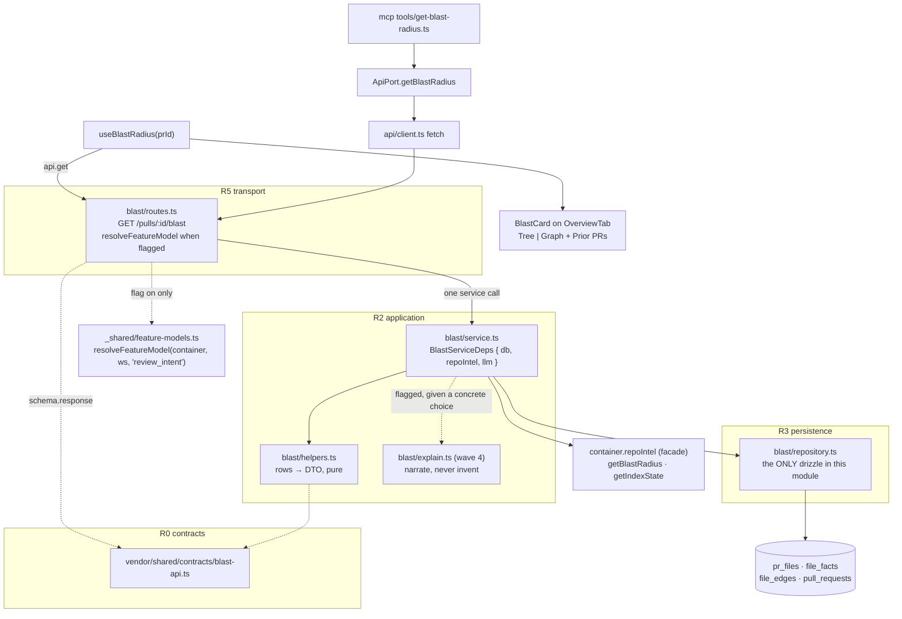

# Plan 06 — Blast Radius

**Modules:** server · client · mcp   **Created:** 2026-08-23   **Status:** draft
**Spec:** none (write one after the plan lands — `server/specs/blast.md`, via `doc-writer`)
**Mockup:** `docs/mockups/blast-radius.png`

## 1. Goal

Answer the reviewer's question *"what else could this diff touch?"* on the PR page, from facts the
`repo-intel` index already holds — **no model call in the core path**.

A new server module `blast/` serves `GET /pulls/:id/blast`: the symbols declared in the PR's changed
files, who calls them, and which HTTP endpoints and cron/jobs may depend on the changed code. A
`BlastCard` renders it on the Overview tab next to `IntentCard` (owner decision **D1**), with a
`Tree | Graph` toggle and a *Prior PRs touching these files* accordion (**D2**). An optional
one-paragraph LLM narration ships last, behind a flag (**D3**). `devdigest-mcp`'s deliberately
stubbed `get_blast_radius` is wired to the same route.

**The engine already exists and has no HTTP route.**
`RepoIntelService.getBlastRadius(repoId, changedFiles)` is implemented at
`server/src/modules/repo-intel/service.ts:221` and declared on the facade interface at
`server/src/modules/repo-intel/types.ts:155`. This plan **does not edit `repo-intel`** (**D4**) — it
exposes it, closes one gap beside it, and records the other honestly.

### Two facts that reshape the owner's step list

- **Step 5 ("walk the reverse import graph to reach HTTP routes") is mostly unnecessary.** Endpoints
  and crons are already **first-class per-file facts**: `file_facts (repo_id, file_path, endpoints
  jsonb, crons jsonb)` at `server/src/db/schema/repo-intel.ts:75-88`, written at index time by
  `extractEndpoints` / `extractCrons` (`server/src/adapters/codeindex/extract.ts:182-214`). They are
  **looked up per file**, not walked to. What the reverse walk genuinely buys is the *module-level*
  dimension the per-symbol lookup misses: a file that transitively imports a changed file but calls
  none of its symbols directly, and declares an endpoint or cron of its own. That — and only that —
  is REQ-9, bounded to depth 2 over `file_edges`' reverse index `file_edges_repo_to_idx (repoId,
  toFile)` (`schema/repo-intel.ts`). There is **no existing helper** for a file-level reverse walk
  (`getEdges` returns forward pairs only), so it is new code in `blast/repository.ts`.
- **The old shape is the right shape.** A fuller blast feature existed and was stripped when the repo
  was cut to a starter (added `d3d53ea`, removed `15fa391`). Its DTO grouped endpoints and crons
  **per changed symbol** — `DownstreamImpact = {symbol, callers[], endpoints_affected[],
  crons_affected[]}` — which is exactly the mockup's Tree. Recoverable for reference with
  `git show 15fa391^:server/src/modules/blast/service.ts`. **Reference only — do not restore it.**
  It predates the current `file_facts` / `decl_file` model and takes the whole `Container`
  (`git show 15fa391^:server/src/modules/blast/routes.ts` → `new BlastService(container)`), which
  `onion-architecture` §3 forbids.

### Owner decisions settled before dispatch (2026-08-23)

| | Decision | Where it binds |
|---|---|---|
| **D1** | The UI is a **card on the Overview tab**, beside `IntentCard` — not a `tab === "blast"` tab | REQ-11, T4 |
| **D2** | The `Tree \| Graph` toggle and the *Prior PRs* accordion are **in scope**, each its own task, sequenced after the core Tree | REQ-14, REQ-15, T6, T8 |
| **D3** | The one-paragraph LLM narration is **in scope**, its own task, behind a flag, last | REQ-19, REQ-20, T9, T10 |
| **D4** | **Do not edit `server/src/modules/repo-intel/**`** | every backend task |
| **A1** | **`file_impact[]` feeds the count strip and the Graph view only.** The Tree stays exactly as mocked: symbol → callers → endpoint/cron chips | REQ-9, REQ-14, T4, T5, T6 |
| **A2** | **`prior_prs[]` rows link to the internal PR page** `/repos/{repoId}/pulls/{number}` — never github.com | REQ-15, T1, T8 |
| **A3** | **The narration model is resolved, not hardcoded**: `resolveFeatureModel(container, workspaceId, 'review_intent')`. No Tier A edit is needed and none is made | REQ-19, T9 |

## 2. Requirements

| ID | Requirement |
|---|---|
| **REQ-1** | `GET /pulls/:id/blast` exists, resolves tenancy via `getContext`, and its `schema.response[200]` is the new contract — a Drizzle row can never reach the wire. |
| **REQ-2** | `symbols[]` lists every symbol declared in the PR's changed files, sourced from `repoIntel.getBlastRadius(repoId, changedFiles)`; the blast module re-implements none of that logic. |
| **REQ-3** | Each symbol's `callers[]` excludes the declaring file, is capped at 20, and is ordered by `rank` descending. |
| **REQ-4** | The PR's changed-file list is read from the cached `pr_files` rows for that PR — no GitHub call, no clone re-read. |
| **REQ-5** | **(gap G1)** Endpoints and crons declared **directly in a changed file** appear in the response. `blast/repository.ts` reads `file_facts` for the *changed* files itself and merges them in. |
| **REQ-6** | `status` is `ok \| partial \| degraded`, derived from `repoIntel.getIndexState(repoId)` and `BlastResult.degraded`; every non-`ok` status carries a non-empty human-readable `status_reason`. |
| **REQ-7** | **(gap G2)** On the degraded path the response reports crons as **unavailable** (`coverage.crons_available === false`) and never as an empty list; `status_reason` says in words that crons could not be determined. |
| **REQ-8** | No array in the response means "unknown". Availability is carried only by the explicit `coverage` booleans, and the route never substitutes `[]` for a fact it does not have. |
| **REQ-9** | `file_impact[]` lists files reached by a reverse-import walk over `file_edges` of depth ≤ 2 from each changed file, each with its own `file_facts` endpoints/crons and its `depth`. **Bound (A1): it is consumed by exactly two things — the `totals` count strip and the Graph view. It is never rendered as rows inside the Tree.** |
| **REQ-10** | `prior_prs[]` lists other PRs of the same repo whose cached `pr_files` overlap the changed files, each with its overlap count, newest first, capped, and each carrying the PR `number` the internal href is built from. |
| **REQ-11** | `BlastCard` renders on the **Overview tab beside `IntentCard`** — not a `tab === "blast"` tab — with the count strip, collapsible symbol rows, caller rows and endpoint/cron chips of the mockup, and nothing else in the Tree body. |
| **REQ-12** | Every caller `file:line` is a link built by `githubBlobUrl(repoFullName, headSha, file, line)` and rendered through `MonoLink`, opening that line of that file on github.com. |
| **REQ-13** | Blast data reaches the card only through a `useBlastRadius(prId)` hook over `api.get` in `client/src/lib/hooks/` — no `fetch` in a component. |
| **REQ-14** | A `Tree \| Graph` segmented toggle switches the card body between the tree and a node-link graph, rendered with **no new client dependency**. The Graph is the **only** view that renders `file_impact[]` (A1). |
| **REQ-15** | A collapsed `Prior PRs touching these files [n]` accordion renders `prior_prs[]`, each row linking to the **internal** PR page `/repos/{repoId}/pulls/{number}` — never a github.com URL. |
| **REQ-16** | A non-`ok` status is visible in the card (a labelled banner carrying `status_reason`), and heuristic endpoint/cron chips are never presented as certainty. |
| **REQ-17** | `get_blast_radius` in `devdigest-mcp` resolves `repo`+`pr` through the existing lookup resolver, calls `GET /pulls/:id/blast` through `ApiPort` → `ApiClient`, and returns real data; the stub's `{implemented:false, retry:false, …}` shape is gone. |
| **REQ-18** | The MCP output is a narrowed, explicitly capped flat projection in `mcp/src/shaping/**`, and `mcp/test/rings.test.ts` stays green (only `api/client.ts` calls `fetch`, only `api/routes.ts` builds URLs). |
| **REQ-19** | The one-paragraph LLM narration is produced only when the feature flag is on, on the provider+model returned by `resolveFeatureModel(container, workspaceId, 'review_intent')` (A3), and narrates only facts already present in the computed response — it adds no symbol, caller, endpoint or cron. |
| **REQ-20** | With the flag off (the default), `narrative` is `null`, **no model is resolved** and **no LLM call is made**. |
| **REQ-21** | A DB-backed `server/test/blast.it.test.ts` drives the real route through `buildApp` against a seeded index and asserts REQ-1, REQ-3, REQ-5, REQ-7, REQ-9 and REQ-10. |

## 3. Insights consulted

Read in full per the root `AGENTS.md` session protocol: `server/INSIGHTS.md` (197 lines),
`client/INSIGHTS.md` (159), `mcp/INSIGHTS.md` (132). There is no `server/src/modules/repo-intel/INSIGHTS.md`.

**Server — what binds this change**

- `2026-08-22` — *a Zod contract edit that passes BOTH typechecks can still break every fixture.*
  `server/tsconfig.json` never compiles `server/test/**`, and `.parse()` takes `unknown`. A contract
  task's done condition must run `pnpm exec vitest run --exclude '**/*.it.test.ts'`, not just
  `pnpm typecheck`. **This overrides the bare contract-lane command for T1.**
- `2026-08-16` — *widening a contract enum takes 3 edits, never a migration*: the Zod enum, the
  matching Drizzle `text(col, {enum:[…]})` **if the value is persisted**, then `sync-vendor.sh`.
  Nothing in this plan persists `status`, so it is 2 edits here.
- `2026-08-15` — *`Container` structurally satisfies a per-service `Deps` interface.*
  `new BlastService(app.container)` compiles against an explicit `BlastServiceDeps` with no container
  change. This is why the old `new BlastService(container)` must not be restored.
- `2026-08-23` — *a red `.it` lane is usually Testcontainers contention, not a regression.* Re-run one
  suite alone before debugging; never two `.it` invocations concurrently.
- `2026-08-17` — *a silent fail-open hides a feature that never ran.* `modules/` has no logger on any
  `Deps`; `console.warn` is the sanctioned escape when a degradation must be observable.
- `2026-08-17` — *`.` does not match `\r`.* Anything parsing file content line-wise splits on `/\r?\n/`.
- `2026-08-09` — DB-backed tests need the `*.it.test.ts` suffix or they run in the wrong lane.

**Client**

- `2026-08-17` — *`MonoLink` doesn't fit a file link that has to truncate.* `vendor/ui/primitives/MonoLink`
  takes no `style` prop and its no-`href` branch renders a dead `<button>`. `FindingCard` gets away
  with it; a constrained row does not. **Consume `MonoLink`; never modify it.**
- `2026-08-17` — *never build a URL from a `fullName` that falls back to a uuid.* Read
  `activeRepo?.full_name` directly (`page.tsx:122` already does).
- `2026-08-16` — *a clickable card must not be a `<button>` if it contains one.* A collapsible row
  containing a chip/link is a container `<div>` + a sibling control.
- `2026-08-10` — *React inline styles: `borderColor` is a shorthand and conflicts with `borderLeftColor`.*
- `2026-08-09 seed` — all server data flows through `lib/hooks/*` → `lib/api.ts`; tests mock the hook
  boundary, never global `fetch`.

**MCP**

- `2026-08-23` — *a task's owned paths must include the tests that assert on its interface.* Adding a
  method to `ApiPort` breaks **every** full `ApiPort` object literal: `test/get-findings.test.ts:16`,
  `test/protocol.test.ts:56`, `test/resolver.test.ts`, `test/run-agent-on-pr.test.ts:23`,
  `test/tools-read.test.ts:46`. T3 owns all of them.
- `2026-08-23` — *when a wave is partitioned by file ownership, the ring boundary and the ownership
  boundary must coincide, or the ring loses every tie.* T3 therefore owns one vertical slice across
  M0/M2/M3/M4/M5 rather than a horizontal one.
- `2026-08-23` — *`rings.test.ts`'s string scans die on the first hit and scan comments too.* A doc
  comment spelling a banned literal is a violation.
- `2026-08-23` — *a thrown `ApiError`'s message reaches the model verbatim*; `api/errors.ts` is
  model-facing copy.
- `2026-08-23` — *an optional field on a `Deps` interface is a silent-degradation vector.*

## 4. Contract changes — wave 0

**New file, never an edit:** `server/src/vendor/shared/contracts/blast-api.ts`, plus one
`export * from './contracts/blast-api.js';` line in `server/src/vendor/shared/index.ts`. That barrel
is **not** Tier A — Tier A covers *existing files under `contracts/**`*, and `index.ts` is the barrel
one directory up; `lookup-api.ts` landed exactly this way. `client/src/vendor/shared/**` **is** Tier A
and is regenerated wholesale by `./scripts/sync-vendor.sh` (`rm -rf` + `cp -r`) — never hand-edited.

**Nothing in this plan touches `contracts/platform.ts`.** A3 removed the only reason anything might
have: the narration reads its model through `resolveFeatureModel(…, 'review_intent')`, so no new
`FeatureModelId` is needed and `FEATURE_MODELS` stays untouched.

### The wave-0 contract must be complete for the WHOLE plan

Once `blast-api.ts` exists it is an *existing file under `contracts/**`* and therefore Tier A for
every later wave of this plan. **Every field any task in waves 1–4 needs must be declared in T1** —
including the graph/file-impact dimension, `prior_prs`, and the nullable LLM `narrative`. A later
task discovering a missing field has no legal repair inside this plan.

**A2's link needs nothing extra, verified rather than assumed.** The internal href is
`/repos/${repoId}/pulls/${number}` — the exact form `PRRow.tsx:59` already navigates with — and
`repoId` is a route param the card's page already holds (`app/repos/[repoId]/pulls/[number]/`). So
`BlastPriorPr.number` is sufficient and no contract field is added for it. `title` and `status` are
carried for the row's label, not for the URL.

### Decision: the new contract COEXISTS with `brief.ts`'s legacy shapes

`contracts/brief.ts:17-45` already declares flat `ChangedSymbol` / `BlastCaller` / `DownstreamImpact` /
`BlastRadius` with no degraded flag, and `PrBrief` composes `blast: BlastRadius` at `brief.ts:179`.
`brief.ts` is Tier A, so those cannot be removed or amended. They stay, unused by this feature.
**Consequence, and it is a hard one:** the barrel is a flat `export *`, so **no name in `blast-api.ts`
may collide with a name in `brief.ts`** — `BlastRadius`, `ChangedSymbol`, `BlastCaller` and
`DownstreamImpact` are all taken. Reusing one is a duplicate export (TS2308 at best, a silently
dropped export at worst).

### Decision: one object with a `status` enum, not a discriminated union

The only ok/degraded idiom in a shared contract today is
`PullLookupResult = z.discriminatedUnion('ok', […])` (`contracts/lookup-api.ts:26-38`) — and it works
there because `{ok:false}` carries **no** `pull` at all. Blast is different: `partial` and `degraded`
still carry symbols, callers and chips. A three-arm union would force every consumer to write the
same rendering branch three times for the same payload while narrowing nothing useful. So:
a single object with `status: 'ok' | 'partial' | 'degraded'`, a mandatory `status_reason`, and an
explicit `coverage` block of booleans.

**Step 6's rule holds either way and is enforced by `coverage`:** an empty array never means
"unknown". `coverage.crons_available === false` is how G2 is told the truth (REQ-7/REQ-8).

### The shape (field names are binding; the Zod is the implementer's)

```
BlastStatus        = z.enum(['ok', 'partial', 'degraded'])
BlastChipKind      = z.enum(['endpoint', 'cron'])

BlastCoverage      = { callers_available, endpoints_available, crons_available,
                       imports_available, prior_prs_available : boolean
                       files_indexed, files_skipped : int
                       index_truncated : boolean }          // MAX_INDEXED_FILES hit
BlastCallerRef     = { file, symbol, line : int, rank : number }
BlastChip          = { label, kind : BlastChipKind, file }  // label is "GET /path" | cron text
BlastSymbolImpact  = { name, file, kind, callers : BlastCallerRef[],
                       caller_count : int, chips : BlastChip[] }
BlastFileImpact    = { file, depth : int (1|2), chips : BlastChip[] }   // counts + Graph only (A1)
BlastPriorPr       = { number : int, title, status, overlap_count : int,
                       overlapping_files : string[], updated_at : string | null }
BlastTotals        = { symbols, callers, endpoints, crons : int }   // the mockup's count strip

BlastRadiusResponse = { status : BlastStatus
                        status_reason : string          // always non-empty when status !== 'ok'
                        coverage : BlastCoverage
                        changed_file_count : int
                        totals : BlastTotals
                        symbols : BlastSymbolImpact[]
                        file_impact : BlastFileImpact[]
                        prior_prs : BlastPriorPr[]
                        narrative : string | null }     // D3; null unless the flag is on
```

`caller_count` is the pre-cap count so the mockup's `4 callers` badge can be honest when the list is
truncated at 20. No `Date` on the boundary — `updated_at` is an ISO string.

## 5. Architecture



**Why `blast/` and not an addition to `repo-intel` or `reviews`:** D4 forbids editing `repo-intel`,
and `onion-architecture`'s rule 2 forbids one module importing another's repository — so blast cannot
reuse `reviews/repository/pull.repo.ts::filesForPull` (`pull.repo.ts:52`) and must issue its own
`pr_files` read. `container.repoIntel` is the sanctioned cross-module seam and is already a port on the
container (`platform/container.ts:114`).

**`_shared/feature-models.ts` is importable from a module, and that is written down in the file
itself** (its doc comment, lines 10-26): *"Lives in `_shared/` rather than `modules/settings/` because
more than one feature module resolves its own model this way (conventions does), and a module may not
import another module. It reads the `settings` table directly — the same sanctioned pattern as
`skills/repository.ts` reading `agent_skills`: the ban is on importing another MODULE, not on reading
its table."* So A3 costs no ring violation.

**Module shape is copied from `lookup/`, the newest module — not `pulls/`, the old flat pattern.**
`routes.ts` uses `withTypeProvider<ZodTypeProvider>()`, constructs the service inline from
`app.container`, and calls `getContext(app.container, req)`; `service.ts` declares an explicit
`BlastServiceDeps` interface satisfied structurally by `Container`; `repository.ts` is the only file
importing `drizzle-orm`; `helpers.ts` is pure row→DTO with no I/O.

## 6. Task graph

### Waves

| Wave | Tasks | Lane(s) | Parallel? |
|---|---|---|---|
| 0 | T1 | contract | **no** — serialized; sync the vendor mirror before wave 1 |
| 1 | T2, T3, T4 | backend, mcp, frontend | yes |
| 2 | T5, T6 | backend, frontend | yes |
| 3 | T7, T8 | backend (DB-backed), frontend | yes |
| 4 | T9, T10 | backend, frontend | yes |

**Disjointness — verified per wave.**

- **W0** — T1 alone.
- **W1** — T2 `server/src/modules/blast/**` + `server/src/modules/index.ts` + `server/test/blast.test.ts`;
  T3 `mcp/**`; T4 `client/**`. Union has no repeats. ✔
- **W2** — T5 `server/src/modules/blast/{repository,service,helpers,constants,types}.ts` +
  `server/test/blast-graph.test.ts`; T6 `client/.../BlastCard/**` + `client/messages/en/blast.json`.
  Different packages. ✔
- **W3** — T7 `server/test/blast.it.test.ts`; T8 `client/.../BlastCard/**` + `client/messages/en/blast.json`. ✔
- **W4** — T9 `server/src/modules/blast/{routes,explain,service,constants}.ts` +
  `server/src/platform/config.ts` + `server/test/blast-explain.test.ts`; T10 `client/.../BlastCard/**`
  + `client/messages/en/blast.json`. ✔

Paths repeat **across** waves (T2/T5/T9 all touch `blast/service.ts`; T2 and T9 both touch
`blast/routes.ts`; T4/T6/T8/T10 all touch `BlastCard.tsx`). That is legal — the invariant is
per-wave — and it is why these are separate waves rather than one big one.

**Exclusivity — none.** No task owns a Tier B path (`.claude/agents/README.md`,
`.claude/skills/README.md`). No task owns a Tier A path; see §9 for the follow-ups that do.

### Requirement → Task coverage

| | 1 | 2 | 3 | 4 | 5 | 6 | 7 | 8 | 9 | 10 | 11 | 12 | 13 | 14 | 15 | 16 | 17 | 18 | 19 | 20 | 21 |
|---|---|---|---|---|---|---|---|---|---|---|---|---|---|---|---|---|---|---|---|---|---|
| **T1** | x | | | | | x | x | x | x | x | | | | | | | | | x | | |
| **T2** | x | x | x | x | x | x | x | x | | | | | | | | | | | | x | |
| **T3** | | | | | | | | | | | | | | | | | x | x | | | |
| **T4** | | | | | | | | | | | x | x | x | | | x | | | | | |
| **T5** | | | | | | | | | x | x | | | | | | | | | | | |
| **T6** | | | | | | | | | x | | | | | x | | | | | | | |
| **T7** | x | | x | | x | | x | | x | x | | | | | | | | | | | x |
| **T8** | | | | | | | | | | x | | | | | x | | | | | | |
| **T9** | | | | | | | | | | | | | | | | | | | x | x | |
| **T10** | | | | | | | | | | | | | | | | x | | | x | | |

Every REQ-1..21 is hit by at least one task; every task implements at least one REQ. ✔

## 7. Tasks

---

### T1 — Blast wire contract (`blast-api.ts`)
**Wave:** 0 · **Parallel:** no · **Lane:** contract · **Ring:** R0 · **Depends on:** —
**Implements:** REQ-1, REQ-6, REQ-7, REQ-8, REQ-9, REQ-10, REQ-19

**Owned paths (exclusive — no other task may name these):**
- `server/src/vendor/shared/contracts/blast-api.ts` (new)
- `server/src/vendor/shared/index.ts` (edit — add exactly one `export *` line)

**May read:** `server/src/vendor/shared/contracts/lookup-api.ts` (the union idiom),
`server/src/vendor/shared/contracts/brief.ts` (the legacy names that must not be reused),
`server/src/modules/repo-intel/types.ts:63-87` (`BlastCallerRow`, `BlastResult` — the internal shapes
being mapped **from**), `docs/plans/06-blast-radius.md` §4.

**Skills (mandatory — these govern this task, from the lane table in `docs/plans/README.md`):**
`zod`, `onion-architecture` (its R0 rule only: contracts import `zod` and nothing else)

**Binding insights:**
- `server/INSIGHTS.md` `2026-08-22` — a contract edit that passes both typechecks can still break
  every runtime fixture; `server/test/**` is not compiled by `tsc` and `.parse()` takes `unknown`.
  Run the vitest lane too.
- `server/INSIGHTS.md` `2026-08-16` — widening a contract enum is 3 edits, never a migration; nothing
  here is persisted, so it is 2.

**Do:** Declare the §4 shape as Zod schemas plus `z.infer` type aliases, exported under names that do
not collide with `brief.ts`. Add one `export * from './contracts/blast-api.js';` line to the barrel,
in the same style as `./contracts/lookup-api.js`. Write §4's "complete for the whole plan" constraint
into the file's doc comment so a later reader knows why `narrative`, `file_impact` and `prior_prs` are
declared before anything serves them. Record A1's bound in `BlastFileImpact`'s doc comment (*counts
and the Graph view only — never Tree rows*) and A2's in `BlastPriorPr`'s (*`number` is what the
internal `/repos/{repoId}/pulls/{number}` href is built from; `repoId` comes from the route*). Do not
hand-edit `client/src/vendor/shared/**` — the done condition regenerates it.

**Acceptance:**
- [ ] REQ-1 — `BlastRadiusResponse` is exported from `@devdigest/shared` and usable as a Fastify
      `schema.response[200]` value (a Zod schema, not a bare type).
- [ ] REQ-6 — `status` is `z.enum(['ok','partial','degraded'])` and `status_reason` is a required
      non-optional `z.string()`.
- [ ] REQ-7/REQ-8 — `coverage` carries `crons_available`, `endpoints_available`, `callers_available`,
      `imports_available`, `prior_prs_available` as required booleans; no field in the contract is
      documented as "empty means unknown".
- [ ] REQ-9 — `file_impact[]` and its `depth` field are declared, and the schema's doc comment states
      A1's bound: counts and Graph only.
- [ ] REQ-10 — `prior_prs[]` is declared with `number`, `overlap_count` and an ISO-string
      `updated_at`; the doc comment states that `number` is what the internal PR href needs and that
      no repo identifier is carried because the client route already holds `repoId`.
- [ ] REQ-19 — `narrative` is declared as `z.string().nullable()` (not `.optional()`, not `.default()`).
- [ ] `./scripts/sync-vendor.sh --check` passes, i.e. the mirror was regenerated by the script.

**Red flags (stop if you are about to do any of these):**
- [ ] editing **any** existing file under `server/src/vendor/shared/contracts/**` — `brief.ts`,
      `platform.ts` and `lookup-api.ts` are Tier A
- [ ] exporting a name already exported by `brief.ts` — `BlastRadius`, `ChangedSymbol`, `BlastCaller`,
      `DownstreamImpact` — into the flat `export *` barrel
- [ ] importing anything but `zod` (and sibling contract files) into `blast-api.ts` — no `drizzle-orm`,
      no `fastify`, no `src/**`
- [ ] a `.default()` or `.optional()` on `narrative` or on any `coverage` boolean — `server/INSIGHTS.md`
      2026-08-17 is explicit that `.default()` masks a missing field, and here it would also make
      "unknown" indistinguishable from "false"
- [ ] adding a `github_url`, `html_url` or repo-full-name field to `BlastPriorPr` — A2 makes the link
      internal, and the client route already supplies `repoId`
- [ ] hand-editing `client/src/vendor/shared/**` (Tier A — regenerated, never authored)
- [ ] putting a Drizzle row type or a `Date` on the boundary

**Done condition:** `./scripts/sync-vendor.sh && ./scripts/sync-vendor.sh --check && cd server && pnpm typecheck && cd ../client && pnpm typecheck`
— **and then**, per `server/INSIGHTS.md` 2026-08-22, `cd server && pnpm exec vitest run --exclude '**/*.it.test.ts'`. Both must be green and both outputs pasted.

---

### T2 — `blast/` module: route, service, repository, helpers
**Wave:** 1 · **Parallel:** yes · **Lane:** backend · **Ring:** R5+R3+R2 · **Depends on:** T1
**Implements:** REQ-1, REQ-2, REQ-3, REQ-4, REQ-5, REQ-6, REQ-7, REQ-8, REQ-20

**Owned paths (exclusive — no other task may name these):**
- `server/src/modules/blast/routes.ts` (new)
- `server/src/modules/blast/service.ts` (new)
- `server/src/modules/blast/repository.ts` (new)
- `server/src/modules/blast/helpers.ts` (new)
- `server/src/modules/blast/constants.ts` (new)
- `server/src/modules/blast/types.ts` (new)
- `server/src/modules/index.ts` (edit — one import + one key)
- `server/test/blast.test.ts` (new, hermetic)

**May read:** `server/src/modules/lookup/{routes,service,repository,helpers}.ts` (the module template),
`server/src/modules/repo-intel/types.ts:63-87,148-165`,
`server/src/modules/repo-intel/service.ts:190-206` (`getIndexState`, never throws) and `:221-392`
(both blast paths — read to map from, not to copy),
`server/src/modules/repo-intel/constants.ts` (`MAX_CALLERS_PER_SYMBOL = 20`, `SUPPORTED_EXT`,
`MAX_INDEXED_FILES = 5000`), `server/src/db/schema/repo-intel.ts`, `server/src/db/schema/pulls.ts`,
`server/src/modules/reviews/repository/pull.repo.ts:52` (how `pr_files` is read — **as a reference,
never an import**), `server/src/modules/_shared/context.ts`, `server/src/db/rows.ts`.

**Skills (mandatory — these govern this task, from the lane table in `docs/plans/README.md`):**
`onion-architecture`, `fastify-best-practices`, `zod`, `typescript-expert`, `drizzle-orm-patterns`,
`postgresql-table-design`

**Binding insights:**
- `server/INSIGHTS.md` `2026-08-15` — `Container` structurally satisfies a per-service `Deps`
  interface; `new BlastService(app.container)` compiles with **no** container change. Declare
  `BlastServiceDeps { db: Db; repoIntel: RepoIntel }`.
- `server/INSIGHTS.md` `2026-08-17` — a silent fail-open hides a feature that never ran; `modules/`
  has no logger on any `Deps`, so `console.warn` is the sanctioned way to make a degradation observable.
- `server/INSIGHTS.md` `2026-08-22` — `server/test/**` is not typechecked; a green `pnpm typecheck`
  proves nothing about a fixture.
- `server/INSIGHTS.md` `2026-08-09` — DB-backed tests need the `.it.test.ts` suffix. **This task's
  test is hermetic** — a `Deps` object literal, no Docker. The DB-backed one is T7.

**Do:** Create the `blast/` module in the shape of `lookup/`. `repository.ts` owns four reads, all
scoped: the PR row by `(workspaceId, prId)`; the PR's `pr_files.path` list (REQ-4); `file_facts` for
the **changed** files (REQ-5 / gap G1 — this is the whole G1 fix, and it is an ordinary R3 read that
breaks no boundary); and `repo_index_state` is *not* read here — `service.ts` gets it from
`deps.repoIntel.getIndexState(repoId)`. `service.ts` calls `deps.repoIntel.getBlastRadius(repoId,
changedFiles)`, merges the changed-file facts, and derives `status` / `status_reason` / `coverage`.
`helpers.ts` maps `BlastResult` + rows → `BlastRadiusResponse` with no I/O, attributing each caller
file's `factsByFile` entry to the symbol it reaches and grouping callers per symbol. Leave
`file_impact`, `prior_prs` as `[]` with `coverage.imports_available` / `prior_prs_available` set to
`false` — T5 fills them; that is the contract's own honesty rule working as designed, not a stub.
`narrative` is `null` (REQ-20). Register the module with one import + one key in
`server/src/modules/index.ts:27-38` (its doc comment already names `blast` as a forthcoming module).

Status derivation (REQ-6/REQ-7), from `getIndexState().status` and `BlastResult.degraded`:

| index state | `BlastResult.degraded` | `status` | `coverage.crons_available` |
|---|---|---|---|
| `full` | `false` | `ok` | `true` |
| `partial` | `false` | `partial` | `true` |
| `degraded` / `failed` / `no_data` | `true` | `degraded` | **`false`** |

**gap G2 is real and cannot be closed here.** `repo-intel`'s ripgrep fallback calls `extractEndpoints`
but never `extractCrons` (`service.ts:291-295`), so on the degraded path crons are simply absent —
not empty. D4 forbids the fix. The response must therefore set `crons_available: false` and say so in
`status_reason` (e.g. *"the index is unavailable, so cron and scheduled-job impact could not be
determined"*). **Never claim "0 crons" on that path.**

**Acceptance:**
- [ ] REQ-1 — `GET /pulls/:id/blast` is registered, calls `getContext(app.container, req)` for
      `workspaceId`, declares `schema: { params, response: { 200: BlastRadiusResponse } }`, and the
      handler does exactly four things: read input, resolve tenancy, call **one** service method, map
      a status code. Unknown/foreign `:id` → 404.
- [ ] REQ-2 — `symbols[]` comes from `deps.repoIntel.getBlastRadius`; no symbol extraction is
      re-implemented in `blast/`.
- [ ] REQ-3 — callers exclude the declaring file, are capped at 20, sorted by `rank` desc, and
      `caller_count` reports the pre-cap count.
- [ ] REQ-4 — the changed-file list comes from `pr_files` via `blast/repository.ts`; no
      `container.github()` and no clone read on this path.
- [ ] REQ-5 (G1) — an endpoint or cron declared **in a changed file itself** appears in that symbol's
      `chips[]`. Covered by a hermetic test naming this case.
- [ ] REQ-6/REQ-7 (G2) — the table above holds; a degraded response sets `crons_available: false` and
      a `status_reason` that says crons could not be determined.
- [ ] REQ-8 — no code path substitutes `[]` for an unknown; every `[]` is paired with an
      `*_available: false` or is a genuine empty.
- [ ] REQ-20 — `narrative` is `null` and no LLM is resolved anywhere in the module.
- [ ] `server/test/blast.test.ts` exercises `BlastService` through a `Deps` **object literal** — no
      `as never`, no private-field write.

**Red flags (stop if you are about to do any of these):**
- [ ] editing anything under `server/src/modules/repo-intel/**` — **D4**, and it is not in your owned paths
- [ ] importing `reviews/repository/pull.repo.ts` (or any other module's file) — no module imports
      another module; issue your own `pr_files` read
- [ ] `drizzle-orm` or `db/schema*` in `service.ts` or `helpers.ts` — R3 only
- [ ] `constructor(private container: Container)` — the stripped `blast/routes.ts` in git history did
      exactly this; declare `BlastServiceDeps` instead
- [ ] returning a Drizzle row from the handler, or omitting `schema.response`
- [ ] hand-rolling `.parse()` in the handler instead of the route schema
- [ ] returning `crons: []` on the degraded path with `crons_available: true`
- [ ] a `.it.test.ts` file (that is T7) or any Docker dependency in `blast.test.ts`

**Done condition:** `cd server && pnpm typecheck && pnpm exec vitest run --exclude '**/*.it.test.ts'`

---

### T3 — Wire `get_blast_radius` in `devdigest-mcp`
**Wave:** 1 · **Parallel:** yes · **Lane:** mcp · **Ring:** M0+M2+M3+M4+M5 · **Depends on:** T1
**Implements:** REQ-17, REQ-18

**Owned paths (exclusive — no other task may name these):**
- `mcp/src/ports.ts` (edit — add `getBlastRadius` to `ApiPort`)
- `mcp/src/api/routes.ts` (edit — add the URL builder)
- `mcp/src/api/client.ts` (edit — the only ring that may call `fetch`)
- `mcp/src/schemas/blast.ts` (edit — replace the stub output shape)
- `mcp/src/shaping/blast.ts` (new — the narrowed projection)
- `mcp/src/tools/get-blast-radius.ts` (edit — rewrite to take `deps: {api, resolver}`)
- `mcp/src/server.ts` (edit — pass the deps at the one construction site)
- `mcp/test/tools-blast.test.ts` (edit)
- `mcp/test/protocol.test.ts` (edit — the frozen description byte count)
- `mcp/test/get-findings.test.ts`, `mcp/test/resolver.test.ts`, `mcp/test/run-agent-on-pr.test.ts`,
  `mcp/test/tools-read.test.ts` (edit — each holds a full `ApiPort` object literal)
- `mcp/test/api-client.test.ts` (edit)
- `mcp/test/shaping.test.ts` (edit)

**May read:** `mcp/specs/mcp-server.md` (the package's own ring model and import matrix — **this
governs, not `server/`'s onion**), `mcp/AGENTS.md` §6, `docs/plans/05-mcp-server.md:529-553`,
`mcp/src/tools/get-findings.ts` (the `Deps` + resolver + shaping template),
`mcp/src/tools/_register.ts:134-174`, `mcp/src/shaping/{project,summary,order,constants}.ts`,
`mcp/src/resolve/resolver.ts`, `mcp/test/rings.test.ts`, `mcp/test/startup-cost.test.ts`,
`server/src/vendor/shared/contracts/blast-api.ts`.

**Skills (mandatory — these govern this task, from the lane table in `docs/plans/README.md`):**
`onion-architecture` (**as scoped by `mcp/specs/mcp-server.md`**), `typescript-expert`, `zod`,
`security` (the tool boundary and every interpolated URL segment), `context7-mcp` (the MCP TypeScript
SDK's current API)

**Binding insights:**
- `mcp/INSIGHTS.md` `2026-08-23` — a task's owned paths must include the tests that assert on its
  interface. Adding a method to `ApiPort` breaks **five** full object literals; they are all listed
  above for exactly this reason.
- `mcp/INSIGHTS.md` `2026-08-23` — when a wave is partitioned by file ownership, the ring boundary and
  the ownership boundary must coincide. This task is one vertical slice; put shaping in
  `shaping/**` and value schemas in `schemas/**`, never in `tools/`.
- `mcp/INSIGHTS.md` `2026-08-23` — `rings.test.ts`'s string scans die on the first hit **and scan
  comments**; a doc comment spelling a banned literal is a violation.
- `mcp/INSIGHTS.md` `2026-08-23` — a thrown `ApiError`'s message reaches the model verbatim.
- `mcp/INSIGHTS.md` `2026-08-23` — an optional field on a `Deps` interface is a silent-degradation
  vector; make `getBlastRadius` required on `ApiPort`.

**Do:** **Note the provenance in the code comment you replace:** this stub was deliberate (decision
D8, `docs/plans/05-mcp-server.md` §5.8 — "exposing it is the course homework"), and the owner is now
explicitly commissioning that exercise. Nobody should later read this as an accidental wiring.

Add `getBlastRadius(pullId: string): Promise<BlastRadiusResponse>` to `ApiPort`; add
`blastUrl(base, pullId)` to `api/routes.ts` using the existing `segment()` helper (every interpolated
value gets `encodeURIComponent` + the 512-char cap); implement it in `api/client.ts` via the private
`request<T>()`. Replace `schemas/blast.ts`'s `{implemented, retry, reason, use_instead}` with a **flat**
output schema. Put the projection in `shaping/blast.ts` and cap it explicitly.

**Shaping caution — the Tree DTO is too big for a tool response.** Decide and *document in the file*
what is dropped: recommend keeping `status`, `status_reason`, the four `totals`, and a capped list of
`{symbol, file, caller_count}` plus a capped flat list of endpoint/cron labels; drop per-caller
`file:line` rows, `rank`, `file_impact`, `prior_prs` and `narrative`. State the caps as named
constants in `shaping/constants.ts`-style and say in the tool description that the result is
truncated. Rewrite the tool description to state what it returns and that it is read-only, then
update the frozen byte count in `mcp/test/protocol.test.ts:260` to the new measured value.

**Acceptance:**
- [ ] REQ-17 — `get_blast_radius` resolves `repo`+`pr` through `resolvePull(...)` before any blast
      call, returns `isError: true` with the resolver's message on a miss, and otherwise returns real
      data; no `implemented: false` literal survives anywhere in `mcp/src/**`.
- [ ] REQ-18 — the projection lives in `mcp/src/shaping/blast.ts`, every cap is a named constant, and
      the file's doc comment lists what is dropped and why.
- [ ] REQ-18 — `mcp/test/rings.test.ts` passes unmodified (it is **not** in your owned paths): `fetch`
      appears only in `api/client.ts`, URL construction only in `api/routes.ts`, no URL literal
      outside `config.ts`'s default.
- [ ] `mcp/test/protocol.test.ts` — the tool list is still exactly the five D-D names, every input
      schema property is a flat primitive (REQ-9 of plan 05), `annotations.readOnlyHint` is `true`,
      and the description byte count is updated to the measured value **in the same commit** as the
      description.
- [ ] `mcp/test/startup-cost.test.ts` passes; if `deferred_startup_tokens` rises, it is a reviewed
      rise, re-measured with `npm run measure`.
- [ ] every `createFakeApi`/`fakeApi` literal compiles with the new `ApiPort` member.

**Red flags (stop if you are about to do any of these):**
- [ ] `fetch`, a URL literal, or string interpolation of a URL anywhere outside `api/client.ts` /
      `api/routes.ts` — including in a comment
- [ ] an interpolated path segment that skips `segment()` (no `encodeURIComponent`, no length cap)
- [ ] an object- or array-typed property on `inputSchema` — `registerTool` and `protocol.test.ts`
      both forbid nested input
- [ ] making `getBlastRadius` optional on `ApiPort`, or defaulting it in a `Deps`
- [ ] shaping or application logic inside `tools/get-blast-radius.ts`
- [ ] `fastify-best-practices`, `drizzle-orm-patterns`, `postgresql-table-design`, or any UI skill —
      this package has no HTTP server, no database ring and no UI
- [ ] editing `mcp/AGENTS.md` (Tier A) or `mcp/test/rings.test.ts` (not owned — if it fails, your code
      is wrong, not the test)
- [ ] returning the full server DTO unshaped

**Done condition:** `cd mcp && npm run typecheck && npm test`

---

### T4 — `BlastCard` (Tree view) on the Overview tab + `useBlastRadius`
**Wave:** 1 · **Parallel:** yes · **Lane:** frontend · **Depends on:** T1
**Implements:** REQ-11, REQ-12, REQ-13, REQ-16

**Owned paths (exclusive — no other task may name these):**
- `client/src/lib/hooks/blast.ts` (new)
- `client/src/lib/hooks/index.ts` (edit — one `export *` line)
- `client/src/app/repos/[repoId]/pulls/[number]/_components/BlastCard/BlastCard.tsx` (new)
- `client/src/app/repos/[repoId]/pulls/[number]/_components/BlastCard/styles.ts` (new)
- `client/src/app/repos/[repoId]/pulls/[number]/_components/BlastCard/helpers.ts` (new)
- `client/src/app/repos/[repoId]/pulls/[number]/_components/BlastCard/index.ts` (new)
- `client/src/app/repos/[repoId]/pulls/[number]/_components/BlastCard/BlastCard.test.tsx` (new)
- `client/src/app/repos/[repoId]/pulls/[number]/_components/OverviewTab/OverviewTab.tsx` (edit)
- `client/src/app/repos/[repoId]/pulls/[number]/_components/OverviewTab/styles.ts` (edit)
- `client/src/app/repos/[repoId]/pulls/[number]/page.tsx` (edit — pass `repoFullName` through)
- `client/messages/en/blast.json` (edit)

**May read:** `docs/mockups/blast-radius.png` (the visual target),
`client/src/lib/hooks/reviews.ts:78-84` (`useSmartDiff` — the closest hook template),
`client/src/lib/hooks/repo-intel.ts`, `client/src/lib/api.ts`, `client/src/lib/github-urls.ts:30-43`,
`client/src/vendor/ui/primitives/MonoLink.tsx` (**consume only**),
`client/src/app/repos/[repoId]/pulls/[number]/_components/IntentCard/**` (card template),
`client/src/app/repos/[repoId]/pulls/[number]/_components/FindingCard/FindingCard.tsx:56-59,117-119`
(the `githubBlobUrl` → `MonoLink` pattern),
`client/src/vendor/shared/contracts/blast-api.ts` (regenerated by T1).

**Skills (mandatory — these govern this task, from the lane table in `docs/plans/README.md`):**
`frontend-ui-architecture`, `next-best-practices`, `react-best-practices`, `typescript-expert`,
`react-testing-library`

**Binding insights:**
- `client/INSIGHTS.md` `2026-08-09 seed` — all server data flows through `lib/hooks/*` → `lib/api.ts`;
  a `fetch` in a component is the thing to stop and fix.
- `client/INSIGHTS.md` `2026-08-17` — `MonoLink` takes no `style` prop and its no-`href` branch renders
  a dead `<button>`. Consume it as `FindingCard` does; if a row must truncate, hand-roll the `<a>` the
  way `ConventionCard` does rather than modifying the primitive.
- `client/INSIGHTS.md` `2026-08-17` — never build a URL from a `fullName` that falls back to a uuid;
  `page.tsx:122` already reads `activeRepo?.full_name` correctly — pass **that** down.
- `client/INSIGHTS.md` `2026-08-16` — a clickable card must not be a `<button>` if it contains one;
  a collapsible row containing chips/links is a container `<div>` + sibling controls.
- `client/INSIGHTS.md` `2026-08-10` — `borderColor` is a shorthand and conflicts with `borderLeftColor`.
- `client/INSIGHTS.md` `2026-08-18` — tests never hit the network; mock the hook boundary.

**Do:** Add `useBlastRadius(prId)` in `client/src/lib/hooks/blast.ts` — `useQuery` over
`api.get<BlastRadiusResponse>('/pulls/${prId}/blast')`, `enabled: !!prId`, keyed `["blast", prId]`,
modelled on `useSmartDiff` — and re-export it from the hooks barrel. Build `BlastCard` to the mockup:
header `BLAST RADIUS`, the count strip `n symbols · n callers · n endpoints · n cron` from
`totals`, collapsible symbol rows (`rateLimit()` with a right-aligned `caller_count` badge), caller
`file:line` rows in mono type, then endpoint chips and a distinctly-coloured cron chip below them.
The `Tree | Graph` segmented toggle is **rendered in this task, with `Graph` disabled or inert** —
T6 wires it; that keeps the toggle out of two owners in different waves from re-laying-out the header.

**A1 is binding on the Tree body: symbol → callers → chips, and nothing else.** `totals` already
includes the `file_impact` contribution, so the count strip is correct without the Tree ever reading
`file_impact[]`. Leave that array entirely to T6's Graph.

**D1 is binding: this is a CARD on the Overview tab, not a tab.** Slot `<BlastCard …/>` alongside
`<IntentCard …/>` in `OverviewTab.tsx:19-35` (the mockup shows the two side by side — introduce the
two-column grid in `OverviewTab/styles.ts`). `OverviewTab` does not currently receive `repoFullName`;
add the prop and thread it from `page.tsx` (which already has it at line 122), exactly as
`FindingsTab` receives it at line 199.

Non-`ok` status must be visible (REQ-16): render `status_reason` in a labelled banner, and label the
chips as heuristic — `extractEndpoints`/`extractCrons` are regex heuristics and false positives and
negatives are expected. Do not render a chip section as a factual list of "affected endpoints" with
no qualifier.

**Acceptance:**
- [ ] REQ-11 — `BlastCard` renders inside `OverviewTab`; no `tab === "blast"` branch exists anywhere.
- [ ] REQ-11 — count strip, collapsible symbol rows with a caller-count badge, caller rows, and
      endpoint + cron chips all render from `BlastRadiusResponse`.
- [ ] REQ-11/A1 — `file_impact` appears nowhere in the Tree body; `grep -n "file_impact"` over the
      owned component files returns only the (absent) Graph placeholder, i.e. nothing this wave.
- [ ] REQ-12 — a caller row's `file:line` is an `<a>`/`MonoLink` whose `href` is
      `githubBlobUrl(repoFullName, headSha, file, line)`; asserted in `BlastCard.test.tsx` with
      `toHaveAttribute('href', …)`.
- [ ] REQ-13 — the only data path is `useBlastRadius`; `grep -n "fetch(" ` over the owned component
      files returns nothing.
- [ ] REQ-16 — a `partial`/`degraded` response renders `status_reason` visibly; a test covers the
      `degraded` case and asserts the cron section does **not** claim zero.
- [ ] loading, error and empty states are handled in the card (RTL: 2–3 flow tests, `userEvent`,
      hook boundary mocked).

**Red flags (stop if you are about to do any of these):**
- [ ] **rendering `file_impact` rows inside the Tree** — A1 confines that array to the count strip and
      the Graph view; the Tree stays exactly as mocked
- [ ] `fetch` inside a component, or a `useEffect` that fetches
- [ ] modifying `client/src/vendor/ui/primitives/MonoLink.tsx` or anything else under
      `client/src/vendor/**` — consume only; `client/src/vendor/shared/**` is Tier A outright
- [ ] adding a `blast` tab, or a `?tab=blast` branch — D1 says card
- [ ] `onion-architecture`, `fastify-best-practices`, `drizzle-orm-patterns` or
      `postgresql-table-design` — none of them govern `client/**`
- [ ] a `renderThing()` camelCase function returning JSX instead of a `<Thing />` component
- [ ] storing derived values (`totals`, chip lists) in `useState` instead of computing during render
- [ ] `getByTestId` as a first-choice query, or a snapshot test in place of behaviour assertions
- [ ] building a URL from `repoId` or from a `fullName` that falls back to it

**Done condition:** `cd client && pnpm typecheck && pnpm test`

---

### T5 — Bounded reverse-import walk + prior PRs
**Wave:** 2 · **Parallel:** yes · **Lane:** backend · **Ring:** R3+R2 · **Depends on:** T2
**Implements:** REQ-9, REQ-10

**Owned paths (exclusive — no other task may name these):**
- `server/src/modules/blast/repository.ts` (edit)
- `server/src/modules/blast/service.ts` (edit)
- `server/src/modules/blast/helpers.ts` (edit)
- `server/src/modules/blast/constants.ts` (edit)
- `server/src/modules/blast/types.ts` (edit)
- `server/test/blast-graph.test.ts` (new, hermetic)

**May read:** `server/src/db/schema/repo-intel.ts:52-88` (`file_edges` + its reverse index
`file_edges_repo_to_idx (repoId, toFile)`; `file_facts`), `server/src/db/schema/pulls.ts:5-51`
(`pull_requests`, `pr_files` and `pr_files_pr_idx`),
`server/src/modules/repo-intel/repository.ts:586-601` (`getFileFacts` — the read to mirror),
`server/src/modules/repo-intel/constants.ts` (`BFS_DEPTH = 2` — the existing name for this bound),
`server/src/modules/blast/routes.ts`.

**Skills (mandatory — these govern this task, from the lane table in `docs/plans/README.md`):**
`onion-architecture`, `fastify-best-practices`, `zod`, `typescript-expert`, `drizzle-orm-patterns`,
`postgresql-table-design`

**Binding insights:**
- `server/INSIGHTS.md` `2026-08-17` — `created_at` cannot break a sort tie between rows written by the
  same transaction; any user-visible list needs a unique immutable last key. `prior_prs` orders by
  `updated_at desc` **then** `number desc`, never by `updated_at` alone.
- `server/INSIGHTS.md` `2026-08-15` — keep the explicit `BlastServiceDeps`; do not widen it to `Container`.
- `server/INSIGHTS.md` `2026-08-22` — a green `pnpm typecheck` says nothing about `server/test/**`.

**Do:** Add the two reads to `blast/repository.ts`, both scoped by `repoId`/`workspaceId`.

*Reverse-import walk (REQ-9):* a breadth-first walk over `file_edges` using the reverse direction
(`where repoId = ? and toFile in (…)` → collect `fromFile`), **two levels only**, seeded with the
changed files, excluding the changed files themselves and de-duplicating across levels so a file
reached at depth 1 is never re-reported at depth 2. Bound the frontier size with a named constant in
`constants.ts` — an unbounded `inArray` over a wide fan-in is how this query stops being O(degree).
Then one `file_facts` read over the reached files; attach `depth` and the chips. Set
`coverage.imports_available` from whether `file_edges` had any row for the repo (an unindexed repo
must report `false`, not an empty walk).

**A1 sets the consumer contract for this array, and it constrains the shape you emit.**
`file_impact[]` is read by exactly two things — the `totals` count strip and T6's Graph view — never
by the Tree. So it needs `file`, `depth` and `chips`, and it does **not** need to be attributable back
to a specific changed symbol; do not add a `viaSymbol` field or duplicate entries per symbol to make
that possible.

*Prior PRs (REQ-10):* join `pr_files` → `pull_requests` where `repoId` matches, `pull_requests.id !=`
this PR, and `pr_files.path` is in the changed set; group by PR; count distinct overlapping paths;
order `updated_at desc, number desc`; cap with a named constant. Set `coverage.prior_prs_available`
honestly: `pr_files` is only populated for PRs whose detail has already been fetched, so a repo with
no cached detail must report `false` rather than an empty list. Every row must carry `number` — A2
makes the client's link `/repos/{repoId}/pulls/{number}`, so a row without it is unlinkable.

**Acceptance:**
- [ ] REQ-9 — `file_impact[]` is populated by a walk whose depth is provably ≤ 2 (asserted in
      `blast-graph.test.ts` with a chain A→B→C→D where D must not appear), each entry carries `depth`
      and its own `file_facts` chips, and changed files never appear in it.
- [ ] REQ-9/A1 — entries are per **file**, not per (file, symbol); no `viaSymbol`-style field is added.
- [ ] REQ-9 — `coverage.imports_available` is `false` when the repo has no `file_edges` rows.
- [ ] REQ-10 — `prior_prs[]` excludes the current PR, carries `number`, `overlap_count` and
      `overlapping_files`, is ordered `updated_at desc, number desc`, and is capped by a named constant.
- [ ] REQ-10 — `coverage.prior_prs_available` is `false` when no other PR of the repo has cached
      `pr_files`.
- [ ] `totals.endpoints` / `totals.crons` count the **union** of per-symbol chips and `file_impact`
      chips, de-duplicated by `(kind, label)` — this is what lets the Tree stay `file_impact`-free
      while the count strip stays correct.
- [ ] `blast-graph.test.ts` drives the pure walk/merge helpers, not the DB.

**Red flags (stop if you are about to do any of these):**
- [ ] a recursive CTE or an unbounded walk — the bound is 2 levels and it is a hard requirement
- [ ] `drizzle-orm` reaching `service.ts` or `helpers.ts`
- [ ] returning a query builder, an `SQL` fragment or `Db` from a repository method
- [ ] an `inArray` over an unbounded frontier with no cap
- [ ] `ORDER BY updated_at` with no unique tiebreaker
- [ ] reporting an empty `file_impact` / `prior_prs` while leaving the matching `coverage` boolean `true`
- [ ] emitting a `prior_prs` row with no `number`, or adding a github.com URL field to it (A2)
- [ ] merging `file_impact` chips into `symbols[].chips` to "make the Tree richer" — A1 says the Tree
      does not show them, and this would double-count `totals`
- [ ] editing `server/src/modules/repo-intel/**` (D4) or `server/src/modules/index.ts` (T2's, and already done)
- [ ] adding a migration or touching `server/src/db/schema/**` — every table this needs already exists

**Done condition:** `cd server && pnpm typecheck && pnpm exec vitest run --exclude '**/*.it.test.ts'`

---

### T6 — Tree | Graph toggle (D2, view 2)
**Wave:** 2 · **Parallel:** yes · **Lane:** frontend · **Depends on:** T4
**Implements:** REQ-9 (its client-side bound), REQ-14

**Owned paths (exclusive — no other task may name these):**
- `client/src/app/repos/[repoId]/pulls/[number]/_components/BlastCard/BlastCard.tsx` (edit)
- `client/src/app/repos/[repoId]/pulls/[number]/_components/BlastCard/BlastGraph.tsx` (new)
- `client/src/app/repos/[repoId]/pulls/[number]/_components/BlastCard/styles.ts` (edit)
- `client/src/app/repos/[repoId]/pulls/[number]/_components/BlastCard/helpers.ts` (edit)
- `client/src/app/repos/[repoId]/pulls/[number]/_components/BlastCard/BlastCard.test.tsx` (edit)
- `client/messages/en/blast.json` (edit)

**May read:** `docs/mockups/blast-radius.png`, `client/src/vendor/ui/primitives/tokens.ts`,
`client/src/vendor/shared/contracts/blast-api.ts`, `client/src/app/repos/[repoId]/pulls/[number]/_components/SmartDiffViewer/**`.

**Skills (mandatory — these govern this task, from the lane table in `docs/plans/README.md`):**
`frontend-ui-architecture`, `next-best-practices`, `react-best-practices`, `typescript-expert`,
`react-testing-library`

**Binding insights:**
- `client/INSIGHTS.md` `2026-08-18` — never run `pnpm build` in `client/` while `pnpm dev` is running;
  the dev server then 500s on deleted chunk paths. Your done condition is `pnpm test`, not a build.
- `client/INSIGHTS.md` `2026-08-16` — `vendor/ui` interactive primitives have no accessible name by
  default; a segmented toggle's buttons need explicit accessible names.
- `client/INSIGHTS.md` `2026-08-10` — `borderColor` conflicts with `borderLeftColor` in inline styles.

**Do:** Make the segmented toggle live. **The Graph is the one and only view that renders
`file_impact[]` (A1).** It draws changed symbol → callers → endpoint/cron chips (the same data the
Tree shows) *plus* a `file_impact` band for files reached by the bounded import walk, each labelled
with its `depth`. Nothing you add here may leak back into the Tree body.

Lay it out yourself in inline SVG/CSS using the existing design tokens.

**Zero new client dependencies (REQ-14).** A layout library (d3, elkjs, reactflow, dagre) is not
approved. A columnar left-to-right layout — a column of symbol nodes, a column of caller nodes, a
column of chips, with a separate `file_impact` column or band, connected by straight or quadratic-Bézier
connectors — is sufficient for the ~20-caller cap and is what to build. **If you conclude a dependency
is genuinely unavoidable, stop and report `BLOCKED` naming the package and the reason — that is an
owner decision, not yours.**

Selecting the view is UI state, not URL state; keep it local to `BlastCard`. Give the SVG
`role="img"` and the `blast.graph.ariaLabel` label, and render `blast.graph.empty` when there is
nothing to graph.

**Note:** `client/messages/en/blast.json` **already exists** with `view.tree`, `view.graph`,
`graph.empty`, `graph.ariaLabel`, `stat.*`, `callerCount` and `noDownstream` — left over from the
stripped feature. Use those keys; add only what is missing. Namespaces auto-load from
`client/messages/en/` (`client/src/i18n/request.ts`), so no shared file needs touching.

**Acceptance:**
- [ ] REQ-14 — clicking `Graph` swaps the card body to the graph and `Tree` swaps it back; asserted
      with `userEvent` in `BlastCard.test.tsx`.
- [ ] REQ-9/A1 — `file_impact[]` is read **only** by `BlastGraph.tsx`; a test asserts that a response
      whose `file_impact` is non-empty shows those files in the Graph view and **not** in the Tree view.
- [ ] REQ-14 — `client/package.json` is unchanged and `git diff --stat` shows no lockfile change.
- [ ] the graph needs no second fetch and no new hook — it reads the same `useBlastRadius` result.
- [ ] the empty case renders `blast.graph.empty`; the SVG carries an accessible name.
- [ ] both toggle buttons have accessible names and are reachable by `getByRole('button', {name})`.

**Red flags (stop if you are about to do any of these):**
- [ ] **rendering `file_impact` rows in the Tree view** while adding the Graph — A1 gives the Graph
      exclusive use of that array
- [ ] adding **any** dependency to `client/package.json` — it is Tier A and the answer is `BLOCKED`,
      not an edit
- [ ] running `pnpm build` in `client/`
- [ ] a `renderGraph()` camelCase JSX factory instead of a `<BlastGraph />` component
- [ ] putting the view choice in the URL or in a Context
- [ ] `container.querySelector` or `getByTestId` where a role query works
- [ ] editing `BlastCard/index.ts` or the hook — not yours this wave

**Done condition:** `cd client && pnpm typecheck && pnpm test`

---

### T7 — DB-backed integration test for `GET /pulls/:id/blast`
**Wave:** 3 · **Parallel:** yes · **Lane:** backend (DB-backed) · **Depends on:** T2, T5
**Implements:** REQ-21 (and re-proves REQ-1, REQ-3, REQ-5, REQ-7, REQ-9, REQ-10)

**Owned paths (exclusive — no other task may name these):**
- `server/test/blast.it.test.ts` (new — the `.it.test.ts` suffix is **mandatory**)

**May read:** `server/test/lookup.it.test.ts` (the template: `startPg()`, `dockerAvailable()`,
`const d = hasDocker ? describe : describe.skip`, drives the real route through `buildApp`),
`server/test/helpers/pg.ts`, `server/test/helpers/overrides.ts`,
`server/test/smart-diff-api.it.test.ts`, `server/test/repo-intel-symbol-clamp.it.test.ts`,
`server/src/db/schema/repo-intel.ts`, `server/src/db/schema/pulls.ts`,
`server/src/modules/blast/**`.

**Skills (mandatory — these govern this task, from the lane table in `docs/plans/README.md`):**
`onion-architecture`, `fastify-best-practices`, `zod`, `typescript-expert`, `drizzle-orm-patterns`,
`postgresql-table-design`

**Binding insights:**
- `server/INSIGHTS.md` `2026-08-23` — a red `.it` lane is usually Testcontainers contention, not a
  regression: 16 suites each spin their own Postgres. Before debugging, re-run **one** suite alone.
  Never run two `.it` invocations concurrently.
- `server/INSIGHTS.md` `2026-08-21` — secrets have two sources, so a `.it` test is not hermetic by
  default; anything reaching `container.llm(...)` or `container.github()` makes real billed calls.
  Use `hermeticOverrides()` from `server/test/helpers/overrides.ts`.
- `server/INSIGHTS.md` `2026-08-17` — `freshRepo()` per test does **not** isolate workspace-scoped
  state; clean up what you write.
- `server/INSIGHTS.md` `2026-08-10` — `reviews.run_id` is a `uuid`; do not seed string run-ids.
- `server/INSIGHTS.md` `2026-08-09` — the `.it.test.ts` suffix is what puts this in the Docker lane.

**Do:** Seed a repo, a PR, its `pr_files`, and a `repo_index_state` row plus `symbols`, `references`,
`file_rank`, `file_facts` and `file_edges` rows that make each requirement observable, then drive
`GET /pulls/:id/blast` through `buildApp` with `hermeticOverrides()`. Cover, as few long tests rather
than many tiny ones:

1. `status: 'ok'` on a `full` index — symbols, per-symbol callers, chips (REQ-1, REQ-3).
2. **G1** — an endpoint declared in a **changed** file appears in that symbol's chips (REQ-5). This is
   the case the upstream `getBlastRadius` structurally cannot produce (`service.ts:377` fetches
   `file_facts` for *caller* files only), so it is the single most valuable assertion in the file.
3. **G2** — with no usable index row, `status: 'degraded'`, `coverage.crons_available === false`, and
   `status_reason` non-empty (REQ-7).
4. Depth bound — a chain `changed → B → C → D` yields `B` at depth 1, `C` at depth 2, and **no `D`** (REQ-9).
5. Prior PRs — a second PR sharing one path appears with `overlap_count: 1` and its `number`; the
   current PR does not (REQ-10).
6. A PR in another workspace 404s.

**Acceptance:**
- [ ] REQ-21 — the file is named `blast.it.test.ts`, self-skips without Docker via
      `const d = hasDocker ? describe : describe.skip`, and drives the route through `buildApp` —
      not the service directly.
- [ ] all six cases above are present and each names the mutation it would catch.
- [ ] `hermeticOverrides()` is used; no test can reach a real LLM or GitHub.
- [ ] the run output pasted in the report shows the suite green, run **alone** if the full lane was
      contended.

**Red flags (stop if you are about to do any of these):**
- [ ] editing any file under `server/src/**` to make a test pass — you own one test file; a failing
      assertion is a `PARTIAL` report naming the defect, not an edit outside your lane
- [ ] omitting the `.it` suffix, or adding Docker-dependent code to a plain `.test.ts`
- [ ] `docker compose down -v` — it deletes `devdigest_pgdata` and every imported repo and review
- [ ] running two `.it` invocations at once and reporting the timeout as a regression
- [ ] asserting on `console` output or on internal service fields instead of the HTTP response body

**Done condition:** `cd server && pnpm typecheck && pnpm exec vitest run .it.test`

---

### T8 — "Prior PRs touching these files" accordion (D2, extra 2)
**Wave:** 3 · **Parallel:** yes · **Lane:** frontend · **Depends on:** T4, T5
**Implements:** REQ-10 (its client-side link form), REQ-15

**Owned paths (exclusive — no other task may name these):**
- `client/src/app/repos/[repoId]/pulls/[number]/_components/BlastCard/BlastCard.tsx` (edit)
- `client/src/app/repos/[repoId]/pulls/[number]/_components/BlastCard/PriorPrs.tsx` (new)
- `client/src/app/repos/[repoId]/pulls/[number]/_components/BlastCard/styles.ts` (edit)
- `client/src/app/repos/[repoId]/pulls/[number]/_components/BlastCard/BlastCard.test.tsx` (edit)
- `client/messages/en/blast.json` (edit)

**May read:** `docs/mockups/blast-radius.png`,
`client/src/app/repos/[repoId]/pulls/_components/PRRow/PRRow.tsx:59` (the internal navigation form
`/repos/${repoId}/pulls/${pr.number}` this task reuses),
`client/src/app/repos/[repoId]/pulls/[number]/_components/ReviewRunAccordion/**` (an existing
accordion in this tree), `client/src/vendor/shared/contracts/blast-api.ts`.

**Skills (mandatory — these govern this task, from the lane table in `docs/plans/README.md`):**
`frontend-ui-architecture`, `next-best-practices`, `react-best-practices`, `typescript-expert`,
`react-testing-library`

**Binding insights:**
- `client/INSIGHTS.md` `2026-08-16` — a clickable card must not be a `<button>` if it contains one;
  shape the accordion header as a container with a sibling control, or a `<button>` with no
  interactive descendants.
- `client/INSIGHTS.md` `2026-08-17` — never build a URL from a `fullName` that falls back to a uuid.
  A2 sidesteps this entirely: the internal href is built from the route's `repoId` and the row's
  `number`, so no repo full-name is involved.
- `client/INSIGHTS.md` `2026-08-17` — a github.com blob/PR link cannot be verified from this sandbox.
  A2 also removes that problem: an internal `next/link` href is assertable in the RTL lane.

**Do:** Render the mockup's bottom accordion: collapsed by default, header
`Prior PRs touching these files [n]` where `n` is `prior_prs.length`, expanding to one row per PR —
number, title, `overlap_count`, and a link.

**A2 is binding: the link is internal — `/repos/{repoId}/pulls/{number}`, the exact form
`PRRow.tsx:59` already navigates with, never a github.com URL.** `repoId` comes from the route
(`useParams`, or the prop the card is already given); `number` comes from the `BlastPriorPr` row. **The
link can never dangle**, and that is structural rather than lucky: `prior_prs` is derived from cached
`pr_files` joined to `pull_requests`, so every row is by construction a PR DevDigest has already
imported and can render.

When `coverage.prior_prs_available` is `false`, say so — do **not** render `[0]` as if zero were a
measured fact (REQ-8's rule reaching the UI).

**Acceptance:**
- [ ] REQ-15 — the accordion is collapsed on first render, expands on click (`userEvent`), and lists
      one row per `prior_prs` entry with its `overlap_count`.
- [ ] REQ-15/A2 — each row links to `/repos/{repoId}/pulls/{number}`; asserted with
      `toHaveAttribute('href', '/repos/<id>/pulls/<n>')`. No `github.com` string appears in the
      owned files.
- [ ] `coverage.prior_prs_available === false` renders an explanatory label, not `[0]`.
- [ ] the accordion header is keyboard-reachable and has an accessible name.

**Red flags (stop if you are about to do any of these):**
- [ ] building a github.com PR URL, or importing `githubPrUrl` here — A2 makes the link internal
- [ ] deriving the href from anything but the route `repoId` + the row's `number`
- [ ] nesting an interactive element inside a `<button>` header
- [ ] a second data hook or fetch — `prior_prs` already rides in the blast response
- [ ] `useState` holding a derived count instead of computing it during render
- [ ] editing `BlastGraph.tsx`, `helpers.ts` or the hook — not yours this wave
- [ ] `getByTestId` where a role or text query works

**Done condition:** `cd client && pnpm typecheck && pnpm test`

---

### T9 — Flagged one-paragraph LLM narration (D3, server side)
**Wave:** 4 · **Parallel:** yes · **Lane:** backend · **Ring:** R5+R2 · **Depends on:** T2, T5
**Implements:** REQ-19, REQ-20

**Owned paths (exclusive — no other task may name these):**
- `server/src/modules/blast/routes.ts` (edit — resolve the model here, R5)
- `server/src/modules/blast/explain.ts` (new)
- `server/src/modules/blast/service.ts` (edit)
- `server/src/modules/blast/constants.ts` (edit)
- `server/src/platform/config.ts` (edit — one env key + one `AppConfig` field)
- `server/test/blast-explain.test.ts` (new, hermetic)

**May read:** `server/src/modules/conventions/routes.ts:55-67` (**the precedent to copy** — the model
is resolved in the ROUTE and a concrete `{provider, model}` is handed to the service),
`server/src/modules/_shared/feature-models.ts:1-71` (the doc comment at lines 10-26 explains why this
file is importable from a module; `resolveFeatureModel(container, workspaceId, id)` is at lines 65-71),
`server/src/modules/reviews/service.ts:317` (the second precedent, using `this.container`),
`server/src/modules/reviews/intent-classifier.ts` (the "explicit `Deps`, lazy `llm(id)` resolver,
never throws, logs every failure" shape), `server/src/vendor/shared/contracts/platform.ts:12-80`
(`FeatureModelId`, `FEATURE_MODELS` — **read only, Tier A**), `server/src/vendor/shared/adapters.ts`
(`LLMProvider`), `server/src/adapters/mocks.ts`, `server/src/platform/resilience.ts`.

**Skills (mandatory — these govern this task, from the lane table in `docs/plans/README.md`):**
`onion-architecture`, `fastify-best-practices`, `zod`, `typescript-expert`, `security` (this is
prompt assembly over repository content — untrusted input reaching a model)

**Binding insights:**
- `server/INSIGHTS.md` `2026-08-17` — **CORRECTS the `{}`-parses entry**: `.default()` on a structured
  output schema breaks the *real* call, because `strict: true` rejects a field that is optional
  without being nullable. Fields stay **required** (`.nullish()` is fine); give the **mock** an
  explicit fixture instead. `test/structured-schemas.test.ts` guards this.
- `server/INSIGHTS.md` `2026-08-17` — *a NEW `completeStructured` call breaks every existing test
  unless `{}` parses*, superseded by the entry above: the answer is a mock fixture, not a `.default()`.
- `server/INSIGHTS.md` `2026-08-17` — a silent fail-open hides a feature that never ran; log every
  failure (`console.warn` is sanctioned in `modules/`).
- `server/INSIGHTS.md` `2026-08-15` — keep the explicit `Deps`; `llm` stays a **lazy resolver**
  (`llm: (id) => Promise<LLMProvider>`), never a resolved client, or booting with no keys breaks.

**Do:** Add `BLAST_EXPLAIN_ENABLED` to `platform/config.ts` following the existing
`EMBEDDINGS_ENABLED` / `REPO_INTEL_ENABLED` pattern (`config.ts:28,53-61,78-79`) — **default OFF**
(`=== 'true'`, like `embeddingsEnabled`, not `!== 'false'`).

**A3 — the model is resolved from settings, never hardcoded.** Use the existing exported helper:

```ts
const choice = await resolveFeatureModel(app.container, workspaceId, 'review_intent');
```

Follow `conventions/routes.ts:55-67` and resolve it **in `blast/routes.ts`**, then pass the concrete
`FeatureModelChoice` into the service call. Three reasons this placement is the right one, and it is
the ring rule rather than taste: `resolveFeatureModel`'s first parameter is a `Container`
(`_shared/feature-models.ts:65-71`), `routes.ts` is one of the only rings permitted to name
`Container`, and the service then never has to know Settings exists — exactly the rationale
`conventions/routes.ts` states in its own comment. It also makes REQ-20 structural: the route resolves
nothing when the flag is off, so the settings read does not happen either.

**`_shared/` is importable from a module and this is written down**, at
`_shared/feature-models.ts:10-26`: it lives there *"because more than one feature module resolves its
own model this way (conventions does), and a module may not import another module… the ban is on
importing another MODULE, not on reading its table."* No ring violation, no exemption needed.

`explain.ts` takes the **already-computed** `BlastRadiusResponse` plus the resolved
`{provider, model}` and returns a one-paragraph string or `null`; `service.ts` calls it only when the
route handed it a choice, and never lets a failure fail the request.

**The model narrates, it never discovers (REQ-19).** The prompt contains only the already-computed
symbol names, caller files, chip labels, `status` and `totals` — never file contents, never the diff.
Instruct it to write one paragraph naming nothing that is not in the input. Then **verify, do not
trust**: reject (return `null`) any output that mentions a symbol, file or endpoint label not present
in the input set. Repository content is untrusted input on this path — a changed file can contain
text addressed to a model.

**Acceptance:**
- [ ] REQ-20 — with `BLAST_EXPLAIN_ENABLED` unset or `false`, `narrative` is `null`,
      `resolveFeatureModel` is **not called**, and `deps.llm` is never called. Asserted with a `Deps`
      literal whose `llm` throws if invoked.
- [ ] REQ-19/A3 — with the flag on, the model comes from
      `resolveFeatureModel(app.container, workspaceId, 'review_intent')` and is passed to the service
      as a concrete `FeatureModelChoice`; a workspace override of that setting changes which model the
      narration uses. No provider/model literal exists in `blast/constants.ts` or `blast/explain.ts`.
- [ ] REQ-19 — `narrative` is a single non-empty paragraph, and a fabricated symbol/endpoint in the
      model's reply causes `null` rather than a leaked invention. Asserted with a mock provider
      returning a fabricated name.
- [ ] REQ-19 — the prompt is assembled only from `BlastRadiusResponse` fields; no diff, no file
      content, no clone read.
- [ ] an LLM failure (rejection, timeout, unparsable reply) yields `narrative: null`, a logged
      warning, and a `200` — never a failed request.
- [ ] `BlastServiceDeps` still does **not** name `Container`; `explain.ts` receives the resolved
      choice as a parameter and `llm` stays a lazy resolver.
- [ ] `server/src/vendor/shared/contracts/platform.ts` is unchanged — `git diff --stat` proves it.

**Red flags (stop if you are about to do any of these):**
- [ ] editing `server/src/vendor/shared/contracts/platform.ts` to add a `blast_explain`
      `FeatureModelId` — **Tier A**, and A3 removed the reason to want one
- [ ] hardcoding a provider/model constant in `blast/constants.ts` or `blast/explain.ts` — A3 says
      resolved, not pinned
- [ ] putting `Container` on `BlastServiceDeps` to reach `resolveFeatureModel` — resolve it in
      `routes.ts` and pass the concrete choice down, as `conventions/routes.ts:62` does
- [ ] **changing `review_intent`'s cost profile.** The narration borrows that setting; it must stay one
      small input-only call, made only behind the flag, on a response already computed — never a
      second classification, never a per-caller call, never a diff in the prompt
- [ ] a `.default()` on any structured-output schema field
- [ ] a resolved `LLMProvider` on `BlastServiceDeps` instead of the lazy `llm(id)` resolver
- [ ] `process.env` read anywhere but `platform/config.ts`
- [ ] putting file content, the diff, or a clone read into the prompt
- [ ] catching the LLM error and returning a plausible sentence anyway — fail to `null`, and log
- [ ] resolving the model or calling the LLM unconditionally and discarding the result when the flag
      is off
- [ ] editing `server/src/modules/blast/{repository,helpers}.ts` — not yours this wave

**Done condition:** `cd server && pnpm typecheck && pnpm exec vitest run --exclude '**/*.it.test.ts'`

---

### T10 — Render the narration and the heuristic qualifier
**Wave:** 4 · **Parallel:** yes · **Lane:** frontend · **Depends on:** T4, T9
**Implements:** REQ-16, REQ-19

**Owned paths (exclusive — no other task may name these):**
- `client/src/app/repos/[repoId]/pulls/[number]/_components/BlastCard/BlastCard.tsx` (edit)
- `client/src/app/repos/[repoId]/pulls/[number]/_components/BlastCard/styles.ts` (edit)
- `client/src/app/repos/[repoId]/pulls/[number]/_components/BlastCard/BlastCard.test.tsx` (edit)
- `client/messages/en/blast.json` (edit)

**May read:** `docs/mockups/blast-radius.png`,
`client/src/app/repos/[repoId]/pulls/[number]/_components/IntentCard/IntentCard.tsx` (how a
model-produced paragraph is already presented in this tree),
`client/src/vendor/shared/contracts/blast-api.ts`.

**Skills (mandatory — these govern this task, from the lane table in `docs/plans/README.md`):**
`frontend-ui-architecture`, `next-best-practices`, `react-best-practices`, `typescript-expert`,
`react-testing-library`

**Binding insights:**
- `client/INSIGHTS.md` `2026-08-09 seed` — pages are thin; the logic lives in the colocated component.
- `client/INSIGHTS.md` `2026-08-10` — `borderColor` conflicts with `borderLeftColor` in inline styles.
- `client/INSIGHTS.md` `2026-08-18` — tests never hit the network; mock the hook boundary.

**Do:** When `narrative` is a non-null string, render it as one paragraph inside the card, labelled as
AI-generated (the OWASP "label AI-generated content" rule, and the repo already does this elsewhere).
When it is `null` — the default — render nothing at all, no placeholder and no skeleton. Finish
REQ-16 in the same pass: give the endpoint/cron chip section a short qualifier making clear the
labels come from pattern matching and may be incomplete or wrong.

**Acceptance:**
- [ ] REQ-19 — `narrative: null` renders no paragraph and no placeholder; a non-null value renders it
      once, labelled as AI-generated. Both asserted.
- [ ] REQ-16 — the chip section carries a heuristic qualifier, and a `degraded` response's
      `status_reason` still renders (the wave-1 assertion must not regress).
- [ ] the paragraph is rendered as text — never `dangerouslySetInnerHTML`.

**Red flags (stop if you are about to do any of these):**
- [ ] `dangerouslySetInnerHTML` on `narrative` — it is model output
- [ ] a skeleton or "generating…" placeholder for a field that is simply `null` by default
- [ ] rendering `file_impact` in the Tree while you are in these files (A1)
- [ ] editing `PriorPrs.tsx`, `BlastGraph.tsx`, `helpers.ts` or the hook — not yours this wave
- [ ] a second hook or a client-side LLM call

**Done condition:** `cd client && pnpm typecheck && pnpm test`

---

## 8. Done condition — the whole plan

```
./scripts/sync-vendor.sh --check
cd server && pnpm typecheck && pnpm exec vitest run --exclude '**/*.it.test.ts'
cd server && pnpm exec vitest run .it.test          # needs Docker
cd client && pnpm typecheck && pnpm test
cd mcp    && npm run typecheck && npm test
```

Plus one manual check the automated lanes structurally cannot make (owner step 8): open a PR with
`repo_intel` indexed, click a caller `file:line` in the Blast card, and confirm github.com opens
**that file at that line**. `client/INSIGHTS.md` 2026-08-17 records that `/blob/` URLs cannot be
fetched from the agent sandbox — this one is a human's. The *Prior PRs* links need no such check:
A2 makes them internal, so the RTL lane asserts them directly.

## 9. Risks, non-goals & open questions

### Non-goals / known limitations — say these in the UI, do not hide them

- **G2 is not closed.** `repo-intel`'s degraded (ripgrep) path calls `extractEndpoints` but never
  `extractCrons` (`service.ts:291-295`), so on that path crons are **absent, not zero**. D4 forbids the
  fix. The response reports `coverage.crons_available: false` and says so in `status_reason`
  (REQ-7). Closing it properly is a follow-up plan against `repo-intel`.
- **The index truncates at 5000 files alphabetically, not by importance.** `MAX_INDEXED_FILES = 5000`
  and `pipeline/walk.ts:60-68` sorts relpaths and takes the **first N** ("T3 will replace 'first N'
  with 'top N by hotness'" — it has not). On a large repo the blast map can be silently missing the
  most important half of the tree. Surface it via `coverage.index_truncated`.
- **JS/TS only.** `SUPPORTED_EXT = ['.ts','.tsx','.js','.jsx','.mjs','.cjs']`
  (`repo-intel/constants.ts:14`). A Python or Go caller is invisible; a polyglot repo's blast map is
  partial by construction.
- **`.gitignore` is not honoured** (`pipeline/walk.ts:14-18`) — only `EXCLUDED_DIRS`. Generated or
  ignored files can appear as callers.
- **Endpoint and cron extraction is regex heuristics** (`adapters/codeindex/extract.ts:182-214`) over
  Fastify/Express-shaped call sites and cron-expression literals. False positives and false negatives
  are expected. **The UI must not present chips as certainty** (REQ-16), and the LLM narration must
  not either (REQ-19).
- **`prior_prs` only sees PRs whose detail was already fetched** — `pr_files` is a cache populated by
  `GET /pulls/:id`. `coverage.prior_prs_available` carries that. It is also exactly why A2's internal
  links cannot dangle: every row is a PR DevDigest already holds.
- **`file_impact[]` is not shown in the Tree** (A1). That is a deliberate scope bound, not an
  omission: the Tree matches the mockup, and the module-level import impact is reachable through the
  Graph view and counted in the strip.
- **The narration is settings-selectable, and no contract change was needed to get there** (A3). It
  reads `resolveFeatureModel(container, workspaceId, 'review_intent')`, so a workspace that changes
  *PR Review · Intent* in Settings changes the narration model too. The trade-off is that the two
  cannot be pointed at different models without a future `FEATURE_MODELS` entry — acceptable, and not
  something this plan needs.

### `[parent session]` follow-ups — Tier A work this plan may not assign

- **After wave 0, before dispatching wave 1:** confirm `./scripts/sync-vendor.sh --check` is green.
  T1's done condition runs it, but the mirror is Tier A and the parent owns the confirmation.
- **After wave 1:** `mcp/AGENTS.md` §6 and `mcp/README.md` still describe `get_blast_radius` as a
  deliberate stub, and `mcp/specs/mcp-server.md` §5.8 records decision D8. `AGENTS.md` is Tier A —
  a `[parent session]` edit; the spec and README are a `doc-writer` follow-up.
- **After wave 4:** the end-of-session `INSIGHTS.md` appends (server, client, mcp) — Tier A, and the
  `engineering-insights` protocol names the parent session as the writer. Implementers report
  candidates in their `### Insight candidates` section instead.
- **Not in this plan:** any `repo-intel` change that would close G2 or make the 5000-file cap
  rank-driven.
- **No longer needed:** the earlier draft listed a `blast_explain` entry in `FEATURE_MODELS` as a
  follow-up. **A3 removed it.** Nothing in this plan touches `contracts/platform.ts`, and the
  narration is settings-driven without it.

### Settled decisions (owner, 2026-08-23) — formerly the open questions

1. **`file_impact` in the Tree?** — **No (A1).** Counts and the Graph view only; the Tree stays
   exactly as mocked. Bound written into REQ-9, REQ-14, T4, T5 and T6.
2. **`prior_prs` link target?** — **The internal PR page (A2):** `/repos/{repoId}/pulls/{number}`, the
   form `PRRow.tsx:59` already uses. `BlastPriorPr.number` plus the route's `repoId` is all it needs,
   so no contract field was added. Written into REQ-10, REQ-15, T1 and T8.
3. **The narration's model?** — **Resolved, not hardcoded (A3):**
   `resolveFeatureModel(container, workspaceId, 'review_intent')`, resolved in `blast/routes.ts` per
   the `conventions/routes.ts:62` precedent. No Tier A edit, no new `FeatureModelId`, no pinned
   constant. Written into REQ-19, REQ-20 and T9.

No open questions remain.
