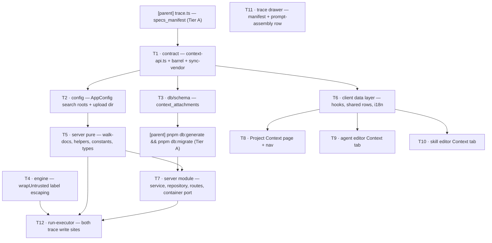

# Plan 07 — Project Context

**Modules:** server · client · reviewer-core   **Created:** 2026-08-25   **Status:** draft
**Spec:** SPEC-01 — [`server/specs/SPEC-01-project-context.md`](../../server/specs/SPEC-01-project-context.md)

## 1. Goal

Wire the four unwired ends the spec names — the dead `SpecFile`/`IndexStatus` contracts, the dead
`useContextFiles`/`useReindexContext` hooks, the unconsumed `client/messages/en/context.json`
namespace, and the engine's `specs?: string[]` slot that no caller ever populates — into one
feature: a Project Context page that lists every `.md` document the server can find in a repository,
a `Context` tab on the agent and skill editors that attaches those documents in a user-controlled
order, and a run that reads the attached text at execution time, sends it under the existing
`## Project context` heading as delimiter-wrapped untrusted data, and records what it read in the
run trace.

Manual selection only. No embedding index, no coverage score, no LLM call anywhere on this path,
no truncation, no budget.

## 2. Requirements

Every `AC-n` of SPEC-01 becomes exactly one `REQ-n` with the same number, so `AC-7` is `REQ-7` and
the traceability chain reads straight through. `NFR-1..NFR-9` follow as `REQ-37..REQ-45`. `REQ-46`
carries the spec's negative requirements — the "artistic licence — do not implement" list — which
are binding and which no `AC` states, so without a `REQ` no verification step would walk them.

All 46 are **supplied**: they restate a ratified spec, and none was invented here.

| ID | Statement (one testable sentence) | Source |
|---|---|---|
| REQ-1 | The document list contains every `.md` file found by recursively walking each configured search root that has an ancestor directory named `specs`, `docs` or `insights`, each shown with its repository-relative path — and, for the selected document, a type badge equal to the nearest such ancestor's name — the restriction being applied by the walk and never derived from the configured root value. | SPEC-01 AC-1 |
| REQ-2 | The server computes each document's estimated token count as `ceil(characterCount / 4)` and the client renders it as the count followed by a bare `t` suffix (e.g. `101t`) — no unit word, no approximation sign — which is the convention every token count in the studio follows. | SPEC-01 AC-2 |
| REQ-3 | Selecting a document row renders that document's markdown in the preview pane, and the file's bytes and modification time on disk are unchanged afterwards. | SPEC-01 AC-3 |
| REQ-4 | An uploaded `.md` file is stored under `~/.devdigest/context/<workspaceId>/<repoId>/`, is listed thereafter with the same fields as a discovered document, and `git status` inside the repository checkout reports no new or modified file as a result. | SPEC-01 AC-4 |
| REQ-5 | Activating the refresh control re-walks the search roots and updates the list, and the page footer states the number of documents currently listed, the summed REQ-2 estimate across that listing, and how long ago the listing was last refreshed. | SPEC-01 AC-5 |
| REQ-6 | A document's estimated token count appears using AC-2's value and its `t` suffix — in both `Context` tabs on that document's own row, and on the Project Context page for the selected document — distinct from and in addition to the summed footer estimates of REQ-5 and REQ-15. | SPEC-01 AC-6 |
| REQ-7 | The Project Context page carries, for the selected document, a `Used by N agents` chip where N is the number of workspace agents reaching that document under REQ-18's traversal with the `skills.enabled` filter removed — counting disabled agents, counting each agent exactly once — plus, where some of those N reach it only through a disabled skill, a parenthetical of the form `Used by 3 agents (1 via a disabled skill)` that breaks N down and is never added to it. | SPEC-01 AC-7 |
| REQ-8 | A document larger than 400 KB on disk is listed and marked as oversized — on the Project Context page when it is selected, and in both `Context` tabs on its own row — and any request to attach it is rejected with a `422` naming that path. | SPEC-01 AC-8 |
| REQ-9 | Reaching the 5 000-candidate-file bound before the search roots are exhausted stops the walk, and the page states that the listing was bounded and names the bound (e.g. `Showing the first 5,000 files — the walk was bounded.`). | SPEC-01 AC-9 |
| REQ-10 | Checking a document in a `Context` tab persists that document's repository-relative path, its integer position and the `repo_id` of the repository it was listed from, and persists no part of the document's text. | SPEC-01 AC-10 |
| REQ-11 | Drag-reordering an attached row persists the new positions such that a subsequent load returns the rows in that order. | SPEC-01 AC-11 |
| REQ-12 | A checkbox toggle or a post-drag drop issues the persisting write without any further user action, and neither `Context` tab presents a Save control. | SPEC-01 AC-12 |
| REQ-13 | Toggles or drops less than 400 ms apart coalesce into a single write carrying the complete ordered attachment set for that owner, and when two writes for one owner are in flight the later-issued one is applied and the earlier response is discarded. | SPEC-01 AC-13 |
| REQ-14 | While a `Context` tab is open every row stays at the index it occupied when the tab was opened, both when a checkbox is toggled and when a persisting write responds. | SPEC-01 AC-14 |
| REQ-15 | The attached count renders as `<n> of <total> attached` and the footer token estimate equals the sum of the estimates of the attached documents only. | SPEC-01 AC-15 |
| REQ-16 | When the summed estimate of an agent's attached documents exceeds 25% of that agent's model's `contextLength`, a warning stating the estimate and the window size is displayed, and it alters neither the attachment set, nor the assembled prompt, nor the run's ability to start. | SPEC-01 AC-16 |
| REQ-17 | A string entered in the `Filter documents…` box shows only rows whose repository-relative path contains that string case-insensitively, and changes no document's attached state. | SPEC-01 AC-17 |
| REQ-18 | An agent's effective document list resolves as the agent's own attachments in stored position order, followed by the attachments of each **enabled** linked skill in `agent_skills.order`, restricted to attachments whose `repo_id` equals the repository under review, de-duplicated by path with the earliest occurrence retained. | SPEC-01 AC-18 |
| REQ-19 | The skill editor's `SERIALIZES AS` preview displays the block heading `## Project context`. | SPEC-01 AC-19 |
| REQ-20 | A review run for an agent with a non-empty effective document list reads each document's current text from disk at that moment and passes the texts, in effective order, to the review engine's `specs` input. | SPEC-01 AC-20 |
| REQ-21 | The assembled block renders under the heading `## Project context`, each document enclosed in its own `<untrusted source="…">…</untrusted>` delimiter pair with a `### <repository-relative path>` line as the first line inside that pair. | SPEC-01 AC-21 |
| REQ-22 | A `"` character or the literal sequence `</untrusted>` in a document's path or body is escaped such that the assembled block contains exactly one opening and one closing `untrusted` delimiter per attached document. | SPEC-01 AC-22 |
| REQ-23 | An attached document that cannot be read at run time is omitted from the assembled block, the run completes, and that document's path is recorded in the run trace with status `missing`, so the trace differs from that of a run that never had the attachment. | SPEC-01 AC-23 |
| REQ-24 | A model-provider rejection for exceeding its prompt limit persists the run with status `failed` and the provider's own error text as the run error. | SPEC-01 AC-24 |
| REQ-25 | No LLM completion and no embedding request is issued on the discovery, token-estimation, attachment or context-assembly paths. | SPEC-01 AC-25 |
| REQ-26 | The run trace's `specs_read` records the repository-relative path of every document read for that run, in effective order. | SPEC-01 AC-26 |
| REQ-27 | Every document in an agent's effective document list gets a manifest entry carrying its path, its status (`read` or `missing`) and, for a read document, the SHA-256 of the exact bytes sent; a persisted trace whose run had a non-empty effective list and whose `specs_manifest` is absent, `null` or empty is a defect, the key being `.nullish()` solely so pre-existing traces keep parsing. | SPEC-01 AC-27 |
| REQ-28 | Opening a completed run's trace drawer for a run with a non-empty effective document list shows a `Prompt assembly` row whose expanded content is byte-identical to the run trace's `prompt_assembly.specs` value. | SPEC-01 AC-28 |
| REQ-29 | Opening a completed run's trace drawer for a run whose manifest contains at least one `missing` entry displays those paths in the `Configuration` block, visually distinguished from the documents that were read. | SPEC-01 AC-29 |
| REQ-30 | An absolute path resolved from a stored attachment path or an upload target that does not lie under that repository's clone directory or under the upload directory causes the operation to be refused with an error and the file not to be opened, the comparison being made on the resolved path and never on the stored string. | SPEC-01 AC-30 |
| REQ-31 | A file submitted through the upload control is accepted only if its name ends in `.md` and its size is within the 400 KB bound, its stored filename is derived with `path.basename` rather than used verbatim, and it is written only under `~/.devdigest/context/<workspaceId>/<repoId>/`. | SPEC-01 AC-31 |
| REQ-32 | The preview pane renders a document as markdown with raw HTML suppressed rather than parsed, and emits no link or image whose URL scheme is `javascript:` or `data:`. | SPEC-01 AC-32 |
| REQ-33 | The expanded `Prompt assembly` row renders the assembled text as preformatted text — the treatment `PromptBlock`/`PromptModalBody` already give the diff and the PR description — and never as markdown or HTML. | SPEC-01 AC-33 |
| REQ-34 | A document list that is being fetched, is empty, or has failed to load renders respectively a loading indicator whose text ends with `…`, a named empty state, or an error message stating both the failure and the next step, and an empty list is never rendered as if it were populated. | SPEC-01 AC-34 |
| REQ-35 | A failed persisting write displays an error naming the failure and restores the displayed attachment state to the last state the server acknowledged. | SPEC-01 AC-35 |
| REQ-36 | Every icon-only control introduced by this feature has an accessible name, and drag-reordering has a keyboard-operable alternative producing the same stored order as REQ-11. | SPEC-01 AC-36 |
| REQ-37 | The walk reuses the bounded-walk shape of `server/src/modules/repo-intel/pipeline/walk.ts` — excluded directories, a per-file size bound, a hard file-count bound, forward-slash-normalised relative paths, a stable alphabetical sort — and a search root is a repository-relative directory prefix, carried in `AppConfig` as a list defaulting to `['.']`, resolved against that repository's `AppConfig.cloneDir` and refused rather than walked when it resolves outside it. | SPEC-01 NFR-1 |
| REQ-38 | The token estimate is computed with the existing `approxTokensForLength`, cached per (path, size, mtime) and recomputed only when that triple changes, with no tokenizer library loaded on this path. | SPEC-01 NFR-2 |
| REQ-39 | Attaching documents adds zero model calls and at most one filesystem read plus one SHA-256 over the read bytes per attached document per run. | SPEC-01 NFR-3 |
| REQ-40 | The per-document bound is a fixed 400 KB that is not configurable and adds no config key, and the walk stops after 5 000 candidate files. | SPEC-01 NFR-4 |
| REQ-41 | Autosave uses a 400 ms trailing debounce per owner; each write is a replace-set carrying the complete ordered list of attached paths for that owner; the response body is not applied to the rendered rows; and a pending write flushes on unmount. | SPEC-01 NFR-5 |
| REQ-42 | The context-window warning fires above 25% of the agent model's `contextLength` read from the value the client already carries, and a null or unknown `contextLength` shows no warning and changes nothing else. | SPEC-01 NFR-6 |
| REQ-43 | Every icon-only control carries an `aria-label`, decorative icons carry `aria-hidden="true"`, the filter input has a `<label>` or `aria-label`, the REQ-16 warning and the REQ-35 failure notice are announced with `aria-live="polite"`, focus is visible via `:focus-visible` on every new interactive element, and every `vendor/ui` `Toggle`/`Checkbox` introduced is passed an explicit `ariaLabel`. | SPEC-01 NFR-7 |
| REQ-44 | The `specs` slot's `chars` and `tokens` are logged and its text never is, and the REQ-27 manifest may be logged in full. | SPEC-01 NFR-8 |
| REQ-45 | New wire shapes live in a new file under `vendor/shared/contracts/` with the vendored client copy regenerated by `./scripts/sync-vendor.sh` in the same change, and the one edit to an existing contract is REQ-27's `specs_manifest` key on `RunTrace`, added `.nullish()` so no stored trace stops parsing. | SPEC-01 NFR-9 |
| REQ-46 | None of the following is rendered or emitted: the `Edit` toggle, the `+` (new document) button, the new-folder button, the `COVERAGE 78` ring, the `· 1,240 chunks` footer fragment, or the heading `## Project specifications`; the heading is `## Project context`, and the trace's prompt-assembly rows render `## Repo skeleton` before `## Project context`, following the engine rather than mockup 4. | SPEC-01 § Design review — "artistic licence — do not implement" |

### Design decisions taken by the owner (2026-08-25) — no longer latitude

The spec's `## Design review` → "What the design does not decide (left open)" named three items and
carried them as implementer latitude. **The owner has since decided all three**, before wave 3, so
that T8/T9/T10 cannot each choose independently and disagree. These are now binding on those tasks
and are **not** to be re-raised as questions:

1. **The document list renders as a flat sorted path list**, not a nested folder tree. One level,
   stable alphabetical sort by full repository-relative path, filename emphasised with the folder
   path dimmed beside it. This is deliberately the same row anatomy the two `Context` tabs use, so
   one row component serves all three screens.
2. **The `Preview` affordance follows the mockups as drawn**: a labelled `Preview` button in the
   agent editor's `Context` tab, an eye icon in the skill editor's `Context` tab. The eye icon
   carries an `aria-label` per REQ-43/NFR-7.
3. **The oversized (REQ-8), over-window warning (REQ-16) and `missing` (REQ-29) states reuse the
   existing `vendor/ui` primitives** — a dimmed row with a badge for oversized, the stock warning
   callout for the over-window notice, and warning-coloured text for `missing` paths in the trace
   drawer. No new styles are introduced for them.

## 3. Insights consulted

Read in full for this plan: `server/INSIGHTS.md` (205 lines), `client/INSIGHTS.md` (167 lines),
`reviewer-core/INSIGHTS.md` (15 lines). The entries that bind this change, with the task each is
pushed down into:

| Module | Date | Entry | Binds |
|---|---|---|---|
| server | 2026-08-25 | A runtime guarantee parked in an optional helper silently never runs — `buildRunTrace` had zero importers; the validate-before-persist now lives at the write chokepoint `saveRunTrace` in `repository/run.repo.ts`. | P1, T12 |
| server | 2026-08-23 | A red `.it` lane is usually Testcontainers contention, not a regression; never run two `.it` invocations concurrently. | T7, T12, §6 |
| server | 2026-08-22 | A Zod contract edit that passes BOTH typechecks can still break every fixture — `server/test/**` is not in `tsconfig` `include` and `.parse()` takes `unknown`. A contract edit's done condition must run `pnpm exec vitest run --exclude '**/*.it.test.ts'`. | P1, T1 |
| server | 2026-08-17 | `.` does not match `\r`, so `split('\n')` silently breaks every CRLF file — split on `/\r?\n/` anywhere you parse file output line-wise. | T5, T12 |
| server | 2026-08-17 | `git.readFile` **throws** ENOENT for a missing file; only the mock returns `''`. Every optional read must be `try`/`catch`ed. | T5, T7, T12 |
| server | 2026-08-17 | `drizzle-kit generate`'s rename prompt cannot be answered non-interactively on Windows; a purely additive migration generates in one shot. | T3, P2 |
| server | 2026-08-16 | `run_traces` is ONE jsonb document with **snake_case** keys inside — it is the wire contract verbatim; `t.runTraces.promptAssembly` silently yields `undefined`. | P1, T12 |
| server | 2026-08-16 | Widening a contract enum takes 3 edits, never 1: the Zod enum, the matching Drizzle `text(col, { enum: [...] })`, and `./scripts/sync-vendor.sh`. | T1, T3 |
| server | 2026-08-15 | `Container` structurally satisfies a per-service `Deps` interface — `new XService(app.container)` still compiles with no container change. | T7 |
| server | 2026-08-21 | Secrets have two sources, so an `.it` test is not hermetic by default — use `hermeticOverrides()` from `server/test/helpers/overrides.ts`. | T7, T12 |
| server | 2026-08-09 | DB-backed tests need the `*.it.test.ts` suffix; migrations do not run on boot. | T3, T7, T12, P2 |
| client | 2026-08-16 | Row order that outlives a checkbox must be **client-held**, not re-derived — `SkillsTab` freezes row order in state at the first edit. | T6, T9, T10 |
| client | 2026-08-16 | HTML5 drag reorder: keep the dragged id in a **`useRef`**, not just state — `dragover` is a continuous-priority event and can read a stale `useState`. | T6, T9, T10 |
| client | 2026-08-16 | `vendor/ui` `Toggle` and `Checkbox` render a `<button role="…">` and are **not** named by a wrapping `<label>` — pass `ariaLabel` explicitly. | T6, T8, T9, T10 |
| client | 2026-08-17 | A `dragover` handler that returns before `preventDefault()` eats the drop silently; jsdom cannot catch it. Always `preventDefault()` on every potential target. | T9, T10 |
| client | 2026-08-17 | HTML5 drag sources: `setData` is mandatory and a `<button>` handle is not a source — a grip button needs its own `draggable` + `dragstart` + `setDragImage(row)`. | T9, T10 |
| client | 2026-08-25 | A hook's `isError` branch does **not** cover a malformed payload — `api.get<T>()` is a plain cast with no runtime parse; wrap such cards in `components/error-boundary` or validate in the hook. | T6, T8 |
| client | 2026-08-17 | `AppFrame`'s `<main>` has **no** padding — every page supplies its own container (`padding: "24px 32px 44px", maxWidth: 1100, margin: "0 auto"`). | T8 |
| client | 2026-08-17 | `FormField required` folds the `*` into the label's accessible name — match a prefix in tests. | T9, T10 |
| client | 2026-08-18 | Never run `pnpm build` in `client/` while `pnpm dev` is running. | all client tasks |
| client | 2026-08-09 | All server data flows through `lib/hooks/*` → `lib/api.ts`; a `fetch` inside a component is a defect. Tests mock the hook boundary, not global `fetch`. | T6, T8, T9, T10, T11 |
| reviewer-core | 2026-08-09 | The build **is** a typecheck; the package never emits JS. Don't add keyword scanning for prompt injection — the defense is the single `INJECTION_GUARD` rule. | T4 |

## 4. Contract changes

Two edits, and NFR-9 (REQ-45) is explicit that a contract change is three edits, never one.

1. **New file — `server/src/vendor/shared/contracts/context-api.ts`** (T1), plus its one export
   line in `server/src/vendor/shared/index.ts`, following the `blast-api.ts` / `lookup-api.ts`
   precedent. `SpecFile` and `IndexStatus` in `contracts/platform.ts` are **reused, not
   re-declared, and not edited**.
2. **`specs_manifest` on `RunTrace` — `server/src/vendor/shared/contracts/trace.ts`.** This is an
   **existing** file under `vendor/shared/contracts/**`, i.e. a **Tier A** path, so it is *not* an
   implementer task. It is the serialized `[parent session]` step **P1** at the head of wave 0.
   The key cannot live in a sibling file because it is a field of one jsonb document (spec,
   `## Module interactions`), and it is added `.nullish()` on exactly the `cost_usd`/`RunStats`
   precedent at `contracts/trace.ts:69-71` so every stored `run_traces` row keeps parsing.
3. **`./scripts/sync-vendor.sh`** regenerates `client/src/vendor/shared/**`. It is not an owned
   path — it is generated output, and running the script is literally the contract lane's
   done-condition command in `docs/plans/README.md`. T1 runs it once, after P1 has landed, so one
   sync carries both edits across.

## 5. Architecture



The one non-obvious edge: **`run-executor` reaches document resolution through a port on the
container**, never by importing `modules/context` — `modules/**` may not import another module
(onion §2 rule 2), and `container.repoIntel` is the existing precedent. T5 declares the port
interface in `modules/context/types.ts`; T7 implements it and wires it into `platform/container.ts`;
T12 consumes `container.contextDocs`.

The second: **there are two trace write sites, not one.** `run-executor.ts:436-466` (the completed
run, persisted by `saveRunTrace` at `:467`) is the only site REQ-26 and REQ-27 govern.
`traceFromBuffer` at `:597-626` — the cancelled and error paths, called at `:109` and `:492` — keeps
`specs_read: []` and carries no manifest. `server/src/platform/trace-builder.ts` has **no importers**
and is deleted in the working tree; **no task targets it.**

## 6. Task graph

**Execution mode:** multi-agent

### Waves

| Wave | Tasks | Lane(s) | Parallel? |
|---|---|---|---|
| — | `[parent session]` **P1** — Tier A contract edit | — | serialized, before wave 0 |
| 0 | T1 | contract | **no** — serialized; commit-equivalent point before wave 1 |
| 1 | T2, T3, T4 | backend, backend/db, engine | yes (3-up) |
| — | `[parent session]` **P2** — Tier A migration generate + apply | — | serialized, between wave 1 and wave 2 |
| 2 | T5, T6 | backend, frontend | yes (2-up) |
| 3 | T7, T8, T9, T10, T11 | backend, frontend ×4 | yes (5-up) |
| 4 | T12 | backend | **no** — sole task |

### Parent-session steps (Tier A — never an implementer task)

- **P1 — before wave 0.** Add to `server/src/vendor/shared/contracts/trace.ts`:
  `SpecManifestEntry = z.object({ path: z.string(), status: z.enum(['read','missing']), sha256: z.string().nullable(), chars: z.number().int().nullable() })`
  and `specs_manifest: z.array(SpecManifestEntry).nullish()` on `RunTrace`. Nothing else in that
  file changes. Replacement action for the Tier A row "existing files under
  `vendor/shared/contracts/**`", which the spec's NFR-9 names as the one unavoidable such edit.
  Verify with `cd server && pnpm typecheck && pnpm exec vitest run --exclude '**/*.it.test.ts'` —
  `server/test/contracts.test.ts` parses a `RunTrace` fixture and `server/test/` is outside
  `tsconfig`'s `include`, so typecheck alone would not see a break (`server/INSIGHTS.md`,
  2026-08-22).
- **P2 — between wave 1 and wave 2.** `cd server && pnpm db:generate && pnpm db:migrate`.
  Replacement action for the Tier A row `server/src/db/migrations/**`. T3's change is **purely
  additive** (one new table, no dropped column), which per `server/INSIGHTS.md`, 2026-08-17 is
  exactly the shape that generates non-interactively on Windows in one shot.

### Requirement → Task coverage matrix

| REQ | T1 | T2 | T3 | T4 | T5 | T6 | T7 | T8 | T9 | T10 | T11 | T12 |
|---|---|---|---|---|---|---|---|---|---|---|---|---|
| REQ-1 | | | | | x | | | x | | | | |
| REQ-2 | | | | | x | | | x | | | | |
| REQ-3 | | | | | | | x | x | | | | |
| REQ-4 | | | | | | | x | | | | | |
| REQ-5 | | | | | | | x | x | | | | |
| REQ-6 | | | | | | | | x | x | x | | |
| REQ-7 | | | | | | | x | x | | | | |
| REQ-8 | | | | | x | | | x | | | | |
| REQ-9 | | | | | x | | | x | | | | |
| REQ-10 | | | x | | | | x | | | | | |
| REQ-11 | | | | | | | x | | x | x | | |
| REQ-12 | | | | | | | x | | x | x | | |
| REQ-13 | | | | | | x | x | | | | | |
| REQ-14 | | | | | | | | | x | x | | |
| REQ-15 | | | | | | | | | x | x | | |
| REQ-16 | | | | | | | | | x | | | |
| REQ-17 | | | | | | | | | x | | | |
| REQ-18 | | | | | | | x | | | | | |
| REQ-19 | | | | | | | | | | x | | |
| REQ-20 | | | | | | | | | | | | x |
| REQ-21 | | | | | x | | | | | | | x |
| REQ-22 | | | | x | | | | | | | | |
| REQ-23 | | | | | | | | | | | | x |
| REQ-24 | | | | | | | | | | | | x |
| REQ-25 | | | | | | | x | | | | | x |
| REQ-26 | | | | | | | | | | | | x |
| REQ-27 | | | | | | | | | | | | x |
| REQ-28 | | | | | | | | | | | x | |
| REQ-29 | | | | | | | | | | | x | |
| REQ-30 | | | | | x | | x | | | | | |
| REQ-31 | | | | | | | x | | | | | |
| REQ-32 | | | | | | | | x | | | | |
| REQ-33 | | | | | | | | | | | x | |
| REQ-34 | | | | | | | | x | x | x | | |
| REQ-35 | | | | | | x | | | x | | | |
| REQ-36 | | | | | | | | x | x | x | | |
| REQ-37 | | x | | | x | | | | | | | |
| REQ-38 | | | | | x | | | | | | | |
| REQ-39 | | | | | | | | | | | | x |
| REQ-40 | | x | | | x | | | | | | | |
| REQ-41 | | | | | | x | | | | | | |
| REQ-42 | | | | | | | | | x | | | |
| REQ-43 | | | | | | | | x | x | x | | |
| REQ-44 | | | | | | | | | | | | x |
| REQ-45 | x | | | | | | | | | | | |
| REQ-46 | | | | x | | | | x | x | x | x | |

### Checks

- **Coverage.** All 46 requirements appear in at least one task's `Acceptance`. No empty row, no
  empty column.
- **Disjointness — verified per wave.** The union of `Owned paths` within each wave has no repeats:
  - *Wave 0*: T1 alone.
  - *Wave 1*: `server/src/platform/config.ts` (T2) · `server/src/db/schema/context.ts` (T3) ·
    `reviewer-core/src/prompt.ts` (T4) — three packages/files, plus three distinct new test files.
  - *Wave 2*: `server/src/modules/context/{constants,types,helpers}.ts` + `pipeline/walk-docs.ts`
    (T5) · `client/src/lib/**` + `client/src/components/context-docs/**` +
    `client/messages/en/context.json` (T6). No overlap.
  - *Wave 3*: T7 owns only `server/src/modules/context/{service,repository,routes}.ts`,
    `server/src/modules/index.ts`, `server/src/platform/container.ts` and two new server tests —
    **disjoint from T5's wave-2 files**. T8/T9/T10/T11 own four non-overlapping client subtrees and
    four different i18n namespaces (`context.json` is T6's from wave 2 and is read-only in wave 3;
    `agents.json` is T9's, `skills.json` is T10's, `runs.json` is T11's).
  - *Wave 4*: T12 alone.
- **Files two tasks would otherwise both want — each pinned to exactly one owner.**
  `server/src/modules/reviews/run-executor.ts` → **T12 only.**
  `client/messages/en/context.json` → **T6 only** (T8/T9/T10 read it; T6 writes every key the three
  of them need, up front). `server/src/modules/index.ts` and `server/src/platform/container.ts` →
  **T7 only.** `client/src/lib/hooks/core.ts` → **T6 only.**
  `server/src/vendor/shared/contracts/trace.ts` → **P1 only** (Tier A, parent session).
  `client/src/components/context-docs/**`, the row/badge/estimate primitives all three client
  surfaces render → **T6 only**, promoted to `src/components/` on the second consumer rule with
  three consumers known by construction.
  `server/src/modules/context/types.ts` → **T5 only**; T5 declares the `ContextDocs` port interface
  there even though T7 implements it, so T7 never needs to own the file.
- **Exclusivity (Tier B).** None — this plan touches no `.claude/**` path.
- **Tier A work.** Two `[parent session]` steps, P1 and P2, listed above.
  `server/src/vendor/shared/index.ts` was checked against the Tier A row and is **not** covered by
  it: the row scopes to "existing files under `server/src/vendor/shared/contracts/**`", and adding
  an export line for a new contract file is precisely the "extends it with new files" the row
  prescribes — the same edit `blast-api.ts` and `lookup-api.ts` already made.
- **`.it` lane serialization.** Only T7 (wave 3) and T12 (wave 4) own `*.it.test.ts` files, and
  they are in different waves, so no two `.it` invocations ever run concurrently
  (`server/INSIGHTS.md`, 2026-08-23).

## 7. Tasks

### T1 — Contract: `context-api.ts` and the barrel export
**Wave:** 0 · **Parallel:** no · **Lane:** contract · **Ring:** R0 · **Depends on:** `[parent session]` P1
**Implements:** REQ-45

**Owned paths (exclusive — no other task may name these):**
- `server/src/vendor/shared/contracts/context-api.ts` (new)
- `server/src/vendor/shared/index.ts` (edit — one export line)

**May read:** `server/src/vendor/shared/contracts/platform.ts` (`SpecFile`, `IndexStatus` at
`:281`/`:289` — reuse, never re-declare), `server/src/vendor/shared/contracts/blast-api.ts`,
`server/src/vendor/shared/contracts/lookup-api.ts`, `server/src/vendor/shared/contracts/trace.ts`
(P1's edit), `server/specs/SPEC-01-project-context.md` § "Inputs and provenance"

**Skills (mandatory — these govern this task):** `zod`, plus `onion-architecture`'s R0 rule —
contracts import `zod` and nothing else, ever

**Binding insights:**
- `server/INSIGHTS.md` `2026-08-22` — a Zod contract edit that passes BOTH typechecks can still
  break every fixture: `server/test/**` is not in `tsconfig`'s `include` and `.parse()` takes
  `unknown`, so the hermetic vitest run is the only thing that sees it
- `server/INSIGHTS.md` `2026-08-16` — a contract change is three edits, never one; the third is
  `./scripts/sync-vendor.sh`
- `server/INSIGHTS.md` `2026-08-17` — fields stay **required**; `.nullish()` (nullable *and*
  optional) is fine, `.default()` is not — OpenAI `strict: true` rejects optional-without-nullable

**Do:** Add one new contract file carrying every wire shape this feature introduces, and one export
line for it in the barrel. Cover: the document type badge enum (`specs` | `docs` | `insights`); a
listed document (repository-relative path, type, size in bytes, mtime, token estimate, an
`oversized` flag for REQ-8, a `repo` | `upload` source, and the REQ-7 chip's count plus its
disabled-skill-only breakdown as two integers so the client never re-derives the parenthetical); the
list response (documents, total, and REQ-9's bounded flag with the bound itself so the copy can name
it); a preview response; the **replace-set** attachment request (a `repo_id` uuid plus the complete
ordered array of paths — never a partial diff, NFR-5) and its response; and the upload request
(filename plus the file's text as a string — the server has **no** multipart plugin and this feature
does not add one; Fastify's `bodyLimit` is already 1 MB at `app.ts:49`, comfortably above the 400 KB
per-document bound). Then run the done condition, which regenerates the client mirror.

**Acceptance:**
- [ ] REQ-45 — `server/src/vendor/shared/contracts/context-api.ts` exists, imports `zod` and
      nothing else, and is exported from `server/src/vendor/shared/index.ts`; `SpecFile` and
      `IndexStatus` are imported from `contracts/platform.ts` where reused and are **not**
      re-declared, and no existing contract file was edited by this task
- [ ] REQ-45 — `./scripts/sync-vendor.sh --check` exits 0, so `client/src/vendor/shared/` carries
      both this new file and P1's `specs_manifest` key
- [ ] REQ-45 — `RunTrace` in the vendored tree now parses a trace carrying `specs_manifest` **and**
      one that omits it entirely; verified by `cd server && pnpm exec vitest run --exclude '**/*.it.test.ts'`
      exiting 0 with `server/test/contracts.test.ts` green

**Red flags (stop if you are about to do any of these):**
- [ ] importing anything other than `zod` into `contracts/context-api.ts`
- [ ] editing `contracts/platform.ts`, `contracts/trace.ts`, or any other existing file under
      `contracts/**` — Tier A, and P1 already made the only permitted edit
- [ ] hand-editing `client/src/vendor/shared/**` instead of letting `sync-vendor.sh` write it
- [ ] giving a request field a `.default()` — it masks a missing field in real calls and is
      rejected under OpenAI `strict: true`
- [ ] putting a Drizzle row type, a `Date`, or a class into a contract
- [ ] declaring the upload body as anything requiring a multipart parser

**Inner loop:** none — the contract lane owns no test file of its own; run the done condition directly

**Done condition:** `./scripts/sync-vendor.sh && ./scripts/sync-vendor.sh --check && cd server && pnpm typecheck && cd ../client && pnpm typecheck`

---

### T2 — `AppConfig`: search roots and the upload directory
**Wave:** 1 · **Parallel:** yes · **Lane:** backend · **Ring:** R1 · **Depends on:** T1
**Implements:** REQ-37, REQ-40

**Owned paths (exclusive):**
- `server/src/platform/config.ts` (edit)
- `server/test/context-config.test.ts` (new)

**May read:** `server/src/modules/repo-intel/constants.ts` (`MAX_FILE_SIZE`, `MAX_INDEXED_FILES`),
`server/specs/SPEC-01-project-context.md` § NFR-1, NFR-4 and the "Search roots" / "Upload directory"
rows of § "Inputs and provenance"

**Skills (mandatory):** `onion-architecture`, `fastify-best-practices`, `zod`, `typescript-expert`,
`security`

**Binding insights:**
- `server/INSIGHTS.md` `2026-08-16` — `pnpm typecheck` is green on `main`; treat **any** error as
  yours, not pre-existing
- `server/INSIGHTS.md` `2026-08-21` — secrets have two sources (`~/.devdigest/secrets.json` **and**
  `process.env` via `dotenv/config`); `config.ts` is the env boundary and secrets never enter
  `AppConfig`

**Do:** Extend `AppConfig` with two fields and parse them in `loadConfig`. `contextSearchRoots:
string[]` — a list of **repository-relative directory prefixes**, never globs and never absolute
paths, defaulting to `['.']` (the clone root) so the feature works with zero operator configuration;
parse from one new env var, splitting on commas and trimming. `contextUploadDir: string` — an
absolute path defaulting to `join(homedir(), '.devdigest', 'context')`, a **sibling** of the default
`cloneDir`, deliberately outside every git checkout. Follow the existing `cloneDir` idiom at
`config.ts:74-77` for absolute-vs-relative resolution. Add **no** config key for the 400 KB bound or
the 5 000-file bound — NFR-4 says both are fixed and non-configurable.

**Acceptance:**
- [ ] REQ-37 — `loadConfig({})` returns `contextSearchRoots` equal to `['.']`, and a configured
      comma-separated value parses into a trimmed list of repository-relative prefixes
- [ ] REQ-37 — an absolute path or a glob supplied as a root is documented in the field's JSDoc as
      unsupported; resolution and containment enforcement live in T5's helper, not here
- [ ] REQ-37 — `contextUploadDir` defaults to an absolute path under `~/.devdigest/context` and is
      **not** under `cloneDir`
- [ ] REQ-40 — `grep` over `config.ts` shows no new key for the 400 KB per-document bound or the
      5 000-file walk bound

**Red flags:**
- [ ] adding a config key for `MAX_FILE_SIZE` or `MAX_INDEXED_FILES` — NFR-4 fixes both
- [ ] resolving a search root against `cloneDir` here — `config.ts` parses env, it does not touch
      the filesystem, and per-repository resolution is T5's
- [ ] putting the upload directory *inside* `cloneDir` — `GitClient.sync` advances the working tree
      and would clobber it, and it would dirty the user's `git status`
- [ ] reading `process.env` anywhere outside this file and `adapters/secrets/local.ts`
- [ ] letting a secret or a key reach `AppConfig`

**Inner loop:** `cd server && pnpm exec vitest run test/context-config.test.ts --reporter=dot --silent`

**Done condition:** `cd server && pnpm typecheck && pnpm exec vitest run --exclude '**/*.it.test.ts'`

---

### T3 — DB schema: the `context_attachments` table
**Wave:** 1 · **Parallel:** yes · **Lane:** backend · **Ring:** R4 · **Depends on:** T1
**Implements:** REQ-10

**Owned paths (exclusive):**
- `server/src/db/schema/context.ts` (edit — append one table)
- `server/test/context-schema.test.ts` (new)

**May read:** `server/src/db/schema/agents.ts` (`agents`, `agentSkills`), `server/src/db/schema/skills.ts`,
`server/src/db/schema/repos.ts`, `server/src/db/schema/core.ts`, `server/src/db/schema/_shared.ts`
(`now()`), `server/src/db/schema.ts` (the barrel already re-exports `./schema/context`)

**Skills (mandatory):** `onion-architecture`, `drizzle-orm-patterns`, `postgresql-table-design`,
`typescript-expert`

**Binding insights:**
- `server/INSIGHTS.md` `2026-08-17` — `drizzle-kit generate`'s rename prompt cannot be answered
  non-interactively on Windows; a **purely additive** change (no dropped column) generates in one
  shot, which is why this task adds a table and drops nothing
- `server/INSIGHTS.md` `2026-08-16` — a value added to a Zod enum must also be added to the matching
  Drizzle `text(col, { enum: [...] })`, or `$inferInsert` rejects it at the repository
- `server/INSIGHTS.md` `2026-08-09` — migrations are **not** run on boot; DB-backed tests need the
  `*.it.test.ts` suffix

**Do:** Append one table, `context_attachments`, to `server/src/db/schema/context.ts`. It carries
`workspace_id` (FK → `workspaces`, cascade — the tenancy rule the schema barrel states), `repo_id`
(FK → `repos`, cascade — REQ-10's scoping, and the spec's "Why an attachment carries `repo_id`"),
the repository-relative `path`, an integer `position`, and `created_at` via `now()`. Model the owner
as **two nullable FK columns** — `agent_id` (FK → `agents`, cascade) and `skill_id` (FK → `skills`,
cascade) — rather than a polymorphic `(owner_type, owner_id)` pair, so deleting an agent or a skill
cascades its attachments away instead of orphaning rows; add a `check()` that exactly one of the two
is non-null if `drizzle-orm@^0.38.3` exposes it, and otherwise enforce the invariant in T7's
repository and say so in a comment beside the table. Index the FK columns explicitly — Postgres does
not auto-index them — and add a unique index per owner on `(owner_fk, repo_id, path)` so one
document cannot be attached twice to one owner in one repository. **No text column**: REQ-10 says no
part of a document's body is persisted. Write nothing under `db/migrations/**`; P2 generates it.

**Acceptance:**
- [ ] REQ-10 — `contextAttachments` exists in `server/src/db/schema/context.ts` with columns for the
      repository-relative path, an integer position and `repo_id`, and **no** column holding
      document text or content
- [ ] REQ-10 — the owner is expressed as two nullable cascading FKs with an exactly-one-of
      invariant, each FK column explicitly indexed, plus a per-owner unique index on
      `(owner, repo_id, path)`
- [ ] REQ-10 — `server/test/context-schema.test.ts` asserts the column set by name, so a later
      rename fails a test rather than a migration
- [ ] `cd server && pnpm typecheck` exits 0 and `server/src/db/migrations/**` is untouched by this task

**Red flags:**
- [ ] writing or editing anything under `server/src/db/migrations/**` — Tier A, generated by P2
- [ ] running `pnpm db:generate` or `pnpm db:migrate` yourself — both are parent-session actions
      that mutate shared state
- [ ] adding a `content`, `body` or `text` column
- [ ] dropping or renaming any existing column in `schema/context.ts` — it would make P2's generate
      interactive and hang on Windows
- [ ] using `serial`, `varchar(n)`, `timestamp` (without time zone) or `money`
- [ ] relying on Postgres to index the FK columns for you

**Inner loop:** `cd server && pnpm exec vitest run test/context-schema.test.ts --reporter=dot --silent`

**Done condition:** `cd server && pnpm typecheck && pnpm exec vitest run --exclude '**/*.it.test.ts'`

---

### T4 — Engine: delimiter integrity for a repository-controlled label
**Wave:** 1 · **Parallel:** yes · **Lane:** engine · **Depends on:** none
**Implements:** REQ-22, REQ-46 (block-order half)

**Owned paths (exclusive):**
- `reviewer-core/src/prompt.ts` (edit)
- `reviewer-core/test/prompt-project-context.test.ts` (new)

**May read:** `reviewer-core/test/prompt.test.ts` (the existing suite — **read only, never edit**),
`reviewer-core/src/review/run.ts:60` (`ReviewInput.specs`),
`server/specs/SPEC-01-project-context.md` § "Untrusted inputs" ¶3 and § "Design review"

**Skills (mandatory):** `typescript-expert`, `zod`, `security` (this is a prompt-assembly and
injection path)

**Binding insights:**
- `reviewer-core/INSIGHTS.md` `2026-08-09` — the build **is** a typecheck; the package never emits
  JS, and a symbol a consumer cannot see must be exported from `index.ts`
- `reviewer-core/INSIGHTS.md` `2026-08-09` — do **not** add keyword scanning for prompt injection;
  the defense is the single `INJECTION_GUARD` rule and a denylist gives false comfort

**Do:** Close the real defect the spec names at `prompt.ts:30-34`. `wrapUntrusted` escapes
`</untrusted>` in the **content** but interpolates the **label** raw into
`<untrusted source="${label}">`. Every call site passes a server-authored constant today, so the gap
is unreachable — this feature makes it reachable by putting repository-controlled provenance on that
line, and the spec is explicit that the gap must close in the same change, not after. Escape the
label so a path such as `a" trusted="yes` cannot forge an attribute, keep the existing content
escaping, and change nothing else: `INJECTION_GUARD` is not edited, weakened or reordered, the
`specs` slot's public signature does not change, and `assemblePrompt`'s section order is untouched.
The new test file pins both the escaping and the fact that `## Repo skeleton` renders **before**
`## Project context` (REQ-46), so a later reordering toward mockup 4 fails a test.

**Acceptance:**
- [ ] REQ-22 — a label containing `"` produces exactly one `<untrusted source="…">` opening tag with
      no forged attribute, and content containing the literal `</untrusted>` still produces exactly
      one closing tag; asserted by counting occurrences of `<untrusted` and `</untrusted>` in the
      assembled user message
- [ ] REQ-22 — with two `specs` entries whose text and labels both contain `"` and `</untrusted>`,
      the assembled block contains exactly **two** opening and **two** closing `untrusted`
      delimiters
- [ ] REQ-46 — a prompt assembled with both `repoMap` and `specs` renders `## Repo skeleton` at a
      lower index than `## Project context` in the user message
- [ ] `assemblePrompt`'s existing behaviour is unchanged: `reviewer-core/test/prompt.test.ts` passes
      untouched, and a zero-`specs` run emits no `## Project context` section at all

**Red flags:**
- [ ] editing, weakening or reordering `INJECTION_GUARD` or `SCOPE_DIRECTIVE`
- [ ] adding keyword or denylist scanning for injection phrases
- [ ] editing `reviewer-core/test/prompt.test.ts` — it belongs to no task here
- [ ] changing `PromptParts.specs` or `ReviewInput.specs` from `string[]`, or changing the
      omit-when-empty contract that keeps a zero-attachment run byte-identical
- [ ] reaching for the filesystem, the database or HTTP from `reviewer-core` — the engine is pure
- [ ] emitting JS: the package is consumed as TypeScript source through a tsconfig path alias

**Inner loop:** `cd reviewer-core && npm exec -- vitest run test/prompt-project-context.test.ts --reporter=dot --silent`

**Done condition:** `cd reviewer-core && npm run typecheck && npm test`

---

### T5 — Server: the bounded document walk, path safety, and the block helper
**Wave:** 2 · **Parallel:** yes · **Lane:** backend · **Ring:** R2 · **Depends on:** T1, T2
**Implements:** REQ-1, REQ-2, REQ-8, REQ-9, REQ-21 (per-document string shape), REQ-30, REQ-37, REQ-38, REQ-40

**Owned paths (exclusive):**
- `server/src/modules/context/constants.ts` (new)
- `server/src/modules/context/types.ts` (new — includes the `ContextDocs` **port interface** T7 implements and T12 consumes)
- `server/src/modules/context/helpers.ts` (new)
- `server/src/modules/context/pipeline/walk-docs.ts` (new)
- `server/test/context-walk.test.ts` (new)
- `server/test/context-helpers.test.ts` (new)

**May read:** `server/src/modules/repo-intel/pipeline/walk.ts` (the shape to reuse),
`server/src/modules/repo-intel/constants.ts` (`EXCLUDED_DIRS`, `MAX_FILE_SIZE = 400 * 1024`,
`MAX_INDEXED_FILES = 5000`), `server/src/adapters/tokenizer/index.ts` (`approxTokensForLength`),
`server/src/platform/config.ts` (T2's fields), `server/src/vendor/shared/contracts/context-api.ts`,
`server/src/modules/repo-intel/types.ts` (the port-interface precedent),
`server/specs/SPEC-01-project-context.md` § NFR-1, NFR-2, NFR-4 and § "Untrusted inputs" ¶5

**Skills (mandatory):** `onion-architecture`, `fastify-best-practices`, `zod`, `typescript-expert`,
`security` (untrusted paths, path traversal)

**Binding insights:**
- `server/INSIGHTS.md` `2026-08-17` — `.` does not match `\r`, so `split('\n')` silently breaks
  every CRLF file; split on `/\r?\n/` anywhere you process file output line-wise
- `server/INSIGHTS.md` `2026-08-17` — `git.readFile` **throws** ENOENT for a missing file; only the
  mock returns `''`, so every optional read is `try`/`catch`ed or it passes every hermetic test and
  blows up on the first real clone
- `server/INSIGHTS.md` `2026-08-16` — `pnpm typecheck` is green on `main`; treat any error as yours

**Do:** Write the pure layer of the `context` module — no database, no `Container`, no Fastify. Four
files.

`pipeline/walk-docs.ts` reuses the shape of `repo-intel/pipeline/walk.ts` rather than importing it
(different extension set, different filter, and an adapter must stay feature-agnostic): recursive
`readdir` with `withFileTypes`, `EXCLUDED_DIRS` skipped, symlinks never followed, unreadable
directories skipped cleanly, forward-slash-normalised relative paths, a stable alphabetical sort,
per-file `stat` for size and mtime, and a hard 5 000-candidate bound that reports whether it
engaged. The extension filter is `.md`; the **ancestor filter** — the file must have a directory
named `specs`, `docs` or `insights` somewhere on its path from the repository root — is applied by
the walk itself and is derived from **nothing the operator configures** (REQ-1, and NFR-1's
load-bearing consequence: a root value decides only where the walk starts). A file over 400 KB is
**listed and flagged oversized**, not dropped — REQ-8 differs from repo-intel here, where oversized
files are skipped.

`helpers.ts` holds the pure transforms: the type badge (the name of the *nearest* `specs`/`docs`/
`insights` ancestor), the token estimate via `approxTokensForLength(chars)` behind a cache keyed on
`(path, size, mtime)`, the **resolved-path containment check** for REQ-30 (resolve first, then
compare prefixes against the clone directory and the upload directory — never string-match the
stored value, so `..` segments, absolute paths and escaping symlinks are all covered by the one
check), the search-root resolver that refuses a root resolving outside `cloneDir`, and the
per-document block string for REQ-21: `### <repository-relative path>` as the first line, then the
body verbatim, with CRLF preserved and never re-split.

`types.ts` declares the module's local types **and** the `ContextDocs` port interface the container
will expose — modelled on `modules/repo-intel/types.ts`, which is the precedent for a module service
reached across a module boundary through the container.

**Acceptance:**
- [ ] REQ-1 — over a fixture tree, the walk returns every `.md` file having a `specs`/`docs`/
      `insights` ancestor and **no** `.md` file lacking one, including when the configured root is
      `.` (the clone root); each result carries the forward-slash repository-relative path and a
      type badge equal to the *nearest* such ancestor's name
- [ ] REQ-2 / REQ-38 — the estimate equals `Math.ceil(chars / 4)` for a known fixture; a second call
      with an unchanged `(path, size, mtime)` triple does not recompute, and a changed mtime does;
      `js-tiktoken` is not imported by any file this task owns
- [ ] REQ-8 / REQ-40 — a 401 KB fixture is **present** in the result and flagged oversized; the
      bound is `400 * 1024` and comes from a constant, not a config value
- [ ] REQ-9 / REQ-40 — a tree of 5 001 candidates yields exactly 5 000 entries and a bounded flag
      that is true, and the bound value itself is reported so the client can name it
- [ ] REQ-30 — `../../etc/passwd`, an absolute path, and a symlink pointing outside the root are
      each refused by the containment check; a legitimate nested path under the clone directory and
      one under the upload directory are each accepted; the check operates on the **resolved** path
- [ ] REQ-37 — a search root resolving outside `cloneDir` is refused rather than walked, and a
      configured root that does not exist on disk is skipped (surfaced to the caller as skipped, not
      thrown) so neither fails the listing
- [ ] REQ-21 — the per-document block string starts with `### <path>` on its own first line and
      leaves the body byte-identical, CRLF included

**Red flags:**
- [ ] importing `drizzle-orm`, `db/schema*`, `platform/container`, or `fastify` into any R2 file
- [ ] importing `modules/repo-intel/**` — a cross-module import; copy the walk's *shape*, not its module
- [ ] deriving the `specs`/`docs`/`insights` restriction from a configured value instead of hard-coding
      it in the walk — NFR-1 makes this the difference between a misconfigured root and a widened surface
- [ ] `split('\n')` on any document body, or normalising line endings
- [ ] comparing the stored attachment string against a prefix instead of resolving it first
- [ ] skipping an oversized file instead of listing it flagged — that is repo-intel's rule, not REQ-8's
- [ ] an unguarded `fs.readFile` on a path that may not exist
- [ ] following symlinks during the walk

**Inner loop:** `cd server && pnpm exec vitest run test/context-walk.test.ts test/context-helpers.test.ts --reporter=dot --silent`

**Done condition:** `cd server && pnpm typecheck && pnpm exec vitest run --exclude '**/*.it.test.ts'`

---

### T6 — Client: data layer, shared document-row components, and the `context` i18n namespace
**Wave:** 2 · **Parallel:** yes · **Lane:** frontend · **Depends on:** T1
**Implements:** REQ-13, REQ-35, REQ-41

**Owned paths (exclusive):**
- `client/src/lib/hooks/context.ts` (new)
- `client/src/lib/hooks/core.ts` (edit — retire the two dead hooks at `:123-137`)
- `client/src/lib/hooks/index.ts` (edit — barrel)
- `client/src/lib/types.ts` (edit — re-export the new contract types)
- `client/messages/en/context.json` (edit — **every** key the page and both tabs need)
- `client/src/components/context-docs/**` (new — the shared presentational row set, its `helpers.ts`, `styles.ts`, `index.ts`)
- `client/src/components/context-docs/helpers.test.ts` (new)
- `client/src/lib/hooks/context.test.tsx` (new)

**May read:** `client/src/lib/api.ts`, `client/src/lib/hooks/agents.ts` (`useProviderModels` →
`ModelInfo[]` carrying `contextLength`), `client/src/lib/hooks/blast.ts` and
`client/src/lib/hooks/repo-intel.ts` (hook idiom), `client/src/lib/model-label.ts:11-14`,
`client/src/vendor/ui/primitives/index.ts`, `client/src/vendor/ui/kit/Checkbox.tsx`,
`client/src/app/agents/[id]/_components/AgentEditor/_components/SkillsTab/helpers.ts` (the
`filterByName` / `move` / `reconcileOrder` prior art), `client/src/components/error-boundary/`

**Skills (mandatory):** `frontend-ui-architecture`, `next-best-practices`, `react-best-practices`,
`typescript-expert`, `zod` (payload parsing), `react-testing-library`

**Binding insights:**
- `client/INSIGHTS.md` `2026-08-25` — a hook's `isError` branch does **not** cover a malformed
  payload: `api.get<T>()` is a plain cast with no runtime parse, so a drifted response resolves
  successfully and throws in render. Validate in the hook, or wrap consumers in
  `components/error-boundary` with `resetKeys`
- `client/INSIGHTS.md` `2026-08-16` — row order that outlives a checkbox must be **client-held**,
  not re-derived; re-deriving it on every toggle makes unchecked rows jump
- `client/INSIGHTS.md` `2026-08-16` — keep the dragged id in a **`useRef`**, not just `useState`;
  `dragover` is a continuous-priority event and can read the pre-`dragstart` `null`
- `client/INSIGHTS.md` `2026-08-16` — `vendor/ui` `Toggle` and `Checkbox` render a
  `<button role="…">` and are **not** named by a wrapping `<label>`; pass `ariaLabel` explicitly
- `client/INSIGHTS.md` `2026-08-09` — all server data flows through `lib/hooks/*` → `lib/api.ts`; a
  `fetch` inside a component is a defect, and tests mock the hook boundary, never global `fetch`

**Do:** Build everything the three client surfaces share, once, so wave 3 can fan out four ways
without collisions.

`lib/hooks/context.ts`: a list query, a preview query, an upload mutation, an attachment query, and
the **autosave** mutation. The autosave is the whole weight of this task: a **400 ms trailing
debounce per owner**; each write a **replace-set** carrying the complete ordered path list, never a
partial diff; concurrent writes for one owner resolved by issue order, with the earlier response
**discarded** rather than applied; the response body **never** applied to the rendered rows (this is
what makes REQ-14 achievable in wave 3); a pending write **flushed on unmount** so the last toggle
before navigation is not silently lost; and on failure, an error surfaced plus a revert to the last
server-acknowledged state.

`lib/hooks/core.ts`: delete `useContextFiles` and `useReindexContext` (`:123-137`). They are dead —
zero importers anywhere in `client/src` — and they name a response shape (`SpecFile[]`,
`IndexStatus`) this feature supersedes. Leaving them would give a wave-3 implementer two plausible
hooks for one job.

`client/messages/en/context.json`: rewrite. Keep and extend the namespace; **remove** the `chunks`,
`mode` (`preview`/`edit`) and `editor` (`save`/`saving`) keys — each of them is copy for an
affordance REQ-46 forbids. Rewrite `empty.body`, which currently hardcodes `.devdigest/specs/`; that
is one example root, not a location (spec, § Design review). Add every key wave 3 needs: the page's
title, toolbar labels, footer count, bounded-walk notice with its bound as a parameter, oversized
label, `Used by N agents` with its disabled-skill parenthetical as a separate plural key, both tabs'
headings (`Project context — {n} of {total} attached` and `Project context to use — {n} attached`),
the `Filter documents…` placeholder, the order-matters helper line, the injected-as-untrusted
footer line, the `SERIALIZES AS` label, the over-window warning, the save-failed notice, and the
loading/empty/error strings — the loading one **ending in `…`**.

`components/context-docs/`: the presentational row set all three surfaces render — a document row
(drag grip, checkbox, filename, dimmed folder path, source badge, token estimate, preview action),
the type badge, the `t`-suffixed estimate, the oversized marker, and the pure helpers for filtering
and reordering. Promotion to `src/components/` is correct here and is not speculative: three
consumers are known by construction (page, agent tab, skill tab). Every icon-only control takes an
`ariaLabel`, and the drag helpers expose a keyboard-operable reorder alongside the pointer one so
wave 3 can satisfy REQ-36 without re-deriving it.

**Acceptance:**
- [ ] REQ-41 / REQ-13 — three toggles fired 100 ms apart produce **exactly one** network write,
      carrying the final complete ordered path list; a fourth fired 500 ms later produces a second
      write
- [ ] REQ-13 — with two writes in flight for one owner, the earlier response resolving *after* the
      later one does not overwrite the later state
- [ ] REQ-41 — the mutation's success handler does **not** write the response body into the rendered
      row order, and a pending debounced write is flushed when the hook unmounts
- [ ] REQ-35 — a rejected write surfaces an error naming the failure and restores the attachment
      state to the last server-acknowledged value
- [ ] `client/messages/en/context.json` contains no `chunks`, `mode` or `editor` key, its
      `empty.body` names no hardcoded path, and its loading string ends with `…`
- [ ] `useContextFiles` and `useReindexContext` no longer exist anywhere in `client/src`
- [ ] every interactive `context-docs` primitive accepts and forwards an `ariaLabel`, and the
      drag helper's keyboard path produces the same ordering as the pointer path for the same moves

**Red flags:**
- [ ] a `fetch` inside a component instead of a hook
- [ ] applying the mutation response to the rendered rows — it breaks REQ-14 one wave later
- [ ] re-deriving row order on every toggle instead of holding it client-side
- [ ] reading the dragged id from `useState` inside `onDragOver`/`onDrop`
- [ ] omitting `ariaLabel` on a `Toggle` or `Checkbox`, or wrapping one in a `<label>` and assuming
      it names the control
- [ ] mocking global `fetch` in the test instead of the hook boundary
- [ ] importing anything from `client/src/app/**` into `lib/` or `components/` — shared code never
      imports a route
- [ ] editing `client/src/vendor/shared/**` — it is a generated mirror

**Inner loop:** `cd client && pnpm exec vitest run src/lib/hooks/context.test.tsx src/components/context-docs/helpers.test.ts --reporter=dot --silent`

**Done condition:** `cd client && pnpm typecheck && pnpm test`

---

### T7 — Server: the `context` module — service, repository, routes, container port
**Wave:** 3 · **Parallel:** yes · **Lane:** backend · **Ring:** R2+R3+R5+R6 · **Depends on:** T1, T5, `[parent session]` P2
**Implements:** REQ-3, REQ-4, REQ-5, REQ-7, REQ-10, REQ-11, REQ-12, REQ-13, REQ-18, REQ-25, REQ-30, REQ-31

**Owned paths (exclusive):**
- `server/src/modules/context/service.ts` (new)
- `server/src/modules/context/repository.ts` (new)
- `server/src/modules/context/routes.ts` (new)
- `server/src/modules/index.ts` (edit — one import + one registry entry)
- `server/src/platform/container.ts` (edit — the `contextDocs` getter)
- `server/test/context-service.test.ts` (new, hermetic)
- `server/test/context-api.it.test.ts` (new, DB-backed — the `.it` suffix is mandatory)

**May read:** `server/src/modules/context/{constants,types,helpers}.ts` and `pipeline/walk-docs.ts`
(T5's, read-only), `server/src/modules/blast/routes.ts` (the newest route shape — `withTypeProvider`,
explicit `Deps`, `getContext`, declared `schema.response`), `server/src/modules/lookup/`,
`server/src/modules/_shared/{context,schemas}.ts`, `server/src/modules/repo-intel/service.ts` and
`types.ts` (the container-port precedent), `server/src/db/schema/context.ts` (T3's table),
`server/src/db/schema/agents.ts` (`agents`, `agentSkills`), `server/src/db/schema/skills.ts`,
`server/src/modules/reviews/helpers.ts:98-100` (`selectSkillBodies` — the `skill.enabled` filter
REQ-18 mirrors and REQ-7 removes), `server/test/helpers/overrides.ts`,
`server/src/platform/errors.ts`

**Skills (mandatory):** `onion-architecture`, `fastify-best-practices`, `zod`, `typescript-expert`,
`drizzle-orm-patterns`, `postgresql-table-design`, `security` (untrusted paths, uploads)

**Binding insights:**
- `server/INSIGHTS.md` `2026-08-15` — `Container` **structurally satisfies** a per-service `Deps`
  interface, so `new ContextService(app.container)` compiles with no container change; write the
  `Deps` interface, never `constructor(private container: Container)`
- `server/INSIGHTS.md` `2026-08-17` — `git.readFile` **throws** ENOENT; wrap every optional read
- `server/INSIGHTS.md` `2026-08-21` — an `.it` test is not hermetic by default: `LocalSecretsProvider`
  reads `~/.devdigest/secrets.json` **and** falls back to `process.env`; use `hermeticOverrides()`
  from `server/test/helpers/overrides.ts` or the lane makes real billed calls that `catch` swallows
- `server/INSIGHTS.md` `2026-08-23` — a red `.it` lane is usually Testcontainers contention, not a
  regression; re-run one suite alone before debugging, and never run two `.it` invocations at once
- `server/INSIGHTS.md` `2026-08-17` — `freshRepo()` does **not** isolate an `.it` test: agents,
  skills and settings are workspace-scoped and leak across tests in one file; delete what you write
- `server/INSIGHTS.md` `2026-08-17` — `created_at` cannot break a sort tie between rows written by
  one transaction; any user-visible list needs a unique immutable last key

**Do:** Wire the module. `repository.ts` (R3) is the only file here that may name `drizzle-orm` or
`db/schema`: the replace-set write (delete the owner's rows for that `repo_id`, insert the new
ordered set — one guard over both, in one transaction, because a delete-then-guarded-insert is the
shape that lost data in the 2026-08-17 incident), the ordered read, and the REQ-7 count query, which
is REQ-18's traversal with the `skills.enabled` filter removed, counting each agent once and
reporting separately how many reach the document *only* through a disabled skill. Order every
user-visible list by `(position asc, id asc)` — a unique immutable last key, never `created_at`.

`service.ts` (R2) takes an explicit `ContextServiceDeps` interface — `db`, `config`, and whatever
else it truly needs — never the `Container`. It composes T5's walk, the containment check and the
estimate cache into the listing, resolves the preview (read-only: open, read, return; never write,
never touch mtime), implements the upload (extension check, size check, `path.basename`, write only
under `contextUploadDir/<workspaceId>/<repoId>/`, creating the directory if absent and surfacing an
error naming the directory when it is not writable), and implements REQ-18's effective-list
resolution as the **single** rule the run will use — exported so T12 consumes it through the port
rather than re-deriving it.

`routes.ts` (R5) declares `schema.params`/`schema.body` **and** `schema.response` from T1's
contracts — the outward DTO gate — resolves tenancy with `getContext`, calls exactly one service
method per handler, and maps status codes: `422` for an attach request naming an oversized path
(REQ-8, raised by the service and mapped here), and a refusal for a path failing the containment
check. No `.parse()` in a handler.

`modules/index.ts` gains one import and one registry entry. `platform/container.ts` gains a lazily
constructed `contextDocs` getter typed as T5's `ContextDocs` port — the `container.repoIntel`
pattern exactly.

**Acceptance:**
- [ ] REQ-5 / REQ-3 — `GET` on the list route returns the walked documents with total and bounded
      flag; the preview route returns a document's text, and the file's bytes and mtime on disk are
      identical before and after the call
- [ ] REQ-4 / REQ-31 — an upload of `x.md` lands under `<contextUploadDir>/<workspaceId>/<repoId>/`,
      appears in the next listing with the same fields as a discovered document and a `upload`
      source; a non-`.md` name, an oversized body, and a name containing `../` are each rejected,
      and the stored filename is the `path.basename` of the submitted one
- [ ] REQ-30 — an attach or preview request whose path resolves outside both the clone directory and
      the upload directory is refused with an error and no file is opened
- [ ] REQ-8 — an attach request naming a path over 400 KB returns `422` and the body names that path
- [ ] REQ-10 / REQ-11 / REQ-12 / REQ-13 — a replace-set write persists path, integer position and
      `repo_id` and no document text; a second write with a permuted list returns that permutation on
      the next read; the write is the only mutating endpoint and there is no separate "save" route
- [ ] REQ-18 — an agent with its own attachments plus two linked skills (one enabled, one disabled)
      resolves to the agent's attachments in position order, then the **enabled** skill's in
      `agent_skills.order`, restricted to the `repo_id` under review, de-duplicated by path keeping
      the earliest occurrence; the disabled skill's attachments are absent
- [ ] REQ-7 — the chip count for a document counts that same agent **whether or not** it is enabled
      and **whether or not** its only path is the disabled skill, counts it exactly once, and reports
      the disabled-skill-only subset as a breakdown of N rather than an addition to it
- [ ] REQ-25 — `grep` over the three new module files finds no call into `container.llm`,
      `container.embedder`, or any completion or embedding API
- [ ] `server/test/context-api.it.test.ts` uses `hermeticOverrides()` and deletes the
      workspace-scoped agents/skills it creates before closing

**Red flags:**
- [ ] `constructor(private container: Container)` on the service — write an explicit `Deps`
- [ ] `drizzle-orm` or `db/schema*` imported into `service.ts`, `routes.ts` or any T5 file
- [ ] a route handler doing SQL, or a second service call, or a hand-rolled `.parse()`
- [ ] a route without a declared `schema.response` — a Drizzle row reaching the wire
- [ ] the repository returning a query builder, a `SQL` fragment, or the `Db` handle
- [ ] a delete and an insert under **separate** guards in the replace-set write
- [ ] ordering a user-visible list by `created_at` alone
- [ ] importing another feature module (`modules/reviews/**`, `modules/agents/**`) — reach shared
      repositories through the container instead
- [ ] naming the DB-backed test anything other than `*.it.test.ts`
- [ ] running `pnpm db:migrate` or `pnpm db:seed` — parent-session actions
- [ ] trusting the submitted upload filename, or writing anywhere under `cloneDir`
- [ ] `process.env` anywhere in this module

**Inner loop:** `cd server && pnpm exec vitest run test/context-service.test.ts --reporter=dot --silent`

**Done condition:** `cd server && pnpm typecheck && pnpm exec vitest run .it.test`

---

### T8 — Client: the Project Context page and its nav entry
**Wave:** 3 · **Parallel:** yes · **Lane:** frontend · **Depends on:** T6
**Implements:** REQ-1, REQ-2, REQ-3, REQ-5, REQ-6, REQ-7, REQ-8, REQ-9, REQ-32, REQ-34, REQ-36, REQ-43, REQ-46

**Owned paths (exclusive):**
- `client/src/app/repos/[repoId]/context/page.tsx` (new)
- `client/src/app/repos/[repoId]/context/_components/ProjectContextView/**` (new — component, `styles.ts`, `constants.ts`, `helpers.ts`, `index.ts`, `ProjectContextView.test.tsx`)
- `client/src/vendor/ui/nav.ts` (edit — one `NavItemDef` in the `WORKSPACE` group)

**May read:** `client/src/app/repos/[repoId]/conventions/page.tsx` and `_components/ConventionsView/`
(the repo-scoped page precedent), `client/src/components/context-docs/**` (T6's),
`client/src/lib/hooks/context.ts` (T6's), `client/messages/en/context.json` (T6's) and
`client/messages/en/shell.json` (already carries `nav.context: "Project Context"`),
`client/src/components/app-shell/helpers.ts` (`activeKeyFor` already returns `"context"` for
`/context` paths), `client/src/vendor/ui/primitives/Markdown.tsx`, `client/src/vendor/ui/icons.tsx`
(the `IconName` union), `client/src/app/agents/_components/AgentsListView/styles.ts` (the page
container values), `client/src/components/error-boundary/`

**Skills (mandatory):** `frontend-ui-architecture`, `next-best-practices`, `react-best-practices`,
`typescript-expert`, `react-testing-library`, plus `security` for REQ-32 — this pane renders
markdown from a repository under review, so it is a stored-XSS surface on the studio's own origin,
not merely a prompt surface

**Binding insights:**
- `client/INSIGHTS.md` `2026-08-17` — `AppFrame`'s `<main>` has **no** padding; every page supplies
  its own container (`padding: "24px 32px 44px", maxWidth: 1100, margin: "0 auto"`)
- `client/INSIGHTS.md` `2026-08-25` — a hook's `isError` branch does not cover a malformed payload;
  wrap the view in `components/error-boundary` with `resetKeys={[repoId]}`
- `client/INSIGHTS.md` `2026-08-16` — `vendor/ui` `Toggle`/`Checkbox` need an explicit `ariaLabel`
- `client/INSIGHTS.md` `2026-08-18` — never run `pnpm build` in `client/` while `pnpm dev` is running
- `client/INSIGHTS.md` `2026-08-09` — pages are thin; the real logic lives in colocated
  `_components/<Name>/`, and tests mock the hook boundary

**Do:** A thin `page.tsx` that reads `params`, and a colocated `ProjectContextView` holding a
full-height **two-pane** layout after `docs/mockups/Context Folder 1.png`. LEFT pane: the eyebrow
heading, the upload and refresh icon buttons, a scrollable list in which each row is a button
showing only that document's repository-relative path, and a pinned footer stating the number of
documents listed, the summed estimate and how long ago the list was refreshed — plus, when the
walk was bounded, the notice naming the bound. RIGHT pane: a header strip carrying the selected
document's path, its type badge, its `t`-suffixed estimate, the `Used by N agents` chip with the
disabled-skill parenthetical when the server reports one, and the oversized marker when applicable;
below it the rendered markdown. Selecting a row IS the preview action — render no separate
`Preview` control on this page. (Amended 2026-08-26 by owner decision; see the note under SPEC-01's
discovery criteria. Both `Context` tabs are unchanged and keep all four on the row, so
`client/src/components/context-docs/**` must not be edited.)

This page is deliberately full-bleed rather than the centred `maxWidth: 1100` container the
2026-08-17 insight below prescribes: that insight exists because `<main>` has no padding of its own,
and each pane supplies its own padding instead, so `<main>`'s bare edge is still never exposed.

Add one `NavItemDef` to `NAV`'s `WORKSPACE` group in `client/src/vendor/ui/nav.ts` with
`href: "/repos/:repoId/context"` and an **existing** `IconName` — `FileText`, `Folder` and
`BookOpen` are all in the union; do not edit `icons.tsx`. `activeKeyFor` and `shell.json`'s
`nav.context` already exist and need no change.

For REQ-32: `vendor/ui`'s `Markdown` uses `react-markdown@^9` without `rehype-raw`, so raw HTML is
already not parsed, and v9's `defaultUrlTransform` already strips `javascript:` and `data:` hrefs
before the custom `a` renderer sees them. Your job is to **pin that with a test**, not to rebuild
it — render a fixture containing `<script>`, an `onerror` attribute, a `javascript:` link and a
`data:` image and assert none of them survives. Do not weaken it.

**Acceptance:**
- [ ] REQ-1 / REQ-2 / REQ-6 — each row renders its repository-relative path and nothing else; the
      selected document's type badge and its `t`-suffixed token estimate render in the preview header
- [ ] REQ-3 — selecting a row renders that document's markdown in the preview pane
- [ ] REQ-5 — the refresh control refetches, and the footer states the number of documents listed,
      the summed estimate over that listing, and how long ago it was refreshed
- [ ] REQ-7 — selecting a document the server reports as used by 3 agents, 1 of them only via a
      disabled skill, renders `Used by 3 agents (1 via a disabled skill)` in the preview header — the
      parenthetical breaking N down, never adding to it
- [ ] REQ-8 — selecting an oversized document marks it visibly in the preview header (this page has
      no attach affordance to disable)
- [ ] REQ-9 — a bounded listing renders a notice naming the bound, distinct from the plain count
- [ ] REQ-32 — a fixture document containing `<script>alert(1)</script>`, an ``, a
      `[x](javascript:alert(1))` link and a `data:`-schemed image renders none of them as executable
      HTML and emits no `javascript:` or `data:` URL
- [ ] REQ-34 — the loading state renders an indicator whose text ends with `…`, the empty state
      renders the named empty state, the error state names both the failure and the next step, and
      an empty list never renders as a populated one
- [ ] REQ-36 / REQ-43 — every icon-only control (upload, refresh) and every list row has an
      accessible name;
      decorative icons carry `aria-hidden="true"`; new interactive elements show `:focus-visible`
- [ ] REQ-46 — the page renders no `Edit` toggle, no `+` button, no new-folder button, no
      `COVERAGE` ring and no chunk count; grep the owned paths for `COVERAGE`, `chunks` and `Edit`
      to prove it

**Red flags:**
- [ ] rendering the `Edit` toggle, the `+` button, the new-folder button, a coverage ring or a chunk
      count — REQ-46 forbids all five, and "rendered disabled" is explicitly not the instruction
- [ ] adding `rehype-raw`, or passing a `urlTransform` that re-admits `javascript:`/`data:`
- [ ] business logic in `page.tsx`
- [ ] a `fetch` inside a component instead of T6's hook
- [ ] editing `client/src/vendor/ui/icons.tsx`, `client/messages/en/context.json` or anything under
      `client/src/components/context-docs/` — all belong to other tasks
- [ ] a page that returns straight into `AppShell` with no container of its own
- [ ] using an array index as a React `key` on a reorderable list
- [ ] `getByTestId` where `getByRole`/`getByLabelText` would work

**Inner loop:** `cd client && pnpm exec vitest run "src/app/repos/[repoId]/context/_components/ProjectContextView/ProjectContextView.test.tsx" --reporter=dot --silent`

**Done condition:** `cd client && pnpm typecheck && pnpm test`

---

### T9 — Client: the agent editor's `Context` tab
**Wave:** 3 · **Parallel:** yes · **Lane:** frontend · **Depends on:** T6
**Implements:** REQ-6, REQ-11, REQ-12, REQ-14, REQ-15, REQ-16, REQ-17, REQ-34, REQ-35, REQ-36, REQ-42, REQ-43, REQ-46

**Owned paths (exclusive):**
- `client/src/app/agents/[id]/_components/AgentEditor/_components/ContextTab/**` (new — component, `helpers.ts`, `helpers.test.ts`, `styles.ts`, `index.ts`, `ContextTab.test.tsx`)
- `client/src/app/agents/[id]/_components/AgentEditor/constants.ts` (edit — one `TABS` entry)
- `client/src/app/agents/[id]/_components/AgentEditor/AgentEditor.tsx` (edit — one body branch)
- `client/messages/en/agents.json` (edit — the tab label under `editor.tabs`)

**May read:** `client/src/app/agents/[id]/_components/AgentEditor/_components/SkillsTab/**` (the
drag-reorder + checkbox prior art this tab mirrors — **read only**),
`client/src/components/context-docs/**` and `client/src/lib/hooks/context.ts` (T6's),
`client/messages/en/context.json` (T6's), `client/src/lib/hooks/agents.ts`
(`useProviderModels` → `ModelInfo[]` carrying `contextLength`), `client/src/lib/model-label.ts:11-14`,
`client/src/app/agents/[id]/_components/AgentEditor/_components/ConfigTab/ConfigTab.tsx:32-40`
(how the model list is already fetched)

**Skills (mandatory):** `frontend-ui-architecture`, `next-best-practices`, `react-best-practices`,
`typescript-expert`, `react-testing-library`

**Binding insights:**
- `client/INSIGHTS.md` `2026-08-16` — row order that outlives a checkbox must be **client-held**;
  `SkillsTab` freezes row order in state at the first edit and derives prompt order as
  `displayOrder.filter(checked)` so unchecked rows stay anchored. This is exactly REQ-14
- `client/INSIGHTS.md` `2026-08-16` — keep the dragged id in a **`useRef`**; `dragover` is a
  continuous-priority event and `useState` alone can read the pre-`dragstart` `null`
- `client/INSIGHTS.md` `2026-08-17` — a `dragover` handler that returns before `preventDefault()`
  eats the drop silently, and jsdom cannot catch it: always `preventDefault()` on **every** potential
  target, then decide what the drop means in `onDrop`
- `client/INSIGHTS.md` `2026-08-17` — `setData` is mandatory on `dragstart` (Firefox aborts without
  it), and a grip `<button>` needs its own `draggable` + `dragstart` + `setDragImage(row)`
- `client/INSIGHTS.md` `2026-08-16` — `Toggle`/`Checkbox` need an explicit `ariaLabel`
- `client/INSIGHTS.md` `2026-08-17` — `FormField required` folds the `*` into the accessible name;
  match a prefix in tests

**Do:** Add a `context` tab to the agent editor, between `skills` and where `evals` would go, headed
`Project context — <n> of <total> attached`, with the `Filter documents…` box, the "Order matters"
helper line, and the footer stating the summed estimate over **attached** documents only plus
the "Injected as an untrusted block (`## Project context`) into every run." line. There is **no Save
control** — every toggle and every drop goes through T6's debounced replace-set autosave.

Freeze the row order in state when the tab opens and permute only within it, so a toggle and a write
response both leave every row at the index it had (REQ-14). Render the per-row estimate as well as
the footer sum (REQ-6 is distinct from REQ-15). For REQ-16/REQ-42, read the agent's model's
`contextLength` from `useProviderModels(agent.provider)` and warn above 25% — a rendered number and
a colour, announced with `aria-live="polite"`, that changes nothing: not the attachment set, not the
prompt, not the ability to start a run. A null or unknown `contextLength` shows no warning at all.

**Acceptance:**
- [ ] REQ-12 — toggling a checkbox issues the persisting write with no further user action, and the
      tab renders **no** Save control (grep the owned paths)
- [ ] REQ-14 — toggling a checkbox leaves every row at the index it occupied when the tab opened,
      and a resolved write response does not reorder them
- [ ] REQ-11 — a drag-drop reorder issues a write carrying the new complete order, and a keyboard
      reorder over the same moves produces the identical order (REQ-36)
- [ ] REQ-15 / REQ-6 — the heading reads `<n> of <total> attached`, the footer estimate sums the
      **attached** documents only, and each row still carries its own `t`-suffixed estimate
- [ ] REQ-16 / REQ-42 — with attachments summing above 25% of a 128 000-token `contextLength`, a
      warning states both the estimate and the window size and is announced `aria-live="polite"`;
      the attachment set is unchanged and no control is disabled by it; with `contextLength` null,
      no warning renders and nothing else changes
- [ ] REQ-17 — a filter string shows only rows whose path contains it case-insensitively, and no
      row's attached state changes as a result
- [ ] REQ-34 / REQ-35 — loading, empty and error states render per REQ-34; a failed write names the
      failure `aria-live="polite"` and reverts the displayed state
- [ ] REQ-36 / REQ-43 — the drag grip, the Preview control and every other icon-only control have
      accessible names; the filter input is labelled
- [ ] REQ-46 — the heading text is `## Project context`, never `## Project specifications`

**Red flags:**
- [ ] rendering a Save button — REQ-12 forbids one, and the whole autosave apparatus exists because
      the owner overrode the explicit-Save design
- [ ] re-deriving row order from the checked set on every toggle
- [ ] reading the dragged id from `useState` inside `onDragOver`/`onDrop`
- [ ] returning from `onDragOver` before calling `preventDefault()`
- [ ] letting the warning gate anything — disabling a checkbox, blocking a run, or dropping a
      document. It displays; it never decides
- [ ] applying the write response to the rendered rows
- [ ] editing `SkillsTab/**`, `client/messages/en/context.json`, or `components/context-docs/**`
- [ ] a `fetch` inside a component
- [ ] `fireEvent` instead of `userEvent`, or asserting on component state instead of rendered output

**Inner loop:** `cd client && pnpm exec vitest run "src/app/agents/[id]/_components/AgentEditor/_components/ContextTab/ContextTab.test.tsx" --reporter=dot --silent`

**Done condition:** `cd client && pnpm typecheck && pnpm test`

---

### T10 — Client: the skill editor's `Context` tab and its `SERIALIZES AS` preview
**Wave:** 3 · **Parallel:** yes · **Lane:** frontend · **Depends on:** T6
**Implements:** REQ-6, REQ-11, REQ-12, REQ-14, REQ-15, REQ-19, REQ-34, REQ-36, REQ-43, REQ-46

**Owned paths (exclusive):**
- `client/src/app/skills/[id]/_components/SkillEditor/_components/ContextTab/**` (new — component, `helpers.ts`, `styles.ts`, `index.ts`, `ContextTab.test.tsx`)
- `client/src/app/skills/[id]/_components/SkillEditor/constants.ts` (edit — one `TABS` entry)
- `client/src/app/skills/[id]/_components/SkillEditor/SkillEditor.tsx` (edit — one body branch)
- `client/messages/en/skills.json` (edit — the tab label under `editor.tabs`)

**May read:** `client/src/app/skills/[id]/_components/SkillEditor/_components/PreviewTab/PreviewTab.tsx`
(the nearest shipped analogue of a preview box), `client/src/app/skills/[id]/_components/SkillDetailView/SkillDetailView.tsx`
(which owns `?tab=` state), `client/src/components/context-docs/**` and
`client/src/lib/hooks/context.ts` (T6's), `client/messages/en/context.json` (T6's),
`client/src/app/agents/[id]/_components/AgentEditor/_components/SkillsTab/**` (drag prior art),
`reviewer-core/src/prompt.ts:150` (the literal heading `## Project context` the preview must show)

**Skills (mandatory):** `frontend-ui-architecture`, `next-best-practices`, `react-best-practices`,
`typescript-expert`, `react-testing-library`

**Binding insights:**
- `client/INSIGHTS.md` `2026-08-16` — client-held row order; `useRef` for the dragged id
- `client/INSIGHTS.md` `2026-08-17` — always `preventDefault()` on every drag target; `setData` is
  mandatory; a grip `<button>` needs its own `draggable`
- `client/INSIGHTS.md` `2026-08-16` — `Toggle`/`Checkbox` need an explicit `ariaLabel`
- `client/INSIGHTS.md` `2026-08-09` — tests mock the hook boundary, never global `fetch`

**Do:** Add a `context` tab to the skill editor headed `Project context to use — <n> attached`, with
the line "Any agent using this skill inherits these documents." and a **`SERIALIZES AS` preview
box** — a surface that does not exist anywhere in the client today, so it is new rather than reused.
Same autosave, same client-held ordering, same drag and keyboard reorder as T9; this tab has no
context-window warning, because a skill has no model.

REQ-19 is the load-bearing detail: the preview box must display **`## Project context`**. Mockup 3
shows `## Project specifications` and is the single outlier — it contradicts mockup 2, mockup 5,
the shipped `reviewer-core/src/prompt.ts:150`, and the existing i18n label at
`client/messages/en/runs.json:50`. The spec resolves it in favour of `## Project context`.

**Acceptance:**
- [ ] REQ-19 — the `SERIALIZES AS` box renders the literal string `## Project context`, and the
      string `## Project specifications` appears nowhere in the owned paths
- [ ] REQ-12 — a toggle or a drop persists with no further action, and the tab renders no Save control
- [ ] REQ-14 — every row stays at the index it had when the tab opened, on toggle and on write response
- [ ] REQ-11 / REQ-36 — drag reorder and keyboard reorder produce the identical stored order
- [ ] REQ-15 / REQ-6 — the heading reads `<n> attached`, the footer estimate sums attached documents
      only, and each row carries its own `t`-suffixed estimate
- [ ] REQ-34 — loading, empty and error states render per REQ-34, the loading text ending in `…`
- [ ] REQ-43 — the drag grip and the Preview affordance carry accessible names
- [ ] REQ-46 — no `Edit` toggle, no `+` button, no new-folder button in this tab

**Red flags:**
- [ ] writing `## Project specifications` anywhere — mockup 3 is the outlier and is not the spec
- [ ] rendering a Save control
- [ ] re-deriving row order on toggle, or reading the dragged id from `useState` in a drag handler
- [ ] returning from `onDragOver` before `preventDefault()`
- [ ] editing `client/messages/en/context.json` or `components/context-docs/**` — T6 owns both
- [ ] editing anything under `AgentEditor/**` — T9 owns it
- [ ] a `fetch` inside a component; `fireEvent` instead of `userEvent`

**Inner loop:** `cd client && pnpm exec vitest run "src/app/skills/[id]/_components/SkillEditor/_components/ContextTab/ContextTab.test.tsx" --reporter=dot --silent`

**Done condition:** `cd client && pnpm typecheck && pnpm test`

---

### T11 — Client: the run trace drawer — manifest, missing paths, and the prompt-assembly row
**Wave:** 3 · **Parallel:** yes · **Lane:** frontend · **Depends on:** T1, `[parent session]` P1
**Implements:** REQ-28, REQ-29, REQ-33, REQ-46 (row-order half)

**Owned paths (exclusive):**
- `client/src/app/repos/[repoId]/pulls/[number]/_components/RunTraceDrawer/_components/TraceBody/TraceBody.tsx` (edit)
- `client/src/app/repos/[repoId]/pulls/[number]/_components/RunTraceDrawer/styles.ts` (edit)
- `client/src/app/repos/[repoId]/pulls/[number]/_components/RunTraceDrawer/constants.ts` (edit — `PROMPT_COLORS` if a new slot needs one)
- `client/src/app/repos/[repoId]/pulls/[number]/_components/RunTraceDrawer/RunTraceDrawer.test.tsx` (edit — extend, do not replace)
- `client/messages/en/runs.json` (edit)

**May read:** `.../RunTraceDrawer/_components/PromptBlock/PromptBlock.tsx` and
`.../PromptModalBody/PromptModalBody.tsx` (the preformatted treatment REQ-33 names — read only),
`.../RunTraceDrawer/RunTraceDrawer.tsx`, `.../RunTraceDrawer/helpers.ts`,
`client/src/vendor/shared/contracts/trace.ts` (P1's `specs_manifest`),
`client/src/lib/hooks/trace.ts`, `reviewer-core/src/prompt.ts:68-72,147-150` (the engine's section
order this row order must mirror)

**Skills (mandatory):** `frontend-ui-architecture`, `next-best-practices`, `react-best-practices`,
`typescript-expert`, `react-testing-library`

**Binding insights:**
- `client/INSIGHTS.md` `2026-08-25` — a hook's `isError` branch does not cover a malformed payload;
  a trace missing a key must degrade, not throw in render
- `server/INSIGHTS.md` `2026-08-16` — the trace jsonb document carries **snake_case** keys verbatim
  from the wire contract; `specs_manifest`, not `specsManifest`
- `client/INSIGHTS.md` `2026-08-09` — tests mock the hook boundary, never global `fetch`

**Do:** Three narrow changes, and the client work here is a label and a rendering change rather than
a new component — `TraceBody.tsx:39-51` already renders `specs_read` as the Configuration
"Specs read" row, and `:82-87` already renders `prompt_assembly.specs` through `PromptBlock`, which
already carries copy, expand-to-modal and in-modal line search.

1. Label the existing `prompt_assembly.specs` block "Project context — attached specs (untrusted)"
   in `runs.json` (REQ-28). Keep the existing null-guard: when `prompt_assembly.specs` is `null` the
   row is **absent**, which is the correct rendering for a run with no attachments.
2. Read `specs_manifest` and render the `missing` entries' paths in the `Configuration` block,
   visually distinguished from the paths that were read (REQ-29). The manifest is `.nullish()`, so
   an older trace without the key renders exactly as it does today.
3. Assert REQ-33 and REQ-46 with tests rather than new code: the expanded block already renders as
   preformatted text via `PromptModalBody`, and `:82-87` already renders `repo_map` **before**
   `specs`. Pin both, so a later change toward mockup 4's ordering or a markdown renderer fails a
   test.

**Acceptance:**
- [ ] REQ-28 — for a trace whose `prompt_assembly.specs` is a non-empty string, the drawer shows the
      `Prompt assembly` row and its expanded content is byte-identical to that value, including
      leading and trailing whitespace
- [ ] REQ-29 — a trace whose `specs_manifest` contains a `missing` entry renders that path in the
      `Configuration` block, marked distinctly from a `read` path
- [ ] REQ-27 (rendering half) — a trace with `specs_manifest` absent or `null` renders without
      throwing and looks exactly as it does today
- [ ] REQ-33 — the expanded assembled text renders inside a preformatted element; a fixture
      containing `<b>bold</b>` and `# heading` renders those characters literally, with no `<b>`
      element and no heading element in the DOM
- [ ] REQ-46 — with both `repo_map` and `specs` present, the repo-skeleton block appears **above**
      the project-context block, matching the engine
- [ ] `RunTraceDrawer.test.tsx`'s existing cases still pass — this task extends the suite, it does
      not replace it

**Red flags:**
- [ ] rendering the assembled text through `Markdown` or `dangerouslySetInnerHTML` — it is untrusted
      text from a repository under review, and REQ-33 exists for exactly this
- [ ] reordering the prompt-assembly blocks to put project context above the repo skeleton — mockup 4
      is artistic licence; the trace must mirror what was sent
- [ ] reading `specsManifest` (camelCase) off the trace — the jsonb keys are snake_case
- [ ] assuming `specs_manifest` is present; it is `.nullish()` by design
- [ ] deleting or rewriting existing cases in `RunTraceDrawer.test.tsx`
- [ ] editing `PromptBlock` or `PromptModalBody` — they already do the right thing and are shared

**Inner loop:** `cd client && pnpm exec vitest run "src/app/repos/[repoId]/pulls/[number]/_components/RunTraceDrawer/RunTraceDrawer.test.tsx" --reporter=dot --silent`

**Done condition:** `cd client && pnpm typecheck && pnpm test`

---

### T12 — Server: wire the run — both trace write sites
**Wave:** 4 · **Parallel:** no · **Lane:** backend · **Ring:** R2 · **Depends on:** T4, T5, T7, `[parent session]` P1
**Implements:** REQ-20, REQ-21, REQ-23, REQ-24, REQ-25, REQ-26, REQ-27, REQ-39, REQ-44

**Owned paths (exclusive):**
- `server/src/modules/reviews/run-executor.ts` (edit)
- `server/test/context-run-trace.it.test.ts` (new — the `.it` suffix is mandatory)

**May read:** `server/src/modules/context/{types,helpers}.ts` (T5's — the `ContextDocs` port and the
`### <path>` block helper), `server/src/platform/container.ts` (T7's `contextDocs` getter),
`server/src/modules/reviews/helpers.ts:98-100` (`selectSkillBodies`, the `skill.enabled` filter
REQ-18 mirrors), `reviewer-core/src/review/run.ts:60` (`ReviewInput.specs`),
`reviewer-core/src/prompt.ts:127-130,150`, `server/src/modules/reviews/repository/run.repo.ts:181-192`
(`saveRunTrace`, the validate-before-persist chokepoint),
`server/src/vendor/shared/contracts/trace.ts` (P1's `specs_manifest`),
`server/test/intent-run-executor.it.test.ts` (the `.it` shape for this file),
`server/test/helpers/overrides.ts`, `server/specs/SPEC-01-project-context.md` § "Module interactions"

**Skills (mandatory):** `onion-architecture`, `fastify-best-practices`, `zod`, `typescript-expert`,
`security` (this is the prompt-assembly and injection path)

**Binding insights:**
- `server/INSIGHTS.md` `2026-08-25` — a runtime guarantee parked in an optional helper silently
  never runs: `platform/trace-builder.ts`'s `buildRunTrace` had **zero importers** while
  `run-executor` built the trace as a typed object literal on all three paths and wrote it raw. The
  validate-before-persist now lives at `saveRunTrace`. **Do not target `trace-builder.ts`** — it is
  deleted in the working tree and editing it changes nothing that ships
- `server/INSIGHTS.md` `2026-08-16` — `run_traces` is ONE jsonb document with **snake_case** keys;
  `specs_manifest`, never `specsManifest`
- `server/INSIGHTS.md` `2026-08-17` — `git.readFile` **throws** ENOENT for a missing file; only the
  mock returns `''`, so every optional read on this path is `try`/`catch`ed. This is precisely the
  mechanism behind REQ-23
- `server/INSIGHTS.md` `2026-08-17` — `.` does not match `\r`; never `split('\n')` a document body
- `server/INSIGHTS.md` `2026-08-21` — use `hermeticOverrides()` or the `.it` lane makes real billed
  LLM calls that `catch` blocks swallow
- `server/INSIGHTS.md` `2026-08-23` — a red `.it` lane is usually Testcontainers contention; re-run
  one suite alone before debugging
- `server/INSIGHTS.md` `2026-08-09` — `completeAgentRun` has a **third**, hidden param-type copy in
  the class wrapper; if you touch its values type you edit both

**Do:** Two edits inside one file, and the spec names both sites because wiring only one ships a
half-feature.

**Site 1 — the completed run** (`run-executor.ts:436-466`, persisted by `saveRunTrace` at `:467`).
Before assembling the prompt, resolve the agent's effective document list through
`container.contextDocs` — never by importing `modules/context`, which onion §2 rule 2 forbids — read
each document's current text from disk at that moment, and pass the texts, in effective order, into
the existing `ReviewInput.specs` field. No change to the engine's public signature is required.
Each string is T5's `### <repository-relative path>` line followed by the body verbatim, and the
engine wraps it (T4 having closed the label-escaping gap). Write `specs_read` (currently `[]` at
`:462`) with the paths actually **read**, in effective order, and add `specs_manifest` with one entry
per document in the effective list — path, `read` or `missing`, and for a read document the SHA-256
of the exact bytes sent plus its char count. **Degradation is a skip, not a throw**: this
deliberately diverges from `linkedSkills` at `:267-273`, which lets it throw, and the spec's
`## Module interactions` gives the two reasons — a document path points at a working tree that a
rebase or a resync legitimately moves, and documents are reference where skills are instructions.
What the fail-open insight forbids is the *silence*, and the manifest entry plus the drawer's
rendering is what removes it.

**Site 2 — the buffer** (`traceFromBuffer` at `:597-626`, used by the cancelled and error paths at
`:109` and `:492`). It keeps `specs_read: []` and carries **no** manifest. A run that never reached
the model has nothing to report about documents it did not send. Touch it only to keep it compiling.

For REQ-44, extend the existing metadata-only prompt-composition log at `:345-380`: the `specs`
slot's `chars` and `tokens` are already measured there and its text is already never logged — keep
that invariant exactly, and log the manifest in full if you log it at all, since it carries paths,
statuses, hashes and integer lengths and no document text.

**Acceptance:**
- [ ] REQ-20 / REQ-21 — for an agent with two attached documents, `assemblePrompt`'s user message
      contains one `## Project context` section holding both documents in effective order, each in
      its own `<untrusted …>…</untrusted>` pair whose first inner line is `### <path>`
- [ ] REQ-26 — the persisted trace's `specs_read` equals the repository-relative paths actually
      read, in effective order
- [ ] REQ-27 — the persisted trace's `specs_manifest` has one entry per document in the effective
      list, each with a path, a `read`/`missing` status, and a SHA-256 for every `read` entry; a run
      with a non-empty effective list never persists an absent, `null` or empty `specs_manifest`
- [ ] REQ-23 — with one of two attached documents deleted from disk before the run, the run
      **completes**, the assembled block holds only the surviving document, and the manifest carries
      the deleted path with status `missing`
- [ ] REQ-23 (every-document-missing case) — with **all** attachments missing, the run still
      completes, `prompt_assembly.specs` is `null`, no `## Project context` section is emitted, and
      the manifest carries one `missing` entry per attachment
- [ ] zero-attachment case — `specs` is omitted entirely, `prompt_assembly.specs` is `null`,
      `specs_read` is `[]`, the manifest is absent, and the assembled prompt is byte-identical to a
      run of the same agent before this feature
- [ ] REQ-24 — a provider error naming a prompt-size rejection persists the run `failed` with the
      provider's own error text as the run error
- [ ] REQ-25 / REQ-39 — resolving and assembling issues no LLM completion and no embedding request,
      and performs at most one filesystem read plus one SHA-256 per attached document per run
- [ ] REQ-44 — the prompt-composition log records the `specs` slot's `chars` and `tokens` and no
      part of its text; grep the diff to prove no `assembly.specs` string value is placed on a log object
- [ ] cancelled path — `traceFromBuffer` still writes `specs_read: []` and carries no manifest
- [ ] the `.it` test uses `hermeticOverrides()`

**Red flags:**
- [ ] importing `modules/context/**` directly from `modules/reviews/**` — reach it through
      `container.contextDocs`
- [ ] editing or recreating `server/src/platform/trace-builder.ts` — it has no importers and is
      deleted; nothing it does ships
- [ ] adding a manifest to `traceFromBuffer` — REQ-26/REQ-27 govern the completed-run site only
- [ ] throwing on an unreadable attached document — the owner overrode that; it skips, and the
      manifest is what stops the skip being silent
- [ ] an unguarded `readFile` on an attachment path, or reading a path without first passing it
      through T5's resolved-path containment check
- [ ] `split('\n')` or any normalisation of a document body before hashing — the SHA-256 must be of
      the **exact bytes sent**
- [ ] writing `specsManifest` in camelCase into the jsonb document
- [ ] editing `INJECTION_GUARD`, or wrapping the block in an HTML comment instead of the
      `<untrusted>` delimiters — the comment is a label, the delimiter is the mechanism
- [ ] changing the omit-when-empty behaviour that keeps a zero-attachment run byte-identical
- [ ] naming the DB-backed test anything other than `*.it.test.ts`
- [ ] logging any `outcome.assembly.*` string value

**Inner loop:** `cd server && pnpm exec vitest run test/context-run-trace.it.test.ts --reporter=dot --silent`

**Done condition:** `cd server && pnpm typecheck && pnpm exec vitest run .it.test`

## 8. Done condition

The whole plan has landed when all five commands are green, run from the repository root in this
order (Docker running for the third):

```
./scripts/sync-vendor.sh --check
cd reviewer-core && npm run typecheck && npm test
cd server && pnpm typecheck && pnpm exec vitest run --exclude '**/*.it.test.ts'
cd server && pnpm exec vitest run .it.test
cd client && pnpm typecheck && pnpm test
```

The two `server` runs are deliberately separate invocations and are never run concurrently
(`server/INSIGHTS.md`, 2026-08-23: sixteen `.it` suites each spinning their own Postgres container
blow the 120 s `beforeAll` budget on a busy Docker and report a timeout with zero assertion
failures).

`pnpm db:migrate` must have been run (step P2) — migrations are not applied on boot.

## 9. Risks & open questions

**No open questions.** SPEC-01's `## Open questions` reads "None remain open"; all eight were
answered by the repo owner and written into the binding text. Upload storage, repository scoping,
missing-document behaviour, the 400 KB bound, autosave, the search-root shape and the
`Used by N agents` counting rule are decided and are not reopened here.

Risks, in the order they would bite:

1. **`contracts/trace.ts` is a Tier A path and the spec requires editing it.** Handled as parent
   step P1 rather than silently assigned. If P1 does not land before wave 0, T1's `sync-vendor` run
   carries only half the contract and T11 and T12 both fail on a missing `specs_manifest`. P1 is the
   single sequencing dependency the whole plan hangs on.
2. **Two trace write sites.** The spec names both precisely because wiring one ships a half-feature.
   T12's acceptance covers both, and the cancelled-path assertion is what proves site 2 was
   considered rather than forgotten.
3. **The delimiter-label gap is a real defect this feature introduces, not a hardening nicety.**
   T4 is in wave 1 and T12 in wave 4 specifically so the escape lands before anything passes a
   repository-controlled path as provenance. Merging T4 into T12 would put the vulnerability and its
   fix in the same commit at the end of the run, where a partial landing leaves it open.
4. **Autosave is the largest source of client subtlety.** REQ-13, REQ-14, REQ-35 and REQ-41 are four
   requirements over one mechanism, and three separate `client/INSIGHTS.md` entries are about
   exactly the drag-and-order failure modes it invites. Centralising it in T6 — one wave earlier
   than the three surfaces that use it — is what keeps T9 and T10 from each re-deriving it and
   diverging.
5. **The `Used by N agents` chip is the one place the chip and the run deliberately disagree.**
   AC-7 is defined as AC-18's traversal minus the `skills.enabled` filter, so the two are one
   definition and one delta. T7 owns both queries in one file for that reason; splitting them across
   tasks is how they would drift.
6. **Uploads arrive as a JSON body, not multipart.** The server has no multipart plugin and this
   plan does not add one, because a new dependency means editing `server/package.json`, which is
   Tier A **and** `skip-worktree`, so the edit would be invisible to `git status` and lost silently.
   Fastify's `bodyLimit` is 1 MB (`app.ts:49`), comfortably above the 400 KB per-document bound.
   Nothing in AC-4 or AC-31 requires a multipart transport.
7. **Two `.it` suites are added, in different waves.** T7 (wave 3) and T12 (wave 4) never run
   concurrently by construction. Do not collapse waves 3 and 4.
