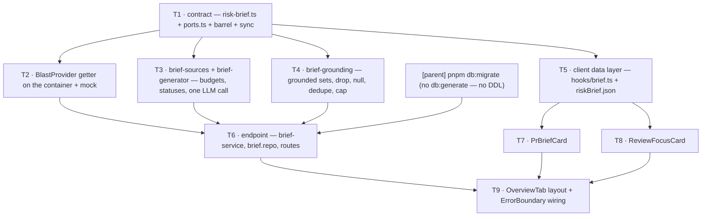

# Plan 08 — PR Risk Brief

**Modules:** server · client   **Created:** 2026-08-26   **Revised:** 2026-08-26 (edition 2, plus amendment A1)   **Status:** draft
**Spec:** SPEC-02 — [`server/specs/SPEC-02-pr-risk-brief.md`](../../server/specs/SPEC-02-pr-risk-brief.md)

> **Edition 2 — what changed and why.** SPEC-02 was corrected in two passes after this plan's first
> edition was written: it now carries **45** acceptance criteria (was 38), `RiskBriefSourceStatus`
> gained the `'skipped'` member the plan already depended on, AC-32 was scoped to the five scalar
> `sources` fields, the `review_focus` edge-case row was rewritten under AC-36, and the LLM call
> signature gained `timeoutMs: 60_000` / `maxRetries: 0`. A review of this plan against the tree also
> found one major and several minor defects in it. Both sets are folded in here. The number is
> unchanged and this file replaces the previous edition in place — see §2 for the one requirement
> that changed its meaning between editions.

## 1. Goal

Give the reviewer opening a pull request the judgement the Overview tab does not carry today.
`IntentCard` says what the author claims the PR does; `BlastCard` says what the diff can reach.
Neither answers *is this risky, and where do I start reading*.

One `POST /pulls/:id/brief` endpoint assembles the PR's existing facts — title, body, linked issue,
declared intent, changed-file list with `@@` headers only, blast summary, `.md` head-excerpts —
makes **exactly one** structured model call, filters every file and endpoint the model named against
a set harvested from the database, and caches the result in the already-migrated `pr_brief` table
keyed on `pr_id`. Three UI surfaces render it: a full-width `PrBriefCard` band above the card grid,
the risk-area list inside `IntentCard`'s card, and a full-width `ReviewFocusCard` band below the
grid — see amendment **A1** at the end of this file, which reversed the original placement.

**No diff hunk body ever reaches the model.** Grounding, not prompt hygiene, is the defence: a model
fully under an attacker's control cannot emit a `file` that survives, because `/etc/passwd` is not a
row in `pr_files`.

The spec's non-goals N1–N7 are binding and are carried into `REQ-46` so a verification pass walks
them: no PR score, no verdict band, no cost strip, no staleness signal, no rewrite of `IntentCard`
or `BlastCard`, no line numbers anywhere, no Project Context input, no retry or repair loop, no edit
to the legacy `contracts/brief.ts`.

## 2. Requirements

### The numbering decision — recorded so the next reader does not have to guess

SPEC-02 now carries 45 criteria. The first edition of this plan mapped `AC-n → REQ-n` one-to-one for
`AC-1..AC-38` and used `REQ-39` for the derived non-goals bundle. `AC-39..AC-45` cannot land on that
identity while `REQ-39` is occupied, so the collision is resolved **in favour of the identity**:

> **`AC-n = REQ-n` holds for all 45 criteria. The derived non-goals requirement moves from `REQ-39`
> to `REQ-46`** — the first free number past the end of the criterion range.

The alternative — shifting `AC-39..AC-45` onto `REQ-40..REQ-46` — was rejected because it would break
the identity for seven criteria permanently, in exchange for keeping one derived requirement's number
stable. Nothing outside this file references `REQ-39`: no code from this plan has been written yet.

**`REQ-39` therefore means something different in edition 2 than it did in edition 1.** In edition 1
it was the non-goals bundle; here it is SPEC-02's AC-39, the failed linked-issue fetch. Anyone
holding a quotation from the first edition should re-read it against this table rather than assume
the number carried.

All 45 criteria are **supplied** — they restate a ratified spec and none was invented here.
`REQ-46` is the one `derived` requirement: it carries the spec's binding negatives (N1–N7 and the
"artistic licence — do not implement" list), which no `AC` states and which would therefore be
checked by nobody. The owner has confirmed it stays.

| ID | Statement (one testable sentence) | Source |
|---|---|---|
| REQ-1 | `POST /pulls/:id/brief` with no `force` and no existing `pr_brief` row assembles the inputs, makes exactly one structured model call, applies the grounding filter, writes one `pr_brief` row keyed on `pr_id`, and responds `200` with a body satisfying `RiskBriefResponse`. | SPEC-02 AC-1 |
| REQ-2 | `POST /pulls/:id/brief` with `force` absent, `null` or `false` and an existing `pr_brief` row responds `200` with the stored brief, making zero model calls and zero GitHub calls. | SPEC-02 AC-2 |
| REQ-3 | `POST /pulls/:id/brief` with `{"force": true}` regenerates and replaces the existing `pr_brief` row for `:id` regardless of the stored row's age. | SPEC-02 AC-3 |
| REQ-4 | The cache is keyed on `pr_id` alone and `pull_requests.head_sha` is not read on the cache-hit decision path. | SPEC-02 AC-4 |
| REQ-5 | An `:id` that does not resolve to a pull request inside the caller's workspace responds `404` with no model call, tenancy being checked before the cache is consulted. | SPEC-02 AC-5 |
| REQ-6 | A `risks[]` entry whose `file` is not a member of the grounded path set is dropped before persistence and is absent from both the stored row and the response. | SPEC-02 AC-6 |
| REQ-7 | A `review_focus[]` entry whose `file` is not a member of the grounded path set is dropped before persistence. | SPEC-02 AC-7 |
| REQ-8 | A `risks[]` entry whose non-null `endpoint` is not a member of the grounded endpoint set is persisted with `endpoint: null` rather than dropped. | SPEC-02 AC-8 |
| REQ-9 | No count, flag or other indication of how many items grounding dropped appears in the response body, the stored row, or the rendered UI — the `RiskBriefResponse` contract declares no such field, the persisted row carries none, and no client surface renders one. | SPEC-02 AC-9 |
| REQ-10 | When grounding drops every `risks[]` entry the brief is persisted and returned with `risks: []`, with no retry, no re-prompt and no request failure. | SPEC-02 AC-10 |
| REQ-11 | `risk_level` is exactly one of `low`/`medium`/`high`, and any other value from the model is a failed structured call handled under REQ-18. | SPEC-02 AC-11 |
| REQ-12 | Each `risks[].severity` is exactly one of `low`/`medium`/`high`, independently of `risk_level`. | SPEC-02 AC-12 |
| REQ-13 | `risks[].file` and `review_focus[].file` are bare repository-relative paths containing no line number, no line range and no `#L` fragment, and no rendered link carries one. | SPEC-02 AC-13 |
| REQ-14 | At most 8 entries are returned in `risks[]` and at most 6 in `review_focus[]`, a longer model response being truncated rather than rejected. | SPEC-02 AC-14 |
| REQ-15 | The model's ordering of `review_focus[]` is preserved in the stored row and the response, so the first entry is the one presented as "read this first". | SPEC-02 AC-15 |
| REQ-16 | With no `pr_intent` row for `:id` the prompt is assembled from the remaining inputs, intent is never computed on demand, and `sources.intent = "unavailable"`. | SPEC-02 AC-16 |
| REQ-17 | When the blast-radius computation is unavailable or throws, the prompt is assembled from the remaining inputs and `sources.blast = "unavailable"`. | SPEC-02 AC-17 |
| REQ-18 | A structured model call that fails, times out, or returns a payload failing `RiskBriefGeneration` parsing responds `502`, writes no `pr_brief` row, and leaves any previously stored row unchanged. | SPEC-02 AC-18 |
| REQ-19 | No message sent to the model contains the value of `pr_files.patch`, a `UnifiedDiff` hunk body, or any other line-level diff content; diff evidence is limited to per-file `path (+a/-d)` and `@@` hunk-header lines. | SPEC-02 AC-19 |
| REQ-20 | Every author-controlled or repository-controlled section is wrapped in `wrapUntrusted(label, content)` from `@devdigest/reviewer-core` before the sections are joined. | SPEC-02 AC-20 |
| REQ-21 | The per-source character budgets of SPEC-02 § "Non-functional requirements" are enforced, and a truncated source is recorded as `truncated` rather than silently cut. | SPEC-02 AC-21 |
| REQ-22 | The provider and model are resolved via `resolveFeatureModel(container, workspaceId, 'risk_brief')` and no provider or model name is hardcoded. | SPEC-02 AC-22 |
| REQ-23 | A completed generation logs the resolved provider, model, estimated input token count, per-source status and character counts, and the observed cost, and persists none of those figures in `pr_brief`. | SPEC-02 AC-23 |
| REQ-24 | A `.md` file changed by the PR that cannot be read at the PR head is recorded with status `unavailable`, with no empty string, base-branch version or invented content substituted for it. | SPEC-02 AC-24 |
| REQ-25 | The same log call that records the completed generation carries the number of `risks[]` and `review_focus[]` entries dropped by grounding, the number removed by deduplication, and the number removed by the caps. | SPEC-02 AC-25 |
| REQ-26 | With a brief loaded, `PrBriefCard` renders as a full-width band **above** the two-column grid showing `what`, `why`, a risk-level badge carrying both a colour and the visible text `Low`/`Medium`/`High`, and the single Recalculate control; the `risks[]` list renders **inside `IntentCard`'s card**, below the scope grid and a rule. *(Restated by amendment A1 — the original text put the whole card in the left column.)* | SPEC-02 AC-26 |
| REQ-27 | With a brief loaded, `ReviewFocusCard` renders as a single full-width band below the two-column card grid, each `review_focus[]` entry appearing as a link to `githubBlobUrl(repoFullName, headSha, file)` with no line fragment followed by its `reason` — degrading to plain text, never a constructed URL, when `repoFullName` or `headSha` is unavailable. | SPEC-02 AC-27 + § Edge cases |
| REQ-28 | Activating a risk-area row reveals that entry's `explanation` and leaves every other row's explanation hidden; a collapsed row shows only `title`, `severity` and `file`. | SPEC-02 AC-28 |
| REQ-29 | Activating Recalculate issues `POST /pulls/:id/brief {"force": true}`, disables the control until the request settles, and writes the response into the `["pr-brief", prId]` query cache with `setQueryData` rather than invalidating it. | SPEC-02 AC-29 |
| REQ-30 | With `risks[]` empty, `PrBriefCard` renders a named empty state reading "No risk areas identified" and still renders `what`, `why` and the risk-level badge. | SPEC-02 AC-30 |
| REQ-31 | With `review_focus[]` empty, `ReviewFocusCard` renders a named empty state and does not render an empty bordered band with a heading and nothing under it. | SPEC-02 AC-31 |
| REQ-32 | While any of the five **scalar** `sources` fields — `intent`, `blast`, `pr_body`, `linked_issue`, `file_list` — equals `"unavailable"`, `PrBriefCard` renders a visible note naming the missing source; `sources.md_files` is outside this requirement and is covered by REQ-40. | SPEC-02 AC-32 |
| REQ-33 | `PrBriefCard` and `ReviewFocusCard` are each wrapped in an `ErrorBoundary` with `resetKeys={[prId]}`, matching the existing treatment of `IntentCard` and `BlastCard`. | SPEC-02 AC-33 |
| REQ-34 | Each risk-area disclosure trigger is a `<button>` carrying `aria-expanded` and `aria-controls`, reachable by Tab, operable by Enter and Space, with a visible `:focus-visible` indicator. | SPEC-02 AC-34 |
| REQ-35 | Every file path renders with the full path in an accessible `title` attribute and the displayed text truncated from the **left**, so the filename remains visible. | SPEC-02 AC-35 |
| REQ-36 | Two or more `review_focus[]` entries naming the same `file` are reduced to the first, and the reduction runs after the grounding drop and **before** the 6-entry cap. | SPEC-02 AC-36 |
| REQ-37 | Every `risks[]` entry carries a non-empty `file`, and a model response omitting it is a failed structured call handled under REQ-18. | SPEC-02 AC-37 |
| REQ-38 | No fallback, placeholder or `model: null` brief row is written under any condition. | SPEC-02 AC-38 |
| REQ-39 | A linked-issue fetch that throws, times out, returns an error status, or cannot be attempted because no GitHub token is configured records `sources.linked_issue = "unavailable"`, assembles the prompt from the remaining inputs, completes the generation and responds `200`, and never substitutes an invented or previously cached issue body. | SPEC-02 AC-39 |
| REQ-40 | While at least one `sources.md_files[]` entry has `status === "unavailable"`, `PrBriefCard` renders exactly **one** note naming documentation as a missing source, however many entries are unavailable, and enumerates no paths; an entry whose status is `used`, `truncated` or `skipped` renders no note on its own. | SPEC-02 AC-40 |
| REQ-41 | The structured model call carries `timeoutMs: 60_000` **and** `maxRetries: 0` set explicitly on the `StructuredRequest`, with neither value left to the adapter's default. | SPEC-02 AC-41 |
| REQ-42 | A PR that references no issue at all records `sources.linked_issue = "missing"` — never `"unavailable"` and never `"used"` — and makes no `getIssue` call. | SPEC-02 AC-42 |
| REQ-43 | While two or more of the sources named by REQ-32 and REQ-40 are unavailable at the same time, `PrBriefCard` renders exactly **one** note naming all of them in a single sentence, never one note per source. | SPEC-02 AC-43 |
| REQ-44 | Every `sources` status is derived from what the assembled prompt actually contains — `used` where the source existed and everything available from it reached the prompt, `truncated` where a budget cut it, `skipped` where the remaining budget stopped the read from being attempted, `missing` where the source does not exist for this PR, `unavailable` where a read or computation was attempted and failed — so a server writing `used` unconditionally fails; where another requirement fixes a status explicitly (REQ-16), that requirement governs. | SPEC-02 AC-44 |
| REQ-45 | Below 1,000 characters of remaining aggregate `.md` excerpt budget every remaining `.md` path is recorded `skipped` with no read attempted, `used` or `truncated` is recorded for exactly the paths that were read, and `sources.md_files[]` carries one entry per `.md` path in `pr_files` whether or not it was read. | SPEC-02 AC-45 |
| REQ-46 | The BRIEF PIPELINE produces none of the following, and `contracts/brief.ts` carries none of them: a PR score, a merge verdict, a findings/blocker count, a token or cost figure. Nor is any of the following rendered or introduced anywhere: a staleness or `generated_at` indicator on the brief, a line number or `#L` fragment, a `category`/`kind` field or per-category icon set, a Project Context input, a retry or repair loop, a user-visible drop count, an edit to `BlastCard`, or an edit to `contracts/brief.ts`. *(A1 narrowed the `IntentCard`/`BlastCard` clause to `BlastCard`. **A4** split the rest in two: the score/verdict/count/cost clause became a statement about PROVENANCE rather than about pixels, because those figures now render in the band's verdict row — sourced entirely from review-run data that already existed.)* | **derived** — SPEC-02 § Goals/Non-goals N1–N7, § Design review "artistic licence — do not implement" |

### What validating SPEC-02 turned up, and how this plan resolves it

Three findings from putting the 45 criteria through the five tests. **None is repaired in the spec** —
a spec is read-only input here — and each resolution below is binding on the tasks that cite it.

1. **AC-9 is unfalsifiable as written** — *"a count, a flag, or **any other indication**"* has no
   observation that would prove it false. `REQ-9` restates it in the three checkable forms that
   carry the intent: the contract declares no such field, the persisted row carries none, and no
   client surface renders one. The residue ("any other indication") is not testable and is not
   pretended to be.
2. **AC-27 and AC-35 cannot both be satisfied with `MonoLink`.** AC-27 names `MonoLink` as the link
   element; AC-35 requires left-truncation with the full path in `title`. `client/INSIGHTS.md`
   (2026-08-17) records that `MonoLink` *"takes no `style` prop, so it can't carry the
   `flex:1 / minWidth:0 / textOverflow:ellipsis` a constrained row needs, and its no-`href` branch
   renders a dead `<button>` with no `onClick`"*. Both halves disqualify it here: the first defeats
   REQ-35, and the second defeats REQ-27's plain-text degradation, because a dead `<button>` is an
   interactive element that takes a tab stop and announces itself to a screen reader while doing
   nothing — which is worse than the plain text REQ-27 asks for, not an implementation of it.
   **Resolution: AC-27's `MonoLink` is read as the visual treatment (monospace, accent colour), not
   as a binding component choice.** T7 and T8 hand-roll the `<a>` on the `ConventionCard` precedent
   the same insight names. Recorded as a deliberate divergence in §9.
3. **AC-4's "shall not read `head_sha`" is a negative about implementation**, not about observable
   behaviour: two implementations with identical outputs differ only in whether the column is
   selected. It is checkable by inspection over T6's owned paths and that is how it is proved —
   a grep, not an assertion.

**Retired in edition 2.** The first edition's finding 1 — *"AC-36 contradicts the Edge-cases table"* —
**no longer applies.** The spec's `review_focus`-duplicate edge-case row has been rewritten to state
AC-36's behaviour, so the contradiction is gone and there is nothing left for this plan to arbitrate.
T4 implements REQ-36 exactly as before; only the justification changed, from *"the plan picks the
later, more specific statement"* to *"the spec says one thing"*.

Two smaller notes, resolved without changing anything: AC-38 forbids *writing* `model: null` while
the contract declares `model: z.string().nullish()` — the nullish is read tolerance for a row written
by earlier code, and the two do not conflict. And AC-11/AC-37's "reject as a failed structured call"
needs no branch of its own: `RiskBriefGeneration` already makes `risk_level` an enum and `file` a
`min(1)` string, so `completeStructured`'s parse is the rejection, and REQ-18 is the handler.

**One apparent conflict inside the new criteria, resolved by the spec itself.** REQ-44's general rule
would call an absent `pr_intent` row `missing`; REQ-16 fixes it at `"unavailable"`. AC-44 yields
explicitly — *"Where another criterion fixes a status explicitly, that criterion governs"* — so the
implementation is unambiguous: `intent = "unavailable"` when the row is absent. T3 is told this in so
many words, because "align the odd one out with the general rule" is the natural instinct and it
would break REQ-16.

### Build decisions taken by this plan — no longer latitude

SPEC-02 § "Open questions" leaves two build decisions to the planner and states they are not
contentious. Both are decided here so no task chooses independently. A third is added because the
spec requires logging without naming a channel.

1. **The `BlastProvider` port lives in a new R0 file, `server/src/vendor/shared/ports.ts`** — not in
   `adapters.ts`. That file's own header declares its scope: *"Adapter interfaces. **ALL external
   calls** go behind these interfaces"* (`adapters.ts:9-13`), and `BlastProvider` is an internal
   cross-module seam, not an outbound call. `ports.ts` sits beside `adapters.ts` with the
   complementary header and is exported from the barrel. The R0 rule is unchanged: it imports `zod`
   and its own `contracts/**` siblings, names no Drizzle row and no `modules/**` type.
   **Consequence that saves a task:** `BlastService.getBlastRadius(workspaceId, prId,
   narrationModel?)` (`modules/blast/service.ts:51-55`) already satisfies
   `BlastProvider.getBlastRadius(workspaceId, prId)` structurally, so **`modules/blast` is not
   edited at all** — only the container gains a getter.
2. **The risk-level colour and icon map is three distinct glyphs, local to `PrBriefCard`.** The
   shipped `SEV` map is a four-level scale on a different type (`tokens.ts:6-14`) and is **not**
   aliased. A new `RISK` map in `PrBriefCard/constants.ts`, single consumer, no promotion:
   `high → { c: "var(--crit)", bg: "var(--crit-bg)", icon: "AlertOctagon" }`,
   `medium → { c: "var(--warn)", bg: "var(--warn-bg)", icon: "AlertTriangle" }`,
   `low → { c: "var(--info)", bg: "var(--info-bg)", icon: "Info" }`. All three glyph names are
   already members of the `Icon` map (`client/src/vendor/ui/icons.tsx:86`, entries at `:106-108`),
   as are the `RefreshCw` the Recalculate control needs (`:126`) and the `ChevronDown` the disclosure
   needs (`:98`), so `vendor/ui/icons.tsx` is not edited.
3. **The log channel for REQ-23 and REQ-25 is the Fastify request logger, passed in per call.**
   `modules/**` carries no logger on any `Deps` (`server/INSIGHTS.md`, 2026-08-17), and the house
   precedent for exactly this endpoint shape is `POST /pulls/:id/intent`, which passes
   `log: toIntentLogger(req.log)` plus a per-request `correlationId` into the service
   (`modules/reviews/routes.ts:203-209`). T6 mirrors it: a narrow `log` function on the call's
   options, supplied by the route from `req.log`. `console.*` is not used on this path.

Three further shapes are fixed here so that tasks written in the same wave agree without talking:

- **Component props, with their exact types.** `OverviewTab` holds `prId: string | null`,
  `repoFullName?: string | null` and `headSha?: string | null` (`OverviewTab.tsx:12-23`) and passes
  them straight through, so the two new cards must accept those types rather than bare `string`:
  - `<PrBriefCard prId={prId} />` — `interface PrBriefCardProps { prId: string | null }`
  - `<ReviewFocusCard prId={prId} repoFullName={repoFullName} headSha={headSha} />` —
    `interface ReviewFocusCardProps { prId: string | null; repoFullName?: string | null; headSha?: string | null }`

  T7 and T8 declare exactly these; T9 mounts exactly these. Narrowing a prop to `string` would force
  T9 to add a guard or a non-null assertion in the tab, which is business logic in a layout
  component.
- **One query, two consumers.** Both cards call `usePrBrief(prId)`. It is a `useQuery` keyed
  `["pr-brief", prId]` with a `POST` in its `queryFn` — the `usePrIntent` shape
  (`lib/hooks/reviews.ts:151-173`) — so TanStack dedupes the two mounts into **one** request. It must
  not be a `useMutation` fired on mount, which would POST twice.
- **The "built without" note is one composed sentence, not a list of notes.** REQ-43 makes this a
  message-key design decision rather than a rendering detail: T5 must ship a template key plus a
  per-source name key plus list separators, so T7 can join *n* names into one sentence. A key set
  of the shape `builtWithout.blast = "Built without blast radius"` satisfies REQ-32 on its own and
  makes REQ-43 unimplementable without string surgery, and is therefore wrong.

## 3. Insights consulted

Read in full for this plan: `server/INSIGHTS.md` (205 lines), `client/INSIGHTS.md` (198 lines). The
entries that bind this change, with the task each is pushed down into:

| Module | Date | Entry | Binds |
|---|---|---|---|
| server | 2026-08-25 | A runtime guarantee parked in an optional helper silently never runs — put the validate-before-persist at the **write chokepoint**, not in a builder a caller may skip; `run_traces`-style opaque jsonb only fails on read. | T6 |
| server | 2026-08-23 | A red `.it` lane is usually Testcontainers contention, not a regression — never run two `.it` invocations concurrently; re-run one suite alone before debugging. | T6, §6, §8 |
| server | 2026-08-22 | A Zod contract edit that passes BOTH typechecks can still break every fixture: `server/test/**` is outside `tsconfig`'s `include` and `.parse()` takes `unknown`. A contract edit's done condition must run the hermetic vitest lane. | T1 |
| server | 2026-08-17 | **CORRECTS the `{}`-parses entry:** fields stay REQUIRED — `.nullish()` (nullable AND optional) is fine, `.default()`/`.optional()` alone is rejected by OpenAI `strict: true` at call time, in production only. | T1 |
| server | 2026-08-17 | A NEW `completeStructured` call breaks every existing test unless `{}` parses — `MockLLMProvider` resolves `structuredBySchema[req.schemaName] ?? structured ?? {}`. Give the **mock** an explicit fixture keyed by schema name. | T6 |
| server | 2026-08-17 | `git.readFile` **throws** ENOENT for a missing file; only `MockGitClient` returns `''`. Every optional read must be `try`/`catch`ed or it passes every hermetic test and blows up on the first real clone. | T3 |
| server | 2026-08-17 | `.` does not match `\r`, so `split('\n')` silently breaks every CRLF file — split on `/\r?\n/` anywhere you parse file or subprocess output line-wise. | T3 |
| server | 2026-08-17 | A silent fail-open hides a feature that never ran — the un-deduped list is visually identical to "found no duplicates". Degrading is right; degrading *silently* is not. | T3, T6 |
| server | 2026-08-16 | Widening a contract enum takes 3 edits — but only when the Zod enum is backed by a Drizzle `text(col, { enum })`. `pr_brief.json` is plain `jsonb` with no `CHECK`, so `RiskBriefLevel` is Zod-only and needs no schema-side widening and no migration. | T1, T6 |
| server | 2026-08-15 | `Container` structurally satisfies a per-service `Deps` interface — `new XService(app.container)` compiles with no container change and no call-site change. | T2, T6 |
| server | 2026-08-21 | Secrets have TWO sources, so an `.it` test is not hermetic by default — a test reaching `container.llm(...)` or `container.github()` without `overrides.secrets` makes real billed calls that `catch` blocks swallow. Use `hermeticOverrides()` from `server/test/helpers/overrides.ts`. | T6 |
| server | 2026-08-09 | `completeAgentRun` has a THIRD, hidden param-type copy — the class facade re-declares the inline object type instead of deriving it, and the resulting `TS2353` points at the wrong file. Derive with `Parameters<typeof …>`. | T6 |
| server | 2026-08-09 (seed) | DB-backed tests need the `*.it.test.ts` suffix or they run in the wrong lane; migrations are not applied on boot. | T6, P1 |
| client | 2026-08-27 | A write that does not go through `useMutation` owns its own `setQueryData`/`invalidateQueries`; a `staleTime` can hide the omission for 30 s. A test can pin it — "the hook never writes into that query's cache" is assertable. | T5 |
| client | 2026-08-26 | **`tsc` and vitest map `./x.js` → `x.ts`; Next's webpack does not, unless you tell it.** A broken vendored import passes `pnpm typecheck` AND `pnpm test` and surfaces only as `Module not found` in the dev server — `pnpm build` is the only gate that catches it. Corollary: `import type` from `@devdigest/shared` is erased by SWC and never resolved, so the first runtime VALUE import of the barrel is what trips it. | T1, T5, §8 |
| client | 2026-08-25 | A hook's `isError` branch does NOT cover a malformed payload — `api.get<T>()` is a plain cast, so the throw happens during render, after TanStack Query resolved. Wrap such cards in `components/error-boundary` with `resetKeys={[prId]}`. | T7, T8, T9 |
| client | 2026-08-17 | `MonoLink` doesn't fit a file link that has to truncate — no `style` prop, and its no-`href` branch renders a dead `<button>`. `ConventionCard` hand-rolls the `<a>` plus a local hover `useState` instead. | T7, T8 |
| client | 2026-08-17 | Never build a github.com URL from a `fullName` that falls back to a uuid — read `activeRepo?.full_name` directly, and render plain text when it is absent. | T8, T9 |
| client | 2026-08-16 | `vendor/ui` interactive primitives have NO accessible name by default — a wrapping `<label>` does not name a `<button role=…>`; pass `ariaLabel` explicitly. | T7 |
| client | 2026-08-16 | A clickable card must not be a `<button>` if it contains one — nested interactive elements are invalid HTML the parser breaks apart, and the inner control drops out of the tab order. | T7 |
| client | 2026-08-26 | Every flex ancestor between a definite-height container and the scrolling child needs `minHeight: 0`, or the child refuses to shrink and the whole page scrolls instead of the pane. | T7, T9 |
| client | 2026-08-10 | React inline styles: `borderColor` is a shorthand and conflicts with `borderLeftColor` — use the three non-left longhands when a distinct left accent is present. | T7 |
| client | 2026-08-18 | Never run `pnpm build` in `client/` while `pnpm dev` is running — the build overwrites `.next/` and every route 500s until the dev server is restarted. | T5, T7, T8, T9, §8 |
| client | 2026-08-09 (seed) | All server data flows through `lib/hooks/*` → `lib/api.ts`; a `fetch` inside a component is a defect. Tests mock the **hook boundary**, not global `fetch`. | T5, T7, T8, T9 |

### The vendored-import gate — stated, not left silent

The 2026-08-26 client entry above is the reason §8 ends with `cd client && pnpm build`, and the
reasoning is written out here rather than implied, because "no command in this plan runs the only
gate that catches this class of break" is exactly the kind of hole that reads as an oversight later.

This plan adds **two** files to the vendored tree — `contracts/risk-brief.ts` and `ports.ts` — and
`vendor/shared/index.ts` gains two `export *` lines using NodeNext `./x.js` specifiers. Three facts
bound the risk, all verified in the tree rather than assumed:

1. **`experimental.extensionAlias` is already configured** in `client/next.config.mjs`, mapping
   `.js → [.ts, .tsx, .js]`, with a comment naming this exact hazard. A new sibling file under
   `contracts/` is covered by the same mapping with no config change.
2. **The client's use of the new contract is type-only.** T5 imports `RiskBriefResponse` as a type;
   SWC erases it and never resolves the specifier. The existing runtime VALUE imports of the barrel
   (`lib/hooks/{reviews,context,conventions,skills}.ts`, `lib/types.ts`) already exercise the barrel
   at build time, so the two new export lines are what a build would newly resolve.
3. **`pnpm typecheck` and `pnpm test` cannot see this class of failure**, so a green T5, T7, T8 and
   T9 prove nothing about it.

Hence: no task's done condition changes (the lane rows in `docs/plans/README.md` are copied verbatim,
as they must be), and the whole-plan §8 gate runs `pnpm build` once, at the end, with the
`pnpm dev`-must-not-be-running caveat from the 2026-08-18 entry attached.

## 4. Contract changes — wave 0

**Two new files, zero edits to an existing contract.** SPEC-02's N7 is explicit that
`contracts/brief.ts` is not touched, and the Tier A row covering *existing* files under
`contracts/**` is therefore never approached.

1. **`server/src/vendor/shared/contracts/risk-brief.ts`** — the shape is given verbatim in SPEC-02
   § "The new contract" and is binding: `RiskBriefLevel`, `RiskBriefArea`, `RiskBriefFocusItem`,
   `RiskBriefSourceStatus`, `RiskBriefSources`, `RiskBriefGeneration`, `RiskBriefResponse`,
   `RiskBriefRequest`. The barrel is a flat `export *`, so **no name may collide** with
   `contracts/brief.ts`'s exports — verified taken: `Intent`, `ChangedSymbol`, `BlastCaller`,
   `DownstreamImpact`, `BlastRadius`, `RiskSeverity`, `Risk`, `Risks`, `PrHistoryItem`, `PrHistory`,
   `SmartDiffRole`, `SmartDiffFileFinding`, `SmartDiffFile`, `SmartDiffGroup`, `ProposedSplit`,
   `SmartDiff`, `PrBrief`. Every name in the spec's block already avoids all seventeen.
2. **`server/src/vendor/shared/ports.ts`** — new R0 file, `BlastProvider`, per §2's build decision 1.
3. **`server/src/vendor/shared/index.ts`** — two `export *` lines. The barrel is **not** Tier A: that
   row scopes to *existing files under `contracts/**`*, and adding an export line for a new file is
   precisely the "the barrel is stable — feature agents EXTEND with new files" the file's own header
   prescribes. `blast-api.ts`, `lookup-api.ts` and `context-api.ts` all landed exactly this way.
4. **`./scripts/sync-vendor.sh`** regenerates `client/src/vendor/shared/**`, which **is** Tier A and
   is never hand-edited. The script `rm -rf`s and `cp -r`s the whole tree, so the new `ports.ts`
   carries across with no script change.

**`RiskBriefSourceStatus` is a six-member enum, and `'skipped'` is one of them.** This was a genuine
blocker in edition 1: T3 was told to record a budget-starved `.md` path as `skipped` while the
contract as first specified had no such member. SPEC-02 has since added it, and REQ-45 now depends on
it directly. The six, in the spec's order:
`['used', 'truncated', 'skipped', 'partial', 'missing', 'unavailable']`. Declaring five of them is a
T1 failure that surfaces as a type error in T3, one wave later, in a file T3 may not fix.

### The wave-0 contract must be complete for the whole plan

Once `risk-brief.ts` exists it is an *existing file under `contracts/**`* and therefore Tier A for
every later wave. **Every field any task in waves 1–3 needs must be declared in T1.** A later task
discovering a missing field has no legal repair inside this plan.

Four shape rules that are easy to get wrong and expensive to fix later:

- **No `.max(8)` / `.max(6)` on `risks` or `review_focus`.** REQ-14 requires a longer response to be
  **truncated, not rejected** — a length cap in the schema would make the model's overrun a parse
  failure and route it into REQ-18's `502`. The caps live in the normalisation stage (T4) only.
- **The string `.max()` caps stay exactly as the spec declares them** — `what`/`why`/`explanation`
  600, `title` 120, `reason` 200 — and the asymmetry with REQ-14 is **deliberate and closed**.
  SPEC-02 § "Accepted trade-offs" records that removing them and truncating in the normalisation
  stage instead was proposed and **rejected**, so that the numbers live in the contract alone and one
  `.parse()` checks them. The accepted price is that one over-long sentence from the model costs the
  reviewer the whole brief, and the remedy is Recalculate. **Do not "fix" this.** It is the trade
  that was declined, not one that was missed.
- **No `.default()` anywhere, on any field, in `RiskBriefGeneration`.** It goes out with
  `strict: true` (`server/INSIGHTS.md`, 2026-08-17). `endpoint: z.string().nullable()` is correct;
  `model`/`generated_at` on the *response* may be `.nullish()` because that schema is never sent.
- **`RiskBriefGeneration` deliberately excludes `pr_id`, `sources`, `model` and `generated_at`** —
  those are server-observed, never model-reported. `RiskBriefResponse` extends it with them.

**No migration.** `pr_brief` is created in the initial migration (`db/migrations/0000_init.sql:211`,
FK cascade at `:386`) and carried unchanged through all 19 snapshots. The table is
`(pr_id uuid PK/FK, json jsonb NOT NULL)` — it has **no `model` or `generated_at` column**, so both
live inside the `json` document, which is the whole `RiskBriefResponse`. `pnpm db:generate` is
therefore **not** run by this plan; `pnpm db:migrate` still has to have been applied to the target
database, which is parent step **P1**.

## 5. Architecture



Two edges are non-obvious.

**The blast input crosses a module boundary and must not cross an import boundary.** The brief lives
in `modules/reviews`; blast radius lives in `modules/blast`; no module may import another
(`onion-architecture` §2, cross-cutting rule 2). The seam is `BlastProvider` in R0, wired as
`container.blast` exactly the way `container.repoIntel` and `container.contextDocs` already are
(`platform/container.ts:114-135`). The brief service names the *interface* in its `Deps` and never
learns that `modules/blast` exists. Because `BlastService` already satisfies the interface,
`modules/blast/**` is not in any task's `Owned paths`.

**The container getter constructs `BlastService` without a narration model.** `blast/routes.ts:50-51`
resolves a `review_intent` model to drive the optional one-paragraph narration; the container getter
must not. Passing one would make the brief path cost **two** model calls and break REQ-1's "exactly
one" and REQ-2's "zero on a cache hit". The two-argument call is the whole guarantee.

## 6. Task graph

**Execution mode:** multi-agent

### Waves

| Wave | Tasks | Lane(s) | Parallel? |
|---|---|---|---|
| 0 | T1 | contract | **no** — serialized; the commit-equivalent point before wave 1 |
| 1 | T2, T3, T4, T5 | backend ×3, frontend | yes (4-up) |
| — | `[parent session]` **P1** — apply migrations | — | serialized, between wave 1 and wave 2 |
| 2 | T6, T7, T8 | backend, frontend ×2 | yes (3-up) |
| 3 | T9 | frontend | **no** — sole task |

### Parent-session steps (never an implementer task)

- **P1 — between wave 1 and wave 2.** `cd server && pnpm db:migrate`. **This is not a Tier A
  replacement action** — nothing in this plan touches `server/src/db/migrations/**`, and edition 1
  described it as one in error. It is here for a simpler reason: **migrations are not applied on
  boot** (`server/AGENTS.md`), applying them mutates the owner's database rather than the checkout,
  and T6's `.it` suite needs `pr_brief` to exist on the target database. Running a migration is a
  parent-session action in this repo the same way committing is.
  **`pnpm db:generate` is deliberately NOT run**: this feature adds no DDL — `pr_brief` shipped in
  `0000_init.sql:211` and appears in every snapshot since — so a generate would either produce an
  empty migration or, worse, pick up unrelated drift.

There is **no** Tier A path in any `Owned paths` list in this plan, and no Tier A step other than
P1's environment action. SPEC-02 requires no edit to any existing file under
`vendor/shared/contracts/**`, and the barrel is not covered by that row (§4).

### Requirement → Task coverage matrix

| REQ | T1 | T2 | T3 | T4 | T5 | T6 | T7 | T8 | T9 |
|---|---|---|---|---|---|---|---|---|---|
| REQ-1 | | | | | | x | | | |
| REQ-2 | | | | | | x | | | |
| REQ-3 | | | | | | x | | | |
| REQ-4 | | | | | | x | | | |
| REQ-5 | | | | | | x | | | |
| REQ-6 | | | | x | | x | | | |
| REQ-7 | | | | x | | x | | | |
| REQ-8 | | | | x | | | | | |
| REQ-9 | x | | | x | | | x | | |
| REQ-10 | | | | x | | x | | | |
| REQ-11 | x | | | | | x | | | |
| REQ-12 | x | | | | | | | | |
| REQ-13 | | | x | x | | | x | x | |
| REQ-14 | x | | | x | | | | | |
| REQ-15 | | | | x | | | | x | |
| REQ-16 | | | x | | | x | | | |
| REQ-17 | | x | x | | | x | | | |
| REQ-18 | | | | | | x | | | |
| REQ-19 | | | x | | | | | | |
| REQ-20 | | | x | | | | | | |
| REQ-21 | | | x | | | | | | |
| REQ-22 | | | | | | x | | | |
| REQ-23 | | | | | | x | | | |
| REQ-24 | | | x | | | | | | |
| REQ-25 | | | | x | | x | | | |
| REQ-26 | | | | | | | x | | x |
| REQ-27 | | | | | | | | x | x |
| REQ-28 | | | | | | | x | | |
| REQ-29 | | | | | x | | x | | |
| REQ-30 | | | | | | | x | | |
| REQ-31 | | | | | | | | x | |
| REQ-32 | | | | | | | x | | |
| REQ-33 | | | | | | | | | x |
| REQ-34 | | | | | | | x | | |
| REQ-35 | | | | | | | x | x | |
| REQ-36 | | | | x | | | | | |
| REQ-37 | x | | | x | | | | | |
| REQ-38 | | | | | | x | | | |
| REQ-39 | | | x | | | x | | | |
| REQ-40 | | | | | x | | x | | |
| REQ-41 | | | x | | | | | | |
| REQ-42 | | | x | | | | | | |
| REQ-43 | | | | | x | | x | | |
| REQ-44 | x | | x | | | | | | |
| REQ-45 | x | | x | | | | | | |
| REQ-46 | x | x | x | x | x | x | x | x | x |

### Checks

- **Coverage.** All 46 requirements appear in at least one task's `Acceptance`. No empty row, no
  empty column. All 45 of SPEC-02's `AC-n` are carried, one-to-one, by `REQ-1..REQ-45`; `REQ-46`
  carries the non-goals no `AC` states.
- **Disjointness — verified per wave.** The union of `Owned paths` within each wave has no repeats:
  - *Wave 0*: T1 alone.
  - *Wave 1*: T2 owns `platform/container.ts`, `adapters/mocks.ts`, `test/blast-port.test.ts` ·
    T3 owns `modules/reviews/{brief-sources,brief-generator}.ts`, `modules/reviews/intent-sources.ts`,
    `test/brief-sources.test.ts` · T4 owns `modules/reviews/brief-grounding.ts`,
    `test/brief-grounding.test.ts` · T5 owns `client/src/lib/hooks/{brief.ts,brief.test.tsx,index.ts}`
    and `client/messages/en/riskBrief.json`. Three server file sets and one client set, no overlap.
  - *Wave 2*: T6 owns `modules/reviews/brief-service.ts`, `modules/reviews/repository/brief.repo.ts`,
    `modules/reviews/repository.ts`, `modules/reviews/routes.ts` and two new server tests —
    **disjoint from T3's and T4's wave-1 files**, which it only reads · T7 owns
    `…/_components/PrBriefCard/**` · T8 owns `…/_components/ReviewFocusCard/**`. No overlap.
  - *Wave 3*: T9 alone.
- **Ordering.** Every `Depends on:` names an earlier wave. T9 is last because it imports both cards;
  placing it in wave 2 would leave its typecheck red on siblings' unfinished files for the whole
  wave, which is noise, not information.
- **Files two tasks would otherwise both want — each pinned to exactly one owner.**
  `server/src/platform/container.ts` and `server/src/adapters/mocks.ts` → **T2 only.**
  `server/src/modules/reviews/routes.ts` and `repository.ts` → **T6 only.**
  `server/src/modules/reviews/intent-sources.ts` → **T3 only**, and only to add the word `export` to
  the three helpers named in T3's `Owned paths`. `server/test/structured-schemas.test.ts` → **T1 only.**
  `client/messages/en/riskBrief.json` and `client/src/lib/hooks/**` → **T5 only**; T7, T8 and T9 read
  them, and T5 writes every message key all three need up front.
  `client/src/app/repos/[repoId]/pulls/[number]/_components/OverviewTab/**` → **T9 only.**
  `client/messages/en/brief.json` (the dead legacy namespace) → **nobody**; see §9 risk 6.
- **Exclusivity (Tier B).** None — this plan touches no `.claude/**` path.
- **Tier A work.** No Tier A path appears in any `Owned paths` list: no lockfile, no migration, no
  `client/` vendor mirror, no existing contract file, no root config, no `package.json`, no
  `INSIGHTS.md`, no `AGENTS.md`. P1 is an environment action, not a file edit.
- **`.it` lane serialization.** Exactly one `*.it.test.ts` file is added, by T6, and no other task
  owns one — so no two `.it` invocations can run concurrently (`server/INSIGHTS.md`, 2026-08-23).

## 7. Tasks

### T1 — Contract: `risk-brief.ts`, the `BlastProvider` port, and the barrel
**Wave:** 0 · **Parallel:** no · **Lane:** contract · **Ring:** R0 · **Depends on:** n/a
**Implements:** REQ-9, REQ-11, REQ-12, REQ-14, REQ-37, REQ-44, REQ-45, REQ-46

**Owned paths (exclusive — no other task may name these):**
- `server/src/vendor/shared/contracts/risk-brief.ts` (new)
- `server/src/vendor/shared/ports.ts` (new)
- `server/src/vendor/shared/index.ts` (edit — two export lines)
- `server/test/structured-schemas.test.ts` (edit — one entry in `SENT_WITH_STRICT`)

**May read:** `server/specs/SPEC-02-pr-risk-brief.md` § "The new contract" (the shape is binding),
`server/src/vendor/shared/contracts/brief.ts` (the seventeen names to avoid),
`server/src/vendor/shared/contracts/blast-api.ts` (`BlastRadiusResponse`, and its header's own
collision note at `:18-24`), `server/src/vendor/shared/contracts/intent.ts:84-89`
(`ClassifyIntentRequest` — `force: z.boolean().nullish()` and the comment saying why it is never
`.default(false)`; this is the `force` precedent), `contracts/intent.ts:46-53` (`IntentSourceStatus`,
the neighbouring status enum `RiskBriefSourceStatus` mirrors),
`server/src/vendor/shared/adapters.ts:9-13` and `:230-254` (the header this plan's `ports.ts`
complements, and the `CodeIndex` port shape), `server/src/modules/blast/service.ts:51-55` (the
signature `BlastProvider` must accept)

**Skills (mandatory — these govern this task):** `zod`, plus `onion-architecture`'s R0 rule —
contracts import `zod` and their own `contracts/**` siblings, and nothing else, ever

**Binding insights:**
- `server/INSIGHTS.md` `2026-08-17` — fields stay **required**; `.nullish()` (nullable AND optional)
  is fine, `.default()` or bare `.optional()` is rejected by OpenAI `strict: true` at call time, in
  production only, while `zodResponseFormat` emits nothing but a console warning
- `server/INSIGHTS.md` `2026-08-22` — a contract edit that passes BOTH typechecks can still break
  every fixture: `server/test/**` is outside `tsconfig`'s `include` and `.parse()` takes `unknown`,
  so the hermetic vitest run is the only thing that sees it
- `server/INSIGHTS.md` `2026-08-16` — widening a Zod enum takes three edits only when a Drizzle
  `text(col, { enum })` backs it. `pr_brief.json` is plain `jsonb` with no `CHECK`, so `RiskBriefLevel`
  is Zod-only: no schema edit, no migration
- `client/INSIGHTS.md` `2026-08-26` — a broken vendored import passes `tsc` and vitest on both sides
  and fails only in Next's webpack; keep the barrel's `./x.js` specifier form exactly as its siblings
  write it, and never strip the extension

**Do:** Create `contracts/risk-brief.ts` exactly as SPEC-02 § "The new contract" declares it —
`RiskBriefLevel`, `RiskBriefArea`, `RiskBriefFocusItem`, `RiskBriefSourceStatus`, `RiskBriefSources`,
`RiskBriefGeneration`, `RiskBriefResponse`, `RiskBriefRequest` — each exported as both the Zod const
and its inferred type, matching the double-export pattern every sibling contract uses. Keep the
spec's doc comments on `RiskBriefArea.file`, `.endpoint` and `RiskBriefSourceStatus`: they are what
tell a later reader that those fields are grounded rather than trusted, and that `skipped` is
load-bearing rather than decorative.

`RiskBriefSourceStatus` has **six** members — `'used', 'truncated', 'skipped', 'partial', 'missing',
'unavailable'`. Declaring five is the single most expensive mistake available in this task: T3 needs
`skipped` for REQ-45 and `missing` for REQ-42, one wave later, in a file it may not fix.

Create `ports.ts` beside `adapters.ts` with a header stating the complementary scope — *internal
cross-module seams, not external calls* — and one interface:
`BlastProvider { getBlastRadius(workspaceId: string, prId: string): Promise<BlastRadiusResponse | undefined> }`.
Import `BlastRadiusResponse` from `./contracts/blast-api.js`; import nothing else.

Add both export lines to the barrel, add `['RiskBriefGeneration', RiskBriefGeneration]` to
`SENT_WITH_STRICT` in `server/test/structured-schemas.test.ts`, then run `./scripts/sync-vendor.sh`
so the client mirror carries both files. Never hand-edit `client/src/vendor/shared/**`.

**On `SENT_WITH_STRICT` — add to it, but do not lean on it.** The list holds three `Convention*`
schemas today (`server/test/structured-schemas.test.ts:72-76`) and is **already incomplete**:
`IntentClassification`, `BlastNarration` and `Review` also go out with `strict: true` and are absent
from it. The rule it encodes is correct and this task obeys it — no bare `.optional()` or
`.default()` anywhere in `RiskBriefGeneration`, `.nullish()` allowed — but a green suite is evidence
about this schema only, never about the list being authoritative. **Do not backfill the three missing
schemas**: that is unrelated work with its own blast radius, and it is not in this plan.

**Acceptance:**
- [ ] REQ-11 / REQ-12 — `RiskBriefLevel` is `z.enum(['low','medium','high'])` and drives both
      `risk_level` and `risks[].severity`, the two being independent fields
- [ ] REQ-37 — `RiskBriefArea.file` is `z.string().min(1)`, neither optional nor nullable, so a
      fileless risk cannot parse
- [ ] REQ-14 — **no** `.max()` length cap on `risks` or `review_focus`: an over-long model response
      must be truncatable, not rejectable
- [ ] REQ-44 — `RiskBriefSourceStatus` declares all six members in the spec's order, so every status
      REQ-44 distinguishes is expressible; each of the five scalar `sources` fields is typed by it
      and none is optional
- [ ] REQ-45 — `sources.md_files` is
      `z.array(z.object({ path: z.string(), status: RiskBriefSourceStatus }))` — one entry per path
      with its own status, and no aggregate status of its own
- [ ] REQ-9 — no field anywhere in `RiskBriefResponse` or `RiskBriefGeneration` reports a drop,
      dedupe or truncation count
- [ ] REQ-46 — no `category`/`kind` field on `RiskBriefArea`; no score, verdict, findings count,
      cost or token field anywhere in the file; `contracts/brief.ts` is unmodified
- [ ] `RiskBriefGeneration` has no optional-without-nullable field — proved by the rule itself (grep
      the file for `.optional()` and `.default()`), with the new `SENT_WITH_STRICT` entry going green
      as the mechanical confirmation rather than as the whole proof
- [ ] the string caps are exactly the spec's numbers — `what`/`why`/`explanation` 600, `title` 120,
      `reason` 200 — neither removed nor relaxed
- [ ] `./scripts/sync-vendor.sh --check` exits 0 after the sync

**Red flags (stop if you are about to do any of these):**
- [ ] editing `contracts/brief.ts` or any other existing file under `contracts/**` — Tier A, and N7
      is explicit that the legacy shapes stay
- [ ] hand-editing `client/src/vendor/shared/**` instead of running the sync script
- [ ] re-using any of `Intent`, `Risk`, `Risks`, `RiskSeverity`, `BlastRadius`, `ChangedSymbol`,
      `BlastCaller`, `DownstreamImpact`, `PrHistory`, `PrHistoryItem`, `PrBrief` — the barrel is a
      flat `export *` and a duplicate export is a dropped export
- [ ] `.default()` or bare `.optional()` on any field of `RiskBriefGeneration`
- [ ] `.max(8)` / `.max(6)` on the arrays
- [ ] **removing or loosening the string `.max()` caps**, or giving strings REQ-14's
      truncate-don't-reject semantics — SPEC-02 § "Accepted trade-offs" records that exact proposal
      as considered and **rejected**, in the words *"Do not 'fix' this"*
- [ ] omitting `'skipped'` — or any other member — from `RiskBriefSourceStatus`
- [ ] backfilling `IntentClassification` / `BlastNarration` / `Review` into `SENT_WITH_STRICT` —
      out of scope
- [ ] importing anything but `zod` and `./contracts/*.js` into either new R0 file
- [ ] putting `BlastProvider` in `adapters.ts` — that file's header declares it holds external calls

**Inner loop:** `cd server && pnpm exec vitest run test/structured-schemas.test.ts --reporter=dot --silent`

**Done condition:** `./scripts/sync-vendor.sh && ./scripts/sync-vendor.sh --check && cd server && pnpm typecheck && pnpm exec vitest run --exclude '**/*.it.test.ts' && cd ../client && pnpm typecheck`

---

### T2 — `BlastProvider` on the container, and its mock
**Wave:** 1 · **Parallel:** yes · **Lane:** backend · **Ring:** R6+R4 · **Depends on:** T1
**Implements:** REQ-17, REQ-46

**Owned paths (exclusive):**
- `server/src/platform/container.ts` (edit — one override key, one private field, one getter)
- `server/src/adapters/mocks.ts` (edit — `MockBlastProvider`)
- `server/test/blast-port.test.ts` (new)

**May read:** `server/src/platform/container.ts:114-135` (the `repoIntel` and `contextDocs` getters —
copy their shape), `server/src/modules/blast/service.ts:23-55` (`BlastServiceDeps` and
`getBlastRadius`), `server/src/modules/blast/routes.ts:32-57` (how the service is constructed today,
and the narration-model branch that must **not** be copied),
`server/src/vendor/shared/ports.ts` (T1's), `server/src/adapters/mocks.ts` header

**Skills (mandatory):** `onion-architecture`, `typescript-expert`, `zod`, `fastify-best-practices`

**Binding insights:**
- `server/INSIGHTS.md` `2026-08-15` — `Container` structurally satisfies a per-service `Deps`
  interface; wiring a port needs no call-site change anywhere else
- `server/INSIGHTS.md` `2026-08-21` — an `.it` test reaching `container.llm(...)` without
  `overrides.secrets` makes real billed calls; keep this task's test hermetic and never construct a
  real provider in it

**Do:** Add `blast?: BlastProvider` to `ContainerOverrides`, a `private _blast?: BlastProvider`
field, and a `get blast(): BlastProvider` getter that returns the override when present and otherwise
lazily constructs `new BlastService({ db: this.db, repoIntel: this.repoIntel, llm: (id) => this.llm(id) })`
— the identical dependency object `blast/routes.ts:34-38` builds. Document in the getter's comment
that this is the cross-module seam onion §2 rule 2 requires, exactly as `contextDocs` does.

`BlastService` already satisfies `BlastProvider` structurally (its third parameter is optional), so
**do not edit `modules/blast/**` at all** — not to add an `implements` clause, not to change a
signature. If the assignment does not typecheck, report it rather than reshaping the blast module.

Add `MockBlastProvider` to `adapters/mocks.ts` on the pattern the file already uses: a plain class
with an options object for the fixture, a public `calls` array, and a default of `undefined` (the
"no pull found" answer) so a test can model the unavailable case without a special constructor. Its
`getBlastRadius` must be able to **throw** on demand — REQ-17's "or throws" branch is the one T6
cannot test without it.

**Acceptance:**
- [ ] REQ-17 — `container.blast` returns the injected override when `ContainerOverrides.blast` is
      set, and `MockBlastProvider` can be configured to resolve `undefined` and to throw, so the
      degraded path is reachable in a hermetic test
- [ ] the getter constructs `BlastService` with **two**-argument `getBlastRadius` usage only — no
      `resolveFeatureModel`, no narration model, no settings read on this path
- [ ] `modules/blast/**` is byte-unchanged (`git diff --stat` over that directory is empty)
- [ ] REQ-46 — no new config key, no feature flag, and no cost or token field introduced

**Red flags:**
- [ ] resolving a narration model in the getter — that is a second model call and breaks REQ-1/REQ-2
- [ ] importing `modules/blast/**` into anything other than `platform/container.ts` (R6 is the only
      ring allowed to name a module's service)
- [ ] adding an `implements BlastProvider` clause to `BlastService`, or otherwise editing
      `modules/blast/**`
- [ ] making the getter `async` or resolving secrets in it — `repoIntel`/`contextDocs` are
      synchronous getters and the lazy resolvers (`github()`, `llm()`) are methods for a reason
- [ ] letting a Drizzle row or a `modules/**` type reach `vendor/shared/ports.ts`

**Inner loop:** `cd server && pnpm exec vitest run test/blast-port.test.ts --reporter=dot --silent`

**Done condition:** `cd server && pnpm typecheck && pnpm exec vitest run --exclude '**/*.it.test.ts'`

---

### T3 — Prompt: per-source budgets, honest source statuses, and the one model call
**Wave:** 1 · **Parallel:** yes · **Lane:** backend · **Ring:** R2 · **Depends on:** T1
**Implements:** REQ-13, REQ-16, REQ-17, REQ-19, REQ-20, REQ-21, REQ-24, REQ-39, REQ-41, REQ-42, REQ-44, REQ-45, REQ-46

**Owned paths (exclusive):**
- `server/src/modules/reviews/brief-sources.ts` (new)
- `server/src/modules/reviews/brief-generator.ts` (new)
- `server/src/modules/reviews/intent-sources.ts` (edit — **add the word `export` to
  `isSafeRepoMdPath` (`:234`), `truncatePlain` (`:112`) and `renderFileList` (`:262`), and nothing
  else**)
- `server/test/brief-sources.test.ts` (new)

**May read:** `server/src/modules/reviews/intent-sources.ts` in full (the budget block at `:47-59`,
`truncateMarkdown` at `:77-106` — already exported, `truncatePlain` at `:112-116`, `linkedIssueRefs`
at `:125-140` — already exported, `renderFileList` at `:262-281`, the path-safety gate at `:234-241`
and its call site at `:366-380`, the linked-issue fetch with its `catch` at `:336-355`, the
per-source `wrapUntrusted` calls at `:307/316/346/387/405`),
`server/src/modules/reviews/intent-classifier.ts:200-245` (the `completeStructured` call shape and
the system-prompt layout), `reviewer-core/src/prompt.ts:25-54` (`wrapUntrusted` and its delimiter
escaping), `server/src/vendor/shared/adapters.ts:54-70` (`StructuredRequest` — `timeoutMs` and
`maxRetries` are optional fields REQ-41 requires be set),
`server/src/vendor/shared/contracts/risk-brief.ts` (T1's),
`server/src/vendor/shared/contracts/blast-api.ts`,
`server/src/vendor/shared/contracts/intent.ts:76-81`, `server/src/db/schema/pulls.ts:5-66`,
`server/specs/SPEC-02-pr-risk-brief.md` §§ "Non-functional requirements", "Prompt assembly order",
"Untrusted inputs"

**Skills (mandatory):** `onion-architecture`, `zod`, `typescript-expert`, plus `security` — every
input on this path is attacker-influenced and a pull request is an anonymous write primitive into an
LLM prompt. Apply it at the OWASP level (untrusted input, injection, path traversal); its Express /
MongoDB snippets do not transfer.

**Binding insights:**
- `server/INSIGHTS.md` `2026-08-17` — `git.readFile` **throws** ENOENT for a missing file; only
  `MockGitClient` returns `''`. Every `.md` excerpt read must be `try`/`catch`ed or it passes every
  hermetic test and blows up on the first real clone
- `server/INSIGHTS.md` `2026-08-17` — `.` does not match `\r`; `split('\n')` silently breaks on a
  CRLF checkout. Split `pr_files.patch` on `/\r?\n/` when harvesting `@@` headers
- `server/INSIGHTS.md` `2026-08-17` — a silent fail-open hides a feature that never ran; a degraded
  source must be *recorded* as degraded, which here means the `sources` status is the report
- `server/INSIGHTS.md` `2026-08-17` — fields stay required and `.default()` is rejected under
  `strict: true`; this is the file that issues the call, so the rule bites here too

**Do:** Two files, mirroring the `intent-sources.ts` / `intent-classifier.ts` split the module
already uses.

`brief-sources.ts` gathers and budgets. Declare the seven budgets as module-local constants named
after SPEC-02's table — title 500, body 4 000, linked issue 2 000, file list 8 000 chars / 200 files,
blast 6 000, intent 1 500, `.md` 1 500 per file with a 12 000 aggregate and a below-1 000 skip
threshold — and a total assembled bound of 32 000. Its `Deps` mirror `IntentSourceDeps`
(`intent-sources.ts:34-38`): `git: GitClient` and `github: () => Promise<GitHubClient>`, the lazy
resolver, never a resolved client.

**`sources` is a report, not a decoration (REQ-44).** Derive every status from what actually reached
the assembled prompt, and never write a constant:

| Status | Means | Example on this path |
|---|---|---|
| `used` | the source existed and everything available from it reached the prompt | a 300-char PR body under the 4 000 budget |
| `truncated` | a budget cut it (REQ-21) | a 200 KB PR body |
| `skipped` | remaining budget stopped the read being attempted (REQ-45) | the 9th `.md` file with 400 chars of aggregate left |
| `missing` | the source does not exist for this PR (REQ-42) | no `Closes #N` anywhere; `pr_files` empty → `file_list` |
| `unavailable` | a read or computation was attempted and failed (REQ-17, REQ-24, REQ-39) | `getIssue` threw; `git.readFile` rejected |
| `partial` | blast returned `degraded`/`partial` and its data was used | per SPEC-02's edge-case table |

**Two status rules override the general one, and both are easy to get wrong:**

- **REQ-16 governs `intent`.** An absent `pr_intent` row is `"unavailable"`, *not* `"missing"`,
  even though the general rule in REQ-44 would say otherwise. AC-44 yields to it in writing. Do not
  "align" it.
- **`linked_issue` splits two ways.** No issue referenced at all → `"missing"` **and no `getIssue`
  call is made** (REQ-42). An issue referenced but the fetch failed, timed out, errored, or could
  not be attempted for want of a token → `"unavailable"`, generation continues, and no invented or
  previously cached body is substituted (REQ-39). `intent-sources.ts:336-355` is the precedent for
  both halves: `linkedIssueRefs(body)` first, then the fetch inside a `try`/`catch`.

The changed-file section is `path (+a/-d)` per file followed by `@@ -x,y +z,w @@` header lines
extracted from `pr_files.patch` — **the patch is read for its headers and for nothing else.** A hunk
body must never be concatenated, sliced, summarised or sampled into the output.

`.md` excerpts come from `pr_files` alone; the PR **body** is not scanned for `.md` references
(D3b). **Every** `.md` path in `pr_files` gets exactly one `md_files[]` entry whether or not it was
read (REQ-45), so the entry count equals the `.md` path count. Spend the aggregate budget in
changed-file order; once fewer than 1 000 characters remain, record each remaining path `skipped`
**without calling `readFile`** — the assertion is on the mock's call list, not on the text. Run the
now-exported `isSafeRepoMdPath` gate *before* any `GitClient.readFile`, so a rejected path costs zero
budget and is never fetched. Wrap every section with `wrapUntrusted(label, content)` individually
before joining — never wrap the joined document once.

**On reusing `intent-sources.ts`'s helpers.** `truncateMarkdown` and `linkedIssueRefs` are already
exported; `truncatePlain`, `renderFileList` and `isSafeRepoMdPath` are not, and this task may add the
keyword `export` to those three — that is the *only* permitted edit to that file. If
`renderFileList`'s parameter type (`UnifiedDiff['files']`) does not fit the `pr_files` rows this
feature holds, **write a local renderer in `brief-sources.ts` rather than widening the signature**:
changing it would alter a function the shipped intent path depends on, which is behaviour change
disguised as reuse. Duplicating a small renderer is the cheaper and safer of the two, and is a
deliberate choice here rather than an oversight.

`brief-generator.ts` owns the system prompt and the single structured call. The call is
`llm.completeStructured({ model, schema: RiskBriefGeneration, schemaName, messages, timeoutMs: 60_000, maxRetries: 0 })`
— **both limits explicit** (REQ-41) — taking an explicit `BriefGeneratorDeps`, never `Container`.
Neither number may be left to the adapter default: the OpenRouter path builds its client with
`opts.timeoutMs ?? 90_000`, and all three providers default to `maxRetries ?? 2`, i.e. up to three
billable attempts, which would make "exactly one structured model call" false at the provider
boundary. The system prompt states the guard before any untrusted content appears, names the risk
scale, and states the hard rules the grounding gate will otherwise enforce silently: **every `file`
must come from the changed-file list or the blast data below, and no `file` may carry a line number
or a line range.** Asking for what grounding requires costs nothing and raises the keep rate.

**Acceptance:**
- [ ] REQ-19 — a test whose `pr_files` fixture carries a patch with a recognisable hunk-body token
      asserts that token is absent from every assembled message, while the `@@` header line and the
      `path (+a/-d)` line are present
- [ ] REQ-20 — every section of the assembled user message is individually delimiter-wrapped; a
      fixture whose PR body contains `</untrusted>` and a `"` produces exactly one opening and one
      closing delimiter for that section
- [ ] REQ-21 — a 200 KB PR body is cut to 4 000 chars and recorded `truncated`
- [ ] REQ-41 — **asserted on the request object, not on the mock's behaviour.** `MockLLMProvider`
      implements neither retries nor timeouts, so counting responses proves nothing; the test reads
      `mockLlm.calls[0].req` (the mock pushes `{ method, req }` at `adapters/mocks.ts:95`) and
      asserts `req.timeoutMs === 60_000` and `req.maxRetries === 0`. A test that only counts calls is
      a green test that checks nothing and does not tick this box
- [ ] REQ-45 — with the aggregate `.md` budget spent, the remaining paths are recorded `skipped`
      **and `git.readFile` was never called for them** (asserted against the mock's call list), and
      `sources.md_files` has exactly one entry per `.md` path in `pr_files`
- [ ] REQ-24 — a `.md` path whose `readFile` rejects is recorded `unavailable`, and neither `''`, a
      base-branch version, nor invented content is substituted
- [ ] REQ-42 — a PR body with no issue reference records `linked_issue = "missing"` and the GitHub
      mock's `getIssue` call count is **zero**
- [ ] REQ-39 — a PR body carrying `Closes #7` whose `getIssue` rejects records
      `linked_issue = "unavailable"`, the assembly completes with every other source intact, and
      nothing issue-shaped appears in the messages
- [ ] REQ-44 — a fixture in which each source lands in a different state produces five distinct
      scalar statuses; a `used`-everywhere result on a degraded fixture fails the test
- [ ] REQ-16 — with no `pr_intent` row the prompt is assembled from the rest and
      `sources.intent = "unavailable"` (**not** `"missing"`); the classifier is not called
- [ ] REQ-17 — with the blast input absent or throwing, the prompt is assembled from the rest and
      `sources.blast = "unavailable"`; a `degraded`/`partial` blast is used and recorded `partial`
- [ ] REQ-13 — the system prompt forbids line numbers and line ranges in `file`
- [ ] REQ-46 — no `category`/`kind` is requested from the model; Project Context is not an input; no
      retry, repair or second call exists in either file
- [ ] `intent-sources.ts`'s diff is exactly three added `export` keywords and nothing else
      (`git diff server/src/modules/reviews/intent-sources.ts` shows three changed lines)

**Red flags:**
- [ ] putting any part of `pr_files.patch` other than `@@` header lines into a message
- [ ] `split('\n')` on the patch
- [ ] omitting `timeoutMs` or `maxRetries` from the request, or setting `maxRetries` to anything but
      `0` — three billable attempts is what the default buys
- [ ] writing `used` unconditionally, or defaulting a status before the source is resolved — REQ-44
      names that exact shape as a failure
- [ ] recording an absent `pr_intent` row as `missing` — REQ-16 fixes it at `unavailable`
- [ ] calling `getIssue` when `linkedIssueRefs` returned nothing
- [ ] calling `getOrClassifyIntent` or `classifyIntent` — intent is read from the row or recorded
      `unavailable`; computing it turns one model call into two
- [ ] an un-`try`/`catch`ed `git.readFile`
- [ ] reading a `.md` file the budget has already exhausted, then labelling it `skipped`
- [ ] fetching a `.md` path and then filtering it — the gate runs first, always
- [ ] wrapping the joined document once instead of each section
- [ ] taking `Container` into `BriefGeneratorDeps`, or importing `platform/container.js`
- [ ] importing `drizzle-orm` or `db/schema*` into either file — this is R2
- [ ] editing anything in `intent-sources.ts` beyond adding `export` to the three named helpers —
      in particular, changing `renderFileList`'s parameter type
- [ ] a `.default()` on `RiskBriefGeneration`, or a second `completeStructured` call

**Inner loop:** `cd server && pnpm exec vitest run test/brief-sources.test.ts --reporter=dot --silent`

**Done condition:** `cd server && pnpm typecheck && pnpm exec vitest run --exclude '**/*.it.test.ts'`

---

### T4 — Grounding: the membership test, and the fixed normalisation order
**Wave:** 1 · **Parallel:** yes · **Lane:** backend · **Ring:** R2 (pure) · **Depends on:** T1
**Implements:** REQ-6, REQ-7, REQ-8, REQ-9, REQ-10, REQ-13, REQ-14, REQ-15, REQ-25, REQ-36, REQ-37, REQ-46

**Owned paths (exclusive):**
- `server/src/modules/reviews/brief-grounding.ts` (new)
- `server/test/brief-grounding.test.ts` (new)

**May read:** `reviewer-core/src/grounding.ts:1-94` (`groundFindings`, `FULL_FILE_KINDS`,
`groundingSummary` — the precedent this file follows one step simpler),
`server/src/vendor/shared/contracts/risk-brief.ts` (T1's),
`server/src/vendor/shared/contracts/blast-api.ts:1-152` (where the grounded sets are harvested from),
`server/specs/SPEC-02-pr-risk-brief.md` § "The grounded sets" (the membership test and the
normalisation order are both binding)

**Skills (mandatory):** `onion-architecture`, `typescript-expert`, `zod`, plus `security` — this file
**is** the structural defence against a hostile PR body, and it is the only one. Treat a weakening of
the membership test as a vulnerability, not a refactor.

**Binding insights:** none — this file is pure, has no I/O, and touches nothing any logged entry
covers. The one adjacent lesson is in `reviewer-core/src/grounding.ts` itself, cited above.

**Do:** One exported pure function taking the parsed `RiskBriefGeneration`, the PR's `pr_files`
paths, and the blast response (or `undefined`), returning the normalised brief plus the counts T6
must log. No I/O, no Drizzle, no container, no LLM.

Build the **grounded path set** as the union, as exact strings, of every `pr_files.path` for this PR
and — when blast is available — every `symbols[].file`, `symbols[].callers[].file`,
`symbols[].chips[].file`, `file_impact[].file` and `file_impact[].chips[].file`. Build the **grounded
endpoint set** as every `chips[].label` whose `kind === 'endpoint'`. Membership is exact string
equality after trimming surrounding whitespace — **not** a prefix, suffix, basename or glob match.
With blast unavailable the path set is `pr_files` alone and the endpoint set is empty, so every
`endpoint` is nulled.

Then run the six stages **in this order**, because the order is load-bearing:

1. parse against `RiskBriefGeneration` (the caller has already done this — accept parsed input);
2. drop `risks[]` failing the path test; null `endpoint` values failing the endpoint test;
3. drop `review_focus[]` failing the path test;
4. **deduplicate `review_focus[]` by `file`, first occurrence wins**;
5. truncate to 8 risks / 6 focus items;
6. return `{ brief, counts }` — counts for grounding drops, dedupe removals and cap removals,
   separately for each list.

The counts are a **return value, not a field on the brief**: nothing in the returned brief may carry
them (REQ-9). Do not log from this file; T6 logs at the completion call site.

**Acceptance:**
- [ ] REQ-6 / REQ-7 — a risk and a focus item citing `/etc/passwd`, `../../secrets.json` and a
      `https://` URL are all dropped; a risk citing a path present only in the blast response is
      **kept**
- [ ] REQ-8 — a risk whose `endpoint` is not in the endpoint set is kept with `endpoint: null`, not
      dropped; with blast unavailable every `endpoint` is nulled
- [ ] REQ-10 — an input whose every risk is ungrounded returns `risks: []` with no throw and no
      signal to retry
- [ ] REQ-36 + REQ-14 — an input with 7 focus items of which two name the same file returns 6
      distinct files, proving dedupe ran **before** the cap; running them in the other order would
      return 5 files and one wasted slot, and the test states that as the mutation it catches
- [ ] REQ-15 — the surviving `review_focus[]` order matches the input order
- [ ] REQ-14 — 12 risks truncate to 8 rather than raising
- [ ] REQ-13 — a `file` of `src/config.ts:12` is dropped, because a path with a line suffix is not a
      member of a set harvested from the database
- [ ] REQ-25 — the returned counts distinguish grounding drops, dedupe removals and cap removals,
      per list
- [ ] REQ-9 / REQ-37 — the returned brief carries no count field of any kind, and every surviving
      risk has a non-empty `file`
- [ ] REQ-46 — no retry, no re-prompt, no repair, and no `category` handling anywhere in the file

**Red flags:**
- [ ] a `startsWith`, `endsWith`, `includes`, `basename` or glob comparison anywhere in the
      membership test — exact equality after trim is the whole defence
- [ ] normalising, repairing or stripping a suffix off a model-supplied path so that it *becomes* a
      member — that is the injection, re-admitted
- [ ] dropping a whole risk because its `endpoint` failed (REQ-8 says null the field)
- [ ] deduplicating after the cap, or capping before the drop
- [ ] putting a drop count on the returned brief
- [ ] importing `drizzle-orm`, `fastify`, the container, or anything from `adapters/**` into a pure
      R2 file
- [ ] re-sorting `review_focus[]` — the model's order is the reading order

**Inner loop:** `cd server && pnpm exec vitest run test/brief-grounding.test.ts --reporter=dot --silent`

**Done condition:** `cd server && pnpm typecheck && pnpm exec vitest run --exclude '**/*.it.test.ts'`

---

### T5 — Client data layer: `hooks/brief.ts` and the `riskBrief` message namespace
**Wave:** 1 · **Parallel:** yes · **Lane:** frontend · **Depends on:** T1
**Implements:** REQ-29, REQ-40, REQ-43, REQ-46

**Owned paths (exclusive):**
- `client/src/lib/hooks/brief.ts` (new)
- `client/src/lib/hooks/brief.test.tsx` (new)
- `client/src/lib/hooks/index.ts` (edit — one export line)
- `client/messages/en/riskBrief.json` (new)

**May read:** `client/src/lib/hooks/reviews.ts:151-185` (`usePrIntent` and `useReclassifyIntent` —
the POST-in-a-queryFn shape and the `setQueryData` mutation, both of which this task mirrors),
`client/src/lib/hooks/blast.ts` (the per-feature hook file precedent), `client/src/lib/api.ts`,
`client/src/lib/hooks/reviews.test.tsx:1-30` (how a hook test mocks `../api` with a real
`QueryClient`), `client/src/i18n/request.ts` (namespaces are auto-discovered — no registration),
`client/messages/en/blast.json` and `prReview.json:137-148` (key naming),
`server/src/vendor/shared/contracts/risk-brief.ts` (T1's, via the synced client mirror)

**Skills (mandatory):** `frontend-ui-architecture`, `next-best-practices`, `react-best-practices`,
`typescript-expert`, `react-testing-library`

**Binding insights:**
- `client/INSIGHTS.md` `2026-08-27` — a write that does not go through `useMutation` owns its own
  cache write, and a `staleTime` can hide the omission; the bug is pinnable as "the hook never writes
  into that query's cache"
- `client/INSIGHTS.md` `2026-08-26` — `import type` from `@devdigest/shared` is erased by SWC and
  never resolved, so importing `RiskBriefResponse` as a **type** keeps this file clear of the
  vendored-resolution hazard; a value import of the barrel here would put it back in
- `client/INSIGHTS.md` `2026-08-09` (seed) — all server data flows through `lib/hooks/*` →
  `lib/api.ts`; tests mock the hook boundary, never global `fetch`
- `client/INSIGHTS.md` `2026-08-18` — never run `pnpm build` in `client/` while `pnpm dev` is running

**Do:** A new per-feature hook file, not an edit to `hooks/reviews.ts` — `hooks/blast.ts` is the
precedent and it keeps this task disjoint from the shared file and its test.

`usePrBrief(prId)` is a `useQuery` keyed `["pr-brief", prId]` whose `queryFn` is
`api.post<RiskBriefResponse>("/pulls/" + prId + "/brief", {})`, with `enabled: !!prId`,
`staleTime: Infinity` and `refetchOnWindowFocus: false`. `prId` is `string | null` (§2), so the
`enabled` guard is what the null case rides on. The POST is deliberate and must not be "fixed" to a
GET: the endpoint is get-or-create and cache-first on the server, mounting the card is what makes the
brief exist, and there is no `GET /pulls/:id/brief`. Two components mount this hook — `PrBriefCard`
and `ReviewFocusCard` — and the shared query key is what collapses them into one request; a
`useMutation` fired on mount would POST twice.

`useRecalculateBrief(prId)` is a `useMutation` posting `{ force: true }` whose `onSuccess` calls
`qc.setQueryData(["pr-brief", prId], data)` — **`setQueryData`, never `invalidateQueries`**, so the
fresh brief is applied without a second round trip. Its `isPending` is what T7 disables the control
with.

Write **every** message key T7, T8 and T9 need, up front, into `client/messages/en/riskBrief.json`:
the card and band titles, the three risk-level labels `Low`/`Medium`/`High`, the Recalculate label,
the loading text (ending in `…`), the error text and its retry label, the "No risk areas identified"
empty state, and the review-focus empty state.

**The "built without" copy is composable, because REQ-43 requires one sentence naming *n* sources.**
Ship three things, not one key per source:

1. a **template** key taking the joined list — e.g. `builtWithout.note` = `"Built without {sources}"`;
2. a **name** key per source — `builtWithout.source.intent` = `"declared intent"`,
   `.blast` = `"blast radius"`, `.pr_body` = `"the PR description"`,
   `.linked_issue` = `"the linked issue"`, `.file_list` = `"the changed-file list"`, and
   `.md_files` = `"documentation"` (REQ-40's name — one name for the whole array, never a path);
3. a **list separator** pair — `builtWithout.separator` and `builtWithout.lastSeparator` =
   `" and "` — so T7 renders one grammatical sentence for one, two or six sources without
   concatenating translated fragments by hand.

A key set shaped `builtWithout.blast = "Built without blast radius"` satisfies REQ-32 and makes
REQ-43 unimplementable; that is the mistake this bullet exists to prevent.

A namespace is a file — `i18n/request.ts` discovers every `.json` in `messages/en/` and merges it, so
nothing else is wired. Do **not** touch the pre-existing `client/messages/en/brief.json`: it belongs
to the dead legacy `PrBrief` scaffolding N7 leaves alone.

**Acceptance:**
- [ ] REQ-29 — a test renders a probe component, fires the mutation, and asserts `api.post` was
      called with `/pulls/<id>/brief` and `{ force: true }`, that the `["pr-brief", id]` cache entry
      now holds the response, and that no refetch was issued (the mutation writes, it does not
      invalidate)
- [ ] two components mounting `usePrBrief` with the same `prId` under one `QueryClient` issue
      exactly one `api.post` — the dedupe both cards rely on
- [ ] REQ-40 — a `builtWithout.source.md_files` name exists and names documentation generically, and
      no key exists that would enumerate a path
- [ ] REQ-43 — the namespace carries a template key, six source-name keys and both separators, so one
      sentence can name one, two or six sources; no key hardcodes a single source into a whole
      sentence
- [ ] `useTranslations("riskBrief")` resolves every key T7, T8 and T9 will read; the JSON is valid
      and contains no key for a score, a verdict, a cost, a token count or a `generated_at` label
      (REQ-46)
- [ ] `client/messages/en/brief.json` and `client/src/lib/hooks/reviews.ts` are unmodified

**Red flags:**
- [ ] `invalidateQueries` in `onSuccess` instead of `setQueryData`
- [ ] a `useMutation` fired on mount, or a `useEffect` that POSTs
- [ ] changing the POST to a GET
- [ ] one whole-sentence key per unavailable source — REQ-43 then cannot be satisfied
- [ ] adding the hooks to `hooks/reviews.ts` (owned by nobody in this plan, and its test file is
      shared)
- [ ] editing `client/messages/en/brief.json`
- [ ] mocking global `fetch` instead of the `../api` module
- [ ] re-declaring the response shape locally instead of importing it as a **type** from
      `@devdigest/shared`

**Inner loop:** `cd client && pnpm exec vitest run src/lib/hooks/brief.test.tsx --reporter=dot --silent`

**Done condition:** `cd client && pnpm typecheck && pnpm test`

---

### T6 — Server: the endpoint — service, repository, route
**Wave:** 2 · **Parallel:** yes · **Lane:** backend · **Ring:** R2+R3+R5 · **Depends on:** T1, T2, T3, T4, `[parent session]` P1
**Implements:** REQ-1, REQ-2, REQ-3, REQ-4, REQ-5, REQ-6, REQ-7, REQ-10, REQ-11, REQ-16, REQ-17, REQ-18, REQ-22, REQ-23, REQ-25, REQ-38, REQ-39, REQ-46

**Owned paths (exclusive):**
- `server/src/modules/reviews/brief-service.ts` (new)
- `server/src/modules/reviews/repository/brief.repo.ts` (new)
- `server/src/modules/reviews/repository.ts` (edit — two facade methods)
- `server/src/modules/reviews/routes.ts` (edit — one service construction, one route)
- `server/test/brief-service.test.ts` (new, hermetic)
- `server/test/brief-api.it.test.ts` (new, DB-backed — the `.it.test.ts` suffix is mandatory)

**May read:** `server/src/modules/reviews/service.ts:285-340` (`getOrClassifyIntent` — the
get-or-create cache path this mirrors, **including the one branch it must not copy: the
`isStaleFallback` retry window, which REQ-38 explicitly rejects**),
`server/src/modules/reviews/routes.ts:193-211` (the `POST /pulls/:id/intent` registration, its
`rateLimit` config at `:197` and its logger/correlation-id opts),
`server/src/modules/reviews/repository/pull.repo.ts:101-135` (`upsertIntent`/`getIntent` — the
free-function shape `brief.repo.ts` copies), `server/src/modules/reviews/repository.ts:140-150` (the
facade methods to mirror), `server/src/modules/blast/service.ts:23-27` (`BlastServiceDeps` — an
explicit `Deps` done right), `server/src/modules/_shared/feature-models.ts:64-71`,
`server/src/vendor/shared/contracts/platform.ts:65-71` (the `risk_brief` registry entry — it defaults
to **`openai` / `gpt-4.1`**, which is the provider key the hermetic LLM mock must sit on),
`server/src/platform/errors.ts:57-61` (`ExternalServiceError` → 502),
`server/src/db/schema/reviews.ts:89-94`, `server/src/adapters/mocks.ts:94-110` (the
`MockLLMProvider` fixture resolution and its `calls` array),
`server/test/helpers/overrides.ts` in full — **read its merge semantics, not just its name**
(`:52-59`), `server/test/intent-api.it.test.ts` (the route `.it` precedent),
`server/src/modules/reviews/{brief-sources,brief-generator,brief-grounding}.ts` (T3's and T4's)

**Skills (mandatory):** `onion-architecture`, `fastify-best-practices`, `zod`, `typescript-expert`,
`drizzle-orm-patterns` and `postgresql-table-design` (this task owns a `repository*` file), plus
`security` — the route is the tenancy boundary and the persistence chokepoint for model output

**Binding insights:**
- `server/INSIGHTS.md` `2026-08-25` — a runtime guarantee parked in an optional helper silently never
  runs; put the validate-before-persist at the **write chokepoint**. `pr_brief.json` is opaque jsonb
  that only fails on read, so `upsertBrief` parses before it writes and `getBrief` `safeParse`s before
  it returns
- `server/INSIGHTS.md` `2026-08-09` — `completeAgentRun` has a third, hidden param-type copy: the
  class facade re-declares the inline object type instead of deriving it, and the resulting `TS2353`
  points at the wrong file. Derive the facade's parameter types with `Parameters<typeof briefRepo.…>`
- `server/INSIGHTS.md` `2026-08-17` — a NEW `completeStructured` call gets `{}` from
  `MockLLMProvider` unless a fixture is supplied; key it by `schemaName` via `structuredBySchema`
- `server/INSIGHTS.md` `2026-08-21` — an `.it` test is not hermetic by default; `hermeticOverrides()`
  closes the secrets, GitHub and **openrouter** channels — and only those
- `server/INSIGHTS.md` `2026-08-23` — a red `.it` lane is usually Testcontainers contention; run one
  suite alone before concluding a regression
- `server/INSIGHTS.md` `2026-08-17` — a silent fail-open hides a feature that never ran; the blast
  and linked-issue degradations must be logged, not swallowed
- `server/INSIGHTS.md` `2026-08-15` — `Container` structurally satisfies an explicit `Deps`, so
  `new BriefService(app.container)`-style construction needs no container change
- `server/INSIGHTS.md` `2026-08-09` (seed) — DB-backed tests need the `*.it.test.ts` suffix

**Do:** A **separate** `BriefService` with an explicit `BriefServiceDeps` — do not add a method to
`ReviewService`, which still takes the whole `Container` (the known V1 violation) and would drag the
new code into it. `Deps` names `db`, `git`, `github`, `llm` (the lazy resolver `(id) => Promise<LLMProvider>`,
never a resolved client) and `blast: BlastProvider`. The per-request pieces — `force`, the model
**resolver**, and the logger — arrive as a per-call options object, mirroring
`getOrClassifyIntent(workspaceId, prId, opts)`.

Order of operations, and it is REQ-5's whole content: resolve tenancy first (`getPull` → `404` on
miss), **then** consult the cache. On a hit with `force` not `true`, return the stored brief and do
nothing else — no model resolution, no GitHub call, no blast computation, no `head_sha` read. On a
miss or `force: true`, gather sources (T3), resolve the feature model through the injected resolver,
make the one call (T3), normalise (T4), log once with everything REQ-23 and REQ-25 require, and
upsert.

`repository/brief.repo.ts` holds two free functions over `Db` — `getBrief(db, prId)` and
`upsertBrief(db, prId, brief)` — with the upsert as `onConflictDoUpdate` on the `pr_id` primary key,
which is also what makes the concurrent-POST edge case land as "last write wins, neither errors".
`pr_brief` has only `pr_id` and `json`, so the whole `RiskBriefResponse` — including `model` and
`generated_at` — lives inside the jsonb document. `getBrief` `safeParse`s the row against
`RiskBriefResponse` and treats a failure as a **cache miss**, never as a value to return. Add the two
matching methods to the `ReviewRepository` facade, deriving their parameter types rather than
re-declaring them.

The route goes in `modules/reviews/routes.ts` alongside the intent routes: schema-first with
`params: IdParams`, `body: RiskBriefRequest`, `response: { 200: RiskBriefResponse }` — declaring the
response schema is what stops anything but the DTO reaching the wire — and
`config: { rateLimit: { max: 10, timeWindow: '1 minute' } }` copied verbatim from `:197`. The handler
does the four permitted things and no more: read validated input, resolve tenancy context, call one
service method, let the error handler map the status.

**The lazy `resolveModel` closure is a new shape here, not a copied precedent — say so in the
comment.** `resolveFeatureModel` takes a `Container`, so it is called in R5, and it is passed down as
`resolveModel: () => resolveFeatureModel(app.container, workspaceId, 'risk_brief')` so a cache hit
never pays for a settings read (REQ-2, REQ-22). Both neighbouring routes resolve **eagerly**:
`blast/routes.ts:50-51` does `await resolveFeatureModel(...)` inside a `config.blastExplainEnabled`
branch, and `conventions/routes.ts:62` does `const choice = await resolveFeatureModel(...)` before
the service call, with a comment explaining why the *resolution site* is the route. This task keeps
their **placement** rule and deliberately changes their **timing**, because REQ-2 forbids the read on
a hit. Write that in the code comment rather than citing either line as if it were the same shape — a
future reader who greps the precedent will find eager code and conclude the closure is a mistake.

**Hermetic testing — `hermeticOverrides()` alone does NOT cover this feature's model call.**
`server/test/helpers/overrides.ts:52-59` returns `llm: { openrouter: intentLlm(), ...overrides.llm }`:
it injects a mock on the **openrouter** key only, because the *intent* feature defaults there.
`risk_brief` is registered with `defaultProvider: 'openai'`, `defaultModel: 'gpt-4.1'`
(`contracts/platform.ts:65-71`), so `container.llm('openai')` walks straight past the override into a
real, billed provider whose failure a `catch` block will swallow. Two consequences, and both tests
must honour them:

- Pass the brief's own mock in explicitly:
  `hermeticOverrides({ llm: { openai: new MockLLMProvider('openai', { structuredBySchema: { [BRIEF_SCHEMA_NAME]: fixture } }) } })`.
  The helper **merges** the `llm` key rather than replacing it, so the intent mock stays on
  `openrouter` and both channels are closed.
- The fixture must be keyed by `schemaName`. `intentLlm()` is deliberately built with **no**
  `structured` fallback, so a foreign schema routed through it throws rather than silently receiving
  the intent fixture; the brief's own mock needs the same discipline for the same reason.

**Acceptance:**
- [ ] REQ-1 — a first POST with no body field assembles, calls the model exactly once, grounds,
      writes one row and returns `200` against `RiskBriefResponse`
- [ ] REQ-2 — a second POST with `force` absent, then `null`, then `false` returns the stored brief
      with the LLM mock's `calls` array unchanged and the GitHub mock's call count unchanged
- [ ] REQ-3 — `{"force": true}` regenerates and the stored row is replaced, whatever its age
- [ ] REQ-4 — the cache decision reads `pr_brief` by `pr_id` only; `head_sha` appears nowhere on that
      path (grep the owned paths for `headSha`/`head_sha` to prove it)
- [ ] REQ-5 — an `:id` from another workspace returns `404` with zero model calls, and the tenancy
      read precedes the cache read
- [ ] REQ-6 / REQ-7 / REQ-10 — an ungrounded model response persists and returns the filtered brief,
      down to `risks: []`, with no retry
- [ ] REQ-11 / REQ-18 — a model response with `risk_level: "critical"`, one omitting `file`, one that
      throws and one that times out each return `502`, write **no** row, and leave a previously
      stored row byte-unchanged (asserted by re-reading it)
- [ ] REQ-38 — no code path writes a row with `model: null` or a placeholder brief; the
      `isStaleFallback` retry-window branch of `getOrClassifyIntent` is **not** reproduced
- [ ] REQ-16 / REQ-17 / REQ-39 — with no `pr_intent` row, with `container.blast` throwing, and with
      `getIssue` rejecting, generation still succeeds and returns `200`, with
      `sources.intent` / `sources.blast` / `sources.linked_issue` reading `"unavailable"`; each
      degradation is logged rather than swallowed
- [ ] REQ-22 — the model is resolved via `resolveFeatureModel(app.container, workspaceId, 'risk_brief')`
      and no provider or model string is hardcoded; a cache hit resolves nothing
- [ ] REQ-23 / REQ-25 — one log line per completed generation carries provider, model, estimated
      input tokens, per-source status and char counts, observed cost, and the grounding-drop,
      dedupe and cap counts; none of those figures appears in the persisted row
- [ ] the `.it` suite injects an **`openai`-keyed** `MockLLMProvider` through `hermeticOverrides`, and
      a deliberate check proves it took effect: that mock's `calls` array is non-empty after a
      generation, so a silent fall-through to a real provider fails the test rather than passing it
- [ ] a stored row that fails `RiskBriefResponse` parsing is regenerated, not returned
- [ ] REQ-46 — the response carries no score, verdict, findings count, cost or token figure

**Red flags:**
- [ ] calling `hermeticOverrides()` with no `llm.openai` mock and believing the suite is hermetic —
      `risk_brief` defaults to openai and the helper only covers openrouter
- [ ] hand-building the container overrides in a way that drops `openrouter` — pass through
      `hermeticOverrides`'s merge instead
- [ ] a `MockLLMProvider` fixture supplied as bare `structured` instead of `structuredBySchema` — a
      foreign schema should throw, not receive this feature's brief
- [ ] adding a brief method to `ReviewService`, or passing `Container` into `BriefServiceDeps`
- [ ] copying `getOrClassifyIntent`'s `isStaleFallback` retry window — REQ-38 rejects it by name, and
      the reason is that a brief has no honest deterministic form
- [ ] importing `drizzle-orm` or `db/schema*` into `brief-service.ts` — R3 is the only ring for SQL
- [ ] hand-rolling `.parse()` in the handler instead of declaring the route schema
- [ ] omitting `response: { 200: RiskBriefResponse }` — that declaration is the DTO gate
- [ ] omitting the `rateLimit` config, or inventing a different limit — the endpoint spends money
- [ ] reading the cache before resolving tenancy
- [ ] resolving the feature model, calling GitHub, or computing blast before the cache check
- [ ] describing the lazy `resolveModel` closure as a copy of `blast/routes.ts` or
      `conventions/routes.ts` — both are eager, and the comment must not mislead the next reader
- [ ] writing a `pr_brief` row on the error path, or deleting the old one before the new one parses
- [ ] a class facade method that re-declares its parameter types instead of deriving them
- [ ] a DB-backed test without the `.it.test.ts` suffix
- [ ] catching the blast or linked-issue failure and continuing with no log line

**Inner loop:** `cd server && pnpm exec vitest run test/brief-service.test.ts --reporter=dot --silent`

**Done condition:** `cd server && pnpm typecheck && pnpm exec vitest run --exclude '**/*.it.test.ts' && pnpm exec vitest run test/brief-api.it.test.ts`

---

### T7 — Client: `PrBriefCard`
**Wave:** 2 · **Parallel:** yes · **Lane:** frontend · **Depends on:** T5
**Implements:** REQ-9, REQ-13, REQ-26, REQ-28, REQ-29, REQ-30, REQ-32, REQ-34, REQ-35, REQ-40, REQ-43, REQ-46

**Owned paths (exclusive):**
- `client/src/app/repos/[repoId]/pulls/[number]/_components/PrBriefCard/PrBriefCard.tsx` (new)
- `client/src/app/repos/[repoId]/pulls/[number]/_components/PrBriefCard/styles.ts` (new)
- `client/src/app/repos/[repoId]/pulls/[number]/_components/PrBriefCard/constants.ts` (new)
- `client/src/app/repos/[repoId]/pulls/[number]/_components/PrBriefCard/helpers.ts` (new)
- `client/src/app/repos/[repoId]/pulls/[number]/_components/PrBriefCard/index.ts` (new)
- `client/src/app/repos/[repoId]/pulls/[number]/_components/PrBriefCard/PrBriefCard.test.tsx` (new)

**May read:** `…/_components/IntentCard/**` (the card anatomy, the `SectionLabel` + `right` control
header, the loading/error branches — **read-only, N3 forbids editing it**),
`…/_components/BlastCard/BlastCard.tsx:221-325` (`SymbolRow` — the hand-rolled disclosure precedent,
a `<button>` with `aria-expanded` and a rotated `ChevronDown`),
`…/_components/BlastCard/styles.ts`, `client/src/lib/hooks/brief.ts` (T5's),
`client/messages/en/riskBrief.json` (T5's), `client/src/vendor/ui/primitives/tokens.ts:1-36` (the
`SEV` map this deliberately does **not** alias),
`client/src/vendor/ui/primitives/index.ts` — it exports `Button`, `SectionLabel`, `Skeleton`,
`EmptyState`, `Badge`/`SeverityBadge` and `MonoLink`, **but not `Icon`**: the glyph map lives at
`client/src/vendor/ui/icons.tsx:86` and reaches this card through the `@devdigest/ui` barrel
(`vendor/ui/index.ts` re-exports `./icons` and `./primitives`), so import `Icon` from
`@devdigest/ui` and not from the primitives file,
`client/src/app/repos/[repoId]/conventions/_components/**` `ConventionCard` (the hand-rolled
truncating `<a>`), `server/specs/SPEC-02-pr-risk-brief.md` § "Design review"

**Skills (mandatory):** `frontend-ui-architecture`, `next-best-practices`, `react-best-practices`,
`typescript-expert`, `react-testing-library`

**Binding insights:**
- `client/INSIGHTS.md` `2026-08-16` — `vendor/ui` interactive primitives have no accessible name by
  default; a wrapping `<label>` does not name a `<button role=…>`, so pass `ariaLabel` explicitly
- `client/INSIGHTS.md` `2026-08-16` — a clickable card must not be a `<button>` if it contains one;
  nested interactive elements are invalid HTML and the inner control leaves the tab order
- `client/INSIGHTS.md` `2026-08-17` — `MonoLink` takes no `style` prop and cannot carry the
  truncation a constrained row needs; hand-roll the `<a>` as `ConventionCard` does
- `client/INSIGHTS.md` `2026-08-26` — every flex ancestor between the height-capped slot and a
  scrolling child needs `minHeight: 0`, or `maxHeight` is a silent no-op
- `client/INSIGHTS.md` `2026-08-10` — `borderColor` is a shorthand and conflicts with
  `borderLeftColor`; use the three non-left longhands when a row carries a left severity accent
- `client/INSIGHTS.md` `2026-08-25` — a hook's `isError` branch does not cover a malformed payload;
  the containment is T9's `ErrorBoundary`, so this card's own error branch is for transport failures
  only and must not try to do both jobs
- `client/INSIGHTS.md` `2026-08-09` (seed) — data through hooks, never `fetch` in a component; tests
  mock the hook boundary

**Do:** `<PrBriefCard prId={prId} />` with `interface PrBriefCardProps { prId: string | null }` —
exactly that prop and exactly that type, because `OverviewTab` holds `prId: string | null`
(`OverviewTab.tsx:13`) and passes it straight through. It reads `usePrBrief(prId)` and
`useRecalculateBrief(prId)` from T5's file.

Structure, after mockup 2 and § "Where the design IS the spec": a `SectionLabel` header with the
Recalculate control on the right (a low-emphasis `Button` with the `RefreshCw` icon, `loading` bound
to the mutation's `isPending` and disabled until it settles); the risk-level badge carrying **both**
a colour and the visible text `Low`/`Medium`/`High`; `what` and `why` as prose; then the risk-area
list. Each row collapsed shows only `title`, `severity` and the file path, with a right-aligned
chevron; activating it reveals that row's `explanation` and collapses any other open row — **single
open at a time**, which is what makes the state a single `string | null`, not a `Set`.

Use §2's `RISK` map from this task's own `constants.ts`. Do not alias `SEV`: it is a four-level scale
on a different type and aliasing `high → CRITICAL` would tie this card to a map that changes for
unrelated reasons.

**The "built without" note is exactly one note, and it composes.** Compute the missing-source list in
`helpers.ts` as a pure function of `sources`:

- each of the **five scalar** fields — `intent`, `blast`, `pr_body`, `linked_issue`, `file_list` —
  contributes its name when and only when it equals `"unavailable"` (REQ-32); `partial`, `truncated`,
  `skipped` and `missing` contribute nothing;
- `md_files` contributes the single name "documentation" when **any** entry has
  `status === "unavailable"`, contributes it **once** however many entries do, and lists no paths
  (REQ-40);
- the resulting names are joined into **one** sentence with T5's template and separators, so one
  unavailable source and four differ in the note's wording and never in the number of notes (REQ-43).

Loading renders a `Skeleton` block whose accompanying text ends in `…`. Empty `risks[]` renders the
named "No risk areas identified" state **while still rendering `what`, `why` and the badge** — the
empty state replaces the list, not the card.

File paths render monospace, left-truncated, with the full path in `title`. Give the flex child
`minWidth: 0` or the truncation silently does nothing.

**Acceptance:**
- [ ] REQ-26 — with a loaded brief the card renders `what`, `why`, the risk-level badge carrying a
      colour **and** the text `Low`/`Medium`/`High`, the risk list and the Recalculate control
- [ ] REQ-28 — opening row 2 reveals row 2's `explanation` and hides row 1's; a collapsed row shows
      only `title`, `severity` and `file`, and no `explanation` text is in the document for it
- [ ] REQ-34 — each disclosure trigger is a `<button>` with `aria-expanded` and `aria-controls`
      pointing at the revealed region's `id`, is reachable by Tab, and toggles on Enter and Space;
      `:focus-visible` is styled and no `outline: none` is left without a replacement
- [ ] REQ-29 — activating Recalculate calls the mutation exactly once and the control is disabled
      while `isPending` is true
- [ ] REQ-30 — with `risks: []` the card renders "No risk areas identified" and still renders `what`,
      `why` and the badge
- [ ] REQ-32 — with `sources.blast === "unavailable"` a visible note names blast; with
      `sources.blast === "partial"` **no** note is rendered
- [ ] REQ-40 — with one `md_files` entry `unavailable` a single note names documentation and no path
      appears anywhere in the document; with three entries `unavailable` documentation is still named
      once; with entries only `used`/`truncated`/`skipped` there is no note at all
- [ ] REQ-43 — with `blast` unavailable **and** an `md_files` entry unavailable, the document
      contains exactly **one** note element naming both in a single sentence; the test counts note
      elements, not words, so a per-source implementation fails it
- [ ] REQ-35 — every rendered path carries the full path in `title` and truncates from the left
- [ ] REQ-13 — no rendered path or href carries a line number, a line range or an `#L` fragment
- [ ] REQ-9 — nothing in the card reports how many items were dropped
- [ ] REQ-46 — no score, no verdict, no findings count, no cost or token strip, no `generated_at` or
      staleness indicator, and at most three distinct severity glyphs; `IntentCard/**` and
      `BlastCard/**` are unmodified

**Red flags:**
- [ ] editing anything under `IntentCard/` or `BlastCard/` — N3 ships them untouched
- [ ] rendering one note per unavailable source — REQ-43 requires exactly one, always
- [ ] enumerating unavailable `.md` paths in the note — REQ-40 forbids it
- [ ] firing the note on a `partial`, `truncated`, `skipped` or `missing` status — only
      `"unavailable"` qualifies
- [ ] importing `Icon` from `vendor/ui/primitives` — it is not exported there; use `@devdigest/ui`
- [ ] aliasing `SEV` for the three-level scale, or editing `vendor/ui/primitives/tokens.ts`
- [ ] narrowing `prId` to `string` and making T9 assert non-null
- [ ] rendering a `generated_at`, an age, or a "may be stale" hint — N2 forbids it by decision
- [ ] a `<div onClick>` disclosure trigger, or a `<button>` nested inside another interactive element
- [ ] `MonoLink` for a path that has to truncate
- [ ] `fetch` in the component, or a locally re-declared response type
- [ ] `getByTestId` where `getByRole`/`getByText` would work
- [ ] allowing two rows open at once
- [ ] an array index as the React `key` on the risk list
- [ ] `borderColor` alongside `borderLeftColor` on a severity-accented row

**Inner loop:** `cd client && pnpm exec vitest run "src/app/repos/[repoId]/pulls/[number]/_components/PrBriefCard/PrBriefCard.test.tsx" --reporter=dot --silent`

**Done condition:** `cd client && pnpm typecheck && pnpm test`

---

### T8 — Client: `ReviewFocusCard`
**Wave:** 2 · **Parallel:** yes · **Lane:** frontend · **Depends on:** T5
**Implements:** REQ-13, REQ-15, REQ-27, REQ-31, REQ-35, REQ-46

**Owned paths (exclusive):**
- `client/src/app/repos/[repoId]/pulls/[number]/_components/ReviewFocusCard/ReviewFocusCard.tsx` (new)
- `client/src/app/repos/[repoId]/pulls/[number]/_components/ReviewFocusCard/styles.ts` (new)
- `client/src/app/repos/[repoId]/pulls/[number]/_components/ReviewFocusCard/helpers.ts` (new)
- `client/src/app/repos/[repoId]/pulls/[number]/_components/ReviewFocusCard/index.ts` (new)
- `client/src/app/repos/[repoId]/pulls/[number]/_components/ReviewFocusCard/ReviewFocusCard.test.tsx` (new)

**May read:** `client/src/lib/github-urls.ts:29-42` (`githubBlobUrl` — call it with **three**
arguments; the optional 4th and 5th are the line fragment REQ-13 forbids),
`…/_components/BlastCard/BlastCard.tsx:270-285` (the `repoFullName && headSha ? … : undefined`
guard), `client/src/lib/hooks/brief.ts` (T5's), `client/messages/en/riskBrief.json` (T5's),
`client/src/vendor/ui/primitives/index.ts` (`SectionLabel`, `EmptyState`, `Skeleton`, `Badge`),
`client/src/app/repos/[repoId]/conventions/_components/**` `ConventionCard` (the hand-rolled
truncating `<a>` with a local hover state), `server/specs/SPEC-02-pr-risk-brief.md` § "Design review"

**Skills (mandatory):** `frontend-ui-architecture`, `next-best-practices`, `react-best-practices`,
`typescript-expert`, `react-testing-library`

**Binding insights:**
- `client/INSIGHTS.md` `2026-08-17` — never build a github.com URL from a `fullName` that falls back
  to a uuid; render plain text when the inputs are absent
- `client/INSIGHTS.md` `2026-08-17` — `MonoLink` takes no `style` prop, cannot truncate, and its
  no-`href` branch renders a **dead `<button>`** — an interactive element with no `onClick`, which
  takes a tab stop and announces itself to a screen reader while doing nothing. That is **not** the
  plain-text degradation REQ-27 asks for; it is worse than it. Hand-roll the `<a>` as
  `ConventionCard` does, and render a plain non-interactive element when there is no href
- `client/INSIGHTS.md` `2026-08-25` — a malformed payload throws during render, not into `isError`;
  containment is T9's `ErrorBoundary`
- `client/INSIGHTS.md` `2026-08-09` (seed) — data through hooks; tests mock the hook boundary

**Do:** `<ReviewFocusCard prId={prId} repoFullName={repoFullName} headSha={headSha} />` with
`interface ReviewFocusCardProps { prId: string | null; repoFullName?: string | null; headSha?: string | null }`
— exactly those three props and exactly those types, because that is what `OverviewTab` holds
(`OverviewTab.tsx:13, 17, 22`) and passes through.

A full-width band, **not** a grid cell: a `SectionLabel` header carrying the entry count as a badge,
then one row per `review_focus[]` entry in the order the payload gives them — the file as a monospace
accent-coloured link, an em dash, then the `reason`, on a single line. The href is
`githubBlobUrl(repoFullName, headSha, file)` with **no** line arguments; when either `repoFullName`
or `headSha` is missing, render the path as plain text rather than constructing a URL.
Left-truncate the path with the full path in `title`, and give the flex child `minWidth: 0`.

Empty `review_focus[]` renders a named empty state — never a bordered band with a heading and
nothing under it. Loading renders a skeleton whose text ends in `…`. The card's own error branch
covers transport failures only.

**Acceptance:**
- [ ] REQ-27 — each entry renders as an `<a>` whose `href` is exactly
      `https://github.com/<full_name>/blob/<sha>/<path>` with no fragment, followed by its `reason`;
      with `repoFullName` or `headSha` absent the same row renders as plain text, the document
      contains no `github.com` href, **and `queryAllByRole("button")` finds nothing** — the
      degradation must not introduce an inert interactive element
- [ ] REQ-15 — the rendered order matches the payload order; the first entry is first in the DOM
- [ ] REQ-13 — no href contains `#L` and no rendered path contains a line number
- [ ] REQ-31 — with `review_focus: []` a named empty state renders and no empty bordered band with a
      bare heading is produced
- [ ] REQ-35 — every path carries the full path in `title` and truncates from the left, with
      `min-width: 0` on the flex child so the truncation actually applies
- [ ] REQ-46 — the band renders no score, verdict, findings count, cost, token figure or line number

**Red flags:**
- [ ] passing a 4th or 5th argument to `githubBlobUrl`
- [ ] building a URL when `repoFullName` or `headSha` is falsy
- [ ] `MonoLink` for the path — it cannot truncate, and its no-`href` branch is a dead `<button>`
- [ ] rendering any `<button>` in the no-href degradation
- [ ] narrowing the three props to non-null types
- [ ] re-sorting or re-ranking the entries
- [ ] rendering the band inside the two-column card grid — the placement is T9's and it is full-width
- [ ] `fetch` in the component; a locally re-declared response type
- [ ] `getByTestId` where `getByRole("link")` would work
- [ ] an array index as the React `key`

**Inner loop:** `cd client && pnpm exec vitest run "src/app/repos/[repoId]/pulls/[number]/_components/ReviewFocusCard/ReviewFocusCard.test.tsx" --reporter=dot --silent`

**Done condition:** `cd client && pnpm typecheck && pnpm test`

---

### T9 — Client: the Overview tab layout and the two new error boundaries
**Wave:** 3 · **Parallel:** no · **Lane:** frontend · **Depends on:** T6, T7, T8
**Implements:** REQ-26, REQ-27, REQ-33, REQ-46

**Owned paths (exclusive):**
- `client/src/app/repos/[repoId]/pulls/[number]/_components/OverviewTab/OverviewTab.tsx` (edit)
- `client/src/app/repos/[repoId]/pulls/[number]/_components/OverviewTab/styles.ts` (edit)
- `client/src/app/repos/[repoId]/pulls/[number]/_components/OverviewTab/OverviewTab.test.tsx` (edit)

**May read:** `…/_components/PrBriefCard/**` (T7's) and `…/_components/ReviewFocusCard/**` (T8's) —
for their prop signatures only, `client/src/components/error-boundary/ErrorBoundary.tsx` (the
`fallback`/`resetKeys` contract), `…/_components/IntentCard/**` and `BlastCard/**` (read-only),
`client/messages/en/riskBrief.json` and `common.json` (the shared `cardFallback` reuses
`common.states.error` / `common.actions.retry` — do not add keys for it),
`server/specs/SPEC-02-pr-risk-brief.md` § "Gaps the design creates that the codebase cannot satisfy
today"

**Skills (mandatory):** `frontend-ui-architecture`, `next-best-practices`, `react-best-practices`,
`typescript-expert`, `react-testing-library`

**Binding insights:**
- `client/INSIGHTS.md` `2026-08-25` — a hook's `isError` branch does not cover a malformed payload;
  `api.post` is a cast, the throw lands in render, and only an `ErrorBoundary` with
  `resetKeys={[prId]}` keeps it to one card instead of the whole route segment
- `client/INSIGHTS.md` `2026-08-26` — every flex ancestor between the definite-height container and a
  scrolling child needs `minHeight: 0`, or `maxHeight` is a silent no-op and the card grows past it
- `client/INSIGHTS.md` `2026-08-17` — never build a github URL from a `fullName` that may be a uuid;
  pass `repoFullName` straight through as `BlastCard` already does, and let T8's card guard it
- `client/INSIGHTS.md` `2026-08-18` — never run `pnpm build` while `pnpm dev` is running

**Do:** Three changes to the tab, and nothing else.

**Layout.** `OverviewTab/styles.ts`'s `cardGrid` is `repeat(auto-fit, minmax(420px, 1fr))` with
`OVERVIEW_CARD_MIN_HEIGHT`/`OVERVIEW_CARD_MAX_HEIGHT` applied per slot, and its comment says in so
many words that the constants describe *two* cards of matched height. That is no longer the layout:
the left column now **stacks** `IntentCard` above `PrBriefCard` and the right column holds
`BlastCard` alone. Rework the grid and the slot constants to describe the new arrangement, keep the
intrinsic one-column collapse on narrow viewports, and keep `minHeight: 0` on every flex ancestor
between a capped slot and a scrolling child. Update the comments so they describe what the file now
does — a stale comment here is what produced this gap in the first place.

**The band.** `ReviewFocusCard` renders **below** the grid, full width, above the existing PR
description section, receiving `prId`, `repoFullName` and `headSha` unchanged — no narrowing, no
non-null assertion, no local guard. The nullable props are T8's to handle (§2).

**Containment.** Both new cards get their own `ErrorBoundary` with the existing shared `cardFallback`
and `resetKeys={[prId]}` — four boundaries in total, matching the treatment `IntentCard` and
`BlastCard` already have. Extend the existing test in the same spirit it was written: it exists to
prove the cards are *actually wrapped*, since a refactor can silently unwrap them without failing
anything else.

`IntentCard` and `BlastCard` are passed exactly the props they are passed today. Do not edit them,
do not move them, do not restyle them.

**Acceptance:**
- [ ] REQ-26 — `PrBriefCard` renders in the left column immediately after `IntentCard`, and
      `BlastCard` is the only card in the right column
- [ ] REQ-27 — `ReviewFocusCard` renders as a single full-width band below the card grid, receiving
      `prId`, `repoFullName` and `headSha` with their existing nullable types
- [ ] REQ-33 — a test in which the brief hook returns a malformed payload shows the `cardFallback`
      for the affected card while every sibling card still renders, and the fallback clears when
      `prId` changes
- [ ] the four boundaries all carry `resetKeys={[prId]}` and the shared `cardFallback`
- [ ] REQ-46 — no verdict band, PR score ring, findings/blocker count or cost strip is added to the
      tab; `IntentCard/**` and `BlastCard/**` are byte-unchanged

**Red flags:**
- [ ] editing, moving or restyling `IntentCard` or `BlastCard` — N3 is explicit that only the layout
      *around* them changes
- [ ] rendering `ReviewFocusCard` inside `cardGrid`
- [ ] adding a `prId!` assertion or a null guard in the tab to satisfy a card's prop type
- [ ] leaving `OVERVIEW_CARD_MIN_HEIGHT`/`MAX_HEIGHT` and their comments describing a two-card row
      they no longer describe
- [ ] dropping `minHeight: 0` from an ancestor of a scrolling card body
- [ ] wrapping the two new cards in one shared boundary — one broken payload would then take both
- [ ] adding a message key here instead of reading T5's namespace and `common.json`
- [ ] calling `usePrBrief` in `OverviewTab` and prop-drilling the result — the two cards share the
      query key, which is what makes one request serve both
- [ ] business logic in the tab component

**Inner loop:** `cd client && pnpm exec vitest run "src/app/repos/[repoId]/pulls/[number]/_components/OverviewTab/OverviewTab.test.tsx" --reporter=dot --silent`

**Done condition:** `cd client && pnpm typecheck && pnpm test`

---

## 8. Done condition

The whole plan has landed when all six commands below are green, run **from the repository root**, in
this order, with Docker running for the fourth and fifth.

**Each `cd` is wrapped in a subshell so the next line starts from the root again.** Edition 1 listed
these as bare `cd server && …` / `cd client && …` lines under a "run from the repository root"
heading, which does not work: after the second line the shell is inside `server/`, and `cd client`
fails. The parentheses are load-bearing, not decoration.

```
./scripts/sync-vendor.sh --check
( cd server && pnpm typecheck && pnpm exec vitest run --exclude '**/*.it.test.ts' )
( cd client && pnpm typecheck && pnpm test )
( cd server && pnpm exec vitest run test/brief-api.it.test.ts )
( cd server && pnpm exec vitest run .it.test )
( cd client && pnpm build )
```

The two `.it` invocations are deliberately separate and are never run concurrently
(`server/INSIGHTS.md`, 2026-08-23: sixteen `.it` suites each spinning their own Postgres container
blow the 120 s `beforeAll` budget on a busy Docker and report a timeout with zero assertion
failures). Run the narrow one first: if `brief-api.it.test.ts` passes alone and the full lane then
reports timeouts, that is contention, not this feature.

**The last line is the vendored-import gate, and it is the only command here that can catch that
class of break** (`client/INSIGHTS.md`, 2026-08-26 — see §3). It sits here rather than in a task's
done condition because the per-lane done-condition commands are copied verbatim from
`docs/plans/README.md` and none of them includes a build. Two conditions on running it: **`pnpm dev`
must not be running in `client/`** (2026-08-18 — the build overwrites `.next/` and every route 500s
until dev restarts), and it is run once, at the end, by the session driving the plan.

`pnpm db:migrate` must have been run (step P1). `pnpm db:generate` must **not** have been: this
feature adds no DDL.

## 9. Risks & open questions

**No open questions for the owner.** SPEC-02's `## Open questions` reads "None" and lists the ten
that were asked and answered. The two build decisions it hands the planner — the `BlastProvider`
port's address and the three-level icon/colour map — are decided in §2 and are not reopened. The
third (the log channel) is decided there too, on the `POST /pulls/:id/intent` precedent.

Risks, in the order they would bite:

1. **The wave-0 contract must be complete.** Once `risk-brief.ts` exists it is Tier A for waves 1–3,
   and a task discovering a missing field has no legal repair inside this plan. Three mistakes are
   all in T1's red flags: a `.max()` cap on a list that turns REQ-14's truncation into a `502`, a
   `.default()` that OpenAI rejects at call time in production only, and a `RiskBriefSourceStatus`
   short of `'skipped'` — the last of which was a real blocker in edition 1 and is only closed
   because the spec was corrected.
2. **Grounding is the only defence, and it degrades quietly when weakened.** A `basename` or
   `endsWith` comparison would pass every test written against friendly fixtures and re-admit exactly
   the attack the feature exists to close. T4 is a separate task in an earlier wave than T6 for that
   reason: the gate lands, with its own hostile-input tests, before anything persists model output.
3. **Dedupe-before-cap is invisible when it is wrong.** Both orders produce a plausible list; only
   the wrong one silently spends a reader's slot on a repeated file. T4's acceptance names the
   mutation, so the test fails if the stages are reordered.
4. **`hermeticOverrides()` does not close the channel this feature actually uses.** It injects a mock
   on `openrouter` (`overrides.ts:52-59`) because the *intent* feature defaults there; `risk_brief`
   defaults to `openai`/`gpt-4.1` (`contracts/platform.ts:65-71`). A T6 `.it` suite that trusts the
   helper's name makes real, billed calls that its own `catch` blocks swallow — the failure mode is a
   green suite and a bill. T6's `Do`, its acceptance and its red flags all name it, and the mock's
   `calls` array is asserted non-empty precisely so a fall-through fails loudly.
5. **REQ-41 is invisible to a mock-boundary test.** `MockLLMProvider` implements neither timeouts nor
   retries, so no count of responses distinguishes `maxRetries: 0` from `maxRetries: 2`. The only
   assertion that works is on the request object itself — `calls[0].req.timeoutMs` and
   `.maxRetries` — and T3's acceptance says so in words, because the natural test here is a green one
   that checks nothing.
6. **`client/messages/en/brief.json` already exists and is dead.** It carries `block.*`, `noRisks`
   and `why.*` keys for the legacy `PrBrief` scaffolding, with **zero** `useTranslations("brief")`
   consumers anywhere in `client/src`. It is a trap: the obvious place to put the new keys is the
   namespace already named after the feature. T5 creates `riskBrief.json` instead and no task owns
   `brief.json`, so an implementer that edits it is outside its lane.
7. **Two POSTs on mount is one config change away.** Both cards call `usePrBrief`, and the dedupe
   holds only because it is a `useQuery` on a shared key. A future "fix" to `useMutation`-on-mount, or
   a per-card key, doubles the model calls on every first view. T5's acceptance pins the single-request
   behaviour with two mounted consumers.
8. **The one-note rule (REQ-43) is what a card grows out of, not into.** The natural implementation —
   map over the unavailable sources and render a note each — satisfies REQ-32 and REQ-40 in isolation
   and fails REQ-43. That is why T5 ships a composable key set rather than per-source sentences, and
   why T7's test counts note **elements** rather than matching text.
9. **`BlastService` satisfying `BlastProvider` is structural, not declared.** Nothing fails loudly if
   someone later adds a required parameter to `getBlastRadius`; the container getter simply stops
   compiling, which is the good case. The bad case is someone "fixing" it by editing
   `modules/blast/**` — T2's red flags forbid it, because a change made to satisfy a consumer is how
   a port stops being a port.
10. **`ReviewService` still takes the whole `Container`** (violation V1 in `onion-architecture` §7).
    This plan does not migrate it — that is unrelated work — but it also does not extend it: the brief
    is a separate service with an explicit `Deps` so the new code is not born inside the violation.

## Amendments

### A1 — 2026-08-26 — the Overview layout follows the mockups after all

**What changed.** As shipped, the brief rendered as a single `PrBriefCard` stacked beneath
`IntentCard` in the left column, carrying the risk badge, `what`/`why` **and** the risk list. The
owner reviewed the rendered page against
[`docs/mockups/pr risk brief 1 .png`](../mockups/pr%20risk%20brief%201%20.png) and reversed both
placement decisions:

- the badge and `what`/`why` moved into a **full-width band above the two-column grid**, keeping the
  single Recalculate control in its header;
- the `risks[]` list moved **inside `IntentCard`'s card**, below the `IN SCOPE`/`OUT OF SCOPE` grid
  and a rule, which is where both mockups draw it.

`ReviewFocusCard` did not move — it was already the full-width band below the grid.

**What it cost.** `PrBriefCard` split into `PrBriefCard` (the band) and `RiskAreas` (the in-card
section), two renderers over the same `usePrBrief` query — the dedupe noted in §"Notes for the
integrator" item 7 is what makes that free. `IntentCard` gained a `children` slot rendered inside its
card in all three branches (loading, error, loaded), which amends SPEC-02's N3; it still does not
read the brief, and `OverviewTab` wraps the risk section in its own `ErrorBoundary` so a malformed
brief costs the risk list and not the intent. `OverviewTab/styles.ts` lost `leftColumn`; the two
height constants now cap the two grid cards only, and neither band is capped.

**What did NOT come back with the mockups.** Mockup 2's second Recalculate control under the risk
list (one resource, one refresh control) and the per-row category icons — SPEC-02's design review
items 1 and 5 still stand, narrowed as recorded there.

**Requirements touched:** REQ-26 (restated), REQ-30 (empty state now sits in the in-card section),
REQ-46 (`IntentCard` removed from the do-not-edit clause). REQ-27, REQ-28, REQ-29, REQ-32, REQ-34,
REQ-35, REQ-40 and REQ-43 are unaffected — only the surface their behaviour sits on moved.

### A2 — 2026-08-26 — a risk row's file path is a link, like Review Focus

The risk-row path shipped as muted, non-interactive text while `ReviewFocusCard`'s rows were already
links; the owner asked for parity. Each path now links to `githubBlobUrl(repoFullName, headSha,
file)` with no line fragment (REQ-13 unchanged) and degrades to plain text when either input is
missing, exactly as REQ-27 requires of Review Focus.

**What it cost.** `RiskRow` was restructured: the disclosure trigger is now the TITLE row alone, and
the path sits beside it as a sibling. An `<a>` inside a `<button>` is nested interactive content —
the parser breaks it apart and the link falls out of the tab order (client/INSIGHTS.md 2026-08-16) —
so the old single two-line button could not have held a link. `RiskAreas` gained `repoFullName` and
`headSha` props, passed through from `OverviewTab` un-narrowed.

**Requirements touched:** REQ-35 (extended to say the path is a link). REQ-34 is unaffected — the
trigger is still a `<button>` with `aria-expanded`/`aria-controls`, only smaller.

### A3 — 2026-08-26 — one Recalculate for the whole Overview tab

Two refresh controls shipped side by side: `PrBriefCard`'s Recalculate (brief only) and
`IntentCard`'s Recompute (intent only). The owner asked for one. `IntentCard`'s button is gone —
that card no longer mounts `useReclassifyIntent` at all — and the band's Recalculate now runs
`POST /pulls/:id/intent {force}` first, awaits it, then `POST /pulls/:id/brief {force}`.

**Why the order is load-bearing.** The brief is generated FROM the intent (`sources.intent`), so a
brief refreshed before the intent is keyed to the previous classification — the exact outcome the
natural click order (Recalculate, then Recompute) produced. `mutateAsync` sequences the two; a
failed reclassification is swallowed so the brief still regenerates and reports
`sources.intent: "unavailable"` through the existing "Built without …" note.

**Copy.** `prReview.intent.stale` said "recompute to refresh it" and pointed at a button that no
longer exists; it now reads "Recalculate to refresh it". The `intent.recompute` message key was
removed — it had no other consumer.

**Requirements touched:** REQ-29 (extended to both mutations, ordered, with the failure path).
REQ-8 is unaffected — mount-time get-or-create is untouched, and only an explicit click still forces
a reclassification.

### A4 — 2026-08-26 — the band's verdict row (SPEC-02 N1 reversed)

The owner compared the shipped band against mockup 1 and called it unfinished: its whole top row was
missing — the verdict headline, the `N findings · M blockers` badge, the ⓘ, the review's summary
prose, the `PR SCORE` ring and the `$0.014 8.2K→1.3K` strip. SPEC-02 had ruled all of it out under
`N1` as "a *different* feature". That call is reversed; `N1` is rewritten and design-review item 1 is
closed out. New criterion: **AC-47**.

**It cost no new data and no server work.** Every figure was already persisted per review run
(`agent_runs.blockers` / `.score` / `.cost_usd` / `.tokens_in` / `.tokens_out`, `reviews.summary`)
and already rendered elsewhere — `VerdictBanner` had all of it except the cost strip, but was mounted
only inside an expanded run accordion on the Findings tab. `contracts/brief.ts` is untouched, which
is the half of REQ-46 that still stands.

**What was built.**
- `_components/ReviewVerdictSummary/` — reads `usePrReviews`/`usePrRuns` (already mounted by
  `page.tsx`, so cache hits), takes the newest review, joins its run on `run_id`, and renders
  `VerdictBanner`. Returns `null` when no review exists, which is the never-reviewed behaviour.
  **Superseded 2026-08-27:** "takes the newest review" was the bug — on a multi-agent PR that is
  whichever agent finished last, so a rejecting run vanished behind a later approving one. The band
  now aggregates the newest review PER AGENT (`_lib/verdict.ts` `aggregatePr`): counts sum, the
  score is their mean, cost and tokens sum. See SPEC-02 AC-47 as amended.
- `VerdictBanner` gained four OPTIONAL props — `costUsd`, `tokensIn`, `tokensOut`, `verdictNote` —
  so `ReviewRunAccordion`'s call site is provably unchanged (a test asserts it).
- `formatTokenFlow` in `lib/format.ts`, beside `formatCost`. `RunTraceDrawer/helpers.ts`'s
  `formatTokens` (`8k→1.3k`) was deliberately left alone: different precision for a dense table.
  Two formatters, two surfaces — recorded so it does not read as an oversight.
- `PrBriefCard` gained a `children` slot at the TOP of its card; `OverviewTab` fills it and gives it
  its own `ErrorBoundary`, so a malformed reviews payload costs the verdict row and not the brief.

**The one judgement call.** The headline is derived from the blocker count, not read from
`ReviewRecord.verdict`. That follows `reviewer-core/src/output/to-review.ts`, which says the
self-reported verdict "drifts and surprises" and computes the GitHub review event deterministically.
A model that says "approve" over two blockers must not headline Approve six inches from a badge
reading `2 blockers`.

**Requirements touched:** REQ-46 (split into a provenance clause and a render clause). AC-47 is new
and has no REQ of its own — this amendment is its home until the next plan edition.

### A5 — 2026-08-26 — the band becomes one component

Reviewing A4 as rendered, the owner asked for four changes, all applied:

1. **The risk-level badge is gone.** `Low`/`Medium`/`High` was the band's severity signal before the
   verdict headline existed; two stacked signals say less than one. `risk_level` stays on the wire
   and is simply not rendered — the same fate `intent.confidence` met in plan 03. Its message keys
   (`riskBrief.riskLevel.*`) were deleted rather than left dead, per this plan's own note 6 about
   `brief.json`.
2. **One component, one box.** `ReviewVerdictSummary` and `PrBriefCard`'s `children` slot are gone;
   the band is a single `PrBriefCard` rendering three flex columns — verdict icon, main column
   (headline + the brief's prose), side column (Recalculate, score ring, cost strip). The nested
   `VerdictBanner` had drawn its own bordered box, so the band read as a card inside a card.
3. **No reviewer name.**
4. **No reviewer findings text.** The prose in the band is always the brief's `what`/`why`; the
   review's `summary` stays on the Findings tab. Putting both in one place would show two different
   claims about the same PR a paragraph apart.

**Structure fallout.** `VerdictBanner` is reverted to exactly its pre-A4 shape and remains the
per-run surface inside `ReviewRunAccordion` — the two banners now share `VERDICT_META` and nothing
else, so that map (and the four pure helpers A4 added) moved to route-level `_lib/verdict.ts`, which
is the promotion `frontend-ui-architecture` calls for on a second consumer.

**The robustness trade.** Merging the two components cost the verdict row its own `ErrorBoundary`:
one component reading three queries means one throw takes the band. A shape guard replaces it —
`Array.isArray(review.findings)` — so a drifted reviews payload degrades to the never-reviewed
rendering instead of blanking the brief. That is strictly better than the boundary was (the boundary
showed a fallback; the guard shows the brief), and it is asserted in both suites.

**Requirements touched:** AC-26 and AC-30 (the badge), AC-47 (extended with the one-box, no-name,
no-summary rules). Nothing else moved.
