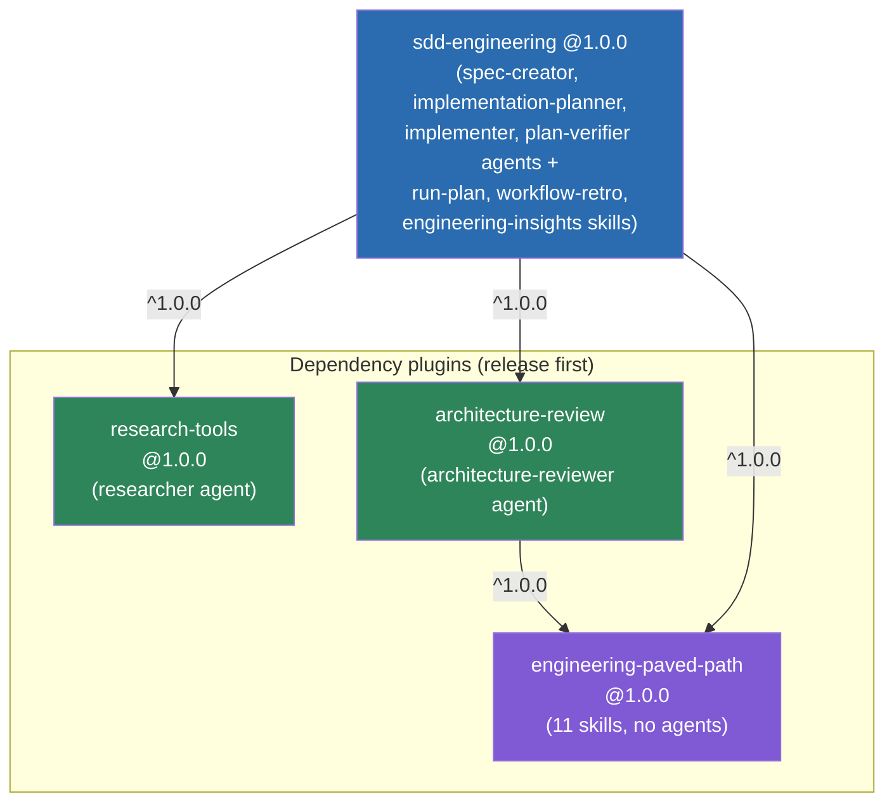
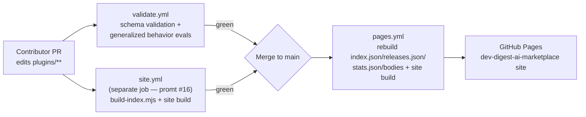
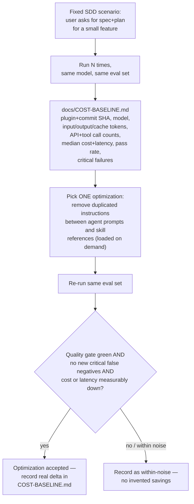

# Architecture Spec: DevDigest AI Marketplace extraction
Status: reviewed — 6/8 open questions resolved, 2 deferred (see Open questions)
Last reviewed: 2026-08-24
Supersedes: none — new initiative, no prior spec covers this ground

## Overview

This spec plans a **separate GitHub repository**, `dev-digest-ai-marketplace`,
that extracts the reusable half of DevDigest's `.claude/` harness into four
installable Claude Code plugins (`engineering-paved-path`, `research-tools`,
`architecture-review`, `sdd-engineering`), publishes them through a Claude
Code plugin marketplace manifest, and exposes a static discovery catalog on
GitHub Pages. It is the architecture-level plan for L08's mandatory hands-on
lab and homework ("Plugins + Cost Engineering + Team Rollout"); the optional
"Agent Performance Dashboard" homework item is **out of scope** — it stays
inside DevDigest and will get its own `docs/specs/client/SPEC-NN-*.md`
feature spec later.

This document describes **a new repository that does not exist as code
yet** — it is a target architecture, not a description of an implemented
system. Nothing under `dev-digest/**` changes as a result of this spec; the
work product is `dev-digest-ai-marketplace`, built and reviewed separately.

**Resolved:** owner/org is GitHub user `viptech` (confirmed via `gh api
user`). The GitHub repository `viptech/dev-digest-ai-marketplace` already
exists and is empty (confirmed via `gh repo view` on 2026-08-24 —
`isEmpty: true`, no default branch yet). The **local working copy does
not exist yet**: no `dev-digest-ai-marketplace` folder under
`/Users/viptech/dev/ai agent` (sibling to `dev-digest/`). Step 0 of the
build sequence is therefore just `git clone
git@github.com:viptech/dev-digest-ai-marketplace.git` (or `gh repo clone`)
into that path, then scaffold the tree below and make the first commit —
no repo-creation step needed, only cloning.

Why a separate repo instead of a `marketplace/` folder inside DevDigest
(lab step 1's own rationale, carried forward as an invariant): DevDigest
the product and the team's engineering harness have different owners and
different release cadences. A client UI change must never cut a new skill
version, and a skill wording fix must never require a DevDigest product
release.

## Module boundaries

### What is in scope for this extraction

- The four plugins and their manifests, under `plugins/<name>/`.
- The marketplace manifest (`.claude-plugin/marketplace.json`) and per-plugin
  `.claude-plugin/plugin.json`.
- The GitHub Pages discovery catalog (`site/` + `scripts/build-index.mjs`).
- Contribution/security/release scaffolding for the new repo
  (`CONTRIBUTING.md`, `SECURITY.md`, `CODEOWNERS`, `docs/PLUGIN-GUIDELINES.md`,
  `docs/RELEASES.md`, `docs/COST-BASELINE.md`).
- A generalized subset of `evals/` behavior evals, stripped of DevDigest
  fixtures, that exercises the extracted SDD workflow.
- Release/rollback automation (tagging, install/update/rollback rehearsal).

### What is explicitly out of scope (stays in DevDigest)

- DevDigest's own `CLAUDE.md`, product specs (`docs/specs/*.md` at DevDigest
  root), module names, table names, and any other product-specific
  documentation.
- `architecture-reviewer-lite.md` / `architecture-reviewer-strict.md` — these
  are eval-only A/B variants used to benchmark the real
  `architecture-reviewer`, not a shippable agent. They do not appear in any
  plugin.
- `doc-writer` and `test-writer` agents. The lab's own canonical
  `sdd-engineering` composition (hands-on-lab.md step 2 and step 4 file
  trees) lists exactly four agents — `spec-creator`, `implementation-planner`,
  `implementer`, `plan-verifier` — and does not mention `doc-writer` or
  `test-writer`. **Decision:** v1.0.0 follows the lab's list literally and
  does not extract either agent. DevDigest's own `sdd-implement` skill wires
  `doc-writer` (opt-in) and `test-writer` (opt-in) into its loop; the
  extracted `run-plan` skill (see below) intentionally drops both opt-ins for
  v1.0.0. `[NEEDS CLARIFICATION: is dropping doc-writer/test-writer support
  in the extracted skill an acceptable v1.0.0 scope cut, or should a v1.1.0+
  follow-up re-add them as optional dependency-plugin agents once there's a
  second consumer that wants them?]`
- `pr-self-review` and `react-ui-architecture` skills. Neither appears in the
  lab's explicit `engineering-paved-path` list (hands-on-lab.md step 3: "React,
  testing, Next.js, Fastify, architecture, Drizzle, PostgreSQL, Zod,
  TypeScript, security і Mermaid" — eleven categories, eleven skills, no
  more). Not extracted for v1.0.0.
- MCP servers, or any component with network access or embedded credentials
  ("optional integrations" bucket, lab step 2) — none currently exist under
  DevDigest's `.claude/`, so this bucket is empty for v1.0.0. Documented here
  so a future MCP addition to DevDigest doesn't get extracted by default.
- Hooks. DevDigest's `.claude/` currently contains only `agents/`, `skills/`,
  `settings.local.json`, and `scheduled_tasks.lock` — **no hooks file
  exists**. The lab mentions hooks as part of the "reusable" bucket in step 2
  as a general category; for this specific extraction that bucket is empty.
  Do not invent a hooks directory that has no source material.

### Extraction inventory

Four categories per lab step 2, applied to DevDigest's actual `.claude/`
contents as of 2026-08-24:

| Category | Contents | Disposition |
|---|---|---|
| Reusable (generalized) | `spec-creator`, `implementation-planner`, `implementer`, `plan-verifier`, `researcher`, `architecture-reviewer` (agents); `sdd-implement` → extracted as `run-plan`, `workflow-retro`, `engineering-insights` (skills, after de-DevDigesting); `react-best-practices`, `react-testing-library`, `next-best-practices`, `fastify-best-practices`, `onion-architecture`, `drizzle-orm-patterns`, `postgresql-table-design`, `zod`, `typescript-expert`, `security`, `mermaid-diagram` (skills); a generalized subset of `evals/skills`, `evals/agents`, `evals/workflow` | Extracted into the four plugins (mapping below) |
| Project-specific | DevDigest `CLAUDE.md`, `docs/specs/*.md`, `INSIGHTS.md` (root + per-module), module/table names (`reviewer-core`, `@devdigest/shared`, `pulls`, `findings_summary`, …), `~/.devdigest/secrets.json` path | Left in DevDigest; extracted agents/skills must not reference any of these by name (see Invariants) |
| Optional integrations | (none present) | N/A for v1.0.0 |
| Local leftovers | `.claude/settings.local.json`, `.claude/scheduled_tasks.lock`, any personal memory/cache | Never extracted |

Per-plugin composition (facts only — no invented agents/skills):

| Plugin | Agents | Skills | Depends on |
|---|---|---|---|
| `engineering-paved-path` | — | `react-best-practices`, `react-testing-library`, `next-best-practices`, `fastify-best-practices`, `onion-architecture`, `drizzle-orm-patterns`, `postgresql-table-design`, `zod`, `typescript-expert`, `security`, `mermaid-diagram` | none |
| `research-tools` | `researcher` | — | none |
| `architecture-review` | `architecture-reviewer` (generalized — see Invariants) | — | `engineering-paved-path@^1.0.0` |
| `sdd-engineering` | `spec-creator`, `implementation-planner`, `implementer`, `plan-verifier` | `run-plan` (= extracted `sdd-implement`, renamed — see decision below), `workflow-retro`, `engineering-insights` (generalized) | `engineering-paved-path@^1.0.0`, `research-tools@^1.0.0`, `architecture-review@^1.0.0` |

**Decision — `run-plan` naming, made explicit per the task's ask:** DevDigest
has no skill literally named `run-plan`; the lab's canonical `sdd-engineering`
tree (step 4) expects one. The closest functional match in DevDigest is
`sdd-implement` (`.claude/skills/sdd-implement/SKILL.md`), which already
implements exactly the role the lab describes for `run-plan`: it takes an
approved plan, dispatches `implementer`, then loops
`plan-verifier`/`architecture-reviewer` with a shared 3-round cap, and
optionally runs `doc-writer` (dropped in extraction, see above). **Decision:**
extract `sdd-implement`'s content under the skill directory name `run-plan`
in the new repo — the marketplace is a new product, not bound to DevDigest's
internal naming, and matching the lab's own canonical name avoids a
permanent naming mismatch against every future lab reference to
`run-plan`. Update the `Step 0`/"When to use" prose during the editorial
pass (see Invariants) to say "plan" generically rather than referencing
DevDigest's plan-file conventions if any DevDigest-specific phrasing is
found there.

`evals/` generalization: the reusable subset targets the lab's own fixed
scenario ("a user asks for a spec and plan for a small feature") with a
small eval set carrying acceptance criteria (lab "Що підготувати"), covering
at minimum: `spec-creator` produces a spec without implementation details,
`implementation-planner` reads the given spec rather than inventing
requirements, `run-plan` dispatches `implementer`, the review gate invokes
`architecture-reviewer`, `plan-verifier` checks acceptance criteria,
`workflow-retro` only runs on an explicit request, namespaced skills load
without warnings, and the SDD workflow does **not** activate on an unrelated
prompt (lab step 7's negative-eval list). **Resolved fixture scenario:** "add
a dark-mode toggle to a settings screen" — a small, generic UI feature that
names no DevDigest module, table, or path, giving `spec-creator` and
`implementation-planner` enough surface (a UI control, a persisted
preference, an accessibility consideration) to produce a non-trivial
spec/plan pair without any project-specific context.

## Contracts

### Repository layout (target, per lab step 1)

```
dev-digest-ai-marketplace/
├── .claude-plugin/
│   └── marketplace.json
├── .github/workflows/
│   ├── validate.yml        # schema validation + generalized behavior evals
│   ├── site.yml             # PR: build-index + site build (separate job — see below)
│   └── pages.yml            # post-merge: rebuild + publish site/dist to GitHub Pages
├── plugins/
│   ├── engineering-paved-path/
│   ├── research-tools/
│   ├── architecture-review/
│   └── sdd-engineering/
├── docs/
│   ├── PLUGIN-GUIDELINES.md
│   ├── SITE-SPEC.md
│   ├── SECURITY.md
│   ├── RELEASES.md
│   └── COST-BASELINE.md
├── scripts/
│   ├── build-index.mjs
│   ├── release.sh           # tag dependencies-then-consumer, per Data flow below
│   └── rollback.sh          # pin stable channel to a released SHA, per Data flow below
├── site/                    # React + TS + Vite catalog SPA (own package.json)
├── CODEOWNERS
├── CONTRIBUTING.md
└── README.md
```

Per-plugin layout (illustrated for `sdd-engineering`, lab step 4):

```
plugins/sdd-engineering/
├── .claude-plugin/
│   └── plugin.json
├── skills/
│   ├── run-plan/
│   ├── workflow-retro/
│   └── engineering-insights/
├── agents/
│   ├── spec-creator.md
│   ├── implementation-planner.md
│   ├── implementer.md
│   └── plan-verifier.md
├── evals/
├── README.md
├── CHANGELOG.md
└── COMPATIBILITY.md
```

`engineering-paved-path`, `research-tools`, and `architecture-review` follow
the same shape minus the pieces they don't own (e.g.
`engineering-paved-path` has `skills/` only, no `agents/`).

### `.claude-plugin/plugin.json` (dependency declaration)

`plugin.json` is the **single source of truth** for a plugin's own
composition (agents/skills it ships) and its `dependencies` array — the
marketplace entry only carries `source` and catalog metadata, and must not
duplicate version/component definitions (lab step 5, explicit non-duplication
rule):

```json
{
  "name": "sdd-engineering",
  "version": "1.0.0",
  "dependencies": [
    { "name": "engineering-paved-path", "version": "^1.0.0" },
    { "name": "research-tools", "version": "^1.0.0" },
    { "name": "architecture-review", "version": "^1.0.0" }
  ]
}
```

`architecture-review`'s own `plugin.json` carries its own dependency on
`engineering-paved-path@^1.0.0` (promt #14's explicit confirmation that this
edge was missing from an earlier draft and had to be added).

### `.claude-plugin/marketplace.json`

```json
{
  "$schema": "https://json.schemastore.org/claude-code-marketplace.json",
  "name": "dev-digest-ai-marketplace",
  "owner": { "name": "viptech" },
  "plugins": [
    { "name": "engineering-paved-path", "source": "./plugins/engineering-paved-path" },
    { "name": "research-tools", "source": "./plugins/research-tools" },
    { "name": "architecture-review", "source": "./plugins/architecture-review" },
    { "name": "sdd-engineering", "source": "./plugins/sdd-engineering" }
  ]
}
```

**Resolved:** owner is GitHub user `viptech` (confirmed via `gh api user`).
Every install example in this spec uses `viptech/dev-digest-ai-marketplace`,
replacing the lab material's placeholder `burnjohn/...`.

### Namespaced references

Once a component ships from a dependency plugin, every consumer refers to it
by the fully-qualified `<plugin>:<component>` form, never a bare name:
`engineering-paved-path:react-best-practices`,
`engineering-paved-path:onion-architecture`,
`engineering-paved-path:mermaid-diagram`, `research-tools:researcher`,
`architecture-review:architecture-reviewer`. `sdd-engineering`'s own agents
reference these namespaced forms wherever they would otherwise assume a
skill is locally present.

### Tag convention and compatibility

Git-backed dependency resolution expects tags of the shape
`<plugin>--v<version>`:

```
engineering-paved-path--v1.0.0
research-tools--v1.0.0
architecture-review--v1.0.0
sdd-engineering--v1.0.0
```

`COMPATIBILITY.md` (per plugin) pins `Claude Code >=2.1.110` — the version
the lab's dependency-graph/tag-resolution features require. A plugin that
starts depending on a newer CLI capability must raise its own
`COMPATIBILITY.md` floor and record why, rather than silently assuming the
repo-wide floor still holds.

### CLI validation surface (contract the repo must satisfy, not code this
spec writes)

```
claude plugin validate ./plugins/<name>
claude plugin validate .
claude plugin list --json      # must show no dependency-unsatisfied / range-conflict / no-matching-tag
claude plugin tag --dry-run
claude plugin tag --push
```

No documented `--strict` flag exists for `claude plugin validate` — do not
add one to CI invocations (lab step 7's explicit correction).

### GitHub Pages catalog contract

`scripts/build-index.mjs` reads `marketplace.json`, every `plugin.json`,
plugin `README.md`/`CHANGELOG.md`/`COMPATIBILITY.md`, and each skill's
`SKILL.md` frontmatter, and generates (not committed — gitignored, rebuilt
by CI):

```
site/public/
├── index.json     # searchable artifact index: plugins, skills, agents
├── releases.json  # per-plugin version history from CHANGELOG.md + tags
├── stats.json     # counts/summary for the catalog landing page
└── bodies/        # sanitized rendered markdown bodies (README, SKILL.md, …)
```

This is **regenerate-on-build**, not read-live-from-repo at runtime: GitHub
Pages has no backend (promt #2's explicit constraint), so the catalog is
only ever as fresh as the last successful `pages.yml` run after a merge to
`main`. Any new plugin, skill, or version bump requires a merge to `main` to
appear in the published catalog — there is no on-demand reindex path.

`site/` is a React + TypeScript + Vite SPA using **hash routing** (works
without server-side rewrite rules on GitHub Pages):

```
#/
#/search
#/plugin/<name>
#/artifact/<id>
#/whats-new
#/getting-started
```

In-browser search runs through **MiniSearch** over `index.json` fields
(`name`, `description`, `keywords`, README body, `SKILL.md` body). Markdown
bodies render through `marked`, then are **always** passed through
`DOMPurify` before insertion — catalog content originates from repository
markdown, which the site must treat as untrusted HTML input (see Untrusted
inputs analogue under Invariants; this is a product decision the security
skill flags even in an architecture-level document, not implementation
detail).

Plugin detail page shows version, owner, compatibility, dependencies,
composition (agents/skills), and a copy-pasteable install command:

```
/plugin install sdd-engineering@dev-digest-ai-marketplace
```

Translations live in **one dedicated i18n file**, never hardcoded inside
components (promt #16) — **resolved:** a single flat JSON dictionary,
`site/src/i18n/en.json` (`{ "search.placeholder": "Search plugins…", ... }`),
loaded through a small `useT('key')` hook. English-only for v1.0.0 per the
homework's language requirement; the flat-key shape leaves room for a second
locale file later without a component rewrite, but multi-locale itself is
not in scope now.

**Real-data-only requirement (promt #11):** the catalog must never render
fixture/placeholder plugins, skills, or version numbers — `index.json` is
generated exclusively from what actually exists in `plugins/` and
`marketplace.json` at build time. No seed/demo data ships in `site/public/`.

**Local dev server (promt #10):** `site/` ships its own dev script
(`npm run dev` inside `site/`, per lab step 6's local verification commands
`npm run build:index && cd site && npm ci && npm run build && npm run
preview`) so a contributor can preview catalog changes without waiting on
CI.

**Additional catalog features beyond keyword search + install command —
resolved, three items (default picked from the candidate list; owner did
not respond to the follow-up selection, so the three highest-value,
lowest-build-cost candidates are taken as the working scope — revisit
before `docs/SITE-SPEC.md` is finalized if a different set is wanted):**

1. **Dependency-graph visualization** — a small diagram on a plugin's detail
   page showing what it depends on and (for `engineering-paved-path`) what
   depends on it. Reuses the same edges as the Mermaid graph in Data flow
   above, rendered from `index.json`'s dependency data, not hand-maintained.
2. **"What's new" aggregation** (`#/whats-new`) — a feed assembled at
   build time from every plugin's `CHANGELOG.md`, newest entries first
   across all four plugins.
3. **Version/compatibility badges** — on every plugin card and detail page:
   current version and the `COMPATIBILITY.md` floor, so a visitor sees
   install eligibility before running the install command.

Dropped for v1.0.0 (smallest cut, can return in 1.1.0+): cross-links from a
skill's search result directly to its owning plugin's detail page — the
existing plugin detail page already lists its skills, so this is a
convenience layer, not a gap.

### Contribution/security/release documentation contracts

- `CONTRIBUTING.md` — plugin folder structure, manifest field reference,
  dependency rules, pre-PR checks, PR checklist. Written so "a new author can
  prepare a pull request without asking in chat where files belong and what
  to run" (lab step 1's own acceptance bar).
- `SECURITY.md` — forbids secrets and absolute paths in any committed file;
  documents the response if a release ships either anyway.
- `CODEOWNERS` — paired with a branch ruleset requiring the owning team's
  review; enforced at the platform level, not by this spec.
- `docs/PLUGIN-GUIDELINES.md` — the "reusable vs project-specific vs optional
  vs local" categorization framework from Module boundaries above, so future
  extractions from DevDigest (or any other source repo) use the same rubric
  instead of re-deriving it ad hoc.
- `docs/RELEASES.md` — SemVer policy, tag convention, update flow, release
  channels (`latest` vs `stable`), rollback procedure.
- `docs/COST-BASELINE.md` — format specified in Data flow / cost experiment
  below.

### Release/rollback scripts (promt #4 — explicitly requested, therefore a
required deliverable, not optional tooling)

`scripts/release.sh`: given a plugin name and version, verifies
`plugin.json`'s own `dependencies` are already tagged at satisfying versions
(refuses to tag a consumer before its dependencies), reviews
`CHANGELOG.md`, runs `claude plugin tag --dry-run` then, on confirmation,
`claude plugin tag --push`.

`scripts/rollback.sh`: points a target project's `stable` marketplace
channel at a specific prior tag/SHA (e.g. `sdd-engineering--v1.0.0`),
without a fabricated `plugin rollback` command (lab step 11's explicit
correction — no such CLI command exists), and prints the exact sequence of
`claude plugin marketplace`/`claude plugin install`/`--scope` commands a
human runs to execute it, so the rehearsal is reproducible rather than
manual guesswork.

## Data flow

### Dependency graph (plugin resolution)



### Build → catalog publish flow



The site-build job is kept **separate** from `validate.yml`'s harness checks
(promt #16) so a PR's UI clearly distinguishes "does the catalog site build"
from "does the plugin/skill content pass schema+behavior checks" — a
red site-build must never read as a plugin-content failure or vice versa.

### Release / install / update / rollback sequence

```mermaid
sequenceDiagram
    participant Dev as Marketplace repo
    participant Tags as Git tags
    participant Consumer as Consumer project
    participant CLI as Claude Code CLI

    Dev->>Tags: tag engineering-paved-path--v1.0.0
    Dev->>Tags: tag research-tools--v1.0.0
    Dev->>Tags: tag architecture-review--v1.0.0
    Dev->>Tags: tag sdd-engineering--v1.0.0 (last — depends on the three above)

    Consumer->>CLI: claude plugin marketplace add viptech/dev-digest-ai-marketplace --scope project
    Consumer->>CLI: claude plugin install sdd-engineering@dev-digest-ai-marketplace --scope project
    CLI-->>Consumer: installs sdd-engineering + resolves engineering-paved-path, research-tools, architecture-review
    Consumer->>CLI: claude plugin list --json (verify no dependency-unsatisfied/range-conflict/no-matching-tag)

    Note over Dev,Consumer: --- later: 1.1.0 update ---
    Dev->>Tags: tag sdd-engineering--v1.1.0 (backward-compatible: spec-creator requires AC per requirement)
    Consumer->>CLI: claude plugin marketplace update dev-digest-ai-marketplace
    Consumer->>CLI: claude plugin update sdd-engineering@dev-digest-ai-marketplace --scope project
    CLI-->>Consumer: new version active after /reload-plugins or new session

    Note over Dev,Consumer: --- rollback rehearsal ---
    Consumer->>CLI: switch to stable channel pinned at sdd-engineering--v1.0.0 SHA
    CLI-->>Consumer: sdd-engineering@1.0.0 active again; smoke eval green
```

### Cost baseline experiment flow



Constraint carried into Invariants: never change the model **and** the
routing/instruction-dedup optimization in the same experiment — the delta
must be attributable to one variable.

## Stack

- **Plugin/marketplace layer**: Claude Code plugin format
  (`.claude-plugin/plugin.json`, `.claude-plugin/marketplace.json`), Claude
  Code CLI `>=2.1.110` (per `COMPATIBILITY.md`), Git tags as the
  dependency-resolution mechanism for Git-backed sources.
- **Catalog site (`site/`)**: React + TypeScript + Vite. **Resolved:**
  routing via a hand-written minimal hash-router hook (~20 lines: a
  `useHashRoute()` that reads `window.location.hash`, matches it against
  the six `#/...` patterns above, and re-renders on `hashchange`) — no
  `react-router` dependency, since the route surface is fixed and small.
  MiniSearch for client-side search, `marked` for Markdown → HTML,
  `DOMPurify` for sanitizing that HTML before render.
- **Index build**: Node.js script `scripts/build-index.mjs` (no framework —
  reads repo files, writes `site/public/*.json` + `bodies/`).
- **CI**: GitHub Actions — `validate.yml` (schema validation + generalized
  behavior evals), `site.yml` (PR-time index+site build, separate job per
  promt #16), `pages.yml` (post-merge rebuild + publish).
- **Package manager**: **Resolved: npm**, everywhere in this repo (root and
  `site/`) — confirmed by the owner; also matches the lab's own
  local-verification commands (`npm run build:index`, `cd site && npm ci`).
- **Evals**: generalized subset of the same engine described in
  `evals/README.md` (Vitest + Claude Agent SDK, `EVAL_BACKEND=subscription`
  by default), copied and stripped of DevDigest fixtures — not a new eval
  engine.
- **Secrets**: none committed anywhere in this repo, by `SECURITY.md`
  policy (see Invariants) — no DevDigest-style `~/.devdigest/secrets.json`
  chokepoint carries over, because no extracted component performs network
  calls requiring credentials.

## Invariants

These must hold regardless of which plugin, skill, or catalog feature is
added next.

- The system (shall) never publish a `sdd-engineering` release before its
  three declared dependencies (`engineering-paved-path`,
  `research-tools`, `architecture-review`) are tagged at a satisfying
  version — dependencies release first, consumer last, always (lab step 9,
  `scripts/release.sh` above).
- The system (shall) never mutate an already-pushed tag
  (`<plugin>--v<version>`) — a tag is immutable once it points at a
  CI-green commit; a fix ships as a new version, not a rewritten tag.
- IF an extracted skill or agent file references a DevDigest-specific path,
  module name, table name, or repository name (e.g. `reviewer-core`,
  `@devdigest/shared`, `~/.devdigest/secrets.json`, any `server/src/...`
  path), THEN the system (shall) treat this as a blocking extraction defect
  — the editorial pass (lab step 4) exists specifically to catch and remove
  these before a component is considered generalized. This applies to
  `architecture-reviewer` in particular: it (shall) read repository-local
  architecture docs supplied by the consumer project at runtime, never a
  hardcoded check against `reviewer-core`, `server/`, or `@devdigest/shared`.
- The system (shall) reference every dependency-plugin component by its
  fully-qualified `<plugin>:<component>` name from any consumer — no bare
  cross-plugin reference.
- WHILE a plugin-level script needs its own plugin's root, the system
  (shall) resolve it via `${CLAUDE_PLUGIN_ROOT}`; WHILE a script lives
  inside a specific skill, the system (shall) resolve it via
  `${CLAUDE_SKILL_DIR}` — never a hardcoded relative path assuming a
  specific install location (lab step 4's explicit convention; also called
  out for `workflow-retro/scripts/analyze_journals.py` at lab step 10).
- IF a manifest (`plugin.json` or `marketplace.json`) would need a
  credential or secret value to function, THEN the system (shall) refuse to
  add it — manifests never carry credentials; this repo ships nothing that
  performs an authenticated network call in v1.0.0.
- The system (shall) sanitize every piece of repository-sourced Markdown
  rendered on the catalog site through `DOMPurify` after `marked` — catalog
  content originates from `plugins/**` markdown files across many
  contributors and (shall) be treated as untrusted HTML input, never
  rendered raw.
- The system (shall) build the catalog index (`index.json`,
  `releases.json`, `stats.json`, `bodies/`) exclusively from what exists in
  `plugins/` and `marketplace.json` at build time — never from seed,
  fixture, or placeholder data (promt #11).
- WHERE the cost-baseline optimization experiment changes agent-prompt/skill
  duplication, the system (shall) hold the model and routing constant across
  the before/after comparison — changing more than one variable at once
  invalidates the measured delta.
- IF a cost-baseline delta falls within run-to-run noise, THEN the system
  (shall) record it as "within noise" in `docs/COST-BASELINE.md` rather than
  reporting an invented saving.
- The system (shall) keep every committed file's prose in English —
  `CONTRIBUTING.md`, `SECURITY.md`, `RELEASES.md`, `COST-BASELINE.md`, every
  `README.md`, every skill/agent body, and code comments alike (promts
  #18–#19: no Ukrainian comments anywhere in this repo, verified before each
  PR that touches extracted content).
- IF a target consumer project already has local copies of the same
  agents/skills this marketplace ships, THEN installation guidance (shall)
  warn that trace/telemetry cannot distinguish "plugin ran" from "local copy
  ran" until the local copies are removed (lab step 10's explicit
  precondition).

### Acceptance criteria (EARS)

Traced to the homework's mandatory acceptance criteria
(`10-domashnie-zavdannya.md`) and the lab's own end-of-lab checklist,
excluding the optional Agent Performance Dashboard item.

- **AC-1** (event-driven). WHEN `sdd-engineering@1.0.0` is installed into a
  target project that has no local copies of its agents/skills, the system
  (shall) run the full SDD workflow (`spec-creator` →
  `implementation-planner` → `run-plan` → `implementer` →
  `plan-verifier`/`architecture-reviewer` review gate) using only files
  delivered by the plugin and its declared dependencies — no DevDigest-local
  file is read.
- **AC-2** (unwanted behavior). IF `claude plugin list --json` is run after
  installing `sdd-engineering@dev-digest-ai-marketplace`, THEN the system
  (shall) report no `dependency-unsatisfied`, `range-conflict`, or
  `no-matching-tag` entries for any of the four plugins.
- **AC-3** (ubiquitous). The catalog UI (shall) show the currently published
  version and dependency list for every plugin, matching each plugin's own
  `plugin.json` at the commit `pages.yml` last built from.
- **AC-4** (event-driven). WHEN a trace or telemetry capture is inspected
  after a workflow run through the installed plugin, the system (shall)
  show the active plugin name and version, plus the resolved dependency
  plugins/versions.
- **AC-5** (event-driven). WHEN the 1.1.0 behavior change ships (`spec-creator`
  requires every mandatory requirement to carry an acceptance criterion
  before completing a spec) and its eval runs, the system (shall) report
  that eval passing on 1.1.0 and — for the specific new-requirement case —
  failing or not-applicable on 1.0.0, demonstrating the behavior is new, not
  incidental.
- **AC-6** (ubiquitous). `docs/COST-BASELINE.md` (shall) record cost per
  successful workflow run both before and after the agent-prompt/skill
  instruction-dedup optimization, using the same fixed eval set and model
  for both measurements.
- **AC-7** (event-driven). WHEN the stable channel is activated in place of
  latest and `sdd-engineering` is reinstalled from it, the system (shall)
  resolve to `sdd-engineering@1.0.0` (pinned SHA) and a smoke eval covering
  the core spec→plan→implement→review path (shall) pass.
- **AC-8** (unwanted behavior). IF any committed file under
  `dev-digest-ai-marketplace` contains an absolute local filesystem path or a
  literal secret/credential value, THEN CI (shall) fail the PR before merge
  (`SECURITY.md`'s policy, enforced by `validate.yml`).
- **AC-9** (unwanted behavior). IF an unrelated prompt is sent to a project
  with `sdd-engineering` installed, THEN the SDD workflow (shall) not
  activate — mirrors the lab's negative-eval requirement (hands-on-lab.md
  step 7) and must be covered by the generalized eval set's negative case.

### Open questions

Resolved during review with the owner (2026-08-24), tracked here for
traceability — six of eight are now decided (see the referenced sections);
two remain genuinely open because they need a fact only the owner has, not
a design choice:

1. ~~GitHub org/owner~~ — **resolved:** `viptech` (see Overview, Contracts).
2. ~~Install target~~ — **resolved:** `plugin-install-target`, a fresh
   minimal Node.js project at
   `/Users/viptech/dev/ai agent/plugin-install-target` (own git repo, own
   `CLAUDE.md`, `npm test` running `node --test` against a real `greet.js`
   module + its test, verified green). It ships no `.claude/agents/` or
   `.claude/skills/` of its own — any SDD agent/skill trace observed there
   after install must have come from the plugin, not a local copy.
3. ~~Additional catalog features~~ — **resolved:** dependency-graph
   visualization, "what's new" aggregation, version/compatibility badges
   (see Contracts § GitHub Pages catalog contract).
4. ~~Translations-file format~~ — **resolved:** flat JSON at
   `site/src/i18n/en.json` (see Contracts § GitHub Pages catalog contract).
5. `[NEEDS CLARIFICATION]` Whether `doc-writer`/`test-writer` support should
   return to the extracted `run-plan` skill in a later version once a second
   consumer wants it, or stay DevDigest-only permanently — genuinely
   deferred, not a fact to look up; revisit at the 1.1.0+ planning point
   rather than blocking v1.0.0.
6. ~~Package manager~~ — **resolved:** npm everywhere in the new repo (see
   Stack).
7. ~~Eval fixture content~~ — **resolved:** "add a dark-mode toggle to a
   settings screen" (see the `evals/` generalization paragraph above).
8. ~~Hash-router library~~ — **resolved:** hand-written minimal hook, no
   dependency (see Stack).
