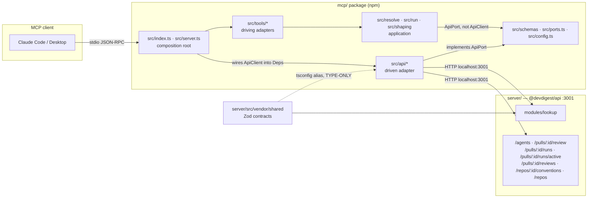
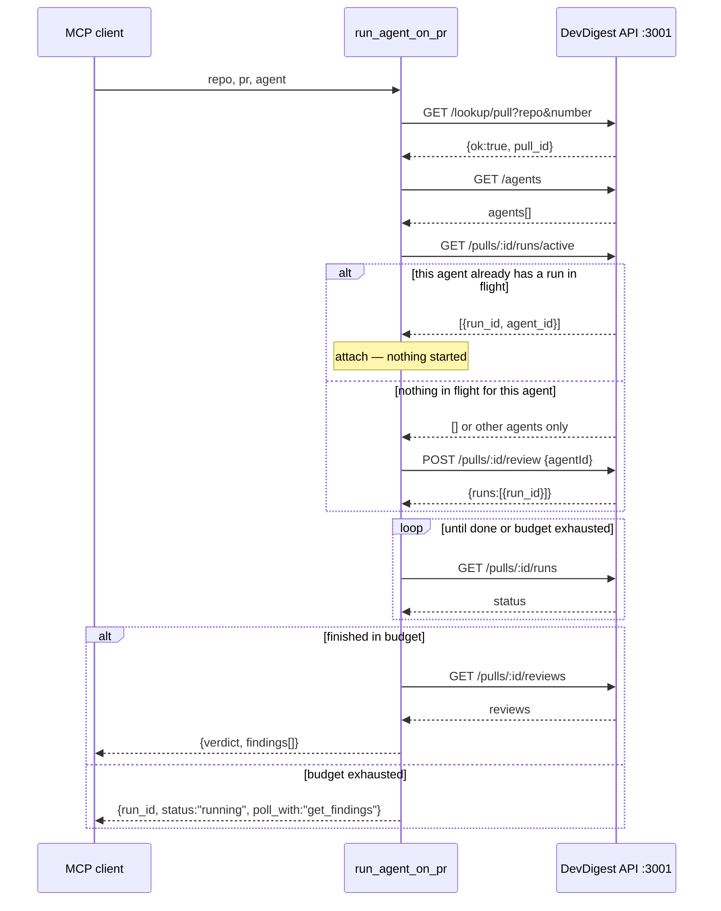

# MCP Server (`mcp/`)

`mcp/` is a standalone Node package that exposes DevDigest's pull-request review over
local **stdio** as five [MCP](https://modelcontextprotocol.io) tools, so an MCP client —
Claude Code first, Claude Desktop second — can review a pull request, read back its
findings, list configured agents, or read a repo's coding conventions without leaving
the conversation. It talks HTTP to the existing `@devdigest/api` server on
`http://localhost:3001` (`cd server && pnpm dev`); it never imports server code, never
opens a database connection, and never touches Postgres.

Registration and an end-to-end verification walkthrough are documented in
[`mcp/README.md`](../README.md) — this document does not repeat that. What follows is
the architecture: the five tools' contracts, the package's own ring model, why the
server gained one new HTTP route instead of resolving everything client-side, why the
long-running review call polls instead of streaming, what "idempotent" actually means
here and what it costs, how a findings list is shaped down to what a model should read,
every error path, and the one tool that is a deliberate stub.

Design background for readers who want the discussion that produced this shape —
including the trade-offs that were rejected — lives in
[`docs/plans/05-mcp-server.md`](../../docs/plans/05-mcp-server.md) §5. This document
does not restate that discussion structurally (no waves, no task ids); it describes the
package as it behaves today, grounded in the code that actually shipped, which in a few
places (noted below) took a slightly different shape than that plan's draft prose.

## The five tools

Exactly five tools are registered, and no others: `list_agents`, `run_agent_on_pr`,
`get_findings`, `get_conventions`, `get_blast_radius`. The names are **bare** — no
`devdigest_` prefix. That is a deliberate choice, not an oversight: the collision risk
with another MCP server exposing, say, its own `get_findings` in the same client
session is real and has been accepted. Every registration goes through
`registerTool` (`mcp/src/tools/_register.ts`), which enforces four things no handler
can forget: a valid name (1–64 characters, `^[A-Za-z0-9_.\-/]+$`), all five
`McpServer.registerTool` config keys present (`title`, `description`, `inputSchema`,
`outputSchema`, `annotations`), a `description` under the 2048-byte UTF-8 budget
(measured with `Buffer.byteLength`, and it **throws at registration** rather than
silently truncating), and a flat `inputSchema` — no property whose Zod type is an
object or an array, because every tool argument is a separate primitive value.

Every tool description below is frozen, approved copy — quoted verbatim from
`mcp/src/tools/*.ts` — and is not meant to be improved on casually; each byte count is
asserted by a test at registration time.

### `list_agents()`

> List the reviewer agents configured in DevDigest, each with its id, name, model and
> enabled flag. Call this first to obtain a valid `agent` value for `run_agent_on_pr` —
> agent ids are uuids and cannot be guessed. Returns one short line per agent; never the
> agent's system prompt or output schema.

298 UTF-8 bytes. No arguments. Thin by construction: one `ApiPort.listAgents()` call,
no filtering, no reordering.

**Output:** `{ agents: [{ id, name, model, enabled }] }` — nothing else. In particular,
never a `system_prompt` or an `output_schema`: those exist for the web UI, not for a
model deciding which agent to run.

### `run_agent_on_pr(repo, pr, agent, response_format?)`

> Review one GitHub pull request with one DevDigest agent and return the findings.
> Performs the whole arc in a single call: resolves the pull request, attaches to a
> matching review already in flight or else starts a new run, waits for it, and returns
> {verdict, score, counts, findings[]}.
>
> `repo` is "owner/name", `pr` is the pull request number, `agent` is an id from
> `list_agents`.
>
> If the review is still running when the wait budget expires (default 90s), returns
> {run_id, status:"running", poll_with:"get_findings"} instead. That is a normal
> result, not a failure — call `get_findings` with the same `repo` and `pr` a minute
> later.
>
> Findings are capped at 20, most severe first. Pass `response_format:"detailed"` only
> when you need each finding's rationale and suggested fix.

780 UTF-8 bytes — the longest of the five, deliberately: it is the only tool with a
non-obvious contract. The sentence *"That is a normal result, not a failure"* is
load-bearing: it is what stops a model from reading `status:"running"` as an error and
retrying, which would otherwise be the one call pattern that could start two reviews of
the same agent on the same PR.

**Arguments:**

| Name | Type | Required | Notes |
|---|---|---|---|
| `repo` | string | yes | `"owner/name"`, validated against `^[A-Za-z0-9._-]+/[A-Za-z0-9._-]+$` before it reaches a URL |
| `pr` | integer | yes | positive, the pull request number |
| `agent` | string | yes | an id (uuid) or name from `list_agents` — matched id-first, then case-insensitive name |
| `response_format` | `"concise" \| "detailed"` | no | defaults to `concise` in the handler, never via a schema `.default()` (see [Response shaping](#response-shaping)) |

**Output** is one flat, wide-optional shape (`mcp/src/schemas/findings.ts`'s
`RunAgentOnPrOutput`) covering three branches, only one of which populates on any given
call:

- **Completed within the budget:** `{ verdict, score, counts: {critical, warning,
  suggestion}, findings: [...], shown, total, note? }` — see
  [Response shaping](#response-shaping) for the finding shape and the cap.
- **Still running when the budget expires:** `isError: false`,
  `{ run_id, status: "running", poll_with: "get_findings" }`. This is not an error —
  it is the hybrid design's expected fallback (see [The hybrid run](#the-hybrid-run--why-polling-beat-sse)).
- **Resolution failure or run failure:** `isError: true`, with either `{}` (a
  resolution failure — never `{findings: []}`, which would misreport "could not
  resolve the PR" as "this PR has zero findings") or `{ run_id, status: "failed" }`
  (the underlying agent run failed).

### `get_findings(repo, pr, agent?, response_format?, severity?, file?)`

> Return the findings of a review that already ran on a pull request, without starting
> a new one. Use it to re-read a result, or to poll after `run_agent_on_pr` returned
> status "running".
>
> `repo` is "owner/name", `pr` is the pull request number. Narrow with `agent` — an id
> or name from `list_agents`, whose latest run is used — and with `severity` and `file`.
>
> Returns {agents[], counts, shown, total} — one entry per agent that reviewed this PR,
> each with its own {agent_name, reviewed, verdict, score, counts, findings[]}. A group
> with "reviewed": false means that agent has no stored result here. Findings are capped
> at 20 across all agents, most severe first. This tool never starts a review — use
> `run_agent_on_pr` for that.

736 UTF-8 bytes. The handler never calls `ApiPort.startReview` — there is no code path
in `get-findings.ts` that could. Under the in-flight-only idempotency rule (see
[Idempotency](#idempotency--in-flight-only)) this is the **only** zero-cost way to
re-read a verdict, which is why "without starting a new one" and "never starts a
review" both appear, one opening the description and one closing it.

**Why the result is grouped by agent (2026-08-23).** A pull holds one review per
agent, and the original flat shape took `verdict`/`score` from `reviews[0]` while
merging every agent's findings underneath them. Live on PR #7 that served five CRITICAL
findings from the API Contract Reviewer under the Performance Reviewer's
`approve`/100. Grouping puts each verdict beside the findings it judged, so the
misattribution is not expressible rather than merely fixed. Two consequences: findings
are no longer deduped ACROSS agents (two agents flagging the same line is two entries,
one per group), and top-level `verdict`/`score` appear only when there are zero or one
groups — with two or more, no single value is true of all of them.

**Why `agent` had to exist.** Without it there was no read path to one agent's stored
result, so "show me the Performance Reviewer's findings" could only be answered by
starting a run — the expensive tool answering a free question. `agent` resolves through
`resolveAgentForRead`, which is `resolveAgent` minus the `enabled` gate: disabled means
"start no new runs with this agent", never "its stored findings are unreadable".

**Why an agent with no stored review is not an error.** It returns `isError: false` with
a single `reviewed: false` group. "Never ran" and "ran and found nothing" are different
answers, and only one of them is a reason to spend a run; collapsing them is what pushed
a caller into starting an unrequested review in the first place.

**Arguments:**

| Name | Type | Required | Notes |
|---|---|---|---|
| `repo` | string | yes | `"owner/name"` |
| `pr` | integer | yes | the pull request number |
| `agent` | string | no | an agent id or name from `list_agents`; that agent's latest run only. Unknown name → `isError`; known agent with no review here → a `reviewed: false` group |
| `response_format` | `"concise" \| "detailed"` | no | same as `run_agent_on_pr` |
| `severity` | `"CRITICAL" \| "WARNING" \| "SUGGESTION"` | no | narrows to one severity |
| `file` | string | no | narrows to findings on exactly this file path (exact match, never a substring) |

**Output:** `{agents[], counts, shown, total, note?}` — and `verdict`/`score` too when
there are at most one group. `run_agent_on_pr` keeps the flat shape: it reports exactly
one run, so it never had the misattribution this grouping prevents. `{}` with
`isError: true` when the PR or the named agent cannot be resolved.

### `get_conventions(repo)`

> Return the coding conventions DevDigest extracted from a repository — the house
> rules its code actually follows. `repo` is "owner/name". Read them before writing or
> reviewing code in that repository, so the change matches existing style instead of
> guessing at it. Returns one line per convention with its status; it reviews nothing
> and starts no run.

352 UTF-8 bytes. See [Tool or Resource?](#get_conventions--tool-or-resource) for why
this ships as a tool rather than an MCP resource.

**Arguments:** `repo` (string, required) — the only argument; there is no PR number in
scope.

**Output:** `{ conventions: [{ rule, status }] }` — only rows whose status is
`accepted`, never `pending` or `rejected`. "One line per convention with its status"
is the promise the description makes, and it is exactly what the handler returns:
nothing about how a rule was extracted, no evidence snippet, no scan timestamp.

### `get_blast_radius(repo, pr)`

> Not implemented — this tool returns an explanation, never data. It is a registered
> placeholder for a future pull request impact map. Do not call it expecting a blast
> radius and do not retry it: use `run_agent_on_pr` for review findings, or
> `get_conventions` for a repository's rules.

285 UTF-8 bytes, and the first two words — "Not implemented" — are load-bearing on
purpose. See [The stub](#the-stub-get_blast_radius) for the full reasoning.

**Arguments:** `repo` (string, required), `pr` (integer, required) — kept, even though
the handler never uses them, so the tool's surface already matches what a real
implementation would need.

**Output:** always `isError: true` with
`{ implemented: false, retry: false, reason, use_instead }`. There is no success
branch.

## Architecture



Everything in `mcp/src/**` reaches DevDigest through the `api/**` adapter and nothing
else. The dotted edge is the only coupling to `server/`, and it disappears at runtime:
`mcp/tsconfig.json` aliases `@devdigest/shared` to `server/src/vendor/shared/index.ts`
so domain types (`Agent`, `ReviewRecord`, `PullLookupResult`, …) are available at
compile time, but every import of them under `mcp/src/**` is `import type` — enforced
by a test, not just a convention — so nothing from the server ever executes inside this
package. `mcp/` also pins its own `zod` independently of `server/`'s; the two packages
sit on different zod minors on purpose, and both typecheck, because nothing crosses the
type-only boundary at runtime.

## The ring model

`mcp/` has its own onion — a ring model written before the package's first real file
existed, deliberately carried over from the reasoning `server/` uses for its own
`modules/`/`adapters/`/`platform/` layering, but expressed against `mcp/`'s much
smaller, DB-free shape. What transfers is the method, not the folder names: **a ring is
a set of paths, and the only rule is which paths may appear in which file's import
list.** That is checkable by eye, by grep, and by `mcp/test/rings.test.ts`, which
currently carries 94 assertions walking every source file under `mcp/src/**` — it is
the authority on what is actually enforced, not this document.

### The rings

Paths are relative to `mcp/src/`. Higher number = further out. Outer rings may import
inner rings directly; an inner ring may never import an outer one.

```
  M5  composition root      │ server.ts (buildServer) · index.ts (stdio, process)
  M4  driving adapters      │ tools/*.ts · tools/_register.ts
  M3  driven adapter        │ api/client.ts · api/routes.ts · api/errors.ts
  M2  application           │ resolve/** · run/** · shaping/**
  M1  kernel                │ config.ts
  M0  contracts + ports     │ schemas/** · ports.ts        ← imports `zod` and itself
       ↑ everything points inward. @devdigest/shared sits alongside M0 as a TYPE-ONLY
         source of domain types the package depends on and never the reverse.
```

`tools/**` is to this package what `routes.ts` is to a server module — the transport
edge, and nothing more — and `_register.ts` is where "schema-first at the boundary"
lives, in the absence of a Fastify route-schema gate: it makes `inputSchema` and
`outputSchema` structurally mandatory on every registration, the same guarantee a
`schema.response` declaration buys on the server side.

### The import matrix

Enforced end-to-end by `mcp/test/rings.test.ts`, written to pass against empty
`resolve/`, `run/`, `shaping/` and `tools/` directories and to start failing the moment
a file in one of them violates the matrix.

| Ring | Path | MAY import | MUST NOT import |
|---|---|---|---|
| **M0** contracts + ports | `schemas/**`, `ports.ts` | `zod`, itself, `import type` from `@devdigest/shared` | the SDK, `fetch`, node builtins, any other ring |
| **M1** kernel | `config.ts` | `zod`, M0 | the SDK, `fetch`, M2–M5. The **only** file in the package that may read `process.env` |
| **M2** application | `resolve/**`, `run/**`, `shaping/**` | M0, `import type` from `@devdigest/shared` | `@modelcontextprotocol/sdk`, `fetch`, `api/**` (M2 depends on the **`ApiPort`** interface, never on `ApiClient`), `process.env`, `tools/**`, `server.ts`/`index.ts` |
| **M3** driven adapter | `api/**` | M0, M1's types, `import type` from `@devdigest/shared` | `@modelcontextprotocol/sdk`, `tools/**`, `resolve/**`/`run/**`/`shaping/**`, `server.ts`/`index.ts`. The **only** ring where `fetch()` is called or a bare URL literal (`http://`/`https://`) may appear |
| **M4** driving adapters | `tools/**` | M0, M2, `@modelcontextprotocol/sdk` | `fetch()`, any URL literal, `api/client.ts` directly (a tool receives an `ApiPort` through its `Deps`), `process.env` |
| **M5** composition root | `server.ts`, `index.ts` | everything | nothing — this is what a composition root is for. `index.ts` is additionally the only file that touches the stdio transport or the process |

Three cross-cutting rules, checked independently of the per-ring cells above:

- **No ring reaches sideways.** `resolve/**` does not import `run/**`; `shaping/**`
  imports neither. When two rings inside M2 would otherwise need the same thing, it
  moves down into M0 instead.
- **No cycles.** The relative-import dependency graph of `mcp/src/**` is walked by a
  depth-first search for a back-edge; there is none today.
- **`process.env` is read in exactly one file, `config.ts`.** Every other ring —
  including the composition root — receives an already-parsed configuration object
  through `Deps`, never a raw environment variable.

### Dependency injection

Every unit in the application ring (`resolve/**`, `run/**`, `shaping/**`) takes an
explicit `Deps` interface naming exactly what it uses — never the whole `McpServer`,
never a module-level singleton client, never the whole configuration object. The
concrete `ApiClient` (`api/client.ts`) is constructed exactly once, inside
`buildServer` in `server.ts`; `mcp/test/rings.test.ts` specifically checks that
`ApiClient` is never instantiated at module scope anywhere in the package. A hermetic
test passes an object literal implementing `ApiPort` as `Deps.api` — never a global
`fetch` stub and never a cast.

Two examples, because the shape repeats everywhere in M2:

```ts
// src/ports.ts (M0) — the seam M2 depends on
export interface ApiPort {
  lookupPull(repo: string, number: number): Promise<PullLookupResult>;
  listAgents(): Promise<AgentSummary[]>;
  listRepos(): Promise<RepoSummary[]>;
  listActiveRuns(pullId: string): Promise<ActiveRun[]>;
  startReview(pullId: string, agentId: string): Promise<{ runId: string }>;
  listRuns(pullId: string): Promise<RunStatus[]>;
  listReviews(pullId: string): Promise<ReviewProjection[]>;
  listConventions(repoId: string): Promise<ConventionProjection[]>;
}

// src/run/waiter.ts (M2)
export interface RunWaiterDeps {
  api: ApiPort;
  budgetMs: number;
  sleep: (ms: number) => Promise<void>;
  now: () => number;
}
```

`ApiPort.listRepos()` is not part of the original sketch of this interface — it was
added to resolve `get_conventions(repo)`, which receives no PR number and therefore
cannot resolve through `lookupPull` the way every other tool does. It is backed by
`GET /repos`, a pure DB read with no GitHub call, deliberately not
`GET /repos/:id/pulls` (see [The resolution layer](#the-resolution-layer)). Every
return type on `ApiPort` is a narrow **projection** of the wire contract via
`Pick<...>` against the real `@devdigest/shared` type — `AgentSummary` is
`Pick<Agent, 'id' | 'name' | 'model' | 'enabled'>`, for instance — never the wire
contract verbatim, so the port can only narrow a field, never invent one the server
does not actually send.

The clock and the sleep function are injected too (`RunWaiterDeps.now`/`.sleep`),
which is what lets the wait-budget behaviour be proven with an injected fake clock in
a test rather than a real timer.

### What does not transfer, and why

A handful of rules from the server's own ring model are named here as inapplicable to
`mcp/` rather than silently dropped:

| Rule | Status in `mcp/` | Why |
|---|---|---|
| The persistence ring — `drizzle-orm`, `db/schema`, row types, transactions, unit-of-work | **Inapplicable** | `mcp/` is forbidden from touching a database at all. There is no repository, no persistence ring, and no file under `mcp/src/**` may import `drizzle-orm` or `postgres` — a test greps the whole tree for it. `ApiPort` (over HTTP) is the package's only source of DevDigest data. |
| The `.it.test.ts` suffix and the unit/integration lane split | **Inapplicable** | That suffix rule exists to route DB-backed tests to a different CI lane. Nothing in `mcp/` can touch a database, so **`mcp/` has exactly one test lane** — `npm test`, entirely hermetic, no Docker, no Postgres. |
| Fastify rules — plugin encapsulation, `app.decorate`, hook ordering, `schema.response` | **Inapplicable** | `mcp/` runs no HTTP server; it is an HTTP *client* of the DevDigest API and an stdio *server* to the MCP client. The nearest analogue to a route schema gate is `tools/_register.ts`, described above. |
| `modules/<name>/` vertical slices, a shared folder, a DI container | **Not adopted** | `mcp/` is roughly fifteen source files. A package this small does not need the module-slicing machinery a much larger server benefits from; the ring model here applies to the whole package, not to a slice inside it. |
| A ledger of specific known violations to repair | **Does not bind `mcp/`** | Such a ledger is a list of concrete files in an existing codebase that accreted before its rules were written down. `mcp/` is greenfield and its ring model existed before its first file did — there is nothing yet to grandfather. |
| "The wire contract is the domain type, do not build a parallel model" | **Adopted, then deliberately narrowed** | Inside `server/`, the wire contract genuinely is the one domain model. Here, the wire contract is not what a model is allowed to see: an `outputSchema` is a hand-narrowed projection (see [Response shaping](#response-shaping)), because a domain contract handed to an LLM spends tokens on fields — `accepted_at`, `system_prompt`, `evidence_snippet` — no tool caller needs. There is still exactly one source of truth, `@devdigest/shared`; `mcp/` re-derives nothing from it independently, it only narrows. |

### The test lane

| Ring | What a test exercises |
|---|---|
| M0 / M1 / M2 | a hermetic unit test, `Deps` supplied as a plain object literal, no `fetch` stub needed |
| M3 (`api/**`) | the one ring where stubbing `fetch` is the right tool, because it is the adapter under test |
| M4 / M5 | registration and protocol tests over `buildServer(deps)` with a fake `ApiPort`, no real transport, no socket |

All of it runs in one command, `cd mcp && npm test`. There is a single lane because
there is no database to split a second lane around.

## The resolution layer

The five tools speak human coordinates — `repo = "owner/name"`, `pr = <number>`. Every
existing DevDigest API route is keyed by an internal uuid, and there was no "get pull
by number" route before this package existed. Three ways to close that gap were
weighed:

| Option | What it costs | Verdict |
|---|---|---|
| Resolve entirely inside `mcp/`: `GET /repos` to match `full_name`, then `GET /repos/:id/pulls` to match the PR number | `GET /repos/:id/pulls` **syncs from GitHub before it answers** — it lists pull requests from the GitHub API and upserts every one of them. Every `run_agent_on_pr` call would trigger a full GitHub PR-list sync on what the caller thinks is a read: slow, GitHub-rate-limited, degraded when offline, and a genuine *write*. Two round trips minimum, and the matching logic would be duplicated in a second language. | Rejected |
| A new read-only route in `server/`, `GET /lookup/pull?repo=&number=` | One database read joining the repos and pull-requests tables, no GitHub call, no write. The "not found, here are the near matches" payload is built exactly where the data already lives. Costs one new contract type, one new small module, one route. | **Chosen** |
| Add the route onto the existing `pulls/` module | Same benefit as the option above, but that module's route file already mixes ~18 inline database queries directly into HTTP handlers with no service or repository layer of its own — extending it would either repeat that shape or drag a larger extraction into this package's scope. It would also put a static `/pulls/lookup` path segment in front of the existing `/pulls/:id` route, a router-precedence subtlety nobody needs. | Rejected |

**Chosen:** a new `modules/lookup/` module in `server/`, structured cleanly from the
start — `routes.ts` → `service.ts` → `repository.ts` — registered alongside every other
module. It is genuinely cross-aggregate (it joins the repos and pull-requests tables),
so it belongs to neither of the two existing modules that touch those tables
individually. The module ships **exactly one route**: `GET /lookup/pull`, answering
`200` with a discriminated union — `{ ok: true, pull: {repo_id, pull_id, number,
full_name, head_sha, title, status} }` on a match, or
`{ ok: false, reason: "repo_not_found" | "pull_not_found", message, candidates[] }`
otherwise, where `candidates` is the imported repos' names (on a repo miss) or the
known PR numbers for that repo (on a PR miss) — so a tool's error message can name a
concrete next step without a second request.

An earlier draft of this module paired it with a second route,
`GET /lookup/run?pull_id=&agent_id=&head_sha=`, to answer whether a run for a given
commit already existed. That route was cut: the existing
`GET /pulls/:id/runs/active` route already returns every currently-`running` run for a
pull, each carrying `run_id` and `agent_id`, which is exactly the question the
idempotency check below needs answered. A second public endpoint with zero callers is
not a smaller cost than a missing one.

**Caching.** `mcp/`'s resolver (`resolve/cache.ts`, `resolve/resolver.ts`) memoizes the
`owner/name → repo_id` mapping in-process for the life of the server process, with a
5-minute TTL — repos are added rarely and their ids never change once assigned. Two
things this cache deliberately never does: it never caches a **negative** result
("this repo is not imported" must become false the instant the user imports it, or the
cache would be teaching the model a lie), and it never caches a **PR-level** lookup — a
PR's title, status and head commit move underneath the caller, and a stale `pull_id`
would silently point a review at the wrong content.

## The hybrid run — why polling beat SSE

Starting a review (`POST /pulls/:id/review`) returns immediately with the run's id and
an empty `reviews` array — the review itself runs in the background. Something on the
`mcp/` side has to wait for it, and two mechanisms were weighed:

| | SSE (`GET /runs/:id/events`) | Polling (`GET /pulls/:id/runs`) |
|---|---|---|
| Latency to "done" | immediate | up to one poll interval |
| Robustness | the server's run-event bus is an in-memory, process-lifetime singleton. Restart the API between the `POST` and the SSE subscribe and the stream simply hangs — there is nothing left to replay | run status lives in Postgres and survives an API restart |
| Cost inside `mcp/` | an SSE frame parser, plus explicit CRLF-safe line splitting on Windows | one `fetch` and one `JSON.parse` |
| Verdict | **rejected as the wait mechanism** | **chosen** |



**Cadence and deadline discipline.** The waiter (`run/waiter.ts`) polls first after 1.5
seconds, then every 3 seconds thereafter. Over the default 90-second budget that is
around 30 requests — comfortably inside the API's global rate limit — and the tool
issues at most one `POST /pulls/:id/review` regardless of how long the wait runs. The
overall budget is enforced by racing each poll against the *remaining* time on the
budget (`Promise.race` between the API call and a `sleep(remainingMs)`), so a call that
never resolves cannot hang the tool past its deadline; this is independent of, and
narrower than, the 15-second per-HTTP-request timeout the adapter (`api/client.ts`)
applies to every individual `fetch` via `AbortSignal.timeout` — that timeout bounds one
network call, not the whole wait. The wait budget itself is configurable through
`DEVDIGEST_MCP_RUN_BUDGET_MS` (default 90000ms), read once in `config.ts` and never
re-read mid-wait. The wait's clock and sleep function are both injected
(`RunWaiterDeps.now`/`.sleep`), which is what makes "the call never blocks past budget"
provable with a fake clock in a test rather than only observable by watching a real
one run.

**Why hybrid at all.** A tool call could in principle just block until the review
finishes, however long that takes. That shape does not survive contact with how MCP
clients actually behave: automatic backgrounding of a long-running call is not
guaranteed across every execution mode a client might run in (a subagent call, an IDE
server, non-interactive mode), and a client-side idle or tool timeout can still cut a
call off regardless. A bounded wait with a documented, actionable fallback —
`{run_id, status:"running", poll_with:"get_findings"}` — is the shape that behaves the
same everywhere, rather than depending on a client capability that cannot be verified
from inside this package.

## Idempotency — in-flight only

The key is **`(pull_id, agent_id)`**, and it matches only a run that is **still
running**. There is no third state.

1. `GET /lookup/pull` resolves `repo` + `pr` to a `pull_id`; `GET /agents` (or an id
   passed directly) resolves `agent` to an `agent_id`.
2. `GET /pulls/:id/runs/active` — the server's own source of truth for in-flight work
   — returns every run on that pull whose status is currently `running`, each carrying
   `run_id` and `agent_id`.
3. **A match on `agent_id` → attach.** The tool waits on that existing run and starts
   nothing new.
   **No match → start.** The tool calls `POST /pulls/:id/review {agentId}`.

A `done`, `failed`, or `cancelled` run for that agent is **never reused**, no matter
what commit it reviewed. This is the fact most likely to surprise a future reader, so
it is stated plainly: **calling `run_agent_on_pr` a second time on a pull request whose
commit has not changed since the last successful review runs a brand-new review and
pays for it again.** That is not an edge case — an agent that returns to the same PR in
a later conversation turn hits it on every return visit.

Two things keep that cost from compounding further:

- **The failure that would actually be expensive is still prevented.** Two calls
  racing inside the same conversation — a model retrying because it read
  `status:"running"` as an error rather than the documented normal result — can never
  start two concurrent runs of the same agent on the same pull. That is exactly what
  the attach branch exists to stop.
- **`get_findings` is the zero-cost path, and both tool descriptions say so.**
  `get_findings` returns the last persisted review's verdict for a pull without
  starting anything, `run_agent_on_pr`'s own description points at it by name for the
  "still running" case, and `get_findings`'s description states "without starting a
  new one" and "never starts a review" so a model that has read it has a free way to
  re-read a result rather than re-running one.

**What it would take to change this.** Nothing in the current shape blocks reusing a
finished review of an unchanged commit — the reason it does not happen today is that
`agent_runs` records no head commit for a finished run, so there is nothing to compare
a new request's head commit against. Fixing it is a bounded, known change: add one
additive, nullable `agent_runs.head_sha` column (no destructive migration), write it
wherever an agent run is created — the run-completion write path currently has more
than one call site that would each need the same field — and add a third branch to the
decision above: a `done` run for `(pull_id, agent_id)` whose `head_sha` matches the
pull's *current* head is reused instead of started. That branch does not exist today;
this package always runs a fresh review once no in-flight run is found.

## Response shaping

`get_findings` and `run_agent_on_pr`'s completed branch both return the same shape:

```
{ verdict, score, counts: {critical, warning, suggestion},
  findings: [{severity, file, line, title}],
  shown, total, note? }
```

`response_format: "detailed"` (default is `"concise"`) adds `id`, `end_line`,
`rationale`, `suggestion`, and `confidence` to each finding. The default is applied in
the handler, not by the schema — a wire-schema `.default()` on a *request* field can
silently mask that field being missing under strict structured-output validation, so
`response_format` stays optional on the schema and the handler substitutes
`"concise"` itself when it is absent.

- **A hard cap of 20 findings per response**, one constant
  (`shaping/constants.ts`'s `MAX_FINDINGS`).
- **A total order, not a partial one:** `CRITICAL` before `WARNING` before
  `SUGGESTION`, then `file` ascending, then `start_line` ascending, then `title`
  ascending (`shaping/order.ts`'s `compareFindings`), using plain code-unit string
  comparison rather than locale-aware comparison, which can otherwise vary by build and
  break byte-for-byte reproducibility. This total order is not decorative — a
  comparator that leaves ties unresolved lets the underlying storage's own tie-breaking
  reshuffle an otherwise-identical list between two reads of the same data, which is a
  real bug class this package deliberately designs around. Findings are also
  deduplicated across multiple reviews of the same pull, on the same three fields the
  comparator's tail sorts by (`file`, `start_line`, `title`), which is what makes the
  final order provably total rather than merely usually total.
- **Truncation teaches, rather than just informing.** When the cap actually truncates
  the list, the response carries a `note`: *"Showing 20 of 57 findings, CRITICAL
  first. Narrow with severity='CRITICAL' or file='src/x.ts'."* — it names the two flat
  arguments that exist on the tool, so a follow-up call is narrower rather than a blind
  repeat.
- **No pagination token, ever.** There is deliberately no `nextCursor`, `cursor`,
  `page`, or `offset` field anywhere in the findings shapes. A cursor would invite a
  model to page through dozens of findings one call at a time, which is precisely the
  token spend this whole package is designed to avoid; a hard cap plus a narrowing hint
  produces cheaper, better-targeted follow-up calls instead.
- **A security property falls out of the concise/detailed split.** A finding's
  `rationale` and `suggestion` are free text written by the reviewing model and about
  to be read by another model — the one real prompt-injection surface this package has.
  `concise` (the default) omits both, so untrusted free text only reaches a calling
  model when `detailed` is explicitly requested.

## The error catalogue

Every failure path returns `isError: true` (except the "still running" case, which is
not an error), and the **first sentence names the next action** — a tool to call or a
shell command to run.

| Condition | Message |
|---|---|
| API unreachable | ``DevDigest API is not answering at `http://localhost:3001`. Start it with `cd server && pnpm dev`, then retry.`` |
| API timed out | ``DevDigest API did not answer in time at `http://localhost:3001`. Start it with `cd server && pnpm dev`, then retry.`` |
| API returned a malformed response | ``DevDigest API at `http://localhost:3001` returned a response this server could not parse: <detail>. The API and mcp/ may be on different versions — restart both with `cd server && pnpm dev`.`` |
| Repo not imported | ``Repo `owner/name` is not imported into DevDigest. Imported repos: `a/b`, `c/d`. Import it at <web UI address>, then retry `run_agent_on_pr` or `get_conventions`.`` |
| PR number unknown | ``Repo `owner/name` has no PR #123 in DevDigest. Known PRs: #45, #46, #48. Retry `run_agent_on_pr` with a known number.`` |
| Agent not found | ``Agent `x` not found — call `list_agents` for valid ids.`` |
| Agent disabled | ``Agent `x` is disabled. Call `list_agents` and pick an enabled one, or enable it at <web UI address>/agents.`` |
| Malformed `repo` argument | ``\`repo\` must be `owner/name`, e.g. `maxfurmanov/devdigest`. Got `x`. Retry `run_agent_on_pr`, `get_findings`, or `get_conventions` with a valid value.`` |
| Wait budget exhausted | *not an error* — `isError: false`, `{run_id, status:"running", poll_with:"get_findings"}`, message: "Still running after 90s. Call `get_findings` with the same repo and pr in a minute." |
| The underlying run failed | ``The run failed: `<error>`. Call `list_agents` to check the agent's model, or retry.`` |
| `get_blast_radius` called | see [The stub](#the-stub-get_blast_radius) |

The web-UI-facing entries (repo not imported, agent disabled) take the web UI's
address as a runtime parameter rather than a string literal baked into the message
text — `resolve/messages.ts`'s `repoNotImported`/`agentDisabled` accept an optional
`webUiUrl` and fall back to a slightly less specific phrasing ("in DevDigest's web UI")
when it is not supplied. That is a direct consequence of the ring model above: a bare
URL literal is banned everywhere outside the `api/**` ring and `config.ts`, even inside
message text that is never sent over the network, so the address has to be threaded in
from `config.ts` (the one place it is allowed to live) rather than written inline.

The resolution and run-level messages above live in exactly one file
(`resolve/messages.ts`), as plain functions returning strings — not scattered across
each tool handler — which is what makes it possible to test the whole catalogue in one
pass rather than by spot-checking individual tools. The three API-connectivity
messages (unreachable, timed out, malformed response) live separately, in
`api/errors.ts`, because that ring is the one that actually owns everything a `fetch`
call can fail with.

## The stub (`get_blast_radius`)

`get_blast_radius` is registered — it appears in the tool list a client sees — but
makes **no HTTP call** and holds no reference to the API client at all; there is
nothing in its file that could reach the network even by accident. Wiring it to the
existing (unexposed) blast-radius computation that already exists inside the server's
codebase indexer is left undone on purpose.

There is **no protocol-level MCP convention for a not-implemented tool** — this was
checked against the MCP specification and SDK directly, and came back not found. The
shape used here — `isError: true` with structured content
`{ implemented: false, retry: false, reason, use_instead }`, plus a first sentence that
says the same thing in words — is therefore an **engineering choice made in this
project**, not a standard anyone should assume transfers to another MCP server.

**Why an error rather than a successful empty result.** A successful, empty-looking
result — `isError: false` with, say, an empty impact list — invites a calling model to
report "the blast radius is empty" as a fact, which is a worse failure than a visibly
unavailable one: it looks like an answer. `retry: false` in the structured content and
the phrase "Not implemented" leading the text both exist to stop a model from retrying
in a loop; the `isError: true` flag is what stops the fabrication in the first place.

## `get_conventions`: Tool or Resource?

MCP distinguishes **Tools** (invoked by the model, can take arguments, can have side
effects) from **Resources** (addressed by URI, generally read-only, can be surfaced to
the client without a model deciding to call them). `get_conventions` is read-only and
per-repo, which makes it look, on the surface, like a natural Resource. It ships as a
**Tool** in this package. Three reasons, heaviest first:

1. **A per-repo Resource has to be a template**, something like
   `devdigest://repo/{owner}/{name}/conventions`, rather than one concrete Resource per
   repo (which would require registering one at startup per imported repo and keeping
   that list current). Whether the specific client this package targets first,
   Claude Code, actually enumerates *resource templates* — as opposed to concrete,
   already-registered resources — is **unverified**. Building the primary access path
   for this tool on unconfirmed client behavior would be a real risk for very little
   confirmed benefit.
2. **The "resources cost nothing until read" argument is weaker than it first looks.**
   A deferred tool's full schema also costs nothing until the client searches for it;
   what is always loaded regardless is the tool's *name*, and `get_conventions` is
   fifteen characters. The startup-cost gap between a deferred tool and a Resource is
   much smaller than it would be if tool schemas were always loaded up front.
3. **A Resource cannot take arguments.** It has no equivalent of `response_format` or a
   filter — it has to return everything unconditionally, which runs directly against
   this package's whole approach to keeping responses terse and targeted.

**The one condition that would flip this recommendation:** a spike that concretely
confirms Claude Code enumerates MCP resource templates via the resource-templates
listing call. If that is confirmed, the better shape becomes registering one concrete
resource per imported repo at server startup, in addition to keeping the tool, and then
measuring whether the model actually reaches for the resource over the tool call in
practice. That spike has not been done, and until it has, `get_conventions` stays a
Tool.

## Security posture

- **stdio, local-only, by construction.** This package speaks stdio to its MCP client
  and loopback HTTP to the DevDigest API; it is never exposed as a network service
  itself. Choosing stdio is itself the relevant mitigation for the class of
  confused-deputy and token-passthrough risk that applies to *remote* MCP servers —
  that guidance does not apply here, and nothing in this package should be "hardened"
  to try to satisfy it.
- **No secret is ever a tool parameter.** The DevDigest API needs no credential today.
  If that changes, the credential must come from the same place every other secret in
  this repository comes from — never from a value a calling model can see or invent as
  an argument.
- **Every URL is built in exactly one ring.** `repo`, `agent`, and `file` are all
  model-authored strings that end up interpolated into a request URL. `repo` is
  validated against a strict `owner/name` pattern before it is ever sent, and every
  interpolated value is passed through `encodeURIComponent` and a defensive length cap
  in `api/routes.ts` — the one file that builds every request URL this package ever
  sends. Because URL construction is confined to a single ring, "did we escape
  everything?" is a one-file question rather than a per-handler audit.
- **The API base URL defaults to loopback and refuses a non-loopback host** unless a
  caller explicitly opts in via an environment variable
  (`DEVDIGEST_MCP_ALLOW_REMOTE=1`). A mis-set environment variable must not silently
  point a local agent at someone else's server; the same rule applies to the web UI
  address used in error messages.
- **The injection surface is handled by shaping, not by scanning.** Finding
  `rationale` and `suggestion` are free text written by one model and read by another —
  see [Response shaping](#response-shaping)'s last point. The `concise` default keeps
  that text out of a response unless a caller explicitly asks for it.
