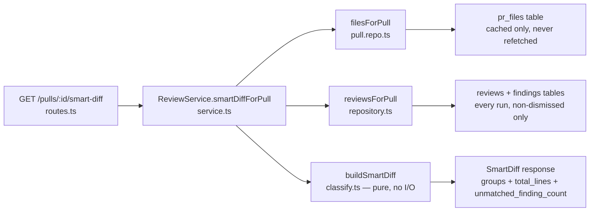

# Smart Diff

Reviewer-ordered view of a PR's changed files: files are grouped by review risk so
business logic is read first and lock files last, and once a review has run, every
finding renders on the exact line it belongs to — one click away from its card in
the Findings tab. Endpoint: `GET /pulls/:id/smart-diff`
(`server/src/modules/reviews/routes.ts:165-172`).

Design background and the decisions that shaped this shape — including two reversed
mid-flight (aggregated chips → one chip per finding; a deleted `pseudocode_summary`
field → kept as an unbuilt placeholder) — live in
[`docs/plans/04-smart-diff.md`](../../docs/plans/04-smart-diff.md), particularly its
decisions ledger (§11) and the post-verification remediation (§12). This document
does not restate that reasoning; it describes the feature as it behaves today.

## Surface

On a PR's **Files changed** tab, a `Smart order | Original order` toggle sits
top-right beside the touched-file count (`client/src/app/repos/[repoId]/pulls/
[number]/_components/DiffTab/DiffTab.tsx:101-108`). **Original order is the
default** — the mode lives in the URL as `?order=smart`, an absent param meaning
original (`page.tsx:71`).

In Smart order, files are partitioned into three sections, always rendered in this
order and always all three: **Core logic** ("The substance of the change — review
closely"), **Wiring** ("Hooks the core into the app"), **Boilerplate** ("Generated /
mechanical — skim"), each showing a file count
(`server/src/modules/reviews/smart-diff/classify.ts:198-201`). A group header is a
heading, not a control — there is no group-level collapse anywhere, on the wire or
in the UI (`SmartDiffGroup` carries no `default_open` field,
`server/src/vendor/shared/contracts/brief.ts:144-151`).

What collapses is each *file's* diff, decided once on the server and carried as
`SmartDiffFile.default_open` (`brief.ts:131-137`, computed in
`classify.ts:132-140`): every Boilerplate file starts collapsed regardless of
findings; a Core or Wiring file with at least one finding starts open, one without
stays shut. A collapsed file's header still shows a coloured dot and a severity
indicator for its findings (`SmartDiffViewer/helpers.ts:143-148`), so a `CRITICAL`
finding inside a generated file is never reachable only by accident.

On an offending line, a coloured left bar and a right-aligned severity chip appear
for every finding anchored to that line — one chip per finding, not an aggregated
count (`SmartDiffViewer/helpers.ts:118-128`). Clicking a chip is an in-app route
transition to `?tab=findings&finding=<id>` (see [Deep link](#deep-link) below). A
file over the large-file threshold carries a visible flag in its header
(`SmartDiffViewer.tsx:82-87`).

## The zero-token guarantee

Serving `GET /pulls/:id/smart-diff` resolves zero LLM providers and makes no GitHub
call. The route's service method, `ReviewService.smartDiffForPull`
(`server/src/modules/reviews/service.ts:233-268`), joins two things already
persisted — the cached `pr_files` rows (`repository/pull.repo.ts:52`,
`filesForPull`) and the non-dismissed findings across every review run of the PR —
and hands them to the pure classifier. It never resolves `container.llm` or
`container.github()`: `pr_files` is read exactly as `pulls/routes.ts`'s
`servePersisted` does, so an unreachable upstream degrades to whatever is cached
rather than triggering a refetch.



No box in this path resolves an LLM provider or calls GitHub — the two I/O reads
(`E`, `F`) are both local Postgres reads of data the app already persisted.

This is enforced by two tests, not asserted by comment:

- a **dynamic** check — a spy on `app.container.llm` asserts it was never called
  during a real request (`server/test/smart-diff-api.it.test.ts:342-352`,
  `REQ-8: the zero-token proof`);
- a **static** check — a test reads `classify.ts` and `constants.ts` as text and
  asserts no `import` line matches `/adapters\/|openai|anthropic|openrouter|llm/i`
  (`server/test/smart-diff-classify.test.ts:300-306`).

Both files import only the R0 contracts and each other
(`server/src/modules/reviews/smart-diff/classify.ts:1-16`).

## Classification

`classifyPath(path)` (`classify.ts:54-58`) reads the file **path only** — never
patch content — and returns one of `core | wiring | boilerplate` via a three-step,
first-match-wins precedence:

```
1. BOILERPLATE_PATTERNS.some(re => re.test(path))  → 'boilerplate'
2. WIRING_PATTERNS.some(re => re.test(path))       → 'wiring'
3. otherwise                                       → 'core'
```

**Boilerplate beats Wiring beats Core; an unmatched path defaults to Core.**
Boilerplate wins first so a generated file that also looks like config (e.g. a
vendored `next.config.js`) is skimmed, not reviewed as wiring. Unmatched defaults to
Core because the two mistakes are not symmetric: a file wrongly promoted to Core
costs a reviewer a few seconds of attention, a file wrongly demoted to Boilerplate
has its diff collapsed by default and may go unread.

**Content heuristics were rejected on purpose.** `patch` is `null` for large and
binary files and can be a stale cache — a content rule would make group membership
depend on whether GitHub felt like sending a patch, so the same file could switch
groups between two identical requests. Classification therefore reads the path only.

**Both `BOILERPLATE_PATTERNS` and `WIRING_PATTERNS` are plain ordered arrays,
checked with `.some()` — first match wins, with no "most specific wins" semantics**
(`classify.ts:55-56`; `constants.ts:72` documents the array as
first-match-relevant). A broader entry earlier in the array shadows a narrower one
added later; `constants.ts:96-100` calls this out explicitly where it matters (the
vendor-tree lookahead).

Two classifications are non-obvious enough to name directly:

- **The canonical `server/src/vendor/shared/**` is `core`; its generated mirror
  `client/src/vendor/shared/**` is `boilerplate`.** The hand-written contracts
  directory is the source of truth for every API/UI type in the repo and is
  deliberately *not* boilerplate — a change there is one of the most review-worthy
  changes the codebase can produce. Only the synced mirror that
  `./scripts/sync-vendor.sh` writes is generated and skimmable
  (`constants.ts:72-121`, the `vendor.yml`-derived block with its
  `(?!shared\/|ui\/)` lookahead). `client/src/vendor/ui/**`, the hand-maintained
  design system, is also `core` for the same reason.
- **`package.json` is `boilerplate`, alongside its lock file, at any depth.** It was
  originally classified `wiring` on the reasoning that adding a dependency is a
  decision worth reading while the lock file is its mechanical consequence; the
  owner overrode that to match `docs/mockups/smart-diff-mock.png`, which groups the
  manifest with its lock file under Boilerplate (`constants.ts:115-120`). The
  override is scoped to `package.json` only — no other manifest (`Cargo.toml`,
  `pyproject.toml`, `go.mod`, `composer.json`, `Gemfile`) is affected.

## Thresholds

Both thresholds, and every classification pattern, live in exactly one file:
`server/src/modules/reviews/smart-diff/constants.ts`. No other file in `server/` or
`client/` declares a Smart Diff threshold or regex.

| Constant | Value | Source |
|---|---|---|
| `LARGE_FILE_LINES` | **400** | GitHub auto-loads only the first 400 lines / 20 KB of a file's diff (docs.github.com repository limits); the Cisco/SmartBear inspection study puts an effective review session at ≤200–400 LOC. The two agree, which is why 400 was picked rather than a compromise number. |
| `SPLIT_SUGGESTION_LINES` | **1000** | Google `eng-practices`: "100 lines is usually a reasonable size for a CL, and 1000 lines is usually too large." |

`large: true` is set when `additions + deletions > LARGE_FILE_LINES`
(`classify.ts:187-188`). `split_suggestion.too_big` is `true` iff `total_lines >
SPLIT_SUGGESTION_LINES`, where `total_lines` is the sum of `additions + deletions`
across every changed file in the PR (`classify.ts:167-172`, `209`).

## Collapse behaviour

Groups never collapse — `SmartDiffGroup` has no `default_open` field, and no group
header is a toggle. What collapses is decided per file, on the server, and carried
as a single flag:

```
default_open(role, findingCount):
  role in ALWAYS_COLLAPSED_ROLES (currently just 'boilerplate')  → false
  otherwise                                                       → findingCount > 0
```

(`classify.ts:132-140`, `constants.ts:167-172`.) Boilerplate files are **always**
collapsed, findings or no findings — even a file carrying a `CRITICAL` finding.
Because that would otherwise make the finding invisible until the user expands the
file by hand, a collapsed file's header still advertises what it holds: the
coloured dot plus a severity indicator, rendered whether the card is open or closed
(`DiffAnnotationApi.headerFor`, `client/src/components/diff-viewer/annotations.ts:
55-58`, consumed at `SmartDiffViewer/helpers.ts:143-148`). The UI never re-derives
the collapse rule — it only reads `file.default_open`
(`SmartDiffViewer.tsx:88`).

## The deep link

Clicking a finding's chip is an in-app route transition, never a link to
github.com: `onOpenFinding` calls `openFinding(id)`, which sets `tab=findings` and
`finding=<id>` together in one `router.replace` (`page.tsx:81-94`, `setParams`
batches both so neither param is lost to a stale `search` snapshot).

The landing side, `FindingsTab`, resolves the param in two steps
(`FindingsTab.tsx:68-82`, `resolveTargetFinding`):

1. **Exact id** — find the finding among the PR's current runs. If nothing matches,
   degrade quietly (see [Staleness](#staleness)).
2. **`findingKey` upgrade** — take that finding's dedup key
   (`severity|file|start_line|end_line|title.trim().toLowerCase()`, imported from
   `client/src/components/findings-indicator`, never re-implemented) and re-resolve
   to the **newest non-dismissed** finding sharing that key. "Newest" is the owning
   review's `created_at`. This is the same winner the server's dedup already picked
   for the Smart Diff badge, so the diff tab and the findings tab agree by
   construction.

When the resolved id differs from the URL's, the page rewrites the URL to the
resolved id (`page.tsx:99-105`, `onTargetResolved`) — writing back the *same* id
would re-trigger the resolution effect and loop, so that case is a deliberate no-op.
Once resolved, the target's `ReviewRunAccordion` opens, `FindingsPanel` clears any
`severity`/`hide-low-confidence` filter that would hide it, moves the keyboard
cursor (`focusIdx`) onto the target's row rather than leaving it on the panel's
first card, and expands and highlights exactly that card
(`FindingsPanel/FindingsPanel.tsx:75-82,142-145`). A single `scrollIntoView` lands
the viewport on the card, coordinated so the accordion does not also scroll and win
the race (`FindingsTab.tsx:169-178`, `scrollOnTarget: false` when a finding target
is active).

When neither step resolves, the tab renders with the newest run open, no crash, no
error toast, and the `finding` param is cleared from the URL
(`FindingsTab.tsx:151-166`).

## Staleness

Finding ids are **run-scoped**: a re-run that reports the same issue mints a new
`findings` row with a new id, and the dedup winner flips to it. The Smart Diff
response is computed on read and persisted nowhere — no table, no cache key, no
`generated_at` (`brief.ts:83-107`; `service.ts:221-232`). **The server is therefore
correct by construction, and every staleness bug in this feature lives in the
client's React Query cache.**

The `["smart-diff", prId]` query is invalidated by every mutation that can change
the finding set (`client/src/lib/hooks/reviews.ts`):

| Mutation | Line | Why |
|---|---|---|
| `useDeleteRun` | `reviews.ts:97` | ids from a deleted run must not linger in its badges |
| `useDeleteReview` | `reviews.ts:118` | same, for a whole deleted review |
| `useRunReview` | `reviews.ts:206` | a re-run can flip the deduped winner for an existing issue to a new id |
| `useFindingAction` (accept/dismiss) | `reviews.ts:236` | a dismissed finding's badge must disappear; accept shares the same mutation |

`page.tsx`'s `onRunDone` (fired when a live run settles) additionally invalidates
`["smart-diff", prId]` directly (`page.tsx:60-65,196-201`) — `useRunReview` already
invalidates on start, but only a *settled* run has findings worth showing.
`useSmartDiff` itself declares **no `refetchInterval`**
(`client/src/lib/hooks/reviews.ts:78-83`): freshness comes entirely from these
invalidations, not polling.

## Known limitations

- **`split_suggestion.proposed_splits` always ships `[]`.** Only `too_big` and
  `total_lines` are genuinely computed (`classify.ts:208-211`); no split proposal is
  built, and no UI renders the array.
- **`pseudocode_summary` is a declared, unbuilt placeholder.** It stays on
  `SmartDiffFile` as `z.string().nullish()` (`brief.ts:122`) for future work;
  nothing on the server constructs it (`classify.ts:184`, explicitly omitted) and
  nothing on the client renders it. The mockup's per-file "What this does:" row and
  its `summary` pill are deliberately not built — filling either would require a
  model call, which would break the zero-token guarantee.
- **One deep-link case is unrecoverable.** A link shared *before* a re-run whose
  original run is *later deleted* cannot be upgraded: step 1 of
  [the resolution](#the-deep-link) finds no exact-id match, so there is no
  `findingKey` to re-resolve from, and the tab degrades quietly (newest run open,
  param cleared). Making this survivable would mean putting the dedup key itself in
  the URL, which is not implemented.
